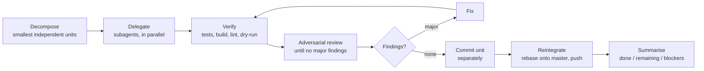

# Agent Operating Model — Decompose · Verify · Review · Reintegrate (DVRR)

## TL;DR

The **default way of working** for every non-trivial task is autonomous and
parallel-first: **decompose** the work into the smallest independent units,
**delegate** them to subagents and run them in parallel, **verify** each unit as
fully as can be done safely, subject each to **adversarial review until no major
findings remain**, **re-verify** after any review-driven change, then **commit
each unit separately and reintegrate it onto `master`**. The gate chain — not a
human prompt — is the authority to ship. Scale the ceremony to the task: full
DVRR for substantial/risky work, a lightweight path for small changes, a direct
edit for trivial ones.

This rule is the *spine* that ties together the existing rules — it does not
replace them. Each phase below points at the rule that owns the detail.

## The Flow

## The Phases

| Phase | What it means | Owned by |
|-------|---------------|----------|
| **Decompose** | Break work into the smallest practical units that can be implemented, verified, reviewed, and committed independently. Maximises parallelism and isolates blast radius. | `taskify-agent` / `/taskify` |
| **Delegate** | Hand independent units to subagents and run them concurrently. Default to delegation unless the work is tightly coupled, must be sequenced, or is too ambiguous to split safely. | [[subagent-routing]], AGENTS.md routing table |
| **Isolate** | Independent *agents* (separate sessions, long autonomous runs) get their own worktree. The primary interactive session stays in the main checkout for IntelliJ MCP visibility; its subagents share its filesystem. Isolation is **between independent agents, not within one**. | [[worktree-workflow]], [[intellij-mcp-preference]] |
| **Verify** | Verify each unit as fully as is *safe*: unit/integration/e2e tests, build, lint, static analysis, type checks, Docker builds, and non-destructive runtime checks (`--dry-run`, `terraform plan`, `--version`, validation flags, executing scripts you wrote). **If it can be safely verified, verify it**; otherwise use the strongest safe substitute. | [[testing-policy]], [[commit-workflow]] (Step 2) |
| **Review** | Subject each unit to adversarial review on a fresh context / different model, applying the 8-lens constitution. The reviewer tries to *disprove* the change, not bless it. Repeat until no major (CRITICAL/MAJOR) findings remain. | [[review-constitution]]; commit gate uses `review-cheap` (per [[commit-workflow]] Step 4), merge-to-master escalates to `review-final`; `code-reviewer` is the quick pre-commit check only |
| **Re-verify** | Any review-driven change re-triggers the relevant verification — fixes regress. No unit is complete until post-review verification passes. | [[commit-workflow]] (Step 4 — re-run on BLOCK) |
| **Commit** | One coherent unit → one commit. Never bundle unrelated changes. Preserves traceability, reviewability, and clean rollback. | [[commit-workflow]] |
| **Reintegrate** | Rebase the unit onto the latest `master` and push. Conflicts surface here; resolve them, then re-verify. Concurrent rebases serialise through the `flock` rebase lock. | [[worktree-workflow]] (steps 7–8), `/worktree-merge` |

## Autonomy & The Commit Gate

**The gate chain is the authority to ship — not a human prompt.** Once a unit
passes the full chain (classify → validate → changelog → adversarial review with
a PASS verdict → re-verify), the agent **commits and pushes to `master`
autonomously, without waiting to be asked.** The adversarial review is the one
defined in [[commit-workflow]] Step 4 — that rule is the single source of truth
for which reviewer runs; the `/worktree-merge` path escalates to the
authoritative `review-final` at its Gate 3 before a worktree branch lands on
`master`. This is the repository's standing authorization: the strong, mandatory
gates *replace* human pre-approval. It applies to interactive and autonomous
sessions alike.

This autonomy is bounded by hard rules that **remain fully in force**:

- **Gates are mandatory and fail-closed.** If any gate cannot run or does not
  return a clean PASS (tests fail, review returns BLOCK, the review subagent is
  unavailable, lint errors), **do not commit**. Stop, surface the failure, and
  leave the work for inspection. Autonomy means shipping *verified* work, never
  *unverified* work.
- **Destructive git commands still require explicit confirmation** — see
  [[git-safety]]. Auto-commit and auto-push of *new* commits is authorized;
  `reset --hard`, `push --force`, history rewrites of pushed commits, `clean
  -fd`, and discarding uncommitted work are **not**.
- **Commit hygiene holds** — stage explicit paths only (never `git add .`),
  commit only files this session changed, re-read before editing, hold the
  commit lock, `git pull --rebase` before push. See [[commit-workflow]].
- **The user can always interject.** Autonomous is not uninterruptible — a
  user instruction at any point overrides the default.

## Scale The Ceremony To The Task

DVRR is a **strong default, not a rigid form**. Apply judgement (this mirrors
the simplicity ethos in [[coding-principles]] and the
[[documentation-style]] rule):

| Task shape | DVRR path |
|------------|-----------|
| **Substantial / multi-file / risky / cross-module** | Full DVRR — decompose, delegate to parallel subagents, worktree if an independent session, full verify, multi-round adversarial review, separate commits, gated reintegration. |
| **Small, single-file, low-risk change** | Lightweight — implement inline, run the [[commit-workflow]] gate chain (a single review pass, targeted verification), single commit. No decomposition, no worktree. |
| **Trivial — typo, comment, doc one-liner** | Direct edit + the minimal relevant check (link/glob check, `bash -n`, etc.), then the [[commit-workflow]] gate chain (skip-conditions may apply). Skip decomposition, delegation, and worktrees. |

Never manufacture ceremony that adds no safety: spinning up subagents,
worktrees, and multi-round review for a one-line fix is the over-engineering
that [[coding-principles]] warns against.

## Clarify Well, Rarely

Work from the strongest safe assumptions and proceed; escalate only when
ambiguity **materially affects correctness, safety, or intent** (see
[[coding-principles]]). When you must ask, make answering cheap — prefer a
structured question (the `AskUserQuestion` tool) that states:

- **What is unclear**, and **why it matters**
- A **recommended option** first, then the alternatives
- The **likely impact** of each choice

Never force the user to reconstruct context from scratch.

## Summarise After Each Batch

When a batch of parallel units completes, give a concise summary so a human can
grasp status at a glance:

- **Done** — units finished, key outcomes, verification performed, major review
  findings resolved, commits produced / reintegrated.
- **Remaining** — outstanding units, blocked items, unresolved decisions, next
  recommended steps, and whether further parallelisation is possible.

Lead with the bottom line, per [[documentation-style]].

## Relationship To Heavy Orchestration

For large fan-outs (audits, migrations, broad multi-unit work) the `Workflow`
tool encodes this same decompose → parallel-verify → adversarially-review →
reintegrate shape deterministically — but it requires **explicit user opt-in**
(see its tooling rules). DVRR via direct subagents is the always-on default;
`Workflow` is the heavier, opt-in expression of the same model.
