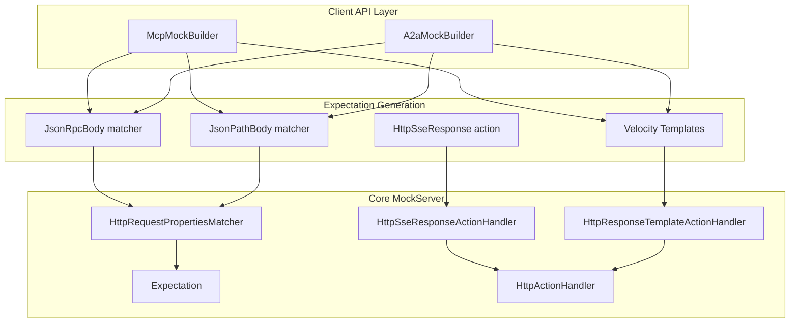
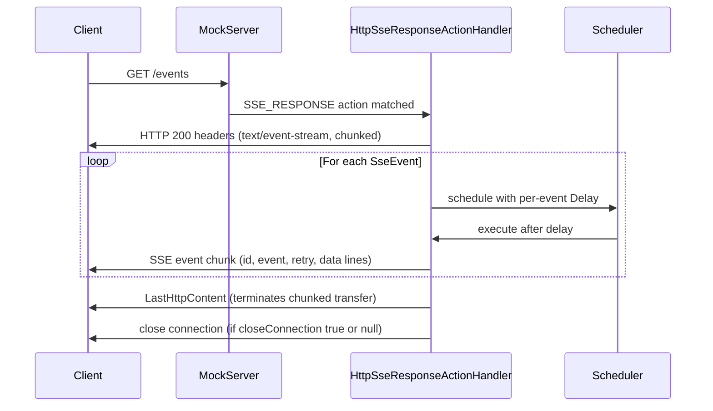
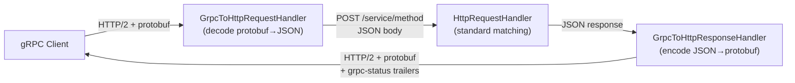
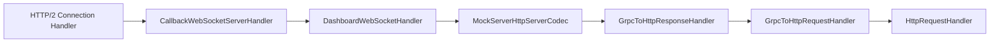
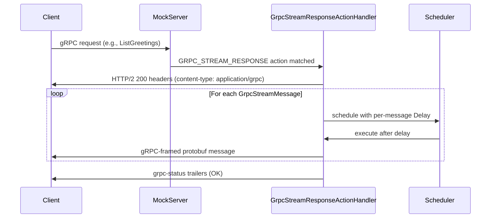
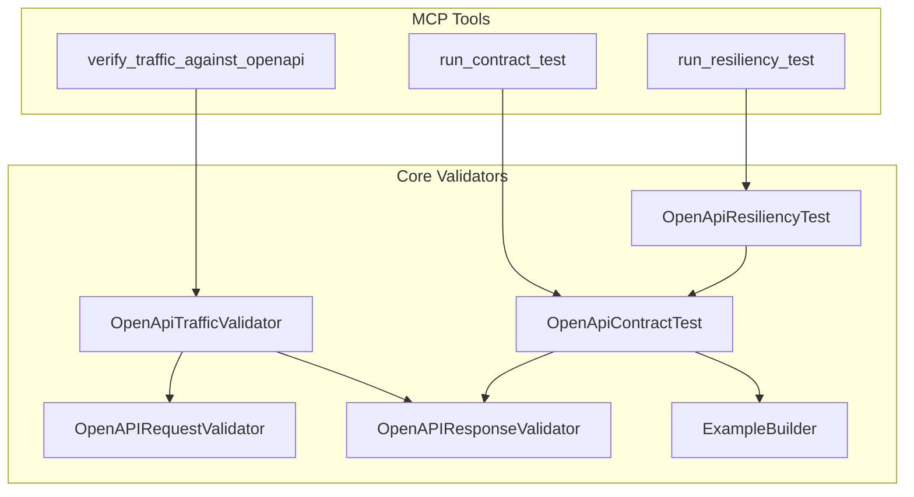
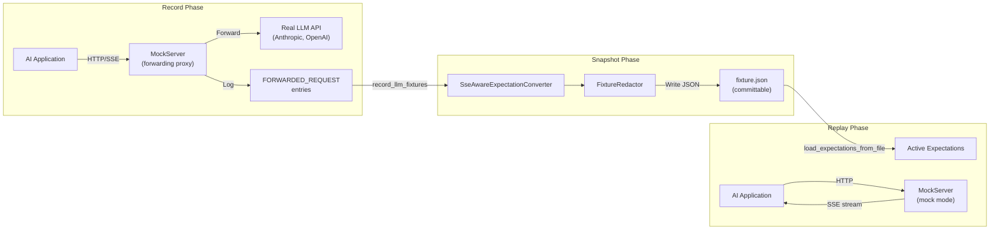

# AI & RPC Protocol Mocking (SSE, WebSocket, JSON-RPC, MCP, A2A, gRPC)

## Overview

MockServer supports mocking AI protocol servers including MCP (Model Context Protocol) and A2A (Agent-to-Agent Protocol). This is distinct from MockServer's own MCP control plane (`/mockserver/mcp`) — these features enable mocking *other people's* MCP and A2A servers for testing.

## Architecture

### Core Building Blocks

Two primitive building blocks enable all AI protocol mocking:

1. **SSE Streaming Responses** (`HttpSseResponse`) — an `Action` type that streams Server-Sent Events to the client
2. **JSON-RPC Body Matching** (`JsonRpcBody`) — a `Body` matcher that validates JSON-RPC 2.0 method names and optionally validates `params` against a JSON Schema

### Higher-Level Builders

Built on top of the primitives:

- **`McpMockBuilder`** — generates a complete set of `Expectation[]` objects for a mock MCP server
- **`A2aMockBuilder`** — generates a complete set of `Expectation[]` objects for a mock A2A agent

### Layer Architecture



## SSE Streaming Responses

### Model

- **`SseEvent`** (`mockserver-core/src/main/java/org/mockserver/model/SseEvent.java`) — a single SSE event with fields: `event`, `data`, `id`, `retry`, `delay`
- **`HttpSseResponse`** (`mockserver-core/src/main/java/org/mockserver/model/HttpSseResponse.java`) — action type extending `Action<HttpSseResponse>` with `statusCode`, `headers`, a list of `SseEvent` objects, and a `closeConnection` flag

### Action Type

`Action.Type.SSE_RESPONSE` was added to the `Action.Type` enum. `HttpActionHandler` routes requests matching an `HttpSseResponse` action to `HttpSseResponseActionHandler`.

### Handler

`HttpSseResponseActionHandler` (`mockserver-core/src/main/java/org/mockserver/mock/action/http/HttpSseResponseActionHandler.java`) writes the SSE stream directly via Netty's `ChannelHandlerContext`. It:

1. Writes HTTP response headers (`Content-Type: text/event-stream`, `Transfer-Encoding: chunked`, `Cache-Control: no-cache`, `Connection: keep-alive`) plus any custom headers from the action
2. Recursively schedules each event via `Scheduler`, using the per-event `Delay` if present or executing immediately if not
3. Formats each event per the SSE specification — multi-line `data` values are split into multiple `data:` lines; `id`, `event`, and `retry` fields are written when non-null
4. Writes `LastHttpContent.EMPTY_LAST_CONTENT` to terminate the chunked stream, then closes the channel if `closeConnection` is `true` (or null, which defaults to closing)



### Serialization

- **`SseEventDTO`** (`mockserver-core/.../serialization/model/SseEventDTO.java`) and **`HttpSseResponseDTO`** (`mockserver-core/.../serialization/model/HttpSseResponseDTO.java`) handle REST API serialization and deserialization
- **`ExpectationDTO`** includes an `httpSseResponse` field mapped to `HttpSseResponseDTO`
- `BodyDTODeserializer` and `StrictBodyDTODeserializer` handle the `JSON_RPC` body type
- `BodyDTO.createDTO()` maps `JsonRpcBody` to `JsonRpcBodyDTO`

## JSON-RPC Body Matching

### Model

**`JsonRpcBody`** (`mockserver-core/src/main/java/org/mockserver/model/JsonRpcBody.java`) extends `Body<String>` with `Body.Type.JSON_RPC`. It has two fields:

| Field | Required | Purpose |
|-------|----------|---------|
| `method` | Yes | Method name to match (exact string or Java regex) |
| `paramsSchema` | No | JSON Schema string; when present, `params` is validated against it |

### Matcher

**`JsonRpcMatcher`** (`mockserver-core/src/main/java/org/mockserver/matchers/JsonRpcMatcher.java`) validates:

1. `jsonrpc` field equals `"2.0"`
2. `method` field matches — first by exact equality, then by `String.matches()` (regex)
3. If `paramsSchema` is set, `params` is validated using `JsonSchemaValidator`; a missing `params` field fails validation
4. Batch requests (JSON arrays) — matches if **any** element in the array satisfies all the above conditions

### Integration Points

- `HttpRequestPropertiesMatcher.buildBodyMatcher()` — added the `JSON_RPC` case to route to `JsonRpcMatcher`
- `BodyDTODeserializer` and `StrictBodyDTODeserializer` — support two JSON representations:
  - Typed: `{"type": "JSON_RPC", "method": "tools/list"}`
  - Wrapped: `{"jsonRpc": {"method": "tools/list"}}`

### Template Object Enhancement

`HttpRequestTemplateObject` (`mockserver-core/.../templates/engine/model/HttpRequestTemplateObject.java`) was extended with three fields extracted from JSON-RPC request bodies:

| Field | Velocity variable | Value |
|-------|-------------------|-------|
| `jsonRpcId` | `$!{request.jsonRpcId}` | String representation of the ID (text nodes use text value; numeric/null use `toString()`) |
| `jsonRpcRawId` | `$!{request.jsonRpcRawId}` | Raw JSON representation — preserves `1` for numbers and `"abc"` for strings; used for embedding directly in JSON response bodies |
| `jsonRpcMethod` | `$!{request.jsonRpcMethod}` | The `method` field value |

Extraction is best-effort: any parse error is silently swallowed, leaving all three fields null.

## WebSocket Mocking

### Model

- **`WebSocketMessage`** (`mockserver-core/.../model/WebSocketMessage.java`) — Single WebSocket message with `text`, `binary`, and `delay` fields
- **`HttpWebSocketResponse`** (`mockserver-core/.../model/HttpWebSocketResponse.java`) — Action type extending `Action<HttpWebSocketResponse>` with `subprotocol`, `messages` list, and `closeConnection` flag

### Action Type

`Action.Type.WEBSOCKET_RESPONSE` was added to the enum. This triggers the `HttpWebSocketResponseActionHandler`.

### Handler

`HttpWebSocketResponseActionHandler` performs the WebSocket handshake using Netty's `WebSocketServerHandshakerFactory`, then sends configured messages as `TextWebSocketFrame` or `BinaryWebSocketFrame`. It:

1. Reconstructs a Netty `FullHttpRequest` from the MockServer `HttpRequest` (preserving headers including `Sec-WebSocket-Key`)
2. Performs the WebSocket handshake
3. Removes HTTP codecs from the pipeline
4. Sends each message with optional per-message delays
5. Optionally sends `CloseWebSocketFrame` and closes the connection

### Usage

```java
mockServerClient.when(
    request().withMethod("GET").withPath("/ws")
).respondWithWebSocket(
    HttpWebSocketResponse.webSocketResponse()
        .withMessage(WebSocketMessage.webSocketMessage("hello"))
        .withMessage(WebSocketMessage.webSocketMessage("world"))
        .withCloseConnection(true)
);
```

## MCP Mock Builder

### Purpose

`McpMockBuilder` generates a complete set of `Expectation[]` objects that make MockServer behave as a mock MCP server. This allows testing MCP clients against a predictable, configurable mock.

### Location

`mockserver-client-java/src/main/java/org/mockserver/client/McpMockBuilder.java`

### Defaults

| Property | Default |
|----------|---------|
| `path` | `/mcp` |
| `serverName` | `MockMCPServer` |
| `serverVersion` | `1.0.0` |
| `protocolVersion` | `2025-03-26` |

### Generated Expectations

| MCP Method | Request Matcher | Response Type |
|---|---|---|
| `initialize` | `POST {path}` + `JsonRpcBody("initialize")` | Velocity template — echoes `jsonRpcRawId`, returns server info and capabilities |
| `ping` | `POST {path}` + `JsonRpcBody("ping")` | Velocity template — echoes `jsonRpcRawId`, returns `{}` |
| `notifications/initialized` | `POST {path}` + `JsonRpcBody("notifications/initialized")` | Static `HttpResponse` 200 with empty JSON body |
| `tools/list` | `POST {path}` + `JsonRpcBody("tools/list")` | Velocity template — returns configured tools array |
| `tools/call` (per tool) | `POST {path}` + `JsonPathBody` matching `method == 'tools/call'` and `params.name == '{toolName}'` | Velocity template — returns text content and `isError` flag |
| `resources/list` | `POST {path}` + `JsonRpcBody("resources/list")` | Velocity template — returns configured resources array |
| `resources/read` (per resource) | `POST {path}` + `JsonPathBody` matching `method == 'resources/read'` and `params.uri == '{uri}'` | Velocity template — returns resource `text` and `mimeType` |
| `prompts/list` | `POST {path}` + `JsonRpcBody("prompts/list")` | Velocity template — returns configured prompts array |
| `prompts/get` (per prompt) | `POST {path}` + `JsonPathBody` matching `method == 'prompts/get'` and `params.name == '{promptName}'` | Velocity template — returns messages array |

The `tools/list`, `resources/list`, and `prompts/list` expectations are generated whenever tools, resources, or prompts are registered respectively, or when the corresponding capability flag (`withToolsCapability()`, etc.) is explicitly set.

### JSON-RPC ID Echoing

All Velocity templates embed `$!{request.jsonRpcRawId}` as the `id` field in the JSON-RPC response body. This preserves the original ID type (number or string) and ensures correct request-response correlation for MCP clients.

### Usage

```java
McpMockBuilder.mcpMock("/mcp")
    .withServerName("TestMCP")
    .withServerVersion("1.0.0")
    .withTool("get_weather")
        .withDescription("Get weather for a city")
        .respondingWith("72F and sunny")
        .and()
    .withResource("config://app")
        .withName("App Config")
        .withMimeType("application/json")
        .withContent("{\"debug\": true}")
        .and()
    .withPrompt("summarize")
        .withDescription("Summarize text")
        .withArgument("text", "Text to summarize", true)
        .respondingWith("assistant", "Here is your summary.")
        .and()
    .applyTo(mockServerClient);
```

`applyTo(MockServerClient)` calls `client.upsert(build())`. `build()` can also be called directly to obtain the `Expectation[]` array without applying it.

## A2A Mock Builder

### Purpose

`A2aMockBuilder` generates expectations for a mock A2A (Agent-to-Agent Protocol) agent. The A2A protocol uses JSON-RPC 2.0 over HTTP with an Agent Card discovery mechanism (`GET /.well-known/agent.json`).

### Location

`mockserver-client-java/src/main/java/org/mockserver/client/A2aMockBuilder.java`

### Defaults

| Property | Default |
|----------|---------|
| `path` | `/a2a` |
| `agentCardPath` | `/.well-known/agent.json` |
| `agentName` | `MockAgent` |
| `agentDescription` | `A mock A2A agent` |
| `agentVersion` | `1.0.0` |
| `agentUrl` | `http://localhost{path}` (derived) |
| `defaultTaskResponse` | `Task completed successfully` |

### Generated Expectations

| Endpoint | Request Matcher | Response Type |
|---|---|---|
| Agent Card | `GET {agentCardPath}` | Static `HttpResponse` — JSON agent card with name, description, version, url, capabilities, and skills |
| `tasks/send` | `POST {path}` + `JsonRpcBody("tasks/send")` | Velocity template — completed task with default response text |
| `tasks/get` | `POST {path}` + `JsonRpcBody("tasks/get")` | Velocity template — completed task with default response text |
| `tasks/cancel` | `POST {path}` + `JsonRpcBody("tasks/cancel")` | Velocity template — canceled task with `status.state: "canceled"` |
| Custom task handlers (per handler) | `POST {path}` + `JsonPathBody` matching `method == 'tasks/send'` and `params.message.parts[0].text =~ /{pattern}/` | Velocity template — completed or failed task with custom response text |

Custom task handlers are evaluated in registration order. Because MockServer matches expectations in priority/registration order, more specific handlers should be registered before the generic `tasks/send` catch-all.

### Usage

```java
A2aMockBuilder.a2aMock("/agent")
    .withAgentName("TranslationAgent")
    .withAgentDescription("Translates text between languages")
    .withSkill("translate")
        .withName("Translation")
        .withDescription("Translates text")
        .withTag("nlp")
        .and()
    .onTaskSend()
        .matchingMessage("translate.*")
        .respondingWith("Bonjour")
        .and()
    .applyTo(mockServerClient);
```

## gRPC Mocking

MockServer supports mocking gRPC services without requiring grpc-java as a dependency. Instead, it uses a pure Netty pipeline approach: gRPC requests are decoded from HTTP/2 + protobuf framing into JSON, routed through the existing matching engine as `POST /<service>/<method>`, and responses are re-encoded back to gRPC framing. This means all existing JSON/JSONPath/JSONSchema matchers work with gRPC automatically.

### Architecture



### Proto Descriptor Infrastructure

gRPC mocking requires proto descriptors so MockServer can convert between protobuf binary and JSON. Three loading mechanisms are supported:

| Mechanism | Config Property | Description |
|-----------|----------------|-------------|
| Descriptor files (`.dsc`/`.desc`) | `grpcDescriptorDirectory` | Directory of pre-compiled descriptor set files |
| Proto source files (`.proto`) | `grpcProtoDirectory` | Directory of `.proto` files compiled at startup via `protoc` |
| Runtime REST API upload | `PUT /mockserver/grpc/descriptors` | Upload descriptor bytes at runtime via client API |

Core classes:

| Class | Module | Purpose |
|-------|--------|---------|
| `GrpcProtoDescriptorStore` | core | Registry of loaded service/method descriptors, provides converters |
| `GrpcProtoFileCompiler` | core | Compiles `.proto` files to descriptors via `protoc` |
| `GrpcJsonMessageConverter` | core | Converts protobuf binary ↔ JSON using `com.google.protobuf.util.JsonFormat` |
| `GrpcFrameCodec` | core | Encodes/decodes the 5-byte gRPC length-prefixed framing |
| `GrpcStatusMapper` | core | Maps between gRPC status codes and names |

### Netty Pipeline Integration

gRPC handlers are conditionally inserted into both h2c (HTTP/2 cleartext) and TLS-negotiated HTTP/2 pipelines when the descriptor store has loaded services:



The handlers are placed after `MockServerHttpServerCodec` so they operate on MockServer model objects. `GrpcToHttpRequestHandler` intercepts inbound `HttpRequest` objects with `content-type: application/grpc`, extracts the service and method from the path, decodes the protobuf body to JSON, and forwards with `x-grpc-service`, `x-grpc-method` headers.

`GrpcToHttpResponseHandler` is an outbound encoder that intercepts `HttpResponse` objects with `x-grpc-service` header, encodes the JSON body back to protobuf binary with gRPC framing, and appends `grpc-status` / `grpc-message` trailers.

### h2c Detection

`PortUnificationHandler.decode()` includes `isH2cPreface()` which detects the HTTP/2 connection preface (`PRI * HTTP/2.0\r\n\r\nSM\r\n\r\n`) on cleartext connections. When detected, `switchToH2c()` assembles the HTTP/2 pipeline with gRPC handlers, enabling gRPC over plaintext HTTP/2.

### Streaming Support

`GrpcStreamResponse` is an action type for gRPC server streaming (and as a building block for other streaming patterns). It follows the same recursive scheduling pattern as `HttpSseResponse`:

| Class | Module | Purpose |
|-------|--------|---------|
| `GrpcStreamMessage` | core (model) | A single message in a stream: JSON body + optional per-message `Delay` |
| `GrpcStreamResponse` | core (model) | Action containing a list of `GrpcStreamMessage` objects and a `statusCode` |
| `GrpcStreamResponseActionHandler` | core (action) | Recursively schedules messages via `Scheduler`, encodes each to gRPC-framed protobuf, writes `grpc-status` trailers after last message |



### Serialization

- **`GrpcStreamMessageDTO`** and **`GrpcStreamResponseDTO`** handle REST API serialization
- **`ExpectationDTO`** includes a `grpcStreamResponse` field mapped to `GrpcStreamResponseDTO`
- **`grpcStreamResponse.json`** JSON schema is registered in `JsonSchemaExpectationValidator`

### gRPC Fault Injection

`GrpcChaosProfile` (`org.mockserver.model.GrpcChaosProfile`) is a declarative gRPC fault/chaos injection profile. It is stored in a `GrpcChaosRegistry` keyed by gRPC service name and applied by `GrpcToHttpRequestHandler` before normal request conversion. An empty-string key registers a default profile that covers all services without a more-specific override.

**Profile fields:**

| Field | Type | Description |
|-------|------|-------------|
| `errorStatusCode` | String | gRPC status code name (e.g. `"UNAVAILABLE"`, `"DEADLINE_EXCEEDED"`) — one of the 17 `GrpcStatusMapper.GrpcStatusCode` enum names |
| `errorMessage` | String | Optional `grpc-message` trailer value |
| `errorProbability` | Double | 0.0–1.0 probability of fault injection; null/0 = never, 1.0 = always |
| `seed` | Long | Optional seed to make fractional probability reproducible |
| `latencyMs` | Long | Milliseconds of artificial delay before the response; >= 0 |
| `succeedFirst` | Integer | First N calls per service are not eligible for chaos; >= 0 |
| `failRequestCount` | Integer | After `succeedFirst`, the next M calls are eligible; >= 1; null = unlimited |
| `quotaName` | String | Shared rate-limit counter key |
| `quotaLimit` | Integer | Max calls allowed per quota window; >= 1 |
| `quotaWindowMillis` | Long | Fixed-window length in ms; calls over the limit return `RESOURCE_EXHAUSTED`; >= 1 |
| `omitGrpcStatus` | Boolean | When true, the fault response contains no `grpc-status` trailer at all, simulating an incomplete or broken RPC stream. Takes precedence over `corruptGrpcStatus` when both are set. |
| `corruptGrpcStatus` | Boolean | When true (and `omitGrpcStatus` is false), the `grpc-status` trailer is set to the non-numeric value `"malformed"` — a genuine protocol violation (the gRPC spec requires `grpc-status` to be a decimal integer) that tests how clients cope with an unparseable status trailer. |
| `customTrailers` | Map&lt;String,String&gt; | Arbitrary trailer key/value pairs injected on the fault response in addition to (or instead of) the normal status trailers. Applied after `omitGrpcStatus`/`corruptGrpcStatus` — always added regardless of which status variant fires. |
| `abortAfterMessages` | Integer | For client-streaming requests: when the number of decoded gRPC messages in the request body is >= this threshold, inject an `ABORTED` status immediately. The message count is determined by decoding the 5-byte gRPC length-prefixed frames in the request body; >= 1. |

**Trailer-fault precedence in `buildFaultResponse`:** `omitGrpcStatus: true` → no `grpc-status` header is written at all; else `corruptGrpcStatus: true` → `grpc-status: malformed` is written (a non-numeric value that violates the gRPC wire spec); else the normal numeric status code is written. `customTrailers` are always appended after the status decision, for every fault response. Custom trailer keys and values are validated against CR/LF injection at the model layer and defensively skipped at the handler layer.

Serialization uses `GrpcChaosProfileDTO` (`org.mockserver.serialization.model.GrpcChaosProfileDTO`).

This feature is distinct from `GrpcHealthRegistry` — gRPC fault injection fires on application RPC methods; health-check chaos controls the `grpc.health.v1.Health/Check` serving-status response.

**REST endpoints:**

| Endpoint | Action |
|----------|--------|
| `PUT /mockserver/grpcChaos` | Register, remove, or clear gRPC chaos profiles; supports `ttlMillis` for auto-expiry |
| `GET /mockserver/grpcChaos` | Read all active profiles and TTL countdowns |
| `PATCH /mockserver/grpcChaos` | JSON Merge Patch a single service's profile (preserves TTL) |

See [Service-scoped chaos REST API](#service-scoped-chaos-rest-api) below for the full request/response shapes, which are identical across all three endpoints (substituting `service` for the key field and `GrpcChaosProfile` fields in the `chaos` object).

### Service-Scoped Chaos REST API

Three parallel REST APIs expose service-scoped chaos registration — one for each protocol layer. All three follow the same request/response structure; the differences are the endpoint path, the key field name (`host` vs `service`), and the profile type (`HttpChaosProfile` vs `TcpChaosProfile` vs `GrpcChaosProfile`).

| Protocol | Endpoints | Key field | Profile type |
|----------|-----------|-----------|--------------|
| HTTP | `PUT/GET/PATCH /mockserver/serviceChaos` | `host` | `HttpChaosProfile` (see profile fields in the consumer chaos docs) |
| TCP | `PUT/GET/PATCH /mockserver/tcpChaos` | `host` | `TcpChaosProfile` |
| gRPC | `PUT/GET/PATCH /mockserver/grpcChaos` | `service` | `GrpcChaosProfile` (fields documented above) |

#### PUT — register, remove, or clear

Request body shapes (all fields except `clear`/`host`/`service` are optional):

**Register or replace a profile** — sets or replaces the chaos profile for a single host/service:

```json
{
  "host": "payments.internal:8080",
  "chaos": { "errorStatus": 503, "errorProbability": 0.3 },
  "ttlMillis": 60000
}
```

- `ttlMillis` (optional, `>= 1`) — auto-reverts the registration after this many milliseconds. When the TTL expires the profile is removed and the host returns to normal behaviour.
- Omitting `ttlMillis` registers the profile indefinitely.

**Remove a single host** — omit `chaos` or supply `remove: true`:

```json
{ "host": "payments.internal:8080", "remove": true }
```

**Clear all registrations**:

```json
{ "clear": true }
```

`clear` and `host`/`service` are mutually exclusive.

**Responses** — all 200 with a `status` field:

| Scenario | Response body |
|----------|--------------|
| Registered | `{"status":"registered","host":"...","ttlMillis":60000}` (ttlMillis omitted when no TTL) |
| Removed | `{"status":"removed","host":"..."}` |
| Cleared | `{"status":"cleared"}` |
| Error | 400 `{"error":"<message>"}` |

#### GET — snapshot

Returns all currently registered profiles. For `serviceChaos` the top-level key is `services`; for `tcpChaos` it is `hosts`. A `ttlRemainingMillis` map is included only when at least one TTL-bearing registration exists.

`GET /mockserver/serviceChaos` example response:

```json
{
  "services": {
    "payments.internal:8080": { "errorStatus": 503, "errorProbability": 0.3 }
  },
  "ttlRemainingMillis": {
    "payments.internal:8080": 42310
  }
}
```

`GET /mockserver/tcpChaos` uses `hosts` as the outer key instead of `services`.

`GET /mockserver/grpcChaos` uses `services` and the keys are gRPC service names (e.g. `helloworld.Greeter`); an empty string key is the catch-all default profile.

#### PATCH — merge-patch a single profile

Only the fields present in the `chaos` object are updated; all other fields of the existing profile are preserved. The TTL on the existing registration is also preserved (the PATCH does not reset or remove it).

Request body:

```json
{
  "host": "payments.internal:8080",
  "chaos": { "errorProbability": 0.5 }
}
```

Both `host`/`service` and `chaos` are required. A missing key returns 400.

Response body on success:

```json
{
  "status": "patched",
  "host": "payments.internal:8080",
  "chaos": { "errorStatus": 503, "errorProbability": 0.5 }
}
```

The `chaos` field in the response reflects the merged profile as serialised by the corresponding `*ChaosProfileDTO`.

**Implementation references:** all nine handlers (`handleServiceChaosPut`, `handleServiceChaosPatch`, `handleServiceChaosGet`, `handleTcpChaosPut`, `handleTcpChaosPatch`, `handleTcpChaosGet`, `handleGrpcChaosPut`, `handleGrpcChaosPatch`, `handleGrpcChaosGet`) are in `mockserver/mockserver-core/src/main/java/org/mockserver/mock/HttpState.java` around lines 2070–2503.

### GraphQL-Semantic HTTP Chaos

`HttpChaosProfile` carries four fields for injecting GraphQL-semantic errors into HTTP responses. These fields are part of the broader `HttpChaosProfile` model (documented on the consumer-facing chaos page) but are relevant here because they are specifically designed for testing GraphQL clients.

**New fields (added alongside the existing body-corruption fields):**

| Field | Type | Description |
|-------|------|-------------|
| `graphqlErrors` | Boolean | When `true`, activates GraphQL error injection. The response is rewritten as an HTTP 200 GraphQL error envelope: `{"data":...,"errors":[{"message":...,"extensions":{"code":...}}]}`, with `Content-Type: application/json` and `Content-Length` stripped. |
| `graphqlErrorMessage` | String | The `errors[0].message` value. Defaults to `"simulated GraphQL error"` when `graphqlErrors` is true and this field is unset. |
| `graphqlErrorCode` | String | Optional value placed in `errors[0].extensions.code` (e.g. `"INTERNAL_SERVER_ERROR"`). The `extensions` object is omitted entirely when this field is null. |
| `graphqlNullifyData` | Boolean | When `true` (the default), `data` is set to `null`. When `false`, the handler attempts to parse the original response body as JSON and embed it as the `data` value, enabling partial-success simulation. Falls back to `data: null` if the original body is not valid JSON. |

**Precedence in `applyResponseChaos`:** `graphqlErrors` takes precedence over `truncateBodyAtFraction` and `malformedBody` — when `graphqlErrors` is true, body corruption is skipped because the envelope is the intended body. The slow-response dribble (`slowResponseChunkSize` + `slowResponseChunkDelay`) composes normally with GraphQL injection since it only affects delivery timing. The fault is metered as `fault_type="graphql"`.

**Scope:** GraphQL error injection works on both expectation-level chaos (attached to an `Expectation`) and service-scoped chaos (`ServiceChaosRegistry` / `PUT /mockserver/serviceChaos`). It respects the count window (`succeedFirst` / `failRequestCount`) in the same way as other body-corruption faults.

### gRPC Health Checking Protocol

MockServer auto-responds to `grpc.health.v1.Health/Check` without requiring a proto descriptor. The implementation uses manual protobuf encode/decode so health checks work even when the descriptor store is empty.

**Key classes:**

| Class | Package | Role |
|-------|---------|------|
| `GrpcHealthRegistry` | `org.mockserver.grpc` | Singleton map of service name → `ServingStatus`; falls back to a configurable default (`SERVING`) when no per-service entry exists |
| `GrpcHealthCheckHandler` | `org.mockserver.grpc` | Decodes the gRPC-framed `HealthCheckRequest` (5-byte header + protobuf field 1 varint), looks up `GrpcHealthRegistry`, encodes a gRPC-framed `HealthCheckResponse` |
| `ServingStatus` | `org.mockserver.grpc` | Enum: `UNKNOWN(0)`, `SERVING(1)`, `NOT_SERVING(2)`, `SERVICE_UNKNOWN(3)` |

**Interception point:** `GrpcToHttpRequestHandler` checks whether the request path equals `GrpcHealthCheckHandler.HEALTH_CHECK_PATH` (`/grpc.health.v1.Health/Check`) before performing any descriptor lookup. When matched, the response is written directly and the request never reaches the expectation matching engine.

**Configuration:** `grpcHealthCheckEnabled` (default `true`) controls whether health check interception is active.

**REST endpoints:**

| Endpoint | Action |
|----------|--------|
| `PUT /mockserver/grpc/health` | Set the `ServingStatus` for a named service (`service` + `status` fields) |
| `GET /mockserver/grpc/health` | Read all status overrides plus the global default |

All overrides are cleared on `HttpState.reset()`. An empty `service` string sets the global default. The `GET` response uses `_default` as the key for the global default entry.

### Control Plane REST API

| Endpoint | Action |
|----------|--------|
| `PUT /mockserver/grpc/descriptors` | Upload a compiled proto descriptor set (binary body) |
| `PUT /mockserver/grpc/services` | List all loaded gRPC services and their methods |
| `PUT /mockserver/grpc/clear` | Clear all loaded descriptors and reset the store |

### Limitations

- **gRPC forwarding/proxy** is deferred — requires HTTP/2 + gRPC-framing client changes to `NettyHttpClient`
- **True client streaming and bidirectional streaming** require migration from `InboundHttp2ToHttpAdapter` (which aggregates full messages) to `Http2MultiplexHandler` with per-stream child channels
- **WAR deployment** returns 501 for `GRPC_STREAM_RESPONSE` actions (no `ChannelHandlerContext` available)
- **Proto reflection** is not yet supported — descriptors must be provided via files or API upload

## Module Boundaries

| Component | Module | Package |
|---|---|---|
| `SseEvent`, `HttpSseResponse`, `JsonRpcBody` | `mockserver-core` | `org.mockserver.model` |
| `JsonRpcMatcher` | `mockserver-core` | `org.mockserver.matchers` |
| `HttpSseResponseActionHandler` | `mockserver-core` | `org.mockserver.mock.action.http` |
| `SseEventDTO`, `HttpSseResponseDTO`, `JsonRpcBodyDTO` | `mockserver-core` | `org.mockserver.serialization.model` |
| `HttpRequestTemplateObject` (jsonRpc fields) | `mockserver-core` | `org.mockserver.templates.engine.model` |
| `GrpcStreamMessage`, `GrpcStreamResponse` | `mockserver-core` | `org.mockserver.model` |
| `GrpcFrameCodec`, `GrpcJsonMessageConverter`, `GrpcProtoDescriptorStore`, `GrpcProtoFileCompiler`, `GrpcStatusMapper`, `GrpcException` | `mockserver-core` | `org.mockserver.grpc` |
| `GrpcHealthRegistry`, `GrpcHealthCheckHandler`, `ServingStatus` | `mockserver-core` | `org.mockserver.grpc` |
| `GrpcChaosProfile` | `mockserver-core` | `org.mockserver.model` |
| `GrpcChaosRegistry` | `mockserver-core` | `org.mockserver.mock.action.http` |
| `GrpcChaosProfileDTO` | `mockserver-core` | `org.mockserver.serialization.model` |
| `GrpcStreamResponseActionHandler` | `mockserver-core` | `org.mockserver.mock.action.http` |
| `GrpcStreamMessageDTO`, `GrpcStreamResponseDTO` | `mockserver-core` | `org.mockserver.serialization.model` |
| `GrpcToHttpRequestHandler`, `GrpcToHttpResponseHandler` | `mockserver-netty` | `org.mockserver.netty.grpc` |
| `McpMockBuilder`, `A2aMockBuilder` | `mockserver-client-java` | `org.mockserver.client` |

## Test Coverage

| Test Class | Module | Tests | Type |
|---|---|---|---|
| `SseEventTest` | core | 19 | Unit |
| `HttpSseResponseTest` | core | 22 | Unit |
| `JsonRpcBodyTest` | core | 21 | Unit |
| `JsonRpcMatcherTest` | core | 12 | Unit |
| `HttpSseResponseDTOTest` | core | 5 | Unit |
| `JsonRpcBodyDTOTest` | core | 5 | Unit |
| `ExpectationWithSseAndJsonRpcSerializationTest` | core | 4 | Unit |
| `HttpRequestTemplateObjectJsonRpcTest` | core | 11 | Unit |
| `McpMockBuilderTest` | client-java | 12 | Unit |
| `A2aMockBuilderTest` | client-java | 11 | Unit |
| `SseStreamingIntegrationTest` | netty | 9 | Integration |
| `McpMockBuilderIntegrationTest` | netty | 12 | Integration |
| `A2aMockBuilderIntegrationTest` | netty | 7 | Integration |
| `WebSocketMessageTest` | core | 14 | Unit |
| `HttpWebSocketResponseTest` | core | 19 | Unit |
| `WebSocketMessageModelDTOTest` | core | 5 | Unit |
| `HttpWebSocketResponseDTOTest` | core | 5 | Unit |
| `ForwardChainExpectationTest` | client-java | 10 | Unit |
| `WebSocketMockingIntegrationTest` | netty | 6 | Integration |
| `GrpcFrameCodecTest` | core | 6 | Unit |
| `GrpcJsonMessageConverterTest` | core | 7 | Unit |
| `GrpcProtoDescriptorStoreTest` | core | 7 | Unit |
| `GrpcStatusMapperTest` | core | 7 | Unit |
| `GrpcStreamResponseDTOTest` | core | 3 | Unit |
| `GrpcIntegrationTest` | netty | 11 | Integration |

## Client Library Support

All four client libraries support the new action types and body matchers:

| Feature | Java | Node.js | Python | Ruby |
|---|---|---|---|---|
| SSE Response (`httpSseResponse`) | `respondWithSse()` | `Expectation.httpSseResponse` | `respond_with_sse()` | `respond_with_sse` |
| WebSocket Response (`httpWebSocketResponse`) | `respondWithWebSocket()` | `Expectation.httpWebSocketResponse` | `respond_with_websocket()` | `respond_with_websocket` |
| JSON-RPC Body (`JSON_RPC`) | `jsonRpc("method")` | `{ type: 'JSON_RPC', method: '...' }` | `Body.json_rpc("method")` | `Body.json_rpc("method")` |
| MCP Mock Builder | `McpMockBuilder.mcpMock()` | N/A (use REST API) | N/A (use REST API) | N/A (use REST API) |
| A2A Mock Builder | `A2aMockBuilder.a2aMock()` | N/A (use REST API) | N/A (use REST API) | N/A (use REST API) |
| gRPC Stream Response (`grpcStreamResponse`) | `respondWithGrpcStream()` | N/A (use REST API) | N/A (use REST API) | N/A (use REST API) |
| gRPC Descriptor Upload | `uploadGrpcDescriptor()` | N/A (use REST API) | N/A (use REST API) | N/A (use REST API) |
| gRPC Services List | `retrieveGrpcServices()` | N/A (use REST API) | N/A (use REST API) | N/A (use REST API) |
| gRPC Descriptors Clear | `clearGrpcDescriptors()` | N/A (use REST API) | N/A (use REST API) | N/A (use REST API) |
| Callback Support | Full (WebSocket) | Full (WebSocket) | Full (WebSocket) | Full (WebSocket) |

## OpenAPI Contract Verification

In addition to mocking AI protocols, MockServer's MCP control plane provides OpenAPI contract verification tools:

### OpenApiTrafficValidator (`mockserver-core`)

Validates recorded request/response pairs against an OpenAPI spec. For each pair, it locates the matching spec operation, validates the request with `OpenAPIRequestValidator`, and validates the response with `OpenAPIResponseValidator`. Exposed via the `verify_traffic_against_openapi` MCP tool.

### OpenApiContractTest (`mockserver-core`)

Builds representative example requests for each operation in an OpenAPI spec (resolving path parameters, query parameters, headers, and request bodies from spec examples and `ExampleBuilder`-generated values), sends them via an injected `Function<HttpRequest, HttpResponse>`, and validates responses with `OpenAPIResponseValidator`. The class is HTTP-client-agnostic; the MCP tool layer wires in the real HTTP transport.

### OpenApiResiliencyTest (`mockserver-core`)

Reuses `OpenApiContractTest.buildExampleRequest()` to generate a valid base request for each operation, then produces a bounded mutation catalogue:

- **Omit required path/query parameter** -- only when the parameter is marked `required`
- **Omit required body field** -- only when the schema lists `required` fields
- **Type violation** -- sends a string where schema expects integer/boolean, or vice versa
- **Numeric boundary violation** -- `minimum-1` and `maximum+1` when schema defines bounds
- **String length violation** -- `minLength-1` and `maxLength+1` when schema defines length constraints
- **Oversized string** -- 10,000-character string for string fields without explicit `maxLength`
- **Malformed JSON body** -- unparseable JSON

Each mutated request is sent via the injected `Function<HttpRequest, HttpResponse>` and the response is classified as `HANDLED` (4xx) or `UNEXPECTED` (5xx, 2xx, connection error). The class is HTTP-client-agnostic like `OpenApiContractTest`. Exposed via the `run_resiliency_test` MCP tool with a 5-second timeout per request.



## Deterministic LLM Record/Replay

### Overview

MockServer supports recording LLM API traffic (Anthropic Claude, OpenAI, MCP servers, etc.) through its forwarding proxy and replaying it deterministically from fixture files. This enables AI application tests that are offline, free (no metered API calls), and reproducible.

### Architecture



### Components

| Class | Module | Purpose |
|-------|--------|---------|
| `FixtureRedactor` | core | Redacts sensitive headers (Authorization, api-key, Cookie, etc.) from expectations before writing to fixture files; operates on copies, never mutates live entries |
| `SseBodyParser` | core | Parses raw `text/event-stream` bytes into `SseEvent` objects; applies a fixed inter-event delay (50ms default) since per-chunk timestamps are not captured |
| `SseAwareExpectationConverter` | core | Detects SSE-streamed responses (via `x-mockserver-streamed` header or `text/event-stream` content type) and converts them to `HttpSseResponse` actions; falls back to static response with warning for truncated captures |

### MCP Tools

| Tool | Purpose |
|------|---------|
| `record_llm_fixtures` | Snapshots recorded proxy traffic into a fixture file: retrieves FORWARDED_REQUEST entries, converts SSE responses, redacts secrets, writes to the specified path |
| `load_expectations_from_file` | Loads a fixture file and adds its expectations as active mocks for replay |

### SSE Timing

Per-chunk timestamps are not captured by the streaming relay (`StreamingBody` captures bytes in a bounded buffer without timing metadata). On replay, SSE events are sent with a fixed 50ms inter-event delay. This is noted as a future enhancement: adding per-chunk timestamps to `StreamingBody` would enable faithful timing reproduction.

### Secret Redaction

The `FixtureRedactor` replaces header values for a configurable set of header names with `***REDACTED***`. Default sensitive headers:
- `Authorization`
- `x-api-key` / `api-key`
- `Cookie` / `Set-Cookie`
- `Proxy-Authorization`

Custom header lists can be provided for application-specific secrets.

### Truncation Handling

When the captured SSE body exceeds `maxStreamingCaptureBytes`, the capture is truncated (`x-mockserver-stream-truncated` header). The converter falls back to a static response with an `x-mockserver-fixture-warning` header explaining the truncation. Increasing `maxStreamingCaptureBytes` ensures full capture.

## Related GitHub Issues

- #2143 — SSE Streaming Support
- #2168 — WebSocket Mocking
- #2115 — Streaming Response Support
- #1936 — gRPC Protocol Support (under #2173 Protocol Extensions)
