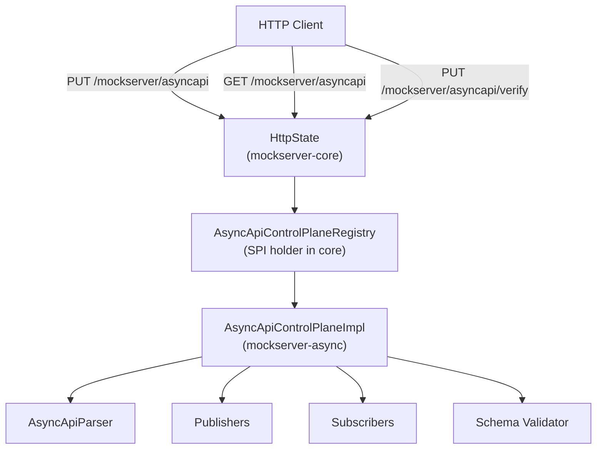

# Async Messaging Module (`mockserver-async`)

## Overview

The `mockserver-async` module provides **AsyncAPI-driven message-broker mocking** for Kafka and MQTT. Given an AsyncAPI 2.x or 3.x specification document, it parses the channels and message definitions, generates schema-validated example payloads, publishes them to a message broker, and can subscribe to channels to record incoming messages for verification.

## Architecture

```mermaid
flowchart LR
    A["AsyncAPI Spec\n(JSON / YAML)"] --> B["AsyncApiParser"]
    B --> C["AsyncApiSpec\n(channels + messages)"]
    C --> D["MessageExampleGenerator"]
    D --> E["Example payloads\n(schema-aware)"]
    E --> F["AsyncApiMockOrchestrator"]
    F --> G["MessagePublisher"]
    G --> H["Kafka / MQTT broker"]
    H --> I["MessageSubscriber"]
    I --> J["RecordedMessages"]
```



### Control-Plane Integration



The control-plane uses an **SPI/registry pattern** (Option A from the design spec): a lightweight `AsyncApiControlPlane` interface and `AsyncApiControlPlaneRegistry` holder live in `mockserver-core`, keeping core free of async module dependencies. The actual implementation (`AsyncApiControlPlaneImpl`) lives in `mockserver-async` and self-registers at server startup via reflection from `MockServer.createServerBootstrap()`. This mirrors the pattern established by `GrpcHealthRegistry`, `WasmStore`, `DriftStore`, and other optional subsystem registries in core.

### Key Classes

| Class | Package | Responsibility |
|-------|---------|----------------|
| `AsyncApiControlPlane` | `o.m.async` (core) | SPI interface for the control-plane |
| `AsyncApiControlPlaneRegistry` | `o.m.async` (core) | Singleton holder; routes HttpState calls to the implementation |
| `AsyncApiControlPlaneImpl` | `o.m.async.controlplane` | Full implementation: load, status, reset, verify, broker lifecycle |
| `AsyncApiParser` | `o.m.async.asyncapi` | Parses AsyncAPI 2.x/3.x JSON or YAML into an `AsyncApiSpec` model |
| `AsyncApiSpec` | `o.m.async.asyncapi` | Immutable model: version, title, list of `AsyncApiChannel` |
| `AsyncApiChannel` | `o.m.async.asyncapi` | A channel name, payload examples, optional JSON Schema, and parsed bindings (MQTT qos/retain, Kafka key) |
| `MessageExampleGenerator` | `o.m.async` | Schema-aware example generation (enum, default, format, min/max, minLength, const) |
| `AsyncApiSchemaValidator` | `o.m.async.validation` | Validates payloads against channel JSON Schemas using core's `JsonSchemaValidator` |
| `PublishOptions` | `o.m.async.publish` | Immutable carrier for per-message publish-time options: Kafka key, MQTT qos, MQTT retain |
| `MessagePublisher` | `o.m.async.publish` | Interface: `publish(channel, payload)`, `publish(channel, key, payload, headers)`, `publish(channel, payload, options)`, `close()` |
| `KafkaMessagePublisher` | `o.m.async.publish` | Wraps `KafkaProducer`; supports keys and headers |
| `MqttMessagePublisher` | `o.m.async.publish` | Wraps Paho `MqttClient`; supports configurable QoS (0/1/2) and binary payloads |
| `MessageSubscriber` | `o.m.async.subscribe` | Interface: `subscribe(channel)`, `unsubscribe(channel)`, `getRecordedMessages()`, `close()` |
| `KafkaMessageSubscriber` | `o.m.async.subscribe` | Wraps `KafkaConsumer` with background poll loop; all consumer access confined to the poll thread via a queued-ops pattern; records messages in bounded stores |
| `MqttMessageSubscriber` | `o.m.async.subscribe` | Wraps Paho `MqttClient` callback; records messages in bounded stores |
| `BoundedMessageStore` | `o.m.async.subscribe` | Thread-safe, bounded FIFO store for `RecordedMessage` instances (default 1000 per channel); evicts oldest when full |
| `RecordedMessage` | `o.m.async.subscribe` | Immutable record: channel, key, payload, headers, timestamp |
| `AsyncApiMockOrchestrator` | `o.m.async` | Publishes examples once (`publishAll()`) or on a schedule (`startPublishing(interval)` / `stop()`) |

## REST Control-Plane

### `PUT /mockserver/asyncapi`

Load an AsyncAPI spec and start mocking. The request body can be either:

1. **Plain spec**: the AsyncAPI document as JSON or YAML
2. **Wrapped body**: `{"spec": <spec>, "brokerConfig": {...}}`

Broker configuration options (`brokerConfig`):

| Field | Type | Default | Description |
|-------|------|---------|-------------|
| `kafkaBootstrapServers` | string | null | Kafka bootstrap servers (e.g. `localhost:9092`) |
| `kafkaGroupId` | string | `mockserver-async-consumer` | Consumer group ID for Kafka subscribers |
| `mqttBrokerUrl` | string | null | MQTT broker URL (e.g. `tcp://localhost:1883`) |
| `mqttClientId` | string | `mockserver-mqtt-pub/sub` | MQTT client ID prefix |
| `mqttQos` | int | 1 | MQTT QoS level (0, 1, or 2) |
| `publishOnLoad` | boolean | true | Publish examples immediately on load |
| `publishIntervalMillis` | long | 0 | Schedule periodic publishing (0 = disabled) |
| `consume` | boolean | false | Enable consumer/subscriber for each channel |
| `kafkaSecurity` | object | null | Kafka SASL/SSL security config (see [Broker Security](#broker-security)) |
| `mqttSecurity` | object | null | MQTT username/password/SSL security config (see [Broker Security](#broker-security)) |

**Response** (201 Created):
```json
{
  "loaded": true,
  "specTitle": "My API",
  "specVersion": "2.6.0",
  "channelCount": 2,
  "channels": [{"name": "orders", "hasSchema": true}],
  "publishers": 1,
  "subscribers": 1
}
```

### `GET /mockserver/asyncapi`

Returns current status including loaded spec info, active channels, and recorded messages from subscribers.

**Response** (200 OK):
```json
{
  "loaded": true,
  "specTitle": "My API",
  "specVersion": "2.6.0",
  "channels": [{"name": "orders", "hasSchema": true, "exampleCount": 1}],
  "publishers": 1,
  "subscribers": 1,
  "recordedMessages": [
    {
      "channel": "orders",
      "key": "order-123",
      "payload": "{\"orderId\":42}",
      "headers": {"trace-id": "abc"},
      "timestamp": "2024-01-01T00:00:00Z",
      "schemaValid": true
    }
  ]
}
```

### `PUT /mockserver/asyncapi/verify`

Verify that recorded messages match the given criteria. Mirrors the semantics of `PUT /mockserver/verify` for HTTP requests.

**Request body** (JSON):

| Field | Type | Required | Description |
|-------|------|----------|-------------|
| `channel` | string | yes | The channel/topic to check |
| `payloadSubstring` | string | no | Payload must contain this substring |
| `payloadJsonPath` | string | no | Dot-notation JSON path to extract from the payload (e.g. `user.name`) |
| `expectedValue` | string | no | Expected value at the JSON path (used with `payloadJsonPath`) |
| `count` | object | no | Count constraints: `{atLeast, atMost, exactly}`. Default: `{atLeast: 1}` |

**Responses:**

| Status | Meaning |
|--------|---------|
| 202 Accepted | Verification passed |
| 406 Not Acceptable | Verification failed (body contains human-readable failure reason) |
| 400 Bad Request | Malformed request (missing channel, invalid JSON) |
| 501 Not Implemented | mockserver-async module is not on the classpath |

**Example — verify at least 1 message on "orders" with a specific user name:**
```json
{
  "channel": "orders",
  "payloadJsonPath": "user.name",
  "expectedValue": "Alice",
  "count": { "atLeast": 1 }
}
```

**Example — verify exactly 0 messages on a channel (negative assertion):**
```json
{
  "channel": "errors",
  "count": { "exactly": 0 }
}
```

### Reset

All async mocking state (publishers, subscribers, recorded messages) is cleared on `PUT /mockserver/reset`.

## AsyncAPI Parsing

The parser auto-detects JSON vs YAML (by leading `{` character) and supports:

- **AsyncAPI 2.x**: `channels.<name>.publish|subscribe.message.payload` for schema; `.payload.example` for inline examples; `.message.examples[].payload` for the examples array
- **AsyncAPI 3.x**: `channels.<name>.messages.<msgName>.payload` for schema; `.examples[].payload` for examples; basic `$ref` resolution to `#/components/messages/<name>`

Missing or incomplete structures are tolerated gracefully (channels appear with empty examples).

## Example Generation (Schema-Aware)

The `MessageExampleGenerator` follows this precedence per channel:

1. First explicit example from the spec
2. Schema-aware synthesis from JSON Schema, respecting:
   - `default` values
   - `enum` (uses first value)
   - `const` values
   - `minimum`/`maximum` and `exclusiveMinimum`/`exclusiveMaximum`
   - `minLength` (pads string to required length)
   - `minItems` (pads array to required size)
   - `format` (generates format-appropriate values: date-time, email, uuid, uri, ipv4, ipv6)
   - `pattern` (heuristic matching for common patterns like email, numeric)
3. Fallback: `{}`

## Schema Validation

The `AsyncApiSchemaValidator` reuses core's `JsonSchemaValidator` (backed by `com.networknt:json-schema-validator`) to validate:

- **Generated examples** before publishing (warnings logged for non-conforming examples)
- **Consumed/recorded messages** from broker subscriptions (validation result included in status response)

## Consumer/Subscriber Mocking

MockServer can **subscribe** to Kafka topics and MQTT topics to record incoming messages, mirroring how HTTP requests are recorded for verification. Subscribers are created when `consume: true` is set in the broker config.

Recorded messages include:
- Channel/topic name
- Message key (Kafka) or null (MQTT)
- Payload (string)
- Headers (Kafka) or empty map (MQTT)
- Timestamp
- Schema validation result (when a schema is defined)

Recorded messages are stored in a **bounded** `BoundedMessageStore` per channel (default 1000 messages). When the cap is reached, the oldest message is evicted (FIFO). This prevents unbounded memory growth under high message volume.

## Message Keys, QoS, and Headers

- **Kafka**: `KafkaMessagePublisher.publish(channel, key, payload, headers)` supports configurable record keys and arbitrary headers
- **MQTT**: `MqttMessagePublisher` supports configurable QoS (0, 1, or 2) and binary payloads via `publishBytes()`
- **Kafka Consumer**: `KafkaMessageSubscriber` records message keys and headers from consumed records

## AsyncAPI Channel Bindings

The parser extracts publish-time bindings from the AsyncAPI spec and threads them through to the publishers via an immutable `PublishOptions` carrier. The following bindings are supported:

### Supported Bindings

| Binding | AsyncAPI Location | Applies To | Effect |
|---------|-------------------|------------|--------|
| MQTT QoS | `publish.bindings.mqtt.qos` (v2), `channels.<n>.bindings.mqtt.qos` (v3 best-effort) | `MqttMessagePublisher` | Overrides the instance-level QoS for the message |
| MQTT retain | `publish.bindings.mqtt.retain` (v2), `channels.<n>.bindings.mqtt.retain` (v3 best-effort) | `MqttMessagePublisher` | Sets `MqttMessage.setRetained()` |
| Kafka message key | `publish.message.bindings.kafka.key` (v2), `messages.<n>.bindings.kafka.key` (v3) | `KafkaMessagePublisher` | Sets the `ProducerRecord` key |

### Kafka Key Extraction

The Kafka key binding (`bindings.kafka.key`) can be:

- A **scalar literal** (string or number) -- used directly
- A **schema with `const`** -- the const value is used
- A **schema with `example`** -- the example value is used
- A **schema with `examples[]`** -- the first example is used
- A **bare schema** (no literal derivable) -- key is null (not applied)

### PublishOptions Threading

The `AsyncApiMockOrchestrator` looks up each channel's `AsyncApiChannel` by name, calls `toPublishOptions()` to build a `PublishOptions`, and passes it to `publisher.publish(channel, payload, options)`. Publishers that do not override the `publish(channel, payload, options)` method fall back to the default implementation which ignores the options, preserving backward compatibility.

### Limitations

- **v3 MQTT operation bindings**: In AsyncAPI 3.x, MQTT QoS and retain are properly located in the top-level `operations` section's bindings, not on channels. The parser checks for channel-level `bindings.mqtt` as a best-effort fallback but does **not** navigate v3 operation-to-channel references. Full v3 operation-binding resolution is deferred.
- **Kafka topic-config bindings**: Kafka channel bindings for topic configuration (partitions, replicas, cleanup policy) are intentionally **not** applied at publish time -- they describe topic creation parameters, not message-level settings.

## Broker Security

The `brokerConfig` supports optional security configuration for connecting to enterprise brokers that require SASL authentication and/or TLS. When security is absent or empty, the adapters use plaintext connections (backward compatible).

### Kafka Security (`kafkaSecurity`)

| Field | Kafka Config Key | Description |
|-------|-----------------|-------------|
| `securityProtocol` | `security.protocol` | Protocol: `PLAINTEXT`, `SSL`, `SASL_PLAINTEXT`, `SASL_SSL` |
| `saslMechanism` | `sasl.mechanism` | SASL mechanism: `PLAIN`, `SCRAM-SHA-256`, `SCRAM-SHA-512`, `OAUTHBEARER` |
| `saslJaasConfig` | `sasl.jaas.config` | JAAS login module configuration string |
| `sslTruststoreLocation` | `ssl.truststore.location` | Path to the SSL truststore file |
| `sslTruststorePassword` | `ssl.truststore.password` | Password for the SSL truststore |
| `sslKeystoreLocation` | `ssl.keystore.location` | Path to the SSL keystore file (for mTLS) |
| `sslKeystorePassword` | `ssl.keystore.password` | Password for the SSL keystore |
| `sslKeyPassword` | `ssl.key.password` | Password for the private key in the keystore |

Example:
```json
{
  "kafkaBootstrapServers": "broker:9093",
  "kafkaSecurity": {
    "securityProtocol": "SASL_SSL",
    "saslMechanism": "PLAIN",
    "saslJaasConfig": "org.apache.kafka.common.security.plain.PlainLoginModule required username=\"user\" password=\"pass\";",
    "sslTruststoreLocation": "/path/to/truststore.jks",
    "sslTruststorePassword": "changeit"
  }
}
```

### MQTT Security (`mqttSecurity`)

| Field | Description |
|-------|-------------|
| `username` | MQTT broker username |
| `password` | MQTT broker password |
| `sslProperties` | Map of SSL properties passed to Paho `MqttConnectOptions.setSSLProperties()` |

Supported SSL property keys (Paho/IBM conventions):

| Key | Description |
|-----|-------------|
| `com.ibm.ssl.keyStore` | Path to the client keystore |
| `com.ibm.ssl.keyStorePassword` | Keystore password |
| `com.ibm.ssl.trustStore` | Path to the truststore |
| `com.ibm.ssl.trustStorePassword` | Truststore password |
| `com.ibm.ssl.protocol` | SSL protocol (e.g. `TLSv1.2`) |

Example:
```json
{
  "mqttBrokerUrl": "ssl://broker:8883",
  "mqttSecurity": {
    "username": "user",
    "password": "pass",
    "sslProperties": {
      "com.ibm.ssl.trustStore": "/path/to/truststore.jks",
      "com.ibm.ssl.trustStorePassword": "changeit"
    }
  }
}
```

### Implementation

Security configuration is applied through testable utility classes:

- `KafkaSecurityProperties.applySecurity(Properties, KafkaSecurity)` — sets the Kafka config keys on the client properties
- `MqttSecurityOptions.buildConnectOptions(MqttSecurity)` — builds `MqttConnectOptions` with username/password/SSL (returns `null` when empty, preserving the no-arg `connect()` path)

The security objects are parsed from the `brokerConfig` JSON in `AsyncApiControlPlaneImpl.parseBrokerConfig()` and threaded through to the publisher/subscriber constructors.

## Build/Docker Wiring

The `mockserver-async` module is wired into the running server:

- **mockserver-netty** declares `mockserver-async` as an optional dependency
- **mockserver-netty-no-dependencies** (the standalone/Docker jar) explicitly includes `mockserver-async` so it's bundled by the shade plugin
- **Registration**: `MockServer.createServerBootstrap()` uses reflection to call `AsyncApiControlPlaneImpl.registerIfAvailable()` at startup, avoiding a hard compile-time dependency
- When the module is absent from the classpath, the `/mockserver/asyncapi` endpoints respond with 501 (Not Implemented)

## Dependencies

| Dependency | Version | Purpose |
|------------|---------|---------|
| `jackson-databind` | (parent-managed) | JSON parsing and generation |
| `jackson-dataformat-yaml` | (parent-managed) | YAML parsing |
| `kafka-clients` | 3.9.0 | Kafka producer and consumer |
| `org.eclipse.paho.client.mqttv3` | 1.2.5 | MQTT client (publish and subscribe) |
| `mockserver-core` | (optional) | SPI interface, JSON Schema validator, shared utilities |

## Tests

| Test Class | What it covers |
|------------|----------------|
| `AsyncApiParserTest` | AsyncAPI 2.x/3.x parsing (JSON, YAML, refs, edge cases, binding extraction) |
| `MessageExampleGeneratorTest` | Basic example generation (explicit, synthesized, fallback) |
| `MessageExampleGeneratorSchemaAwareTest` | Schema-aware synthesis (enum, default, format, min/max, const, minLength, minItems) |
| `PublishOptionsTest` | PublishOptions construction, validation, isEmpty, qos range checking |
| `AsyncApiMockOrchestratorTest` | Orchestrator publish/schedule lifecycle, PublishOptions threading (mocked publisher) |
| `KafkaMessagePublisherTest` | Basic Kafka publishing (mocked producer) |
| `KafkaMessagePublisherKeyHeadersTest` | Kafka keys, headers, and PublishOptions (key from bindings) (mocked producer) |
| `MqttMessagePublisherTest` | Basic MQTT publishing (mocked client) |
| `MqttMessagePublisherQosTest` | MQTT QoS, binary payloads, and PublishOptions (retain, qos override) (mocked client) |
| `BoundedMessageStoreTest` | Bounded FIFO store: capacity, eviction, snapshot isolation, edge cases |
| `KafkaMessageSubscriberTest` | Kafka subscribing, message recording, bounded eviction, queued-ops pattern (mocked consumer) |
| `MqttMessageSubscriberTest` | MQTT subscribing, message recording, bounded eviction (mocked client) |
| `AsyncApiSchemaValidatorTest` | Schema validation (required, type, enum, min/max, pattern) |
| `AsyncApiControlPlaneImplTest` | Control-plane load/status/reset lifecycle (no real broker) |
| `AsyncApiControlPlaneSecurityTest` | Security scheme parsing from `brokerConfig` JSON (kafkaSecurity, mqttSecurity, edge cases) |
| `AsyncApiControlPlaneVerifyTest` | Message verification: count semantics (atLeast/atMost/exactly), payload substring, JSON path matching, error cases |
| `AsyncApiControlPlaneRegistryTest` | SPI holder delegation (including verify) and not-available responses (in core) |
| `KafkaSecurityPropertiesTest` | `KafkaSecurityProperties.applySecurity()`: all/partial/empty/null security, blank value skipping |
| `KafkaMessagePublisherSecurityTest` | `buildProducerProperties()` with SASL_SSL, null, empty, and partial security |
| `KafkaMessageSubscriberSecurityTest` | `buildConsumerProperties()` with SASL_SSL, SCRAM, null, empty security |
| `MqttSecurityOptionsTest` | `MqttSecurityOptions.buildConnectOptions()`: username/password, SSL properties, null/empty security |

## Configuration Properties (Async Defaults)

The following `ConfigurationProperties` provide server-wide defaults for async messaging. Values set via the request body's `brokerConfig` take precedence over these defaults.

| Property Key | Env Var | Type | Default | Description |
|-------------|---------|------|---------|-------------|
| `mockserver.asyncKafkaBootstrapServers` | `MOCKSERVER_ASYNC_KAFKA_BOOTSTRAP_SERVERS` | String | `""` (none) | Default Kafka bootstrap servers; used when `brokerConfig.kafkaBootstrapServers` is absent |
| `mockserver.asyncMqttBrokerUrl` | `MOCKSERVER_ASYNC_MQTT_BROKER_URL` | String | `""` (none) | Default MQTT broker URL; used when `brokerConfig.mqttBrokerUrl` is absent |
| `mockserver.asyncRecordedMessageMaxEntries` | `MOCKSERVER_ASYNC_RECORDED_MESSAGE_MAX_ENTRIES` | int | `1000` | Maximum recorded messages per channel in subscriber stores |

These properties follow the standard four-form pattern (system property, environment variable, property file, `Configuration` instance setter) used by all other MockServer configuration properties.

## Java Client Helpers

`MockServerClient` provides fluent helpers for the asyncapi control-plane:

| Method | HTTP Call | Return / Throw |
|--------|-----------|---------------|
| `loadAsyncApi(String specOrWrappedJson)` | `PUT /mockserver/asyncapi` | JSON response string (spec info) |
| `asyncApiStatus()` | `GET /mockserver/asyncapi` | JSON status string |
| `verifyAsyncMessage(String verificationJson)` | `PUT /mockserver/asyncapi/verify` | Returns `this` on 202; throws `AssertionError` on 406 with the failure description |

Example usage:
```java
MockServerClient client = new MockServerClient("localhost", 1080);
client.loadAsyncApi("{\"spec\":{...}, \"brokerConfig\":{\"kafkaBootstrapServers\":\"localhost:9092\"}}");
String status = client.asyncApiStatus();
client.verifyAsyncMessage("{\"channel\":\"orders\",\"count\":{\"atLeast\":1}}");
```

## Deferred (Honest List)

The following items are **not yet implemented**:

- **Dashboard UI**: no UI panel for async messaging state (deferred to a future UI enhancement)
- **Advanced AsyncAPI bindings (remaining)**: Kafka topic-config bindings (partitions, replicas) and v3 operation-level MQTT binding navigation are not yet implemented. MQTT qos/retain and Kafka message key bindings are supported (see [AsyncAPI Channel Bindings](#asyncapi-channel-bindings))
- **Correlation IDs**: AsyncAPI correlation ID definitions are not tracked
- **Multi-message channels**: only the first message definition per channel is used
- **Live-broker integration tests**: all tests use mocked producers/consumers; Testcontainers-based live-broker tests are a documented follow-up (testcontainers is not currently a test dependency)
