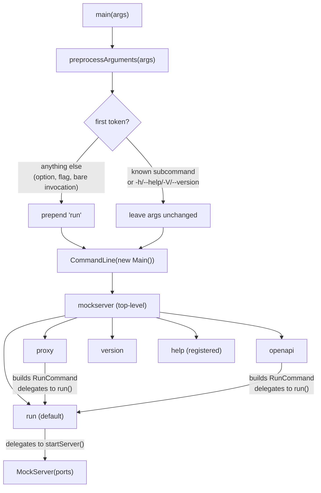
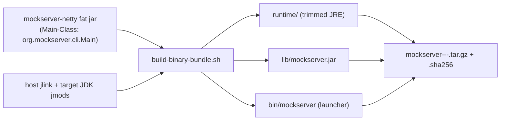

# CLI Architecture

MockServer's command-line interface is built with [picocli](https://picocli.info/) and lives entirely in `org.mockserver.cli.Main`. The entry point is unchanged from earlier releases — Docker's `ENTRYPOINT` and all existing shell scripts still invoke `Main.main()`. The visible change is that the old monolithic argument parser has been replaced by a proper picocli command tree with four named subcommands, while full backward compatibility with pre-existing single-dash legacy flags is preserved.

## Command tree



## Subcommands

| Subcommand | Class | Purpose |
|---|---|---|
| `run` (default) | `Main.RunCommand` | Start MockServer in mock/proxy mode |
| `proxy` | `Main.ProxyCommand` | Syntactic sugar — starts MockServer with `--proxy-to` set, delegates to `RunCommand.run()` |
| `openapi` | `Main.OpenApiCommand` | Start MockServer, pre-load expectations from an OpenAPI spec; delegates to `RunCommand.run()` |
| `version` | `Main.VersionCommand` | Print `Version.getVersion()` and exit |
| `help` | `CommandLine.HelpCommand` (picocli built-in, registered in `@Command(subcommands = {...})`) | Print usage for the top command or any subcommand — `mockserver help` or `mockserver help <subcommand>` |

`proxy` and `openapi` are thin wrappers: they construct a `RunCommand` instance, populate the relevant fields, and call `runCmd.run()`. All actual wiring of `ConfigurationProperties` and server startup lives in `RunCommand`.

## Options reference

### `run` subcommand

| Flag | Short | Config property set | Notes |
|---|---|---|---|
| `--port` | `-p` | `mockserver.serverPort` (via `startServer`) | Comma-separated list, e.g. `1080,1081` |
| `--proxy-to` | — | `mockserver.proxyRemoteHost` + `mockserver.proxyRemotePort` (parsed) | `host:port`, `https://host[:port]`, or `http://host[:port]`; `https://` infers port 443, `http://` infers port 80; a bare hostname with no port and no scheme is rejected with a clear error message |
| `--openapi` | — | `mockserver.initializationOpenAPIPath` | URL or file path |
| `--init` | — | `mockserver.initializationJsonPath` | File path or glob |
| `--persist` | — | `mockserver.persistExpectations` = `true` + `mockserver.persistedExpectationsPath` | |
| `--log-level` | `-l` | `mockserver.logLevel` | |
| `--dev` | — | `mockserver.devMode` | Developer-friendly defaults: `maxLogEntries=1000`, `maxExpectations=1000`. Explicit config overrides dev defaults. Also available as `MOCKSERVER_DEV_MODE=true` or `-Dmockserver.devMode=true`. |
| `--validate-openapi` | — | `mockserver.validateProxyOpenAPISpec` | Validate forwarded/proxied requests and responses against the given OpenAPI spec (URL, file path, or inline payload). Violations are logged; combine with `--validate-enforce` to block non-conformant traffic. |
| `--validate-enforce` | — | `mockserver.validateProxyEnforce` | When combined with `--validate-openapi`, reject requests that violate the spec (400) and replace non-conformant upstream responses (502). Without this flag, violations are report-only. |
| `-serverPort` | — | same as `--port` | Hidden legacy flag |
| `-proxyRemotePort` | — | same as `--proxy-to` port part | Hidden legacy flag |
| `-proxyRemoteHost` | — | same as `--proxy-to` host part | Hidden legacy flag |
| `-logLevel` | — | same as `--log-level` | Hidden legacy flag |

### `proxy` subcommand

| Flag | Short | Notes |
|---|---|---|
| `--to` | — | Required; `host:port`, `https://host[:port]`, or `http://host[:port]`; scheme infers default port (443/80); bare hostname with no port and no scheme is rejected |
| `--port` | `-p` | |
| `--log-level` | `-l` | |
| `--validate-openapi` | — | Validate forwarded/proxied traffic against the given OpenAPI spec |
| `--validate-enforce` | — | Block non-conformant traffic (400 for requests, 502 for responses) |

### `openapi` subcommand

| Argument | Notes |
|---|---|
| `<specUrlOrPath>` | Positional, required |
| `--port` / `-p` | |
| `--log-level` / `-l` | |

### `version` subcommand

No options. Prints `Version.getVersion()` and exits.

## The `preprocessArguments` heuristic

The heuristic exists to satisfy two constraints simultaneously:

1. **Bare invocation** — existing scripts and Docker images invoke MockServer as `mockserver -serverPort 1080` or `mockserver -p 1080` with no subcommand. Without preprocessing, picocli would see an unknown option on the top-level `Main` command and fail.
2. **Top-level flags** — `mockserver --help` and `mockserver --version` must still work without being swallowed into the `run` subcommand.

The logic (in `Main.preprocessArguments`):

```
if args is empty                    → return ["run"]
if args[0] ∈ {run, proxy, openapi, version, help}  → return args unchanged
if args[0] ∈ {--help, -h, --version, -V}           → return args unchanged
otherwise                                           → return ["run"] + args
```

This means every token sequence that would have worked with the old flat parser is transparently routed to `RunCommand`.

## Legacy flag compatibility

The four legacy flags (`-serverPort`, `-proxyRemotePort`, `-proxyRemoteHost`, `-logLevel`) are declared as `hidden = true` options on `RunCommand` with **exact single-token names** (not as clustered POSIX shorts). picocli matches them as long options, so `-serverPort 1080` is parsed as `legacyServerPort = "1080"`.

`RunCommand.run()` merges them with the new flags. New flags always win:

```java
String resolvedPort = isNotBlank(port) ? port : legacyServerPort;
String resolvedLogLevel = isNotBlank(logLevel) ? logLevel : legacyLogLevel;
```

`--proxy-to` and the legacy `-proxyRemotePort`/`-proxyRemoteHost` pair are also merged: if `--proxy-to` is set, its parsed host/port overwrite the legacy values.

## Configuration precedence in `startServer`

`RunCommand.run()` calls `startServer(resolvedPort, resolvedProxyRemotePort, resolvedProxyRemoteHost, resolvedLogLevel)`. This method preserves the original four-level precedence chain:

```
CLI arg  >  JVM system property (mockserver.*)  >  env var (MOCKSERVER_*)  >  mockserver.properties file
```

The env var check is two-pass: `MOCKSERVER_SERVER_PORT` (long form) is checked before `SERVER_PORT` (short form). The short-form check has a special guard: if `SERVER_PORT=1080` (the Docker default) is present **and** `mockserver.serverPort` is already in the properties file, the env var is ignored (prevents Docker's ambient `SERVER_PORT` from overriding a deliberate properties-file setting).

The `Arguments` enum is the canonical source of truth for the three property name forms:

| `Arguments` member | System property | Long env var | Short env var |
|---|---|---|---|
| `serverPort` | `mockserver.serverPort` | `MOCKSERVER_SERVER_PORT` | `SERVER_PORT` |
| `proxyRemoteHost` | `mockserver.proxyRemoteHost` | `MOCKSERVER_PROXY_REMOTE_HOST` | `PROXY_REMOTE_HOST` |
| `proxyRemotePort` | `mockserver.proxyRemotePort` | `MOCKSERVER_PROXY_REMOTE_PORT` | `PROXY_REMOTE_PORT` |
| `logLevel` | `mockserver.logLevel` | `MOCKSERVER_LOG_LEVEL` | `LOG_LEVEL` |

## New flags and `ConfigurationProperties`

`--openapi`, `--init`, and `--persist` are wired directly in `RunCommand.run()` before calling `startServer()`:

```java
if (isNotBlank(openapi))          ConfigurationProperties.initializationOpenAPIPath(openapi);
if (isNotBlank(init))             ConfigurationProperties.initializationJsonPath(init);
if (isNotBlank(persist)) {
    ConfigurationProperties.persistExpectations(true);
    ConfigurationProperties.persistedExpectationsPath(persist);
}
if (isNotBlank(validateOpenapi))  ConfigurationProperties.validateProxyOpenAPISpec(validateOpenapi);
if (validateEnforce)              ConfigurationProperties.validateProxyEnforce(true);
```

These calls write into the same `ConfigurationProperties` property store that env vars and `.properties` files write into, so the precedence rule still applies — a `-Dmockserver.initializationJsonPath=...` JVM flag will be overwritten if `--init` is also supplied on the command line (CLI wins).

`--dev` sets `ConfigurationProperties.devMode(true)`, which applies laptop-friendly defaults for any property the user has not explicitly set (via system property, environment variable, or properties file). Currently this lowers `maxLogEntries` and `maxExpectations` to 1,000 each — enough for local development without consuming the full heap-based default (which can reach 100,000 / 15,000). The same effect is available as `MOCKSERVER_DEV_MODE=true` or `-Dmockserver.devMode=true` for Docker / Compose workloads.

## Proxy target parsing (`parseProxyTarget`)

`--proxy-to` (on `run`) and `--to` (on `proxy`) are both routed through `Main.parseProxyTarget(String value)`. The method returns a `String[]{host, port}` pair or throws `IllegalArgumentException`.

Accepted forms:

| Input | Resolved host | Resolved port |
|---|---|---|
| `host:port` | `host` | `port` |
| `https://host` | `host` | `443` (inferred from scheme) |
| `http://host` | `host` | `80` (inferred from scheme) |
| `https://host:port` | `host` | `port` (explicit overrides scheme default) |
| `http://host/path` | `host` | `80` (path is stripped) |
| `[::1]:port` | `::1` | `port` (IPv6 brackets handled) |

**Rejected form:** a bare hostname with no port and no scheme — e.g. `api.example.com` — causes an immediate `IllegalArgumentException` with an error message that suggests the explicit `host:port` or `https://` form. There is no silent fall-through to mock mode.

## Validation

`validateArguments()` runs after flag merging inside `RunCommand.run()` and produces the same error messages as the old flat parser. Validation rules:

- `serverPort` must match `^\d+(,\d+)*$`
- `proxyRemotePort` must be a single integer
- `proxyRemoteHost` must match either a valid IPv4 or hostname regex
- `logLevel` must be one of: `TRACE DEBUG INFO WARN ERROR OFF FINEST FINE WARNING SEVERE`

If validation fails, the errors are printed and `showUsage()` is called. The `showUsage()` method prints the legacy `USAGE` string (retained for backward compatibility with legacy flag paths) and is guarded by a `usageShown` flag to prevent double-printing. For picocli-era error paths (parse errors, `--proxy-to` validation), picocli's concise subcommand usage is shown instead of the legacy blob.

## Error handling

Two picocli exception handlers are registered in `main()`:

- `setExecutionExceptionHandler` — catches exceptions thrown by `Runnable.run()`, logs them via `MockServerLogger`, calls `showUsage()`, and returns exit code `1`.
- `setParameterExceptionHandler` — catches picocli parse errors (unknown option, missing required arg), prints the error to stderr and the offending subcommand's picocli concise usage to stdout, and returns exit code `2`.

## How to add a new subcommand

1. Create a `static class MyCommand implements Runnable` annotated with `@Command(name = "mycommand", ...)` inside `Main`.
2. Add `@Option` fields for the subcommand's flags.
3. Register it in the top-level `@Command(subcommands = {..., MyCommand.class})`.
4. Add `"mycommand"` to the `subcommands` set inside `preprocessArguments` so that `mockserver mycommand ...` is not incorrectly prepended with `"run"`.
5. If the subcommand starts MockServer, delegate to `RunCommand.run()` by populating a `RunCommand` instance (as `ProxyCommand` and `OpenApiCommand` do) rather than calling `startServer()` directly — this keeps validation and new-flag wiring in one place.
6. Update this document and the consumer-facing CLI page.

## JVM-less binary distribution (jlink bundle)

The CLI can be shipped as a self-contained, cross-platform bundle that runs with **no
pre-installed JVM and no Docker**, built by `scripts/build-binary-bundle.sh`.



**Why jlink, not GraalVM native-image:** MockServer loads user-supplied classes at runtime
(`initializationClass`, `RESPONSE_CLASS_CALLBACK`, `FORWARD_CLASS_CALLBACK`), generates TLS
certificates dynamically via BouncyCastle, and embeds scripting engines — all of which violate
native-image's closed-world assumption. A jlink-trimmed runtime is the real HotSpot JVM, so
feature parity is 100% with zero reachability-metadata maintenance.

**Runtime module set** (validated end-to-end — HTTP, HTTPS/BouncyCastle dynamic certs, and DNS
all confirmed): `java.se` (runtime aggregator) plus `jdk.unsupported` (Netty `sun.misc.Unsafe`),
`jdk.crypto.ec` + `jdk.crypto.cryptoki` (TLS), `jdk.naming.dns`, `jdk.zipfs`. Trimmed runtime is
~54 MB.

**Launcher** (`bin/mockserver`) execs the bundled `runtime/bin/java -jar lib/mockserver.jar "$@"`,
so every CLI subcommand and flag documented above works identically; `MOCKSERVER_JAVA_OPTS`
overrides JVM options.

**Cross-build from one host:** jlink targets another OS/arch by using the host `jlink` with the
target JDK's `--jmods` (host and target JDK must share the major version). `--os`/`--arch` name the
archive; Windows produces a `.zip` with `bin/mockserver.bat`. `scripts/build-all-bundles.sh`
orchestrates this for every platform — it downloads a same-version Temurin JDK per target (cached
under `--cache`), then invokes the builder for each `{os}/{arch}`
(`linux/x86_64 linux/aarch64 darwin/x86_64 darwin/aarch64 windows/x86_64`). Validated: a macOS host
produces genuine Linux (ELF) and Windows (PE32+) runtimes.

## Source files

| File | Role |
|---|---|
| `mockserver/mockserver-netty/src/main/java/org/mockserver/cli/Main.java` | Entire CLI: top command, all subcommands, preprocessing, validation |
| `mockserver/mockserver-core/src/main/java/org/mockserver/configuration/ConfigurationProperties.java` | Property store; the CLI writes here for `--openapi`, `--init`, `--persist` |
| `mockserver/mockserver-core/src/main/java/org/mockserver/version/Version.java` | Version string used by `VersionCommand` and `MockServerVersionProvider` |
