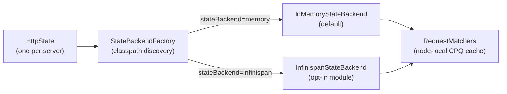
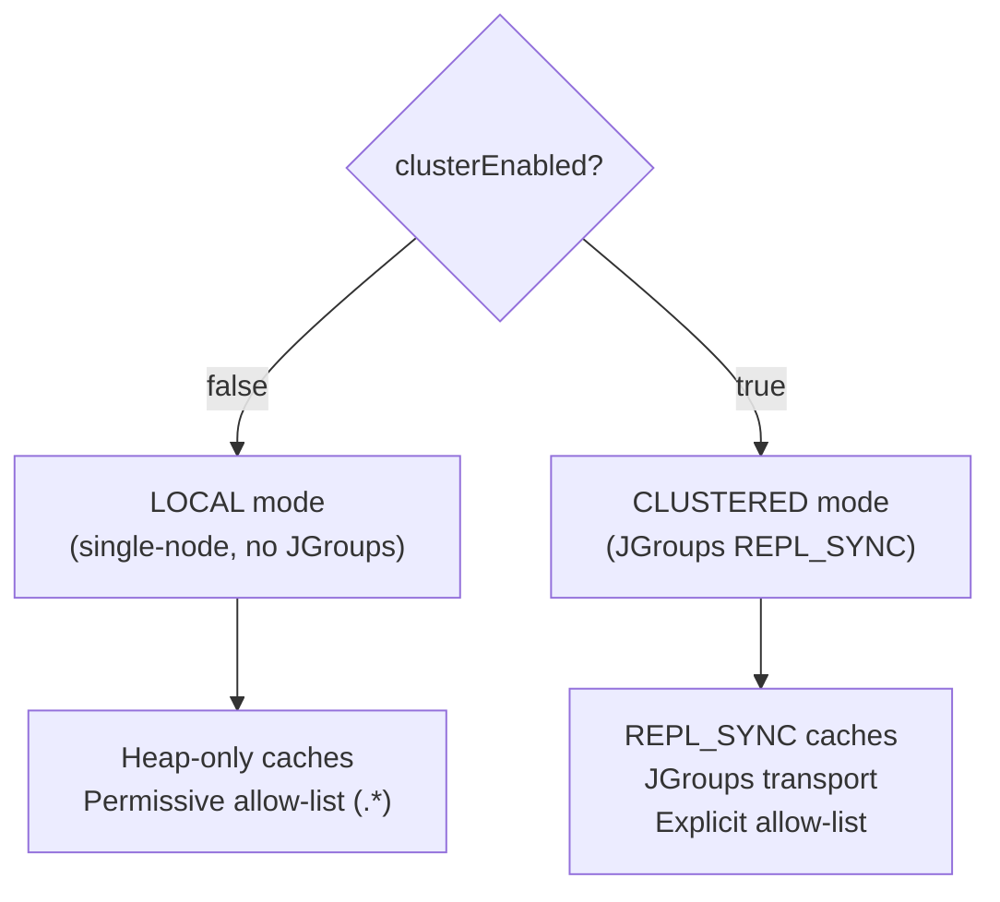
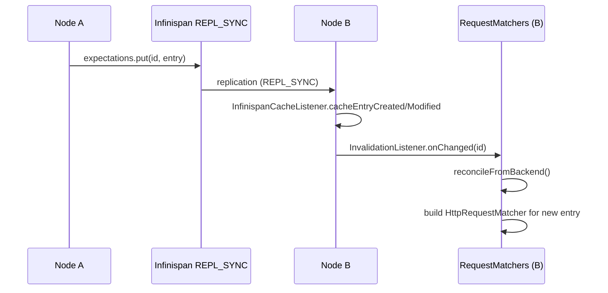
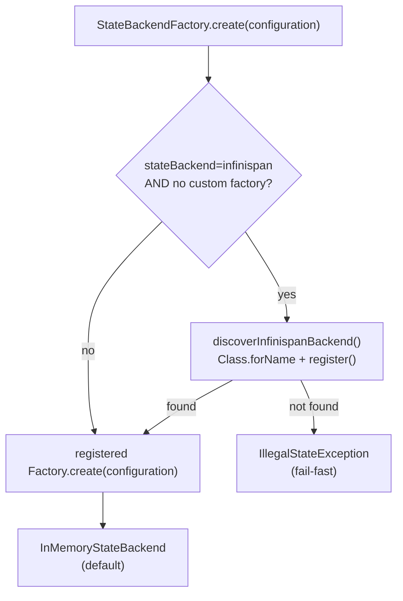
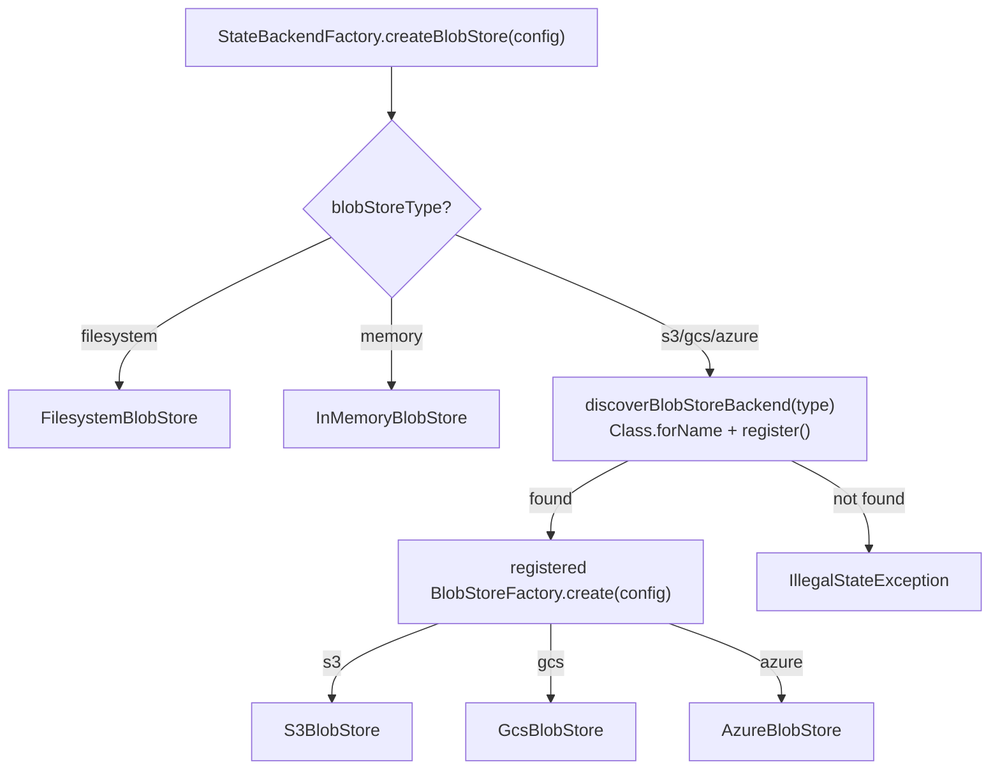
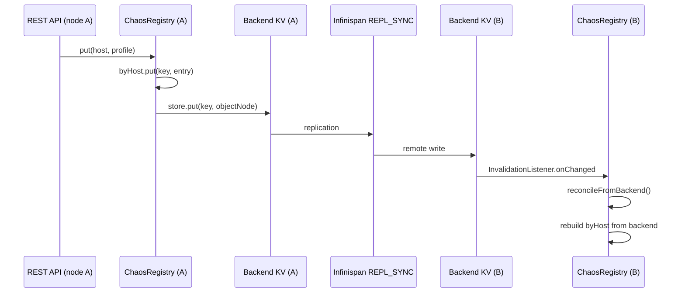
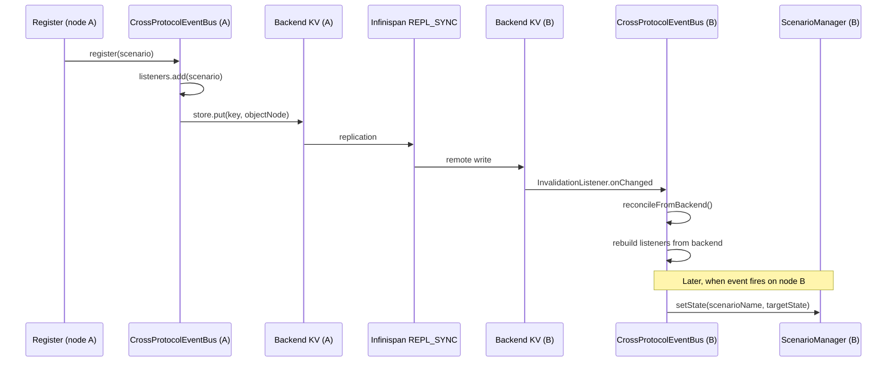

# Clustered MockServer State

## Status

**OPT-IN (single-node default unchanged).** The clustered state backend is an optional Maven module (`mockserver-state-infinispan`) that must be placed on the classpath and activated via configuration. All existing single-node deployments continue to use the default `InMemoryStateBackend` with no change in behaviour or performance.

**Consumer guide:** For an operator-facing deployment guide covering the single-node, clustered HA, and persistence-only options with configuration examples and trade-offs, see the [Centralized Deployment](https://www.mock-server.com/mock_server/centralized_deployment.html) page in the consumer documentation (`jekyll-www.mock-server.com/mock_server/centralized_deployment.html`).

**Docker image:** The `-clustered` Docker image variant (`mockserver/mockserver:clustered-<version>`) bundles the Infinispan module and its transitive dependencies. It is built and pushed by the release pipeline (`scripts/release/components/docker.sh`) alongside the base and GraalJS images, multi-arch (linux/amd64 + linux/arm64). The Dockerfile is at `docker/clustered/Dockerfile`. The Helm chart's `clustering.enabled` value assumes this image variant (see `helm/mockserver/values.yaml`).

## Overview

MockServer ships a `StateBackend` SPI that abstracts all shared server state — expectations, scenario states, CRUD entity stores, and blob persistence — behind a pluggable interface. The default implementation (`InMemoryStateBackend`) wraps the same concurrent in-memory data structures that have always existed. An optional second implementation (`InfinispanStateBackend`, in the `mockserver-state-infinispan` module) can replicate that state across a JGroups cluster, enabling multiple MockServer nodes to share the same expectation set.



## The StateBackend SPI

Defined in `mockserver-core` at `org.mockserver.state.StateBackend`.

### Interfaces

| Interface | Purpose |
|-----------|---------|
| `StateBackend` | Top-level SPI: factory methods for the four store types, plus `nodeId()` and `close()` |
| `KeyValueStore<V>` | Versioned key-value store with optimistic-concurrency (`compareAndSet`) and `InvalidationListener` support |
| `Versioned<V>` | Value paired with a monotonic version number used by `compareAndSet` |
| `BlobStore` | Binary large-object store for persisted cassettes, fixtures, and snapshots |
| `InvalidationListener` | Callback (`onChanged(key)` / `onCleared()`) fired on remote writes in a clustered backend |
| `ExpectationEntry` | Serializable carrier for an `Expectation` and its sort fields (priority, created, id); the `Expectation` itself is marshalled as JSON inside custom `writeObject`/`readObject` because the domain model is not `Serializable` |

### Store Types

`StateBackend` exposes four stores via its interface:

| Store | Type | Description |
|-------|------|-------------|
| `expectations()` | `KeyValueStore<ExpectationEntry>` | Expectation definitions; keyed by expectation id |
| `scenarioStates()` | `KeyValueStore<String>` | Scenario state strings; keyed by composite `scenarioName+isolation` |
| `crudEntities(namespace)` | `KeyValueStore<ObjectNode>` | Per-namespace CRUD entity stores |
| `blobs()` | `BlobStore` | Persisted expectations, recorded cassettes, and fixture files |

### KeyValueStore Semantics

- `put(key, value)` — last-writer-wins; returns the new version number
- `compareAndSet(key, expectedVersion, value)` — atomic replace (optimistic concurrency)
- `compareAndRemove(key, expectedVersion)` — atomic delete
- `entries()` — streaming snapshot of all entries; iteration order is implementation-defined (unordered for generic stores; sorted by priority for the expectation store)
- `addInvalidationListener(listener)` — registers a callback for any mutation

## Default: InMemoryStateBackend

`InMemoryStateBackend` (in `mockserver-core`) is the default for all single-node deployments. It wraps:

- `InMemoryExpectationKeyValueStore` — backed by the same `CircularPriorityQueue` used before the SPI was introduced, so ordering and eviction behaviour are byte-for-byte identical
- `InMemoryKeyValueStore<String>` — backed by `ConcurrentHashMap` for scenario states
- Per-namespace `InMemoryKeyValueStore<ObjectNode>` for CRUD entities
- `InMemoryBlobStore` or `FilesystemBlobStore` depending on `blobStoreType` configuration

`InvalidationListener` callbacks are registered but are no-ops in the single-node path — they exist purely to satisfy the SPI so that `RequestMatchers` can attach reconcile callbacks without knowing which backend is active.

## InfinispanStateBackend

The `mockserver-state-infinispan` module provides an embedded Infinispan `StateBackend`. Infinispan runs in-process — there is no separate data grid to operate.

### Modes

`InfinispanStateBackend` supports two modes, selected at construction time from the `Configuration`:



**LOCAL mode** (`clusterEnabled=false`) starts Infinispan with `nonClusteredDefault()` — no JGroups network transport, no serialization over the wire. The allow-list is `".*"` because nothing crosses a network boundary. This mode is functionally equivalent to the default in-memory backend but adds Infinispan on the classpath. It is useful for testing the Infinispan code path without needing multiple nodes.

**CLUSTERED mode** (`clusterEnabled=true`) starts Infinispan with a JGroups transport and `REPL_SYNC` caches, so every write is synchronously replicated to all cluster members before the write call returns.

### Wire Format

The clustered wire format uses Java serialization (`JavaSerializationMarshaller`) rather than ProtoStream. The `Expectation` domain model does not implement `Serializable`, so `ExpectationEntry` uses custom `writeObject`/`readObject` that serialize the expectation as its JSON string via `ExpectationDTO`. This keeps the wire format self-contained and avoids adding `Serializable` to the entire domain graph.

A strict explicit allow-list covers exactly the types that cross the wire:

| Allow-list pattern | Covers |
|--------------------|--------|
| `org\.mockserver\.state\.infinispan\..*` | `VersionedWrapper` (the cache value carrier) |
| `org\.mockserver\.state\..*` | `ExpectationEntry`, `Blob` |
| `org\.mockserver\.mock\..*` | `Expectation` (as JSON, inside `ExpectationEntry`) |
| `org\.mockserver\.model\..*` | `HttpRequest`, `HttpResponse`, etc. |
| `org\.mockserver\.matchers\..*` | `TimeToLive`, `Times` |
| `com\.fasterxml\.jackson\..*` | `ObjectNode` (for CRUD entities) |
| `java\.lang\..*`, `java\.util\..*`, `java\.time\..*` | JDK primitives, collections, time types |
| `\[B` | `byte[]` (for `Blob` data) |

This explicit allow-list resolves the deserialization gadget-chain risk — types from untrusted packages cannot be instantiated through the cluster wire.

### Cross-Node Invalidation

When a remote write arrives on a cluster node, Infinispan fires its internal cache event. An `InfinispanCacheListener` (`@Listener(clustered=true)`) translates this to `InvalidationListener.onChanged(key)` or `InvalidationListener.onCleared()`, which triggers `RequestMatchers.reconcileFromBackend()` on the receiving node.



`reconcileFromBackend()` in `RequestMatchers` performs a three-step diff against the backend:

1. **Evict** — remove node-local matchers whose id no longer appears in the backend
2. **Add** — for new backend entries, build a local `HttpRequestMatcher` via `MatcherBuilder`
3. **Update** — for existing entries whose backend version is strictly newer than the last reconciled version, update the local matcher (preserving runtime state such as `Times` counters) and re-insert its priority key if sort fields changed

### Eviction

The expectations cache uses Infinispan's approximate `maxCount` eviction with `EvictionStrategy.REMOVE`, capped at `maxExpectations` (default 1000). When the cache is full, Infinispan evicts the least-recently-used entry. The evicted entry is removed from all cluster nodes (eviction is coordinated by Infinispan), and the `InvalidationListener` fires on each node to reconcile the local matcher cache.

Because eviction is approximate, the node-local `CircularPriorityQueue` (used for iteration order during matching) may briefly contain one more entry than `maxExpectations` between an eviction and the next reconcile cycle.

### Clustered Scenario State Transitions

`ScenarioManager` reads and writes scenario state through the backend's `scenarioStates()` `KeyValueStore<String>`. State transitions (`matchesAndTransition`) use `compareAndSet` for cross-node atomicity: two nodes racing to advance the same scenario from "Started" to "Step1" will produce exactly one winner. The losing node's CAS fails and the transition is retried (if the state still matches) or rejected (if the state has changed).

For the default `InMemoryStateBackend`, this is backed by a `ConcurrentHashMap` with version tracking -- identical single-node behaviour and performance to the pre-clustering implementation. For the clustered `InfinispanStateBackend`, the `scenarioStates` cache is `REPL_SYNC`, so writes are synchronously replicated and reads on any node reflect the latest state.

`ScenarioManager` uses no node-local cache for scenario state; all reads go through `KeyValueStore.get()` and all writes through `put()` or `compareAndSet()`. This read-through design means no `InvalidationListener` is needed for scenario state (unlike expectations, which maintain a node-local compiled-matcher cache).

## Factory and Classpath Discovery

`StateBackendFactory` in `mockserver-core` manages backend creation without a compile-time dependency on Infinispan:



If `stateBackend=infinispan` is configured but `mockserver-state-infinispan` is not on the classpath, `StateBackendFactory` throws `IllegalStateException` immediately at startup rather than silently falling through to the in-memory backend. Falling through would create a split-brain cluster where the operator believes nodes share state but each node is actually isolated.

## Cloud Blob Store Backends

Three optional modules provide cloud-backed `BlobStore` implementations for durable blob storage across cloud providers:

| Module | Blob store type | Cloud SDK | Emulator (Testcontainers) |
|--------|----------------|-----------|---------------------------|
| `mockserver-blob-s3` | `s3` | AWS SDK v2 `S3Client` | MinIO (`minio/minio`) |
| `mockserver-blob-gcs` | `gcs` | `google-cloud-storage` | fake-gcs-server (`fsouza/fake-gcs-server`) |
| `mockserver-blob-azure` | `azure` | `azure-storage-blob` | Azurite (`mcr.microsoft.com/azure-storage/azurite`) |

### Architecture

Each cloud module follows the same isolation pattern as `mockserver-state-infinispan`:

1. **Zero core dependency** -- `mockserver-core` has no compile-time or runtime dependency on any cloud SDK. The `BlobStore` and `BlobStoreFactory` interfaces are defined in core; cloud modules implement them.
2. **Self-registration via reflection** -- each module provides a `Registrar` class (e.g. `S3BlobStoreRegistrar`) that calls `StateBackendFactory.registerBlobStoreFactory(type, factory)`. When `blobStoreType` is configured to a cloud type, `StateBackendFactory.createBlobStore()` auto-discovers the registrar via `Class.forName()`.
3. **Fail-fast** -- if `blobStoreType=s3` is configured but the S3 module is not on the classpath, `StateBackendFactory` throws `IllegalStateException` with a helpful message rather than silently falling through.



### Shared BlobStore Contract Test

A shared abstract contract test (`BlobStoreContract`) in `mockserver-core`'s test tree exercises the full `BlobStore` SPI (put/get/overwrite/list-by-prefix/delete/missing-key/metadata round-trip/binary data/nested keys) against any implementation. Each cloud module runs this same contract against its emulator via Testcontainers, ensuring behavioral parity across all five blob store implementations (memory, filesystem, S3, GCS, Azure).

### Enabling a Cloud Blob Store

Add the module to the classpath and configure the blob store type plus backend-specific properties:

**S3:**
```
-Dmockserver.blobStoreType=s3
-Dmockserver.blobStoreBucket=my-bucket
-Dmockserver.blobStoreRegion=us-east-1
```

**GCS:**
```
-Dmockserver.blobStoreType=gcs
-Dmockserver.blobStoreBucket=my-bucket
```

**Azure:**
```
-Dmockserver.blobStoreType=azure
-Dmockserver.blobStoreContainer=my-container
-Dmockserver.blobStoreConnectionString=DefaultEndpointsProtocol=https;AccountName=...;AccountKey=...
```

## Configuration Reference

| Property | Env var | Default | Description |
|----------|---------|---------|-------------|
| `mockserver.stateBackend` | `MOCKSERVER_STATE_BACKEND` | `memory` | Backend type: `memory` or `infinispan` |
| `mockserver.blobStoreType` | `MOCKSERVER_BLOB_STORE_TYPE` | `filesystem` | Blob store type: `filesystem` (default), `memory`, `s3`, `gcs`, or `azure` |
| `mockserver.blobStoreBucket` | `MOCKSERVER_BLOB_STORE_BUCKET` | _(empty)_ | S3/GCS bucket name (required for `s3` and `gcs` backends) |
| `mockserver.blobStoreRegion` | `MOCKSERVER_BLOB_STORE_REGION` | _(empty)_ | AWS region for S3 (default: us-east-1 when empty) |
| `mockserver.blobStoreEndpoint` | `MOCKSERVER_BLOB_STORE_ENDPOINT` | _(empty)_ | Endpoint override for S3-compatible (MinIO) or fake-gcs-server |
| `mockserver.blobStoreKeyPrefix` | `MOCKSERVER_BLOB_STORE_KEY_PREFIX` | _(empty)_ | Key/object-name prefix for all cloud blob store objects |
| `mockserver.blobStoreAccessKeyId` | `MOCKSERVER_BLOB_STORE_ACCESS_KEY_ID` | _(empty)_ | Explicit AWS access key (optional; falls back to default chain) |
| `mockserver.blobStoreSecretAccessKey` | `MOCKSERVER_BLOB_STORE_SECRET_ACCESS_KEY` | _(empty)_ | Explicit AWS secret key (optional; falls back to default chain) |
| `mockserver.blobStoreContainer` | `MOCKSERVER_BLOB_STORE_CONTAINER` | _(empty)_ | Azure Blob Storage container name (required for `azure` backend) |
| `mockserver.blobStoreConnectionString` | `MOCKSERVER_BLOB_STORE_CONNECTION_STRING` | _(empty)_ | Azure connection string (required for `azure` backend) |
| `mockserver.blobStoreProjectId` | `MOCKSERVER_BLOB_STORE_PROJECT_ID` | _(empty)_ | GCS project ID (optional; falls back to application default credentials) |
| `mockserver.clusterEnabled` | `MOCKSERVER_CLUSTER_ENABLED` | `false` | Enable JGroups cluster transport (Infinispan CLUSTERED mode) |
| `mockserver.clusterName` | `MOCKSERVER_CLUSTER_NAME` | `mockserver-cluster` | JGroups cluster identifier; all nodes that should share state must use the same value |
| `mockserver.clusterTransportConfig` | `MOCKSERVER_CLUSTER_TRANSPORT_CONFIG` | _(built-in loopback stack)_ | Path to a custom JGroups XML transport configuration; leave empty to use the built-in loopback stack (suitable for embedded tests; use a UDP or TCP stack for production) |

## Enabling Infinispan

Add the module to the classpath and set the configuration property:

```
-Dmockserver.stateBackend=infinispan
```

For a cluster of two or more nodes, also set:

```
-Dmockserver.clusterEnabled=true
-Dmockserver.clusterName=my-cluster
-Dmockserver.clusterTransportConfig=/path/to/jgroups-udp.xml
```

All nodes must be on the same JGroups network (multicast or unicast depending on the JGroups stack) and use the same `clusterName`.

## Distributed Chaos (G11)

When the state backend is clustered, all three chaos registries (Service/HTTP, TCP, gRPC) replicate their profiles across the fleet. A chaos profile registered via the REST API on node A is automatically visible on node B's hot-path registry without additional configuration.

### How it works

Each chaos registry stores its active profiles in the `StateBackend`'s `crudEntities(namespace)` KV store, using three dedicated namespaces:

| Registry | Backend namespace | Key |
|----------|-------------------|-----|
| `ServiceChaosRegistry` (HTTP) | `chaos-service` | Normalised host (lower-cased, port-stripped) |
| `TcpChaosRegistry` | `chaos-tcp` | Normalised host |
| `GrpcChaosRegistry` | `chaos-grpc` | Normalised service name |

Each value is an `ObjectNode` containing the chaos profile serialized via its DTO (e.g. `HttpChaosProfileDTO`) and the `expiresAtMillis` TTL metadata.



### Node-local fast path

The `get()` method on all registries reads ONLY from the node-local `ConcurrentHashMap` -- there is no backend round-trip on the chaos lookup path during request handling. The backend is consulted only on write-through (mutations) and reconciliation (invalidation callbacks).

### Default / single-node behaviour

When the state backend is not clustered (default `InMemoryStateBackend` or `InfinispanStateBackend` in LOCAL mode), the `setStateBackend()` call on each registry is a no-op. The registries behave exactly as they did before G11 -- purely node-local, no backend interaction, zero overhead on the chaos hot path.

### Wiring in HttpState

`HttpState` wires the chaos backend in its constructor:

1. Calls `setStateBackend(stateBackend)` on each singleton registry (ServiceChaos, TcpChaos, GrpcChaos). This is a no-op when the backend is not clustered.
2. When the backend is clustered, registers a SEPARATE `InvalidationListener` (distinct from the expectations reconcile listener) that calls `reconcileFromBackend()` on all three chaos registries when any remote write is detected.

## Distributed CrossProtocolEventBus (G11 Follow-Up)

When the state backend is clustered, the `CrossProtocolEventBus` replicates its trigger-to-scenario registrations across the fleet. A cross-protocol scenario registered on node A (e.g. "when a DNS query for api.example.com is seen, advance scenario DnsScenario to DnsObserved") becomes effective on all nodes -- any node that observes the matching protocol event will fire the scenario state transition.

### How it works

The event bus stores its active registrations in the `StateBackend`'s `crudEntities("cross-protocol-bus")` KV store. Each registration is keyed by a composite of trigger type, scenario name, target state, and match pattern.

| Field | Backend key component |
|-------|----------------------|
| Trigger | `CrossProtocolTrigger` enum name (e.g. `DNS_QUERY`) |
| Scenario name | The scenario being driven |
| Target state | The state to transition to on match |
| Match pattern | Optional pattern for trigger filtering |

Each value is an `ObjectNode` containing the trigger, scenario name, target state, and match pattern as simple string fields.



### Node-local fire path

The `fire()` method reads ONLY from the node-local `ConcurrentHashMap` -- there is no backend round-trip on the event-dispatch path during request handling. The backend is consulted only on write-through (register/unregister/reset) and reconciliation (invalidation callbacks).

### Default / single-node behaviour

When the state backend is not clustered (default `InMemoryStateBackend` or `InfinispanStateBackend` in LOCAL mode), the `setStateBackend()` call is a no-op. The bus behaves exactly as it did before -- purely node-local, no backend interaction, zero overhead on the fire path.

### Wiring in HttpState

`HttpState` wires the cross-protocol bus backend in its constructor, following the same pattern as the chaos registries:

1. Calls `CrossProtocolEventBus.getInstance().setStateBackend(stateBackend)`. This is a no-op when the backend is not clustered.
2. When the backend is clustered, registers a SEPARATE `InvalidationListener` (distinct from the expectations and chaos reconcile listeners) that calls `reconcileFromBackend()` on the event bus when any remote write is detected.

## Clustered Times Counters

Per-expectation `Times` match limits (e.g. `Times.exactly(3)`, `Times.once()`) are enforced **cluster-wide** when a clustered backend is active. On a match, the consuming node atomically decrements a shared remaining-count on the backend `ExpectationEntry` (CAS) *before* serving; if the allotment is already exhausted (another node took the last one) it falls through without serving. So a `Times.exactly(3)` expectation serves exactly 3 times total across the whole fleet — not 3 per node. Unlimited `Times` and the default (non-clustered) path take the node-local fast path with no backend round-trip. See `RequestMatchers.consumeTimesViaBackendCas`.

## Limitations and Known Follow-Ups

| Limitation | Detail |
|------------|--------|
| CRUD entity namespace isolation | Each namespace is a separate Infinispan cache defined on demand. The number of distinct CRUD namespaces in use should be small (hundreds, not millions). |
| No cloud blob backends | `BlobStore` has `InMemoryBlobStore` and `FilesystemBlobStore` implementations; S3/GCS/Azure Blob adapters are SPI-only stubs. |
| JGroups stack configuration | The built-in loopback stack is suitable for embedded tests only. Production clusters require a UDP or TCP JGroups stack configured via `clusterTransportConfig`. |
| Chaos TTL clock skew | TTL-based auto-expiry uses the node-local controllable clock (`TimeService`). In a clustered deployment, clock advances (via `PUT /mockserver/clock`) are node-local, so a TTL-bearing profile may expire at different wall-clock times on different nodes if their clocks are advanced independently. For production use, rely on the REST API `remove` endpoint rather than TTL for deterministic cross-node cleanup. |
| Chaos match counters | Per-service gRPC match counters (`incrementMatchCount`) and per-host quota counters remain node-local. A quota limit of 100 on a two-node cluster allows up to 200 total requests. |

## Source Locations

| File | Module | Purpose |
|------|--------|---------|
| `org.mockserver.state.StateBackend` | `mockserver-core` | SPI interface |
| `org.mockserver.state.KeyValueStore` | `mockserver-core` | Versioned KV store abstraction |
| `org.mockserver.state.Versioned` | `mockserver-core` | Value + version carrier |
| `org.mockserver.state.BlobStore` | `mockserver-core` | Blob store abstraction |
| `org.mockserver.state.InvalidationListener` | `mockserver-core` | Change notification callback |
| `org.mockserver.state.ExpectationEntry` | `mockserver-core` | Serializable expectation carrier |
| `org.mockserver.state.InMemoryStateBackend` | `mockserver-core` | Default in-memory implementation |
| `org.mockserver.state.StateBackendFactory` | `mockserver-core` | Pluggable factory with classpath auto-discovery |
| `org.mockserver.mock.RequestMatchers` | `mockserver-core` | Node-local matcher cache; `reconcileFromBackend()` |
| `org.mockserver.mock.action.http.ServiceChaosRegistry` | `mockserver-core` | Fleet-aware HTTP chaos registry (G11) |
| `org.mockserver.mock.action.http.TcpChaosRegistry` | `mockserver-core` | Fleet-aware TCP chaos registry (G11) |
| `org.mockserver.mock.action.http.GrpcChaosRegistry` | `mockserver-core` | Fleet-aware gRPC chaos registry (G11) |
| `org.mockserver.mock.CrossProtocolEventBus` | `mockserver-core` | Fleet-aware cross-protocol event bus (G11 follow-up) |
| `org.mockserver.state.infinispan.InfinispanStateBackend` | `mockserver-state-infinispan` | Infinispan LOCAL/CLUSTERED implementation |
| `org.mockserver.state.infinispan.InfinispanStateBackendRegistrar` | `mockserver-state-infinispan` | Self-registration hook called by `StateBackendFactory` |
| `org.mockserver.state.infinispan.InfinispanCacheListener` | `mockserver-state-infinispan` | Bridges Infinispan cluster events to `InvalidationListener` |
| `org.mockserver.state.infinispan.ClusteredTwoNodeChaosTest` | `mockserver-state-infinispan` | G11 2-node-in-JVM integration test for cross-node chaos replication |
| `org.mockserver.state.infinispan.ClusteredTwoNodeCrossProtocolBusTest` | `mockserver-state-infinispan` | G11 follow-up 2-node-in-JVM integration test for cross-node event bus replication |
