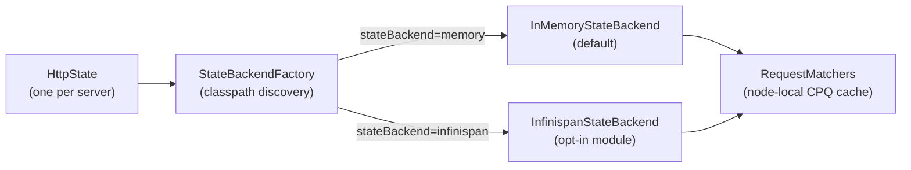
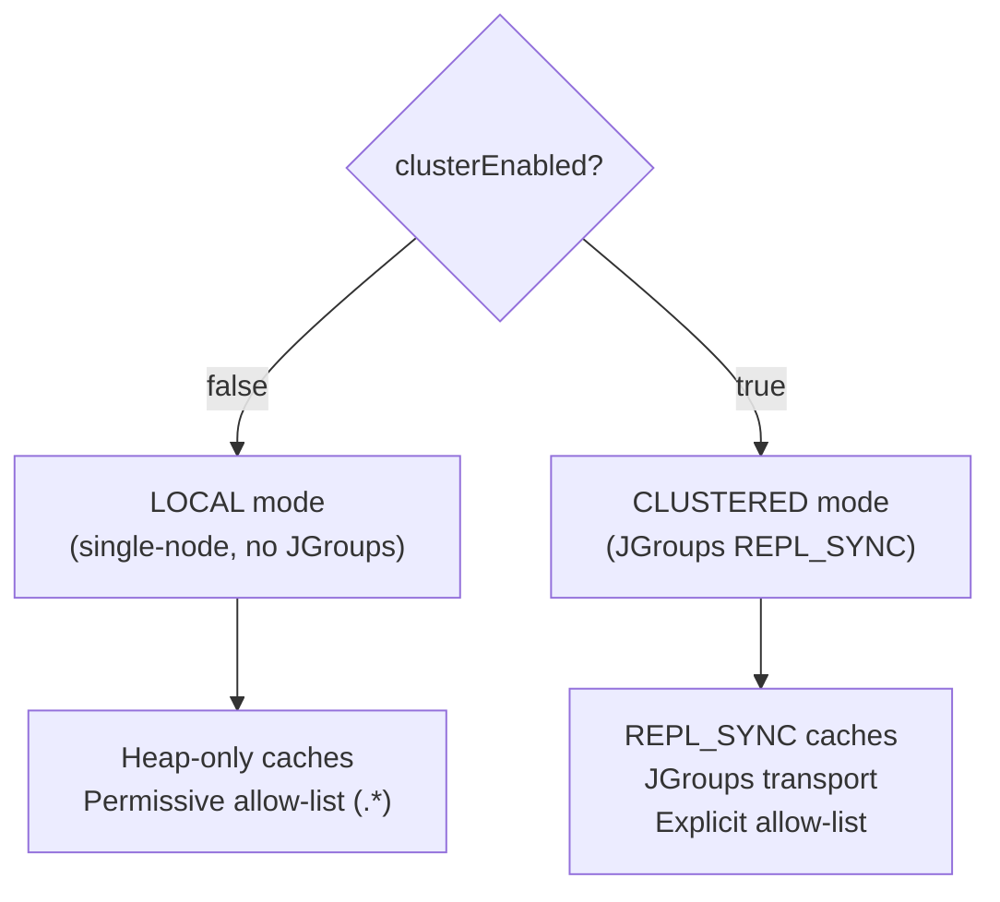
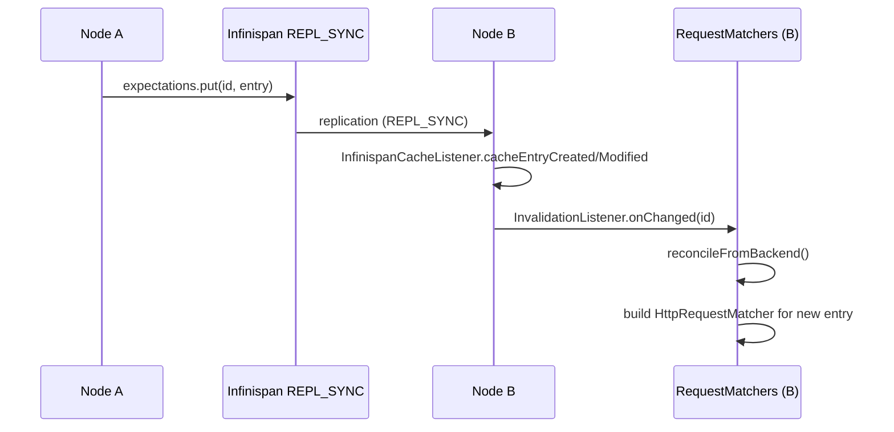
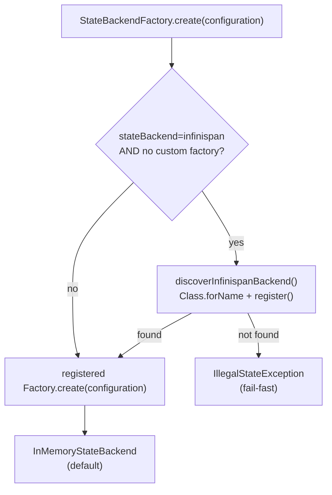

# Clustered MockServer State

## Status

**OPT-IN (single-node default unchanged).** The clustered state backend is an optional Maven module (`mockserver-state-infinispan`) that must be placed on the classpath and activated via configuration. All existing single-node deployments continue to use the default `InMemoryStateBackend` with no change in behaviour or performance.

## Overview

MockServer 7.x introduces a `StateBackend` SPI that abstracts all shared server state — expectations, scenario states, CRUD entity stores, and blob persistence — behind a pluggable interface. The default implementation (`InMemoryStateBackend`) wraps the same concurrent in-memory data structures that have always existed. An optional second implementation (`InfinispanStateBackend`, in the `mockserver-state-infinispan` module) can replicate that state across a JGroups cluster, enabling multiple MockServer nodes to share the same expectation set.



## The StateBackend SPI

Defined in `mockserver-core` at `org.mockserver.state.StateBackend`.

### Interfaces

| Interface | Purpose |
|-----------|---------|
| `StateBackend` | Top-level SPI: factory methods for the four store types, plus `nodeId()` and `close()` |
| `KeyValueStore<V>` | Versioned key-value store with optimistic-concurrency (`compareAndSet`) and `InvalidationListener` support |
| `Versioned<V>` | Value paired with a monotonic version number used by `compareAndSet` |
| `BlobStore` | Binary large-object store for persisted cassettes, fixtures, and snapshots |
| `InvalidationListener` | Callback (`onChanged(key)` / `onCleared()`) fired on remote writes in a clustered backend |
| `ExpectationEntry` | Serializable carrier for an `Expectation` and its sort fields (priority, created, id); the `Expectation` itself is marshalled as JSON inside custom `writeObject`/`readObject` because the domain model is not `Serializable` |

### Store Types

`StateBackend` exposes four stores via its interface:

| Store | Type | Description |
|-------|------|-------------|
| `expectations()` | `KeyValueStore<ExpectationEntry>` | Expectation definitions; keyed by expectation id |
| `scenarioStates()` | `KeyValueStore<String>` | Scenario state strings; keyed by composite `scenarioName+isolation` |
| `crudEntities(namespace)` | `KeyValueStore<ObjectNode>` | Per-namespace CRUD entity stores |
| `blobs()` | `BlobStore` | Persisted expectations, recorded cassettes, and fixture files |

### KeyValueStore Semantics

- `put(key, value)` — last-writer-wins; returns the new version number
- `compareAndSet(key, expectedVersion, value)` — atomic replace (optimistic concurrency)
- `compareAndRemove(key, expectedVersion)` — atomic delete
- `entries()` — streaming snapshot of all entries; iteration order is implementation-defined (unordered for generic stores; sorted by priority for the expectation store)
- `addInvalidationListener(listener)` — registers a callback for any mutation

## Default: InMemoryStateBackend

`InMemoryStateBackend` (in `mockserver-core`) is the default for all single-node deployments. It wraps:

- `InMemoryExpectationKeyValueStore` — backed by the same `CircularPriorityQueue` used before the SPI was introduced, so ordering and eviction behaviour are byte-for-byte identical
- `InMemoryKeyValueStore<String>` — backed by `ConcurrentHashMap` for scenario states
- Per-namespace `InMemoryKeyValueStore<ObjectNode>` for CRUD entities
- `InMemoryBlobStore` or `FilesystemBlobStore` depending on `blobStoreType` configuration

`InvalidationListener` callbacks are registered but are no-ops in the single-node path — they exist purely to satisfy the SPI so that `RequestMatchers` can attach reconcile callbacks without knowing which backend is active.

## InfinispanStateBackend

The `mockserver-state-infinispan` module provides an embedded Infinispan `StateBackend`. Infinispan runs in-process — there is no separate data grid to operate.

### Modes

`InfinispanStateBackend` supports two modes, selected at construction time from the `Configuration`:



**LOCAL mode** (`clusterEnabled=false`) starts Infinispan with `nonClusteredDefault()` — no JGroups network transport, no serialization over the wire. The allow-list is `".*"` because nothing crosses a network boundary. This mode is functionally equivalent to the default in-memory backend but adds Infinispan on the classpath. It is useful for testing the Infinispan code path without needing multiple nodes.

**CLUSTERED mode** (`clusterEnabled=true`) starts Infinispan with a JGroups transport and `REPL_SYNC` caches, so every write is synchronously replicated to all cluster members before the write call returns.

### Wire Format

The clustered wire format uses Java serialization (`JavaSerializationMarshaller`) rather than ProtoStream. The `Expectation` domain model does not implement `Serializable`, so `ExpectationEntry` uses custom `writeObject`/`readObject` that serialize the expectation as its JSON string via `ExpectationDTO`. This keeps the wire format self-contained and avoids adding `Serializable` to the entire domain graph.

A strict explicit allow-list covers exactly the types that cross the wire:

| Allow-list pattern | Covers |
|--------------------|--------|
| `org\.mockserver\.state\.infinispan\..*` | `VersionedWrapper` (the cache value carrier) |
| `org\.mockserver\.state\..*` | `ExpectationEntry`, `Blob` |
| `org\.mockserver\.mock\..*` | `Expectation` (as JSON, inside `ExpectationEntry`) |
| `org\.mockserver\.model\..*` | `HttpRequest`, `HttpResponse`, etc. |
| `org\.mockserver\.matchers\..*` | `TimeToLive`, `Times` |
| `com\.fasterxml\.jackson\..*` | `ObjectNode` (for CRUD entities) |
| `java\.lang\..*`, `java\.util\..*`, `java\.time\..*` | JDK primitives, collections, time types |
| `\[B` | `byte[]` (for `Blob` data) |

This explicit allow-list resolves the deserialization gadget-chain risk — types from untrusted packages cannot be instantiated through the cluster wire.

### Cross-Node Invalidation

When a remote write arrives on a cluster node, Infinispan fires its internal cache event. An `InfinispanCacheListener` (`@Listener(clustered=true)`) translates this to `InvalidationListener.onChanged(key)` or `InvalidationListener.onCleared()`, which triggers `RequestMatchers.reconcileFromBackend()` on the receiving node.



`reconcileFromBackend()` in `RequestMatchers` performs a three-step diff against the backend:

1. **Evict** — remove node-local matchers whose id no longer appears in the backend
2. **Add** — for new backend entries, build a local `HttpRequestMatcher` via `MatcherBuilder`
3. **Update** — for existing entries whose backend version is strictly newer than the last reconciled version, update the local matcher (preserving runtime state such as `Times` counters) and re-insert its priority key if sort fields changed

### Eviction

The expectations cache uses Infinispan's approximate `maxCount` eviction with `EvictionStrategy.REMOVE`, capped at `maxExpectations` (default 1000). When the cache is full, Infinispan evicts the least-recently-used entry. The evicted entry is removed from all cluster nodes (eviction is coordinated by Infinispan), and the `InvalidationListener` fires on each node to reconcile the local matcher cache.

Because eviction is approximate, the node-local `CircularPriorityQueue` (used for iteration order during matching) may briefly contain one more entry than `maxExpectations` between an eviction and the next reconcile cycle.

## Factory and Classpath Discovery

`StateBackendFactory` in `mockserver-core` manages backend creation without a compile-time dependency on Infinispan:



If `stateBackend=infinispan` is configured but `mockserver-state-infinispan` is not on the classpath, `StateBackendFactory` throws `IllegalStateException` immediately at startup rather than silently falling through to the in-memory backend. Falling through would create a split-brain cluster where the operator believes nodes share state but each node is actually isolated.

## Configuration Reference

| Property | Env var | Default | Description |
|----------|---------|---------|-------------|
| `mockserver.stateBackend` | `MOCKSERVER_STATE_BACKEND` | `memory` | Backend type: `memory` or `infinispan` |
| `mockserver.blobStoreType` | `MOCKSERVER_BLOB_STORE_TYPE` | `filesystem` | Blob store type: `filesystem` (default, delegates to existing file I/O) or `memory` (in-process only, lost on exit) |
| `mockserver.clusterEnabled` | `MOCKSERVER_CLUSTER_ENABLED` | `false` | Enable JGroups cluster transport (Infinispan CLUSTERED mode) |
| `mockserver.clusterName` | `MOCKSERVER_CLUSTER_NAME` | `mockserver-cluster` | JGroups cluster identifier; all nodes that should share state must use the same value |
| `mockserver.clusterTransportConfig` | `MOCKSERVER_CLUSTER_TRANSPORT_CONFIG` | _(built-in loopback stack)_ | Path to a custom JGroups XML transport configuration; leave empty to use the built-in loopback stack (suitable for embedded tests; use a UDP or TCP stack for production) |

## Enabling Infinispan

Add the module to the classpath and set the configuration property:

```
-Dmockserver.stateBackend=infinispan
```

For a cluster of two or more nodes, also set:

```
-Dmockserver.clusterEnabled=true
-Dmockserver.clusterName=my-cluster
-Dmockserver.clusterTransportConfig=/path/to/jgroups-udp.xml
```

All nodes must be on the same JGroups network (multicast or unicast depending on the JGroups stack) and use the same `clusterName`.

## Limitations and Known Follow-Ups

| Limitation | Detail |
|------------|--------|
| Scenario-state transitions | Cross-node scenario transitions are not yet atomic. A client on node A advancing a scenario state and a concurrent client on node B reading the same state may see different values between the write and the replication round-trip. |
| Shared `Times` counters | Per-expectation match-limit counters (`Times`) are node-local. A `Times(3)` expectation on a two-node cluster allows up to 6 total matches, not 3. |
| CRUD entity namespace isolation | Each namespace is a separate Infinispan cache defined on demand. The number of distinct CRUD namespaces in use should be small (hundreds, not millions). |
| No cloud blob backends | `BlobStore` has `InMemoryBlobStore` and `FilesystemBlobStore` implementations; S3/GCS/Azure Blob adapters are SPI-only stubs. |
| JGroups stack configuration | The built-in loopback stack is suitable for embedded tests only. Production clusters require a UDP or TCP JGroups stack configured via `clusterTransportConfig`. |

## Source Locations

| File | Module | Purpose |
|------|--------|---------|
| `org.mockserver.state.StateBackend` | `mockserver-core` | SPI interface |
| `org.mockserver.state.KeyValueStore` | `mockserver-core` | Versioned KV store abstraction |
| `org.mockserver.state.Versioned` | `mockserver-core` | Value + version carrier |
| `org.mockserver.state.BlobStore` | `mockserver-core` | Blob store abstraction |
| `org.mockserver.state.InvalidationListener` | `mockserver-core` | Change notification callback |
| `org.mockserver.state.ExpectationEntry` | `mockserver-core` | Serializable expectation carrier |
| `org.mockserver.state.InMemoryStateBackend` | `mockserver-core` | Default in-memory implementation |
| `org.mockserver.state.StateBackendFactory` | `mockserver-core` | Pluggable factory with classpath auto-discovery |
| `org.mockserver.mock.RequestMatchers` | `mockserver-core` | Node-local matcher cache; `reconcileFromBackend()` |
| `org.mockserver.state.infinispan.InfinispanStateBackend` | `mockserver-state-infinispan` | Infinispan LOCAL/CLUSTERED implementation |
| `org.mockserver.state.infinispan.InfinispanStateBackendRegistrar` | `mockserver-state-infinispan` | Self-registration hook called by `StateBackendFactory` |
| `org.mockserver.state.infinispan.InfinispanCacheListener` | `mockserver-state-infinispan` | Bridges Infinispan cluster events to `InvalidationListener` |
