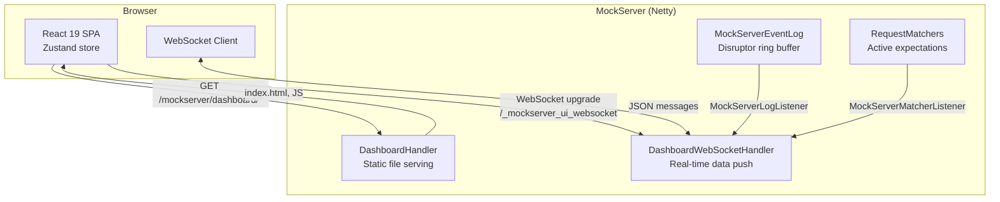
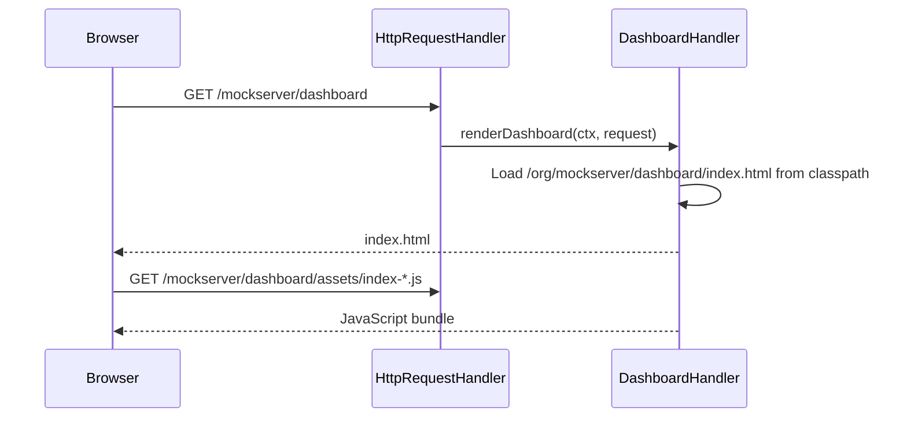
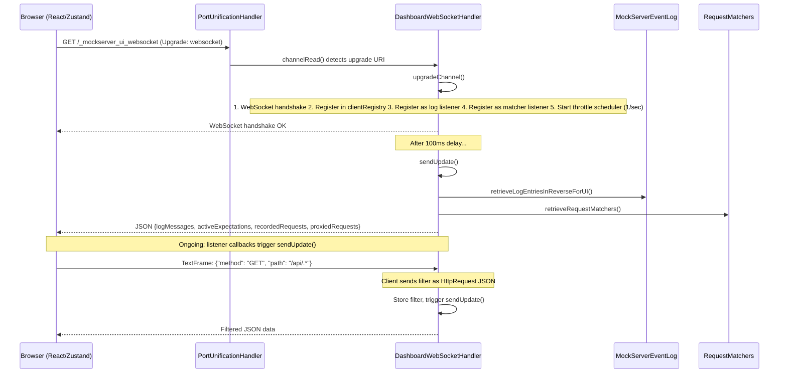
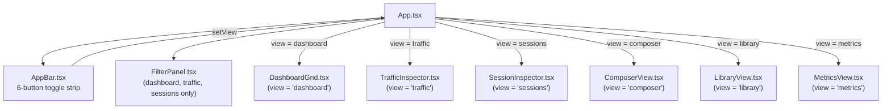
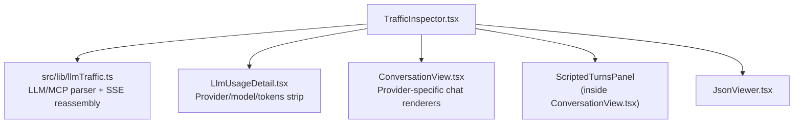
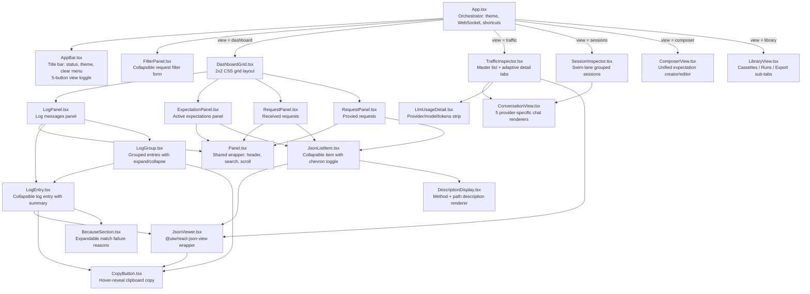
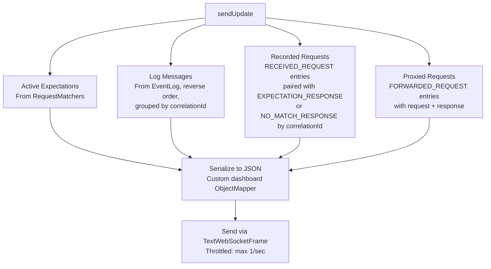

# Dashboard UI

## Architecture Overview

The MockServer dashboard is a React single-page application (SPA) that receives real-time updates via WebSocket. The frontend is built with Vite and served as static resources from the Java classpath. During the Maven build, the `build-ui` profile in `mockserver-netty` uses `frontend-maven-plugin` to install Node, run `npm ci` and `npm run build`, then copies the output to the classpath.



## Request Flow

### 1. Initial Page Load



### 2. WebSocket Connection



### 3. Real-Time Updates

The `DashboardWebSocketHandler` implements both `MockServerLogListener` and `MockServerMatcherListener`. When either fires, `sendUpdate()` assembles and pushes the current state to all connected clients.

**Throttling**: A `Semaphore(1)` with a scheduled release every 1 second limits updates to at most one per second per client, preventing UI flooding during high-traffic scenarios.

## Top-Level Views

The dashboard has **seven top-level views** controlled by a toggle strip in the AppBar: **Dashboard**, **Traffic**, **Sessions**, **Composer**, **Library**, **Metrics**, and **Chaos**. The view state is stored in Zustand as `view: ViewMode` where `ViewMode = 'dashboard' | 'traffic' | 'sessions' | 'composer' | 'library' | 'metrics' | 'chaos'`.

The Request Filter panel is shown on Dashboard, Traffic, and Sessions views. It is hidden on Composer, Library, Metrics, and Chaos.



## Metrics View

`MetricsView.tsx` (view = `metrics`) is the dashboard's observability surface. Unlike the other views — which are pushed data over the WebSocket — it **polls** MockServer's Prometheus endpoint `GET /mockserver/metrics` on an interval (default 3s) via the `useMetricsPolling` hook, parses the text exposition format (`lib/prometheusParser.ts`), and keeps a rolling history so it can derive time series client-side (`lib/metricsDerive.ts`).

It renders:
- summary stat cards (requests received, matched, not-matched, forwarded) with inline-SVG sparklines (`Sparkline.tsx`),
- a derived requests-per-second throughput chart (Δcount / Δt between scrapes, since the metrics are monotonic gauges),
- request latency percentiles (p50/p95/p99) from the `mock_server_request_duration_seconds` histogram (shown only when present),
- an **HTTP Chaos Faults** section showing cumulative `mock_server_http_chaos_injected_total` split by every `fault_type` the server emits (`drop`, `error`, `latency`, `truncate`, `malformed`, `slow`, `quota` — fault types are discovered from the scrape via `labelValues`, so a future type renders automatically), the `mock_server_active_service_chaos` gauge as an "active services" stat, and a per-fault-type time-series chart (shown only when a chaos metric is present and has non-zero data),
- JVM heap memory, thread count, and GC stats (shown only when JVM metrics are present), and
- a per-action breakdown of the `*_actions_count` gauges, plus the served MockServer version from `mock_server_build_info`.

There is **no charting dependency** (inline SVG) and no server change required. Because metrics are off by default, a 404 is treated as a first-class `disabled` state that shows the user how to enable them (`metricsEnabled`) rather than an error.

## Chaos View

`ServiceChaosPanel.tsx` (view = `chaos`) manages **service-scoped chaos** interactively. Like the Metrics view it **polls** rather than using the WebSocket — `GET /mockserver/serviceChaos` every 4s via the control-plane helpers in `lib/serviceChaos.ts` (`fetchServiceChaos` / `registerServiceChaos` / `removeServiceChaos` / `clearServiceChaos`). It renders:
- a **register form** — host plus error status / error probability / drop probability / latency-ms / optional TTL-ms fields; only the populated fields are sent in the `chaos` object (`buildChaosProfile`), and the register is rejected client-side if no fault is set,
- a list of **active registrations**, each with a `summarizeChaosProfile` chip breakdown of its faults and a per-host **Remove** button,
- a **live TTL auto-revert countdown** chip for any TTL-bearing registration — the remaining ms returned by the server's `ttlRemainingMillis` is decremented client-side by a 1s tick between polls (`formatTtl`),
- a **Clear all** button.

`lib/serviceChaos.ts` is framework-agnostic (plain `fetch`) so it is unit-tested independently of the component; it surfaces the server's `{"error": ...}` message on a 4xx.

## Dashboard View

`DashboardGrid.tsx` renders a 2×2 CSS grid with four data panels:

| Panel | Component | Data Source | Content |
|-------|-----------|------------|---------|
| Log Messages | `LogPanel` → `LogEntry` / `LogGroup` | `logMessages` | Grouped log entries with color-coded types |
| Active Expectations | `ExpectationPanel` → `JsonListItem` | `activeExpectations` | Currently registered expectations |
| Received Requests | `RequestPanel` → `JsonListItem` | `recordedRequests` | All received HTTP requests with paired responses |
| Proxied Requests | `RequestPanel` → `JsonListItem` | `proxiedRequests` | Forwarded requests with upstream responses |

### Row Layout in Requests and Expectations

Each collapsed item row has two lines:

1. `[expand-chevron] [#] [expectationId-if-present]: METHOD …/right-aligned/path`
2. LLM badge chips (provider / model / `turn N of M` / stream / tool count / isolation key), indented to align with the expectation id column

The expanded JSON tree also aligns with the id column. The `turn N of M` chip is computed from `scenarioName` + `scenarioState` ordering and is always present for LLM expectations, regardless of which predicate type the turn uses.

## Traffic Inspector

`TrafficInspector.tsx` is a full-width master/detail layout. It shows **all captured traffic** — both mock-matched requests (from `recordedRequests`) and upstream-proxied requests (from `proxiedRequests`) — in a single unified list, because the user thinks of both as "traffic". No server-side changes are needed beyond the request/response pairing described below.



**Master list** — one row per captured call:

| Column | Source |
|--------|--------|
| Index | Row number |
| Provider chip | Detected kind: Anthropic / OpenAI / OpenAI Resp / Gemini / Ollama / MCP / HTTP |
| Method | `httpRequest.method` |
| Host + path | `httpRequest.headers.host` + `httpRequest.path` |
| Status chip | `httpResponse.statusCode` |
| Model chip | Parsed by `llmTraffic.ts` from request/response bodies |
| Token summary | Input/output tokens from response body |

**Detail pane** — shown on row selection. A thin **LLM Usage** strip appears above the tab row for any LLM-kind row, showing: provider chip, model name, tokens (`<in> in / <out> out`), estimated USD cost, and stop reason. This strip is rendered by `LlmUsageDetail.tsx`.

Below the strip, the adaptive tab row:

| Traffic kind | Tabs rendered |
|-------------|---------------|
| Anthropic, OpenAI, OpenAI Responses, Gemini, Ollama | **Messages**, **Conversation**, optionally **Scripted Turns** (when active scripted expectations exist), optionally **SSE Timeline** (when stream events present), **Raw JSON** |
| MCP JSON-RPC (`jsonrpc` field present) | **MCP**, **Raw JSON** |
| All other traffic | Raw JSON rendered directly (no tab bar) |

A **Capture as mock** button appears top-right of the detail pane for LLM-kind rows. Clicking it opens `CaptureAsMockDialog.tsx`, which calls the MCP `mock_llm_completion` tool to register a mock expectation from the captured traffic.

### ConversationView Component

`ConversationView.tsx` exports five provider-specific conversation views:

| Export | Provider | Format |
|--------|----------|--------|
| `AnthropicConversationView` | Anthropic Messages API | System banner + user/assistant bubbles + tool-call/tool-result bubbles |
| `OpenAiConversationView` | OpenAI Chat Completions | Same layout, OpenAI message structure |
| `OpenAiResponsesConversationView` | OpenAI Responses API | Input/output item rendering |
| `GeminiConversationView` | Gemini | Contents/candidates rendering |
| `OllamaConversationView` | Ollama | Messages + response rendering |

All five use a chat-transcript layout: user messages left-aligned, assistant messages right-aligned (WhatsApp-style bubbles), system prompts as a distinct banner.

The component is a pure renderer — it receives a parsed object from `llmTraffic.ts` and has no direct store or network dependencies.

### LLM/MCP Parser (`llmTraffic.ts`)

`src/lib/llmTraffic.ts` is a pure client-side parser. It detects traffic kind and extracts structured data for the detail pane.

**Traffic detection:**

| Pattern | Detection logic |
|---------|----------------|
| Anthropic Messages API | Path ends with `/v1/messages`; extracts `model`, `usage.input_tokens`, `usage.output_tokens`, `stop_reason`, messages array, tool-use blocks, SSE events |
| OpenAI Chat Completions | Path ends with `/v1/chat/completions`; extracts `model`, `usage.prompt_tokens`, `usage.completion_tokens`, `finish_reason`, messages array, `tool_calls` |
| OpenAI Responses API | Path ends with `/v1/responses`; extracts `model`, input/output items |
| Gemini | Path contains `/models/` and `/generateContent`; extracts `model`, contents, candidates |
| Ollama | Path ends with `/api/chat` or `/api/generate`; extracts `model`, messages, response message |
| MCP JSON-RPC | `Content-Type: application/json` body with a `jsonrpc` field; extracts `method`, `id`, `params`, `result`, `error` |
| Fallback | Generic display — Raw JSON only |

**SSE reassembly:** For streamed responses (body contains `data:` lines), `llmTraffic.ts` splits the captured body on `\n\n`, parses each `data:` chunk as JSON, and merges incremental delta fields to reconstruct the final message content. The per-chunk elapsed timestamps are preserved for the SSE Timeline tab.

**Base64 body decoding:** When a response body has a `BINARY` body type, the content is base64-encoded. `llmTraffic.ts` detects the `BINARY` type and decodes before parsing. Textual streaming responses are normally delivered as `STRING` bodies; this is a defensive fallback.

## Sessions Inspector

`SessionInspector.tsx` groups all captured requests into swim-lanes by `<scenarioName> / <isolation-value>`. Each swim-lane displays chips for the captured turns, where each chip shows the turn index, method, path, and status code. Clicking a chip opens a per-request detail panel directly below the swim-lane, showing the Conversation view for the selected turn.

A separate **Unscoped requests** strip at the bottom holds requests that did not match any isolated scenario.

The grouping logic lives in `src/lib/sessionGrouping.ts`. It uses `scenarioName` and `scenarioState` from the request data to identify which requests belong to which conversation session.

## Composer View

`ComposerView.tsx` is a unified expectation creator and editor — a single inline form covering standard HTTP expectations of every action type plus multi-turn LLM conversations.

At the top is an **Expectation kind** radio: **Standard HTTP expectation** or **LLM Conversation**.

### Standard HTTP Expectation

- An **Edit existing or add new** dropdown lists every active non-LLM expectation by `<id-short>… · METHOD path`. Picking one prefills the matcher + response-action panel. A Reset button clears the selection.
- **Step 1 · Match a request**: Expectation ID (optional), Method, Path, Headers (Name: value lines), Query string parameters (key=value lines), Cookies (name=value lines), Path parameters (name=value lines), Body matcher, "Body is binary (base64)" toggle, HTTPS-only toggle, Priority (higher = wins), Times (0 = unlimited). All string fields and per-line entries accept a leading `!` to negate via MockServer's NottableString convention.
- **Step 2 · Respond with**: radio for the response action — Static HTTP response / Forward to upstream / Forward with override / Class callback / Response template / Error / fault injection.
- **Step 3 · {action name}**: per-action panel with fields specific to that action.
- **Step 4 · Review & register**: Java / JSON / curl tabs (read-only preview generated from the current form state), then the Register expectation button. Helper text next to the button changes based on whether the Expectation ID field is filled (editing existing in place vs. creating new).

### LLM Conversation

- Same **Edit existing or add new** dropdown, but listing scenario names (e.g. `weather-agent (2 turns)`).
- The LLM Conversation wizard content is rendered inline on the same page — no modal. It uses the same "1 · / 2 · / 3 ·" step structure: **Conversation basics** (provider, path, model, isolateBy), **Turns**, **Review & register** (Java / JSON / MCP tabs + Register button).
- Picking an existing scenario from the dropdown remounts the form via React `key` and prefills all fields. The Register button reads "Update N expectations" instead of "Register on server" when editing. A green note confirms "Editing — the existing expectation IDs will be reused so this updates in place."

The edit-existing flow works because `ComposerView.tsx` collects the current expectation IDs and passes them as `ids: string[]` to the `create_llm_conversation` MCP tool call. The server then calls `Expectation.withId(...)` on each generated expectation before `httpState.add(...)`, which performs an upsert.

## Library View

`LibraryView.tsx` consolidates fixture management and export. Three sub-tabs:

| Sub-tab | Content |
|---------|---------|
| **Cassettes** | List / Record / Load / Export sub-tabs for cassette files. Recording writes the current MockServer state to a JSON cassette file on the server filesystem via the `record_llm_fixtures` MCP tool. Loading reads one back via `load_expectations_from_file`. |
| **Runs** | Pick two captured sessions (Run A / Run B) and see a side-by-side structural trajectory diff (tool-call chain + per-turn token usage table). |
| **Export** | Single dropdown that crosses scope (registered expectations / recorded requests) with file format (MockServer JSON / HAR / OpenAPI 3 / Postman v2.1 / Bruno zip). Each option maps to a `PUT /mockserver/retrieve?type=ACTIVE_EXPECTATIONS\|REQUEST_RESPONSES&format=JSON\|HAR\|OPENAPI\|POSTMAN\|BRUNO` call. BRUNO returns `application/zip` since Bruno collections are multi-file (`.bru` per request + `bruno.json` manifest). Generation lives in `mockserver-core`'s `ExpectationExportSerializer` — best-effort for the non-MockServer formats (positive-string matchers round-trip, NottableString negation and dynamic actions appear as placeholders). |

## MCP Session Handshake

`mockserver-ui/src/lib/mcpClient.ts` manages all MCP tool calls from the UI (capture-as-mock, conversation registration, cassette record/load). It performs the MCP `initialize` + `notifications/initialized` handshake lazily on first use and caches the resulting `Mcp-Session-Id` per base URL in a module-level `Map`. If a call fails with a "Missing or invalid Mcp-Session-Id" error, the client reinitializes automatically before retrying.

Prior to this, any UI feature that called an MCP tool was broken with a session-not-initialized error.

## AppBar Styling

The AppBar renders the five toggle buttons (Dashboard / Traffic / Sessions / Composer / Library) as a `ToggleButtonGroup`. The HAR download lives in Library → Export rather than as a top-bar icon.

**Light mode**: toggle buttons use `primary.contrastText` (white) text with a translucent white border (`rgba(255,255,255,0.3)`) and a translucent-white selected state. The status chip uses pale colour tints (`#7fffa0` connected, `#ffd180` connecting, `#ff8a80` error) so colour semantics remain readable against the blue AppBar background.

**Dark mode**: MUI defaults are kept; no overrides applied.

## Frontend Application

### Technology Stack

| Component | Technology |
|-----------|-----------|
| Framework | React 19 |
| State management | Zustand |
| Build tool | Vite |
| UI library | MUI v9 |
| Language | TypeScript |
| Testing | Vitest + React Testing Library |

### Zustand Store

```typescript
{
  logMessages: [],           // Log entries (grouped by correlationId)
  activeExpectations: [],    // Currently active expectations
  recordedRequests: [],      // All received requests (with paired responses)
  proxiedRequests: [],       // Forwarded request+response pairs
  connectionStatus: 'disconnected',
  error: null,
  filterEnabled: false,
  filterExpanded: false,
  autoScroll: true,
  logSearch: '',
  expectationSearch: '',
  receivedSearch: '',
  proxiedSearch: '',
  trafficSearch: '',
  view: 'dashboard',        // 'dashboard' | 'traffic' | 'sessions' | 'composer' | 'library'
  selectedTrafficIndex: null,
  actionTypeFilter: [],
  llmProviderFilter: [],
}
```

### WebSocket Hook

The `useWebSocket` hook manages the WebSocket lifecycle:

```typescript
const url = `${protocol}://${host}:${port}/_mockserver_ui_websocket`;
const ws = new WebSocket(url);
```

- `onopen`: Sends the current filter (serialized `HttpRequest`), resets reconnect counter
- `onmessage`: Parses JSON, calls `applyMessage()` to update all four entity arrays
- `onclose`: Triggers reconnection with exponential backoff (max 10 retries)
- `onerror`: Sets error status in store

### Component Architecture



### UI Components

| Component | File | Purpose |
|-----------|------|---------|
| `AppBar` | `AppBar.tsx` | Title bar with connection status chip, keyboard shortcut hints, auto-scroll toggle, dark/light mode toggle, clear/reset menu, 5-button view toggle |
| `FilterPanel` | `FilterPanel.tsx` | Collapsible request filter form (method, path, headers, query params, cookies) with debounced WebSocket send; shown on dashboard/traffic/sessions |
| `DashboardGrid` | `DashboardGrid.tsx` | 2×2 CSS grid layout for the four panels |
| `TrafficInspector` | `TrafficInspector.tsx` | Full-width master list + adaptive detail pane for all captured traffic (mock-matched + proxied) |
| `SessionInspector` | `SessionInspector.tsx` | Swim-lane grouped view of isolated LLM conversation sessions |
| `ComposerView` | `ComposerView.tsx` | Unified expectation creator/editor; inline Standard HTTP and LLM Conversation forms |
| `LibraryView` | `LibraryView.tsx` | Cassettes / Runs / Export sub-tabs |
| `ConversationView` | `ConversationView.tsx` | Five provider-specific chat-transcript renderers: Anthropic, OpenAI, OpenAI Responses, Gemini, Ollama |
| `LlmUsageDetail` | `LlmUsageDetail.tsx` | Thin strip shown above the detail pane tab row for LLM traffic: provider chip, model, tokens, cost, stop reason |
| `Panel` | `Panel.tsx` | Shared panel wrapper with title, count chip, search box, auto-scroll content area |
| `LogEntry` | `LogEntry.tsx` | Renders a single log entry; supports `collapsible` mode and `divider` mode |
| `LogGroup` | `LogGroup.tsx` | Groups related log entries (same correlation ID) with orange left border, expand/collapse |
| `JsonListItem` | `JsonListItem.tsx` | Renders request/expectation items with chevron toggle, index number, and description |
| `JsonViewer` | `JsonViewer.tsx` | Thin wrapper around `@uiw/react-json-view` with theme-aware styling |
| `CopyButton` | `CopyButton.tsx` | Hover-reveal icon button that copies text to clipboard |
| `DescriptionDisplay` | `DescriptionDisplay.tsx` | Renders description variants: plain string, structured `{first, second}`, or JSON object |
| `BecauseSection` | `BecauseSection.tsx` | Expandable list of match failure reasons for `EXPECTATION_NOT_MATCHED` entries |

### Collapsible Items

All data items are **collapsed by default** across all four dashboard panels:

- **Requests and expectations** (`JsonListItem`): Show a chevron (`▸`), index number, and method+path description. Click to expand and reveal the full JSON body rendered by `JsonViewer`.
- **Standalone log entries** (`LogEntry` with `collapsible=true`): Show a chevron, description (timestamp + type), and a grey summary (first 80 chars of message text, truncated with `…`). Click to expand and see the full message parts.
- **Grouped log entries** (`LogGroup`): Show an expand button with the group header entry. Click to expand and reveal all child entries.

### Copy to Clipboard

Copy buttons appear on hover (CSS `opacity: 0` → `opacity: 1` on parent `:hover .copy-btn`):

- `JsonViewer`: Copy button in top-right copies the full JSON as formatted text
- `LogEntry`: Copy button copies description + all message parts as text
- `LogGroup`: Separate `.group-copy-btn` copies the full group (header + all child entries joined by `\n\n`)

### Theme System

- Default: dark mode (unless user explicitly saved `'light'` in `localStorage` key `mockserver-theme`)
- `getInitialTheme()` in store checks `localStorage` first; falls back to `'dark'`
- `prefers-color-scheme` media query is **not** used — dark is always the default for new users
- `buildTheme()` in `theme.ts` creates MUI theme from the mode
- Toggle via AppBar sun/moon icon; saved to `localStorage`

### Keyboard Shortcuts

Handled by `useKeyboardShortcuts` hook in `App.tsx`:

| Shortcut | Handler | Action |
|----------|---------|--------|
| `⌘K` / `Ctrl+K` | `onSearch` | Focus log messages search input |
| `⌘L` / `Ctrl+L` | `onClear` | Call `clearServer('all')` (server reset + UI clear + WebSocket reconnect) |
| `Escape` | `onToggleFilter` | Toggle filter panel expanded/collapsed |

### Clear and Reset

The AppBar clear menu provides three server-side operations:

| Menu Item | API Call | UI Behavior |
|-----------|----------|-------------|
| Clear server logs | `PUT /mockserver/clear?type=log` | Calls `clearUI()` after success |
| Clear server expectations | `PUT /mockserver/clear?type=expectations` | Calls `clearUI()` after success |
| Reset server (all) | `PUT /mockserver/reset` | Calls `clearUI()` + reconnects WebSocket (server closes it on reset) |

### Filtering

Users can filter all panels by sending an `HttpRequest` JSON object as a text WebSocket frame. The server stores the filter per client and uses it when assembling data:

- **Active expectations**: Filtered by `requestMatchers.retrieveRequestMatchers(filter)`
- **Log entries**: Filtered by matching `LogEntry.httpRequests` against the filter
- **Recorded requests**: Filtered by type `RECEIVED_REQUEST` + request match
- **Proxied requests**: Filtered by type `FORWARDED_REQUEST` + request match

### WebSocket Reconnection

The `connect()` function in `useWebSocket.ts` handles reconnection safely:

1. Clears any pending reconnect timer (`reconnectTimerRef`)
2. Nullifies `onclose`/`onerror` on the old socket before calling `close()` — prevents stale handlers from triggering spurious reconnection
3. Sets `socketRef.current = null` before creating the new socket
4. On `onclose`, schedules reconnection with exponential backoff (max 10 retries)

### Test Coverage

Vitest + React Testing Library + jsdom — see `mockserver-ui/src/__tests__/` for the full set. The suite is grouped roughly as follows:

| Area | Example test files |
|------|--------------------|
| Store + hooks | `store.test.ts`, `useConnectionParams.test.ts`, `useKeyboardShortcuts.test.ts`, `useWebSocket.test.ts` |
| App-chrome components | `AppBar.test.tsx`, `Panel.test.tsx`, `BecauseSection.test.tsx`, `CopyButton.test.tsx`, `DescriptionDisplay.test.tsx` |
| Log and request panels | `LogEntry.test.tsx`, `LogGroup.test.tsx`, `LogPanel.test.tsx`, `RequestPanel.test.tsx`, `ExpectationPanel.test.tsx`, `FilterPanel.test.tsx`, `JsonListItem.test.tsx` |
| Traffic / Sessions inspectors | `TrafficInspector.test.tsx`, `SessionInspector.test.tsx`, `PredicatePills.test.tsx` |
| LLM mocking flows | `CaptureAsMockDialog.test.tsx`, `ConversationWizard.test.tsx`, `CassetteManager.test.tsx`, `CompareRunsDialog.test.tsx`, `cassetteRegistry.test.ts`, `conversationCodegen.test.ts`, `expectationFromCapture.test.ts`, `llmExpectationCodegen.test.ts`, `llmPricing.test.ts`, `llmTraffic.test.ts`, `trajectoryDiff.test.ts`, `sessionGrouping.test.ts`, `mcpClient.test.ts` |

Run `npm test` from `mockserver-ui/` to execute the full suite; the JUnit report is written to `mockserver-ui/test-reports/junit.xml`.

## Server-Side Data Assembly

### sendUpdate() Method

For each connected client, assembles four data categories (limited to 100 items each):



### Request/Response Pairing for Recorded Requests

`DashboardWebSocketHandler` (lines 385–450) performs a single reverse-chronological pass over the log stream to pair `RECEIVED_REQUEST` entries with their matching `EXPECTATION_RESPONSE` or `NO_MATCH_RESPONSE` entries. Because the log is iterated in reverse order, responses appear before their corresponding requests. The handler stashes each response by `correlationId` in a temporary map, then when it encounters the `RECEIVED_REQUEST` with the matching `correlationId`, it attaches the stashed response as `httpResponse` in the emitted `recordedRequests` item.

This means `recordedRequests` items are now `{ httpRequest, httpResponse }` objects — the same shape as `proxiedRequests` — allowing the Traffic, Sessions, and LLM Usage detail views to see mock-matched traffic with full request/response pairs, not just upstream-proxied traffic.

### Dashboard Model Classes

| Class | Package | Purpose |
|-------|---------|---------|
| `DashboardLogEntryDTO` | `o.m.dashboard.model` | Simplified log entry for UI display with description, style, and HTTP request/response data |
| `DashboardLogEntryDTOGroup` | `o.m.dashboard.model` | Groups related log entries by correlation ID |
| `Description` | `o.m.dashboard.serializers` | Truncated request description (method + path) for UI column display |

### Custom Serializers

The dashboard uses specialized Jackson serializers for UI-friendly output:

| Serializer | Purpose |
|------------|---------|
| `DashboardLogEntryDTOSerializer` | Color-coded log entries with message parts |
| `DashboardLogEntryDTOGroupSerializer` | Groups related entries by correlation ID |
| `DescriptionSerializer` | Truncated request/log descriptions |
| `ThrowableSerializer` | Exception stack traces as string arrays |

### Log Entry Color Coding

| Log Type | Color | RGB |
|----------|-------|-----|
| RECEIVED_REQUEST | Blue | `rgb(114,160,193)` |
| EXPECTATION_RESPONSE | Light blue | `rgb(161,208,231)` |
| EXPECTATION_MATCHED | Teal | `rgb(117,185,186)` |
| EXPECTATION_NOT_MATCHED | Muted pink | `rgb(204,165,163)` |
| FORWARDED_REQUEST | Sky blue | `rgb(152,208,255)` |
| VERIFICATION | Purple | `rgb(178,148,187)` |
| VERIFICATION_FAILED | Red | `rgb(234,67,106)` |
| WARN | Coral | `rgb(245,95,105)` |
| ERROR | Dark pink | `rgb(179,97,122)` |
| EXCEPTION | Bright red | `rgb(211,33,45)` |
| INFO | Green | `rgb(59,122,87)` |
| TEMPLATE_GENERATED | Gold | `rgb(241,186,27)` |
| CREATED_EXPECTATION | (default) | Uses log level colour |
| UPDATED_EXPECTATION | (default) | Uses log level colour |
| REMOVED_EXPECTATION | (default) | Uses log level colour |
| CLEARED | (default) | Uses log level colour |
| RETRIEVED | (default) | Uses log level colour |
| VERIFICATION_PASSED | (default) | Uses log level colour |
| NO_MATCH_RESPONSE | (default) | Uses log level colour |
| SERVER_CONFIGURATION | (default) | Uses log level colour |
| AUTHENTICATION_FAILED | (default) | Uses log level colour |
| DEBUG | (default) | Uses log level colour |
| TRACE | (default) | Uses log level colour |
| RUNNABLE | (hidden) | Internal — not displayed in UI |

### JSON Message Structure

```json
{
  "logMessages": [
    {
      "key": "<id>_log",
      "value": {
        "description": "2024-01-15 10:30:45.123 RECEIVED_REQUEST",
        "style": { "paddingTop": "4px", "color": "rgb(114,160,193)" },
        "messageParts": [
          { "key": "<id>_0msg", "value": "received request:" },
          { "key": "<id>_0arg", "json": true, "argument": true, "value": { "method": "GET", "path": "/api/users" } }
        ]
      }
    }
  ],
  "activeExpectations": [ ... ],
  "recordedRequests": [ ... ],
  "proxiedRequests": [ ... ]
}
```

## Dashboard vs Callback WebSockets

MockServer has two distinct WebSocket systems:

| Feature | Dashboard WebSocket | Callback WebSocket |
|---------|--------------------|--------------------|
| URI | `/_mockserver_ui_websocket` | `/_mockserver_callback_websocket` |
| Handler | `DashboardWebSocketHandler` | `CallbackWebSocketServerHandler` |
| Purpose | Real-time UI data push | Closure callback execution |
| Direction | Server → Client (push) | Bidirectional (request/response) |
| Client | Browser (React SPA) | Java `WebSocketClient` |
| Pipeline impact | Keeps all handlers | Removes downstream handlers |
| Max clients | 100 (CircularHashMap) | Bounded by configuration |

## Build Integration

The UI is built from source during the Maven build via the `build-ui` profile in `mockserver-netty/pom.xml`:

| Step | Plugin | Phase | Action |
|------|--------|-------|--------|
| Install Node | `frontend-maven-plugin` | `generate-resources` | Downloads Node v22.14.0 |
| Install dependencies | `frontend-maven-plugin` | `generate-resources` | Runs `npm ci` |
| Build UI | `frontend-maven-plugin` | `generate-resources` | Runs `npm run build` (tsc + vite) |
| Copy to classpath | `maven-resources-plugin` | `process-resources` | Copies `mockserver-ui/build/` to `target/classes/org/mockserver/dashboard/` |

The profile auto-activates when `../../mockserver-ui/package.json` exists. To skip the UI build: `./mvnw ... -P!build-ui`.

### Static Resources

All frontend files are bundled in the JAR at `/org/mockserver/dashboard/`:

| File | Type | Purpose |
|------|------|---------|
| `index.html` | HTML | SPA entry point |
| `assets/index-*.js` | JS | Application bundle (React, MUI, Zustand, all components) |
| `apple-touch-icon.png` | PNG | Touch icon |
| `favicon.ico` | ICO | Browser favicon |

## Opening the Dashboard

From client code:

```java
MockServerClient client = new MockServerClient("localhost", 1080);
client.openUI();  // Opens http://localhost:1080/mockserver/dashboard in browser
```

Or directly in a browser: `http://localhost:1080/mockserver/dashboard`

## Local Development

### Dev Environment Script

`scripts/local_ui_dev.sh` launches both MockServer and the Vite dev server for UI development:

```bash
./scripts/local_ui_dev.sh              # Build JAR if needed, start both servers, open browser
./scripts/local_ui_dev.sh --rebuild    # Force rebuild the MockServer JAR
./scripts/local_ui_dev.sh --no-browser # Don't auto-open browser
./scripts/local_ui_dev.sh --port 9090  # Use custom MockServer port
```

The script:
1. Checks port availability (offers to kill blocking processes interactively)
2. Builds the MockServer shaded JAR if not present
3. Installs UI npm dependencies if `node_modules/` is missing
4. Starts MockServer (logs to `mockserver-dev.log` in repo root)
5. Loads example data via `scripts/ui_dev_populate_data.sh`
6. Starts Vite dev server on port 3000
7. Opens `http://localhost:3000/mockserver/dashboard/`

### Vite Dev Proxy

`vite.config.ts` proxies API and WebSocket requests to the MockServer backend to avoid CORS issues during development:

| Path | Proxy Target | Notes |
|------|-------------|-------|
| `/_mockserver_ui_websocket` | `MOCKSERVER_URL` (default: `http://localhost:1080`) | WebSocket proxy |
| `/mockserver/*` (except `/mockserver/dashboard*`) | `MOCKSERVER_URL` | API proxy via `bypass` function |
| `/mockserver/dashboard*` | — | Served by Vite (returns `req.url` in bypass) |

The `MOCKSERVER_URL` env var is set by `local_ui_dev.sh` to match the configured MockServer port.
