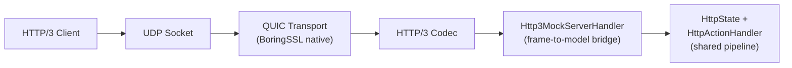
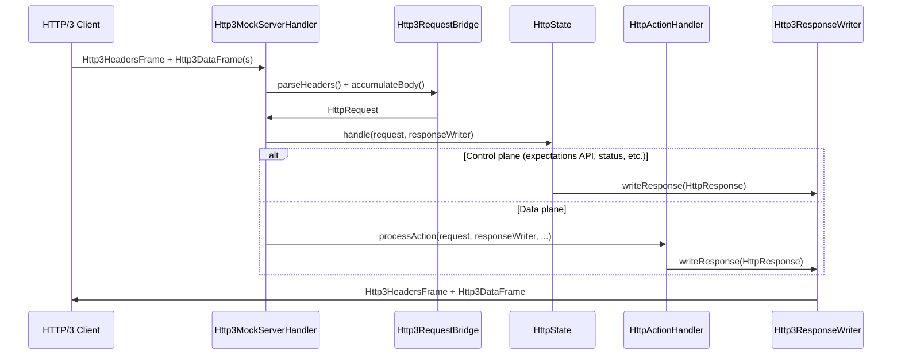
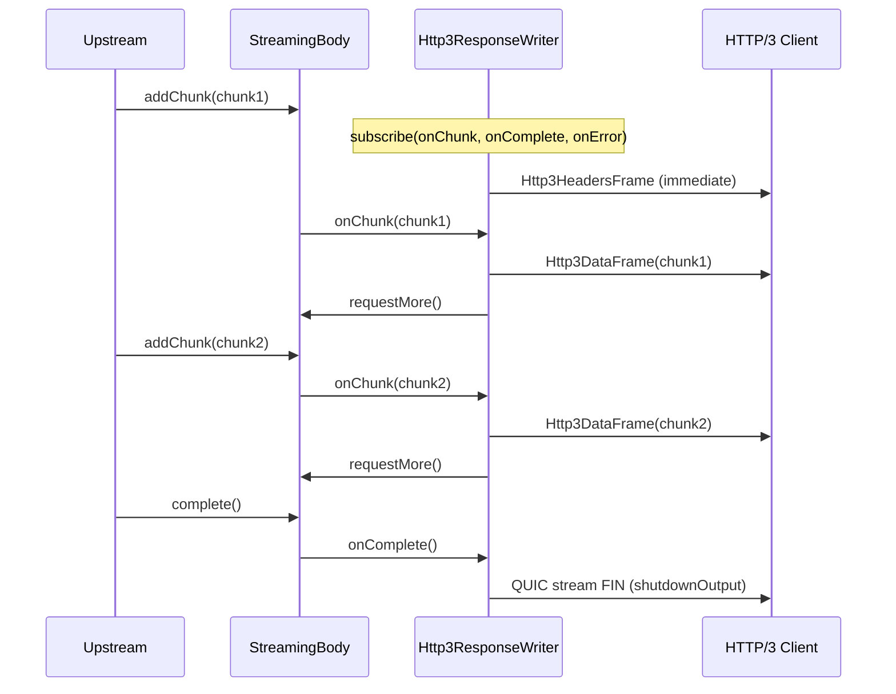

# Experimental HTTP/3 (QUIC) Support

## Status

**EXPERIMENTAL** -- HTTP/3 support is fully integrated with MockServer's request
pipeline (expectation matching, actions, recording, proxy forwarding). It is off
by default and must be explicitly enabled. The "experimental" label reflects the
fact that the underlying QUIC codec is still evolving, although it has now
graduated from the Netty incubator into the mainline Netty 4.2 release as
`io.netty:netty-codec-http3`.

## Overview

MockServer can optionally listen for HTTP/3 requests over QUIC (UDP). HTTP/3
requests are routed through the same expectation matching, action handling,
recording, and proxy forwarding pipeline used by HTTP/1.1 and HTTP/2, providing
full protocol parity.



## How to Enable

Set the `http3Port` configuration property to a non-zero UDP port number:

| Method | Example |
|--------|---------|
| System property | `-Dmockserver.http3Port=8443` |
| Environment variable | `MOCKSERVER_HTTP3_PORT=8443` |
| Configuration API | `Configuration.configuration().http3Port(8443)` |

When `http3Port` is `0` (the default), the HTTP/3 listener is **not started** and
has zero impact on the existing TCP/HTTP server.

## Architecture

### Components

| Class | Module | Purpose |
|-------|--------|---------|
| `Http3Server` | `mockserver-netty` | Bootstraps the QUIC/HTTP3 server, manages lifecycle |
| `Http3MockServerHandler` | `mockserver-netty` | Per-stream handler: accumulates HTTP/3 frames, converts to HttpRequest, routes through the shared pipeline |
| `Http3RequestBridge` | `mockserver-netty` | Pure conversion helpers: HTTP/3 frames to/from HttpRequest/HttpResponse |
| `Http3ResponseWriter` | `mockserver-netty` | ResponseWriter subclass that serialises HttpResponse as HTTP/3 frames |
| `Http3ConnectUdpHandler` | `mockserver-netty` | CONNECT-UDP (MASQUE, RFC 9298) relay; intercepts extended CONNECT requests with `:protocol=connect-udp` when `http3ConnectUdpEnabled=true`; opens a UDP channel to the target authority and relays datagrams bidirectionally |
| `GrpcHttp3Adapter` | `mockserver-netty` | Pure helper: detects gRPC content-type, decodes gRPC framing to JSON (reusing `GrpcFrameCodec` + `GrpcProtoDescriptorStore`), builds H3 HEADERS/DATA frames for gRPC responses with correct trailing HEADERS framing |
| `Http3GrpcResponseWriter` | `mockserver-netty` | `ResponseWriter` subclass that writes gRPC responses over H3 with initial HEADERS + DATA + trailing HEADERS (grpc-status) framing; also implements `GrpcStreamResponseWriter` for server-streaming responses |
| `Http3GrpcBidiStreamHandler` | `mockserver-netty` | Drives true bidirectional gRPC streaming over a single full-duplex QUIC stream (HTTP/3 analogue of `GrpcBidiStreamHandler`); driven incrementally by `Http3MockServerHandler` |
| `GrpcStreamResponseWriter` | `mockserver-core` | Transport-neutral seam `HttpActionHandler` uses to delegate `GRPC_STREAM_RESPONSE` writing to the HTTP/3 writer (HTTP/2 keeps using `GrpcStreamResponseActionHandler`) |
| `GrpcStreamMessageEncoder` / `GrpcBidiRuleMatcher` | `mockserver-core` | Shared encoding + rule-matching helpers so HTTP/2 and HTTP/3 streaming behave identically |
| `Configuration.http3Port()` | `mockserver-core` | Configuration property |
| `ConfigurationProperties.http3Port()` | `mockserver-core` | Static/system-property access |
| `Configuration.http3MaxIdleTimeout()` | `mockserver-core` | QUIC max idle timeout (ms) |
| `Configuration.http3InitialMaxData()` | `mockserver-core` | Connection-level flow control (bytes) |
| `Configuration.http3InitialMaxStreamDataBidirectional()` | `mockserver-core` | Per-stream flow control (bytes) |
| `Configuration.http3InitialMaxStreamsBidirectional()` | `mockserver-core` | Max concurrent bidirectional streams |
| `Configuration.http3QpackMaxTableCapacity()` | `mockserver-core` | QPACK dynamic table capacity (bytes, 0 = disabled) |
| `McpRequestProcessor` | `mockserver-netty` | Transport-neutral MCP JSON-RPC processor shared by TCP (`McpStreamableHttpHandler`) and HTTP/3 (`Http3MockServerHandler`) paths |
| `AltSvcHeaderHandler` | `mockserver-netty` | Outbound handler that adds `Alt-Svc: h3=":<http3Port>"; ma=<maxAge>` to TCP (HTTP/1.1 + HTTP/2) responses when HTTP/3 is enabled; does not clobber user-set Alt-Svc headers |
| `Configuration.http3AltSvcMaxAge()` | `mockserver-core` | Max-age in seconds for the Alt-Svc header (default 86400) |
| `Configuration.http3AdvertiseAltSvc()` | `mockserver-core` | Whether to advertise Alt-Svc on TCP responses (default true) |

### Request Processing

HTTP/3 requests flow through the same pipeline as HTTP/1.1 and HTTP/2:



### Streaming Response Path

When the response carries a `StreamingBody` (SSE, chunked proxy forwarding, LLM
streaming), `Http3ResponseWriter` sends the headers immediately and subscribes
to the body to forward each chunk as an HTTP/3 DATA frame:



Key design points:
- **Same matching**: uses `HttpState.firstMatchingExpectation()` and `HttpActionHandler.processAction()` -- identical to HTTP/1.1 and HTTP/2
- **Same recording**: requests are logged in `MockServerEventLog` for verification
- **Same proxy forwarding**: unmatched requests can be forwarded when configured
- **Body handling**: text content types (JSON, XML, HTML, etc.) are stored as string bodies for correct expectation matching; binary content is stored as binary bodies
- **Streaming support**: `Http3ResponseWriter` subscribes to `StreamingBody` and forwards each chunk as an HTTP/3 DATA frame with backpressure, matching the pattern used by `NettyResponseWriter` for HTTP/1.1

### Lifecycle Integration

The HTTP/3 server is started automatically by `MockServer.createServerBootstrap()`
when `http3Port > 0`. It is stopped during `MockServer.stopAsync()`. The lifecycle
mirrors how the DNS mock server is conditionally started.

**Fail-soft startup**: if the native QUIC transport is not available on the platform,
MockServer logs a warning and continues without HTTP/3. The existing TCP/HTTP server
is never affected by HTTP/3 startup failures.

The bound HTTP/3 port is accessible via `MockServer.getHttp3Port()`.

### Alt-Svc Auto-Discovery

When `http3Port > 0` and `http3AdvertiseAltSvc` is `true` (the default), MockServer
automatically adds an `Alt-Svc` header to every response served over the TCP
(HTTP/1.1 and HTTP/2) paths:

```
Alt-Svc: h3=":<http3Port>"; ma=<http3AltSvcMaxAge>
```

This follows RFC 7838 and tells HTTP/3-capable clients that a QUIC endpoint is
available on the same host. Clients that support HTTP/3 will automatically
upgrade to QUIC on subsequent requests, with transparent fallback to HTTP/2 or
HTTP/1.1 if QUIC is unavailable.

```mermaid
sequenceDiagram
    participant C as HTTP Client
    participant TCP as MockServer TCP
    participant H3 as MockServer HTTP/3

    C->>TCP: GET /api (HTTP/1.1 or HTTP/2)
    TCP->>C: 200 OK + Alt-Svc: h3=":8443"; ma=86400
    Note over C: Client caches Alt-Svc
    C->>H3: GET /api (HTTP/3 over QUIC)
    H3->>C: 200 OK
```

**Design decisions:**

- The `AltSvcHeaderHandler` is a `@Sharable` `ChannelDuplexHandler` added to the
  outbound pipeline at the same point as `TraceContextHandler` in all three TCP
  switch paths (`switchToHttp`, `switchToHttp2`, `switchToH2c`) and in the HTTP/2
  multiplex child initializer.
- The handler intercepts outbound `HttpResponse` writes (MockServer model objects,
  before they are converted to Netty wire format) and adds the header if not already
  present.
- A user-set `Alt-Svc` header in an expectation is never overwritten.
- The handler is NOT added on the HTTP/3 (QUIC) response path itself, since there
  is no point advertising h3 to an h3 client.
- When `http3Port` is `0` (default) or `http3AdvertiseAltSvc` is `false`, no handler
  is added and behaviour is byte-for-byte unchanged.

| Property | Default | Env var | System property |
|----------|---------|---------|-----------------|
| `http3AltSvcMaxAge` | `86400` (24 hours) | `MOCKSERVER_HTTP3_ALT_SVC_MAX_AGE` | `mockserver.http3AltSvcMaxAge` |
| `http3AdvertiseAltSvc` | `true` | `MOCKSERVER_HTTP3_ADVERTISE_ALT_SVC` | `mockserver.http3AdvertiseAltSvc` |

### TLS

The HTTP/3 server uses MockServer's configured TLS certificate material -- the same
private key and certificate chain used by the HTTPS server. This is obtained via
`KeyAndCertificateFactoryFactory.createKeyAndCertificateFactory()`, which respects
the `privateKeyPath`, `x509CertificatePath`, and other TLS configuration properties.

If no configuration is provided (legacy/echo mode), the server falls back to
generating a self-signed EC certificate at startup using BouncyCastle.

### Metrics

When metrics are enabled, HTTP/3 requests increment the `REQUESTS_RECEIVED_COUNT`
counter, consistent with HTTP/1.1 and HTTP/2 request counting.

## Native QUIC Platform Requirement

The QUIC transport requires a native BoringSSL library. The
`netty-codec-http3` dependency transitively pulls in
`netty-codec-native-quic` with classifier-specific JARs.

### Supported platforms

- `linux-x86_64`
- `linux-aarch_64`
- `osx-x86_64`
- `osx-aarch_64`
- `windows-x86_64`

### CI native classifier note

The Maven dependency is declared without a platform classifier, relying on the
transitive resolution from `netty-codec-http3`. This brings in native
libraries for all supported platforms. If the shaded/uber JAR build strips
native libraries (e.g., via maven-shade-plugin filters), ensure the QUIC natives
are included for the target platform.

### Test skip behavior

The `Http3ServerTest` checks `Quic.isAvailable()` at test startup and uses
JUnit 4's `Assume.assumeTrue(...)` to skip gracefully on platforms where the
native library cannot be loaded. The tests will **never fail the build** due to
platform incompatibility.

## Dependencies

| Artifact | Version | Scope |
|----------|---------|-------|
| `io.netty:netty-codec-http3` | `${netty.version}` (4.2.15.Final) | compile |
| `io.netty:netty-codec-native-quic` | `${netty.version}` (transitive) | runtime |
| `io.netty:netty-codec-classes-quic` | `${netty.version}` (transitive) | compile |

The HTTP/3 codec graduated from the Netty incubator into the mainline Netty 4.2
release. The version is now aligned with `${netty.version}` -- no separate
version property is needed. The native QUIC artifact is bundled with platform
classifiers for all supported platforms (`linux-x86_64`, `linux-aarch_64`,
`osx-x86_64`, `osx-aarch_64`, `windows-x86_64`) as transitive runtime
dependencies of `netty-codec-http3`. No additional classifier-specific dependency
declarations are needed -- they resolve automatically.

## What Works

- QUIC server binds to a UDP port and negotiates TLS 1.3 with ALPN `h3`
- HTTP/3 requests are decoded and routed through the full expectation pipeline
- Expectation matching, response actions, template actions, and proxy forwarding
- Request body reading (text and binary content types)
- Request recording for verification via the standard event log
- MockServer TLS certificate reuse (same key/cert as HTTPS)
- Lifecycle integration: start/stop with MockServer
- Fail-soft startup when native QUIC is unavailable
- Metrics: HTTP/3 requests counted in `REQUESTS_RECEIVED_COUNT`
- **Streaming/SSE responses**: `StreamingBody` (SSE, chunked proxy forwarding,
  LLM streaming) responses are fully supported over HTTP/3. Each chunk is sent
  as an HTTP/3 DATA frame with backpressure via `StreamingBody.requestMore()`.
  The QUIC stream output is shut down on stream completion or error.
- Unit-tested frame conversion (no native QUIC needed for bridge tests)
- Unit-tested streaming response writer (no native QUIC needed)
- Integration-tested pipeline parity (expectation matching via HTTP/3)
- Integration-tested streaming over QUIC (in-JVM Netty QUIC client, gated on
  native QUIC availability)
- **CONNECT-UDP (MASQUE, RFC 9298)**: when `http3ConnectUdpEnabled=true`, extended
  CONNECT requests with `:protocol=connect-udp` are intercepted and relayed. The
  handler opens a UDP channel to the target authority parsed from `:authority`,
  relays DATA frame payloads as UDP datagrams bidirectionally, and tears down on
  stream close/error. Normal HTTP/3 requests pass through unchanged. The server
  advertises `SETTINGS_ENABLE_CONNECT_PROTOCOL=1` (RFC 9220) when the flag is on.
- Integration-tested CONNECT-UDP relay (in-JVM QUIC client + local UDP echo server,
  verifies round-trip datagram relay through the tunnel)
- **gRPC unary over HTTP/3**: gRPC unary requests (content-type `application/grpc`,
  `application/grpc+proto`, `application/grpc+json`) are automatically detected on
  the HTTP/3 path and routed through the gRPC adapter. When proto descriptors are
  loaded, the request body is decoded from gRPC length-prefixed protobuf to JSON for
  expectation matching, and the matched response is re-encoded to gRPC-framed
  protobuf. The `grpc-status` and `grpc-message` are conveyed in a **trailing
  HTTP/3 HEADERS frame** (separate from the initial HEADERS), which is the correct
  gRPC wire framing that strict gRPC clients require. Without proto descriptors,
  gRPC requests pass through with binary bodies for raw matching, and grpc-status
  is still correctly framed in trailing HEADERS. Error responses (unknown method,
  decode failure) use the gRPC "trailers-only" pattern (single HEADERS frame with
  both `:status` and `grpc-status`). Non-gRPC requests are unaffected.
- Integration-tested gRPC-over-HTTP/3 (in-JVM Netty QUIC client with manual gRPC
  framing, verifies unary call round-trip, trailing HEADERS framing, error status,
  and non-gRPC regression)
- **gRPC server-streaming over HTTP/3**: a `grpcStreamResponse` expectation streams
  each configured message as its own HTTP/3 DATA frame (honouring per-message delays),
  then a trailing HEADERS frame with `grpc-status`. The unary request is matched
  exactly as for unary gRPC; only the response side fans out. The message encoding is
  shared with the HTTP/2 path via `GrpcStreamMessageEncoder`, and `HttpActionHandler`
  routes the `GRPC_STREAM_RESPONSE` action to the transport-specific
  `GrpcStreamResponseWriter` (implemented by `Http3GrpcResponseWriter`) when the request
  arrived over HTTP/3.
- **gRPC bidi-streaming over HTTP/3**: a `grpcBidiResponse` expectation drives true
  bidirectional streaming on a single (full-duplex) QUIC stream. Enabled by
  `grpcBidiStreamingEnabled` (same flag as HTTP/2). At HEADERS time the stream is routed
  to `Http3GrpcBidiStreamHandler` when the `:path` resolves to a client+server-streaming
  method AND a matching `GrpcBidiResponse` expectation is found (same two-phase
  peek-then-consume protocol as the HTTP/2 `GrpcBidiRouterHandler`). It writes the initial
  HEADERS plus any eager messages, then for each inbound request message evaluates the
  `GrpcBidiRule`s (shared `GrpcBidiRuleMatcher`) and emits the first match's responses,
  writing the trailing HEADERS once the client half-closes and all responses have drained.
- **Alt-Svc auto-discovery (RFC 7838)**: when `http3Port > 0`, responses served over
  the TCP (HTTP/1.1 and HTTP/2) paths include an `Alt-Svc: h3=":<port>"; ma=<maxAge>`
  header so HTTP/3-capable clients automatically upgrade to QUIC. The max-age is
  configurable via `http3AltSvcMaxAge` (default 86400s). Advertisement can be
  suppressed via `http3AdvertiseAltSvc=false`. User-set Alt-Svc headers in
  expectations are never overwritten.
- **W3C trace-context propagation**: `traceparent` and `tracestate` headers are
  parsed from inbound HTTP/3 requests (or generated when `otelGenerateTraceId` is
  enabled) and stored on the channel attribute, exactly like the TCP path's
  `TraceContextHandler`. When `otelPropagateTraceContext` is enabled, the trace
  headers are copied onto outbound HTTP/3 responses. This enables distributed
  tracing across H3 and TCP requests. Both features are default-off (same config
  gates as TCP).
- **mTLS client-certificate capture**: when `tlsMutualAuthenticationRequired` is
  enabled (or a `tlsMutualAuthenticationCertificateChain` is configured), the QUIC
  SSL context requests client certificates under the same conditions as the TCP
  path. Peer certificates are extracted from the `QuicChannel` `SSLEngine` session
  and plumbed into the `HttpRequest` via `withClientCertificateChain`, enabling
  cert-based expectation matching and verification over HTTP/3. When no client cert
  is presented, the request proceeds without a cert chain (no error).
- **MCP (Model Context Protocol) over HTTP/3**: the MCP Streamable HTTP transport
  (`/mockserver/mcp`) works over HTTP/3 with the same behaviour as TCP, including
  JSON-RPC request/response, session management, tool calls, resource reads, batch
  requests, notifications, **control-plane authentication** (JWT and mTLS), and
  **CORS headers**. Specifically:
  - **Control-plane authentication** is enforced for POST, GET, and DELETE requests
    on the MCP path, exactly mirroring the TCP handler's `authenticateRequest()`
    logic. The `HttpRequest` already carries the client certificate chain (captured
    earlier in `captureClientCertificates`), so mTLS auth works. OPTIONS (CORS
    preflight) is exempt from authentication, matching TCP behaviour. On auth
    failure, the H3 path returns the same 401 status and JSON-RPC error body as
    the TCP path.
  - **CORS headers** (`Access-Control-Allow-Origin`, `Allow-Methods`,
    `Allow-Headers`, `Expose-Headers`, `Max-Age`) are added to every MCP response
    when the request carries an `Origin` header, matching the TCP handler's
    `addCorsHeaders()` logic.
  - The MCP protocol logic is extracted into a transport-neutral `McpRequestProcessor`
    that is shared between the TCP handler (`McpStreamableHttpHandler`) and the
    HTTP/3 dispatch in `Http3MockServerHandler`. Each transport creates its own
    `McpRequestProcessor` instance, but both share the same `McpSessionManager` (and
    thus the same session state); the tool and resource registries are stateless.
  - Integration-tested with a native QUIC client (initialize, tools/list, tools/call,
    resources/list, ping, batch, notifications, DELETE, parse errors, GET 405,
    auth-reject-without-credentials, auth-accept-with-credentials, CORS headers).

## HTTP/3 Parity / Known Limitations

All expectation matching, actions, recording, verification, HTTP chaos profiles,
forward-proxy, trace-context propagation, mTLS, MCP (including control-plane
authentication and CORS headers), and gRPC (unary, server-streaming, and
bidi-streaming) work over HTTP/3, matching the TCP (HTTP/1.1 and HTTP/2) path.

### Inherently N/A over HTTP/3

| Feature | Reason |
|---------|--------|
| **TCP chaos (TcpChaosHandler)** | QUIC has no TCP RST/FIN/slow\_close semantics. HTTP-level chaos profiles (latency, error responses, degradation ramp) DO work over H3 |
| **WebSocket callbacks + dashboard WebSocket** | RFC 6455 HTTP/1.1 Upgrade has no HTTP/3 equivalent. The analog is WebTransport (RFC 9220), which is not yet implemented |
| **HTTP/1.1 framing fixups** | `PreserveHeadersNettyRemoves`, `HttpContentDecompressor`, `EarlyMatchingHandler` are HTTP/1.1 pipeline handlers that have no meaning in HTTP/3 (QPACK handles header encoding, HTTP/3 frames are self-describing) |

### Not-yet-supported (deferred by demand)

| Feature | Status |
|---------|--------|
| ~~**MCP-over-H3**~~ | **DONE**: MCP Streamable HTTP transport works over HTTP/3 with full parity. Transport-neutral `McpRequestProcessor` shared between TCP and H3 paths |
| ~~**gRPC server-streaming / bidi-streaming over H3**~~ | **DONE** (G16-FOLLOW-UP-5): server-streaming via `Http3GrpcResponseWriter` + the `GrpcStreamResponseWriter` seam; bidi-streaming via `Http3GrpcBidiStreamHandler` (gated by `grpcBidiStreamingEnabled`). See "What Works". |
| **Per-connection detail in dashboard** | The H3 dashboard chip shows port + aggregate connection count. Per-connection detail (remote address, stream count, duration) is deferred |

## What is NOT Implemented (follow-up work)

- ~~QPACK header compression tuning (G16-FOLLOW-UP-1)~~ -- **DONE**: `http3QpackMaxTableCapacity`
  configuration property controls the QPACK dynamic table size (default 0 = static table only).
- ~~Dashboard UI visibility for HTTP/3 connections (G16-FOLLOW-UP-2)~~ -- **DONE**: active
  connection count tracked in `Http3Server`; exposed via `GET /mockserver/http3status` endpoint;
  dashboard AppBar shows an "H3" chip with port and active connection count when enabled.
  Per-connection detail (remote address, stream count, duration) is deferred as follow-up.
- ~~HTTP/3 specific proxy mode -- CONNECT-UDP / MASQUE (G16-FOLLOW-UP-3)~~ -- **DONE**:
  the `http3ConnectUdpEnabled` configuration flag (default `false`) enables the
  `Http3ConnectUdpHandler` in the QUIC stream pipeline. When enabled, extended
  CONNECT requests with `:protocol=connect-udp` (RFC 9298) are intercepted and
  relayed: a UDP `DatagramChannel` is opened to the target authority, DATA frame
  payloads are forwarded as UDP datagrams, and received datagrams are sent back
  as DATA frames. The server advertises `SETTINGS_ENABLE_CONNECT_PROTOCOL=1`
  (RFC 9220). Normal HTTP/3 requests pass through unchanged. Previously blocked
  on the incubator codec lacking `:protocol` support; unblocked by upgrading to
  the GA `io.netty:netty-codec-http3` (4.2.15.Final) which includes
  `Http3Headers.PseudoHeaderName.PROTOCOL` and
  `Http3SettingsFrame.HTTP3_SETTINGS_ENABLE_CONNECT_PROTOCOL`.
- ~~Configurable QUIC transport parameters via configuration properties (G16-FOLLOW-UP-4)~~ --
  **DONE**: `http3MaxIdleTimeout`, `http3InitialMaxData`,
  `http3InitialMaxStreamDataBidirectional`, `http3InitialMaxStreamsBidirectional` configuration
  properties added. Defaults match the original hardcoded values.
- ~~gRPC server-streaming / bidi-streaming over HTTP/3 (G16-FOLLOW-UP-5)~~ -- **DONE**:
  rather than reuse the HTTP/2-coupled handlers, the transport-neutral logic was extracted
  to core helpers (`GrpcStreamMessageEncoder` for message framing, `GrpcBidiRuleMatcher` for
  rule matching) shared by both transports. Server-streaming is written by
  `Http3GrpcResponseWriter` (which implements the new core `GrpcStreamResponseWriter` seam
  that `HttpActionHandler` dispatches the `GRPC_STREAM_RESPONSE` action to). Bidi-streaming is
  handled by `Http3GrpcBidiStreamHandler`, driven incrementally by `Http3MockServerHandler`'s
  `channelRead`/`channelInputClosed` over the full-duplex QUIC stream (no HTTP/2 child-channel
  needed). Bidi is gated by `grpcBidiStreamingEnabled` and reuses `IncrementalGrpcFrameDecoder`.
  Both are covered by native-QUIC integration tests (`Http3GrpcStreamingIntegrationTest`).

## Risks

- **Native library compatibility**: the QUIC native (BoringSSL) must be available
  for the target platform. Missing natives will prevent the HTTP/3 server from starting.
- **API stability**: `netty-codec-http3` has graduated from the incubator into
  mainline Netty 4.2, but the HTTP/3 API may still evolve in future 4.2.x releases.
- **Netty version coupling**: the HTTP/3 codec version is now aligned with the
  project's `${netty.version}` (4.2.15.Final). Version updates are automatic.
- **InsecureQuicTokenHandler**: the QUIC server uses `InsecureQuicTokenHandler`
  which performs no source-address validation (no Retry token). This is acceptable
  for a test/mock tool but means the server does not protect against address
  spoofing or QUIC amplification (a forged-source Initial packet can elicit a
  response up to `initialMaxData`). A production-exposed deployment would need a
  source-address-validating (stateless-retry) token handler. Tracked as a known
  limitation; not changed here to avoid an untested change to the QUIC handshake.
- **CONNECT-UDP is an open UDP relay (SSRF)**: when `http3ConnectUdpEnabled=true`
  (default `false`), `Http3ConnectUdpHandler` relays datagrams to **any** target
  authority the client names, with no allowlist — including private networks,
  loopback, and cloud metadata endpoints (e.g. 169.254.169.254). This is an
  SSRF-equivalent capability and is intended for controlled test environments
  only. Keep it disabled unless needed, and never expose a CONNECT-UDP–enabled
  HTTP/3 port to untrusted clients. (A future `http3ConnectUdpAllowedTargets`
  allowlist could constrain destinations.)
- **Request body size cap**: HTTP/3 request bodies are accumulated up to
  `maxRequestBodySize` (default 10 MiB), matching the HTTP/1.1 and HTTP/2 paths;
  a request exceeding the cap is rejected (413 / stream shutdown) rather than
  buffered unboundedly.
- **QUIC transport parameters**: transport parameters (`maxIdleTimeout`,
  `initialMaxData`, `initialMaxStreamDataBidirectional`, `initialMaxStreamsBidirectional`)
  and the QPACK dynamic table capacity are now configurable via `Configuration` /
  `ConfigurationProperties`. The defaults match the original hardcoded values and are
  generous for testing. See the configuration properties documentation for details.
- **Streaming body ordering**: streaming chunks over HTTP/3 are serialised on the
  QUIC stream (QUIC guarantees in-order delivery per stream), but the subscriber
  callbacks run on the upstream event loop. If the upstream event loop differs from
  the QUIC stream's event loop, chunks may be delayed by event loop scheduling
  (not lost or reordered, just latency-amplified).
