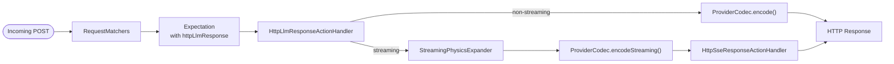
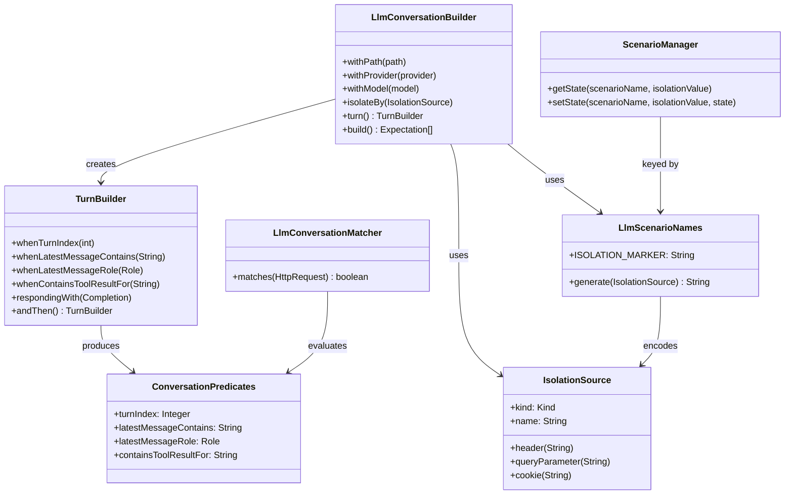
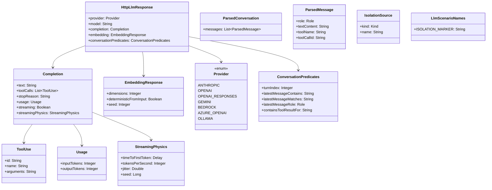

# LLM & Agent Mocking — Internal Architecture

## Overview

MockServer provides first-class LLM mocking through a new action type `httpLlmResponse` that produces provider-correct responses from a high-level, provider-neutral `Completion` abstraction. The feature spans codec encoding, streaming physics, conversation-aware matching, session isolation, MCP tool exposure, and dashboard rendering.

## Action Type

`httpLlmResponse` is a peer to `httpResponse`, `httpSseResponse`, etc. It lives on `Expectation` as a separate field and dispatches through `HttpLlmResponseActionHandler`.



## Codec Registry

`ProviderCodecRegistry` is a singleton that maps `Provider` enum values to `ProviderCodec` implementations. Each codec exposes:

- `encode(Completion, model)` -- non-streaming response
- `encodeStreaming(Completion, model, StreamingPhysics)` -- SSE event list
- `encodeEmbedding(EmbeddingResponse, input)` -- embeddings
- `decode(HttpRequest)` -- parse inbound request to `ParsedConversation` (for conversation matchers)

Currently registered codecs:

| Provider | Codec class | Status |
|----------|-------------|--------|
| ANTHROPIC | `AnthropicCodec` | Complete |
| OPENAI | `OpenAiChatCompletionsCodec` | Complete |
| OPENAI_RESPONSES | `OpenAiResponsesCodec` | Complete |
| GEMINI | `GeminiCodec` | Complete |
| BEDROCK | `BedrockCodec` | Complete (delegates to `AnthropicCodec` for non-streaming; see security audit for binary-framing limitation) |
| AZURE_OPENAI | `AzureOpenAiCodec` | Complete (delegates to `OpenAiChatCompletionsCodec`) |
| OLLAMA | `OllamaCodec` | Complete (see security audit for NDJSON wire-format limitation) |

## Streaming Physics

`StreamingPhysicsExpander` converts a `Completion` + `StreamingPhysics` configuration into a `List<SseEvent>` with pre-computed per-event delays.

Parameters:
- `timeToFirstToken` -- delay before the first SSE event
- `tokensPerSecond` -- base rate (1-10000)
- `jitter` -- fractional uniform deviation (0.0-1.0)
- `seed` -- PRNG seed for reproducible timing

The expanded events are handed to `HttpSseResponseActionHandler` which already honours per-event delays.

## Conversation Matchers

`LlmConversationMatcher` evaluates predicates against a `ParsedConversation` decoded from the inbound request body:

- `whenTurnIndex(n)` -- assistant turn count
- `whenLatestMessageContains(text)` -- substring match on last message
- `whenLatestMessageRole(role)` -- role of last message
- `whenContainsToolResultFor(toolName)` -- tool result presence

Predicates are stored as `ConversationPredicates` on `HttpLlmResponse` for JSON round-tripping. The matcher is lazily reconstructed from predicates after deserialisation.

## Session Isolation

`IsolationSource` describes where to extract the isolation key from an inbound request (header, query parameter, or cookie). The key is encoded into the scenario name:

```
__llm_conv_<uuid>__iso=header:x-session-id
```

`ScenarioManager` uses composite keys `(scenarioName, isolationValue)` to maintain independent state per session.

## Conversation Builder

`LlmConversationBuilder` produces an array of `Expectation` objects, one per turn, with:
- Auto-generated scenario name (with optional isolation suffix)
- State progression: `Started` -> `turn_1` -> `turn_2` -> ... -> `__done`
- `ConversationPredicates` on each `HttpLlmResponse`

The class relationships between the builder, predicates, matcher, and isolation model:



## MCP Tools

Two MCP tools expose the LLM mocking feature to agents:

| Tool | Description |
|------|-------------|
| `mock_llm_completion` | Creates a single LLM expectation from provider, path, text, tool calls, usage |
| `create_llm_conversation` | Creates a multi-turn conversation with scenario state chain and optional isolation |

Both validate provider availability against `ProviderCodecRegistry` at registration time.

## Dashboard Rendering

The expectation panel renders an "LLM Response" badge (with provider, model, and text preview) when `httpLlmResponse` is present on an expectation.

The `ScriptedTurnsPanel` component renders the scripted turn sequence for conversation expectations, showing per-turn predicates, responses, and scenario state transitions.

## Domain Model



## Configuration

| Property | Default | Range | Description |
|----------|---------|-------|-------------|
| `mockserver.maxLlmConversationBodySize` | `1048576` (1 MiB) | 16384 - 67108864 | Maximum request body size for conversation matcher parsing |

## Related Documents

- [RFC: LLM & Agent Mocking](../plans/mockserver-llm-mocking.md) -- authoritative design spec
- [Implementation Plan](../plans/mockserver-llm-mocking-impl-plan.md) -- work items and milestones
- [Security Audit](llm-security-audit.md) -- M5 security review including known codec limitations
- [Codec Golden-File Testing](llm-codec-fixtures.md) -- how to refresh provider fixtures
- [Request Processing](request-processing.md) -- action dispatch pipeline (LLM dispatch flow)
- [Domain Model](domain-model.md) -- model class hierarchy
- [Event System](event-system.md) -- event logging pipeline
- [AI & RPC Protocol Mocking](ai-protocol-mocking.md) -- SSE, MCP, A2A mocking

## Source References

Key source files under `mockserver/mockserver-core/src/main/java/org/mockserver/`:

| File | Role |
|------|------|
| `llm/ProviderCodecRegistry.java` | Codec registry singleton; all 7 providers registered at boot |
| `llm/codec/AnthropicCodec.java` | Anthropic Messages API encoder/decoder |
| `llm/codec/OpenAiChatCompletionsCodec.java` | OpenAI Chat Completions encoder/decoder |
| `llm/codec/OpenAiResponsesCodec.java` | OpenAI Responses API encoder/decoder |
| `llm/codec/GeminiCodec.java` | Gemini encoder/decoder |
| `llm/codec/BedrockCodec.java` | Bedrock wrapper (delegates to Anthropic codec) |
| `llm/codec/AzureOpenAiCodec.java` | Azure OpenAI wrapper (delegates to OpenAI codec) |
| `llm/codec/OllamaCodec.java` | Ollama encoder/decoder |
| `llm/StreamingPhysicsExpander.java` | Converts `Completion` + `StreamingPhysics` to `List<SseEvent>` |
| `llm/IsolationSource.java` | Session isolation key extraction descriptor |
| `llm/LlmScenarioNames.java` | Scenario name generation with isolation encoding |
| `llm/ParsedConversation.java` | Decoded conversation model |
| `llm/ParsedMessage.java` | Single decoded message (role, text, tool name, tool call ID) |
| `client/LlmConversationBuilder.java` | Fluent builder producing per-turn `Expectation` arrays |
| `client/TurnBuilder.java` | Per-turn predicate and response configuration |
| `matchers/LlmConversationMatcher.java` | Evaluates `ConversationPredicates` against decoded requests |
| `model/HttpLlmResponse.java` | Action type holding provider, model, completion, predicates |
| `model/ConversationPredicates.java` | Serialisable predicate set stored on `HttpLlmResponse` |
