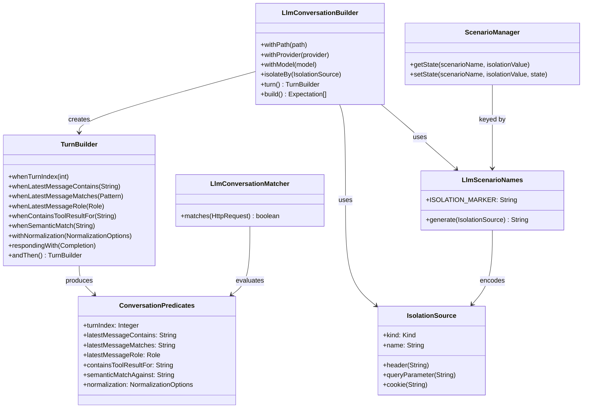
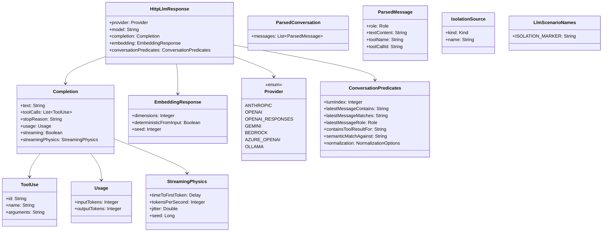
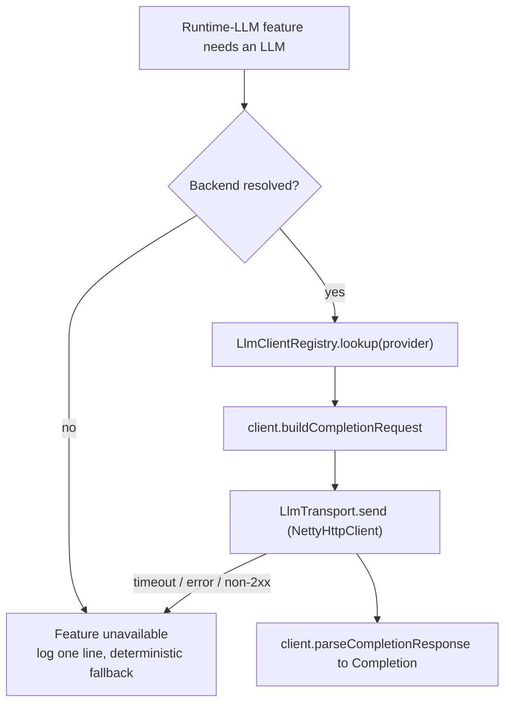

# LLM & Agent Mocking — Internal Architecture

## Overview

MockServer provides first-class LLM mocking through a new action type `httpLlmResponse` that produces provider-correct responses from a high-level, provider-neutral `Completion` abstraction. The feature spans codec encoding, streaming physics, conversation-aware matching, session isolation, MCP tool exposure, and dashboard rendering.

## Action Type

`httpLlmResponse` is a peer to `httpResponse`, `httpSseResponse`, etc. It lives on `Expectation` as a separate field and dispatches through `HttpLlmResponseActionHandler`.


## Codec Registry

`ProviderCodecRegistry` is a singleton that maps `Provider` enum values to `ProviderCodec` implementations. Each codec exposes:

- `encode(Completion, model)` -- non-streaming response
- `encodeStreaming(Completion, model, StreamingPhysics)` -- SSE event list
- `encodeEmbedding(EmbeddingResponse, input)` -- embeddings
- `decode(HttpRequest)` -- parse inbound request to `ParsedConversation` (for conversation matchers)

Currently registered codecs:

| Provider | Codec class | Status |
|----------|-------------|--------|
| ANTHROPIC | `AnthropicCodec` | Complete |
| OPENAI | `OpenAiChatCompletionsCodec` | Complete |
| OPENAI_RESPONSES | `OpenAiResponsesCodec` | Complete |
| GEMINI | `GeminiCodec` | Complete |
| BEDROCK | `BedrockCodec` | Complete (delegates to `AnthropicCodec` for non-streaming; see security audit for binary-framing limitation) |
| AZURE_OPENAI | `AzureOpenAiCodec` | Complete (delegates to `OpenAiChatCompletionsCodec`) |
| OLLAMA | `OllamaCodec` | Complete (see security audit for NDJSON wire-format limitation) |

## Streaming Physics

`StreamingPhysicsExpander` converts a `Completion` + `StreamingPhysics` configuration into a `List<SseEvent>` with pre-computed per-event delays.

Parameters:
- `timeToFirstToken` -- delay before the first SSE event
- `tokensPerSecond` -- base rate (1-10000)
- `jitter` -- fractional uniform deviation (0.0-1.0)
- `seed` -- PRNG seed for reproducible timing

The expanded events are handed to `HttpSseResponseActionHandler` which already honours per-event delays.

## Conversation Matchers

`LlmConversationMatcher` evaluates predicates against a `ParsedConversation` decoded from the inbound request body:

- `whenTurnIndex(n)` -- assistant turn count
- `whenLatestMessageContains(text)` -- substring match on last message
- `whenLatestMessageMatches(pattern)` -- regex match on last message
- `whenLatestMessageRole(role)` -- role of last message
- `whenContainsToolResultFor(toolName)` -- tool result presence
- `withNormalization(options)` -- opt-in prompt normalisation applied before the `contains`/`matches` text predicates (see below)

Predicates are stored as `ConversationPredicates` on `HttpLlmResponse` for JSON round-tripping. The matcher is lazily reconstructed from predicates after deserialisation.

### Normalised prompt matching

Agent prompts are dynamically assembled, so exact-byte matching is brittle. `NormalizationOptions` (carried on `ConversationPredicates`) applies a **deterministic** transform to the latest-message text before the text predicates run, via `PromptNormalizer.normalize(text, options)`:

- `collapseWhitespace` (default on) -- collapse runs of whitespace to a single space and trim
- `lowercase` (default off) -- lowercase the text
- `sortJsonKeys` (default on) -- when the prompt is JSON, sort object keys so key ordering is irrelevant
- `dropBuiltInVolatileFields` (default off) -- strip ISO-8601 timestamps, UUIDs, and `prefix_…` ids (`req_`, `msg_`, `call_`, …)
- `dropVolatileFields` -- names of JSON fields to drop before matching

For `latestMessageContains`, both the subject text and the expected substring are normalised; for `latestMessageMatches`, only the subject is normalised (normalising the regex source would corrupt the pattern). Normalisation applies **only to the latest-message text** — the `containsToolResultFor` tool name, `turnIndex`, and `latestMessageRole` are matched exactly as specified. Boolean options are nullable: an unset flag uses its default (`collapseWhitespace` and `sortJsonKeys` on; `lowercase` and `dropBuiltInVolatileFields` off), resolved identically whether the options arrive via the REST API or the MCP tool. Normalisation is idempotent and pure — it never makes a test flaky — and is a *modifier*, not a predicate: it does not count toward `hasAnyPredicate()` and has no effect unless a text predicate is also set.

### Semantic prompt matching (opt-in, exploratory)

The `semanticMatch` predicate (`ConversationPredicates.semanticMatchAgainst`) matches when the latest message expresses a given intent, judged by a runtime LLM. It is deliberately quarantined from the deterministic path:

- **Off by default.** `SemanticMatching` is a static gate that is only `install`ed (at server start) when `mockserver.llmSemanticMatchingEnabled` is set **and** a backend resolves via `LlmBackendResolver`. Until then `isEnabled()` is false and `LlmConversationMatcher` **ignores** the predicate (logs once, deterministic fallback) — so default behaviour is unchanged.
- **Fail-closed when active.** `SemanticPromptMatcher` asks the LLM (via the Phase-2 `LlmCompletionService`, `temperature=0`, cached) a strict yes/no judge question; a non-affirmative, empty, or errored answer does not match.
- **Never for assertions.** It is non-deterministic by construction (a live model) and documented as exploratory only.

## Session Isolation

`IsolationSource` describes where to extract the isolation key from an inbound request (header, query parameter, or cookie). The key is encoded into the scenario name:

```
__llm_conv_<uuid>__iso=header:x-session-id
```

`ScenarioManager` uses composite keys `(scenarioName, isolationValue)` to maintain independent state per session.

## Conversation Builder

`LlmConversationBuilder` produces an array of `Expectation` objects, one per turn, with:
- Auto-generated scenario name (with optional isolation suffix)
- State progression: `Started` -> `turn_1` -> `turn_2` -> ... -> `__done`
- `ConversationPredicates` on each `HttpLlmResponse`

The class relationships between the builder, predicates, matcher, and isolation model:



## MCP Tools

Two MCP tools expose the LLM mocking feature to agents:

| Tool | Description |
|------|-------------|
| `mock_llm_completion` | Creates a single LLM expectation from provider, path, text, tool calls, usage, and an optional `outputSchema` (response-path structured-output validation) |
| `create_llm_conversation` | Creates a multi-turn conversation with scenario state chain, optional isolation, and an optional per-turn `match.normalization` object |
| `verify_tool_call` | Asserts an agent called a named tool `atLeast`/`atMost` times (optional args regex), by decoding recorded LLM requests |
| `explain_agent_run` | Summarises a recorded agent run: turn/tool-call sequence, tool results, latest role |
| `verify_structured_output` | Validates the JSON output text of recorded LLM responses against a JSON Schema (decodes each response via the runtime-LLM client SPI, then `JsonSchemaValidator`); reports per-response conformance |

The first two validate provider availability against `ProviderCodecRegistry` at registration time. The analysis tools delegate to `org.mockserver.llm.analysis.AgentRunAnalyzer`.

## Structured-output validation

Structured-output validation against a JSON Schema works on **both sides** of a mock, both built on `JsonSchemaValidator`:

- **Read side — `verify_structured_output`** (assertion over recorded traffic): decodes each recorded response for a provider via the runtime-LLM client SPI and checks the assistant's output text against the schema. Read-only and deterministic.
- **Response side — `Completion.outputSchema`** (fixture sanity check): a completion may declare the JSON Schema its `text` should conform to (`Completion.withOutputSchema(...)`, the `outputSchema` expectation-JSON field, or the `mock_llm_completion` MCP param — string or inline object). `HttpLlmResponseActionHandler.validateStructuredOutput(...)` validates the configured text as the response is encoded. It is **fail-soft**: a mismatch never alters the response body — it adds the `x-mockserver-structured-output-invalid` diagnostic header (a single-line, CR/LF-collapsed message; non-streaming only) and logs a warning. A blank schema, absent text, or a malformed schema are all "nothing to check" and can never break the response. This surfaces malformed fixtures while still letting you return a deliberately non-conforming response unchanged.

## Adversarial-response harness

`AdversarialResponseLibrary` (`org.mockserver.llm.adversarial`) is a curated catalog of hostile/malformed *responses* an agent might receive from a compromised tool or jailbroken model — prompt injection, jailbreak persona-swaps, data-exfiltration requests, malformed/truncated JSON, an empty response, and an over-long repetition. The `mock_adversarial_llm_response` MCP tool mocks a chosen payload as the provider-correct LLM response so you can test that your agent **resists** it. The payloads are short, well-known benign test fixtures (not working exploits) — a defensive testing aid — and generation is deterministic (each id maps to fixed text).

## Fault / chaos injection

`LlmChaosProfile` (`org.mockserver.model`) attaches a fault profile to any `HttpLlmResponse` for resilience testing. Applied by `HttpLlmResponseActionHandler`:

- **Probabilistic error** — `chaosErrorResponseOrNull(...)` returns an error `HttpResponse` (`errorStatus` + optional `Retry-After`) when triggered. An `errorStatus` with no `errorProbability` always fires; a fractional probability draws once (reproducible via `seed`). `HttpActionHandler` checks this first and, if present, returns the error on the normal (non-streaming) path — a provider error is a plain HTTP response, not an SSE stream, even for a would-be streaming completion.
- **Mid-stream truncation** — `applyStreamingChaos(...)` keeps a leading `truncateAtFraction` of the SSE events (default 0.5) so the stream ends early.
- **Malformed SSE** — appends a deliberately broken-JSON chunk so the client must handle a corrupt event.

Truncation and malformed-SSE are fully deterministic; the error path is deterministic at probability 0.0/1.0. Each injection increments the `LLM_CHAOS_INJECTED_COUNT` metric. The profile round-trips as the top-level `chaos` field on `HttpLlmResponse` (alongside `completion`, `embedding`, and `conversationPredicates`) and is exposed per turn in the dashboard wizard and via the `chaos` MCP parameter.

## Agent-run analysis

`AgentRunAnalyzer` (`org.mockserver.llm.analysis`) is a deterministic, read-only inspector. Given the LLM requests MockServer recorded (retrieved via the normal request log), it decodes each with the provider's `ProviderCodec` and treats the **richest** conversation (most messages — the latest dialogue snapshot) as the canonical run. From that it derives:

- `inspectToolCalls(requests, provider, toolName, argsRegex)` → count + matched tool calls (powers `verify_tool_call`).
- `summarise(requests, provider)` → message count, assistant-turn count, ordered tool-call name sequence, tool-result keys, latest message role (powers `explain_agent_run`).

- `buildCallGraph(requests, provider)` → a `CallGraph` of nodes (one per message, one per assistant tool call) and directed edges: `NEXT` (message sequence), `INVOKES` (assistant turn → the tool calls it made), `RESULT` (tool call → the tool message that returned its result, correlated by tool-call id). Powers the dashboard call-graph view.

No LLM is called and no network is used — it reads the structure the codecs already produce, so assertions are reproducible. The MCP tools are thin wrappers that retrieve recorded requests (`/mockserver/retrieve?type=REQUESTS`) and format the analyzer's output; `explain_agent_run` includes the `callGraph` (nodes + edges). The dashboard **Sessions** view (`SessionInspector` → `AgentRunGraph.tsx`, with the pure transform `mockserver-ui/src/lib/callGraph.ts`) loads the graph per session via `explain_agent_run` and renders it as a step list (role + invoked tool calls + result indicator) plus a copyable Mermaid `flowchart`.

## Dashboard Rendering

The expectation panel renders an "LLM Response" badge (with provider, model, and text preview) when `httpLlmResponse` is present on an expectation.

The `ScriptedTurnsPanel` component renders the scripted turn sequence for conversation expectations, showing per-turn predicates, responses, and scenario state transitions.

## Domain Model



## Runtime LLM client SPI

Most LLM mocking is deterministic and offline. A few opt-in features (drift detection, semantic prompt matching) need MockServer to act as a *client* against a real LLM the user already runs. This is the opposite direction to the codecs (`decode` parses an inbound request; `encode` builds a mock response), so a sibling SPI mirrors the codec-registry shape:

- `org.mockserver.llm.client.LlmClient` — `provider()`, `buildCompletionRequest(LlmBackend, ParsedConversation)`, `parseCompletionResponse(HttpResponse)`. Implementations are **pure** (no transport, no shared state) so they unit-test offline. `AbstractLlmClient` provides URL parsing, base-request construction, and JSON helpers.
- `org.mockserver.llm.client.LlmClientRegistry` — singleton, static-block registration keyed by `Provider`, structurally identical to `ProviderCodecRegistry`. All seven providers registered: Ollama, OpenAI, OpenAI Responses, Azure OpenAI, Anthropic, Gemini, Bedrock.
- `org.mockserver.llm.client.LlmBackend` — immutable record (`name, provider, baseUrl, apiKey, model, headers, timeoutMillis`); `baseUrl`/`model` default per provider, `apiKey` redacted in `toString()`.
- `org.mockserver.llm.client.LlmBackendResolver` — three config layers: (1) provider env conventions (`OPENAI_API_KEY` / `ANTHROPIC_API_KEY` / `GEMINI_API_KEY` / `OLLAMA_HOST`), (2) `mockserver.llmProvider`/`llmApiKey`/`llmModel`/`llmBaseUrl`, (3) named backends JSON (`mockserver.llmBackendsConfig`). Properties take precedence over env; named backends are selectable by name.
- `org.mockserver.llm.client.LlmCompletionService` — the single entry point for runtime-LLM features. Looks up the client, builds the request, sends it via an injected `LlmTransport`, parses the response. Enforces the safety rules: **off unless a backend resolves**, **fail closed** (timeout / transport error / non-2xx / parse failure → `Optional.empty()` + one log line), and **reproducible** (clients pin `temperature=0`/seed; responses cached per provider+model+baseUrl+normalised prompt). `LlmTransport` is a seam; `NettyHttpClientLlmTransport` wraps the server's `NettyHttpClient` in production.



Adding a provider = implement `LlmClient` + one `register(...)` line — the same one-line story as codecs. **Ollama** is the reference backend (no auth, local, free) used to prove the path. **Bedrock** builds the Anthropic-on-Bedrock body and parses the Anthropic-shaped response, but automatic AWS SigV4 signing is not yet implemented — callers supply auth via the `headers` escape hatch or a signing proxy (tracked in `llm-security-audit.md`).

This SPI is never on the deterministic assertion/matching path. The features that consume it (drift detection, semantic matching) are tracked in `docs/plans/mockserver-llm-mocking.md`.

## OpenTelemetry export

Optional, off-by-default OTLP export, in two independent parts (both fail-soft — a setup error logs one line and never affects the server or a response; `io.opentelemetry` is relocated in the shaded jar):

- **Metrics** (`org.mockserver.metrics.OtelMetricsExporter`, `mockserver.otelMetricsEnabled`) — bridges the existing `Metrics.Name` gauges (the same set exposed for Prometheus, including the LLM/SSE/chaos counters) to OTLP as observable gauges that read the current values, so Prometheus and OTLP stay consistent. An alternative to the Prometheus endpoint.
- **GenAI spans** (`org.mockserver.telemetry.GenAiSpanExporter` + `GenAiSpans`, `mockserver.otelTracesEnabled`) — `HttpLlmResponseActionHandler` calls `GenAiSpans.recordCompletion(provider, model, completion)` on each served completion (streaming and non-streaming), emitting one span with GenAI semantic-convention attributes (`gen_ai.system`, `gen_ai.request.model`, `gen_ai.usage.*`, `gen_ai.response.finish_reasons`, tool-call count). These are spans MockServer codes deliberately — **no auto-instrumentation**. `GenAiSpans` is a process-wide no-op until `GenAiSpanExporter` installs a tracer.

Both use the OTLP HTTP/protobuf exporter with the JDK HttpClient sender (no gRPC/OkHttp) and share `mockserver.otelEndpoint` (a base collector URL; `/v1/metrics` and `/v1/traces` appended per signal, resolved by `telemetry.OtelEndpoints`).

## Drift detection

`detect_llm_drift` (MCP) closes the loop on stale cassettes: it replays a recorded cassette's exchanges against the **live** provider and reports structural drift in the responses. Built from two pieces in `org.mockserver.llm.drift`:

- `StructuralShapeDiff` — pure: walks two JSON documents into path→type shape maps and reports added / removed / type-changed paths (values ignored; arrays use a representative-first-element model). Reusable.
- `DriftDetector` — for each recorded exchange, decodes the recorded request via the `ProviderCodec`, builds a fresh live request via the runtime-LLM `LlmClient` (Phase 2 SPI), sends it through an injected `LlmTransport`, and diffs the live response shape against the recorded one. **Fails closed** per exchange: a missing client/codec, network error, non-2xx, or non-JSON body is reported as `COULD_NOT_CHECK`, never as drift, and never thrown.

The MCP tool resolves a backend via `LlmBackendResolver` and is **disabled** (returns `{disabled:true}`) when none is configured. When configured, it builds a transient `NettyHttpClient`-backed transport for the live calls. Because it needs real API keys/tokens and is inherently non-deterministic against a live API, it belongs in an opt-in/scheduled CI lane (see `docs/infrastructure/ci-cd.md`), never the per-commit build. No dashboard control — it is an operational/CI tool.

## MCP server conformance testing

`run_mcp_contract_test` (MCP) verifies that a target **MCP (Model Context Protocol) server** correctly implements the protocol over Streamable HTTP. It is deterministic and involves no LLM — it checks the *protocol*, not any tool's semantics.

- `org.mockserver.netty.mcp.McpContractTest` — the orchestrator. Pure, with an injected `JsonRpcExchange` transport (a `(message, sessionId) → ExchangeResult` function), so the whole check sequence is unit-testable without a network (`McpContractTestTest` drives it with stub servers). Runs an ordered suite of checks, each producing a `CheckResult` (name, passed, statusCode, detail, validationErrors), aggregated into a `Report` (checks + negotiated `protocolVersion` + `serverInfo`):
  1. **initialize** — POSTs `initialize`, validates the JSON-RPC 2.0 envelope and that `result` carries `protocolVersion`, a `capabilities` object, and `serverInfo.name`; captures the `Mcp-Session-Id`. A transport error here short-circuits (only this check is reported).
  2. **notifications/initialized** — sends the notification (no `id`) with the session; expects HTTP 200/202/204 and no JSON-RPC error.
  3. **ping** — expects a JSON-RPC `result`.
  4. **tools/list** — expects `result.tools` to be an array where every tool has a `name` and an object `inputSchema` (`type: object`).
  5. **rejects unknown method** — sends a bogus method; expects a JSON-RPC `error` with code `-32601` (Method not found).
  6. **tools/call** (optional) — only when the caller passes `toolName`, since a real call may have side effects; a shape check on `result.content[]` + the `isError` boolean.
- The `McpToolRegistry` handler validates `targetUrl` (absolute http/https with a host), builds the `JsonRpcExchange` over the existing `sendHttpRequest` (`HttpURLConnection`, 10 s timeout), extracts the session header case-insensitively, and parses the JSON-RPC body — handling both `application/json` and `text/event-stream` (SSE `data:` framing) responses.

The check sequence is self-consistent with MockServer's own `McpStreamableHttpHandler` (which returns `-32601` for unknown methods and `202 ACCEPTED` for the initialized notification), so pointing the tool at MockServer's own `/mockserver/mcp` endpoint passes. No dashboard control — it is an agent/CI-invoked developer tool, like `run_contract_test`.

## VCR (record / replay)

LLM/MCP traffic forwarded through MockServer can be snapshotted to committable fixture files and replayed deterministically:

- **Record** — `record_llm_fixtures` (MCP) converts recorded request/response pairs (including SSE) into expectations via `SseAwareExpectationConverter`, then `FixtureRedactor` masks sensitive **headers** and — when `redactBodyFields` / `mockserver.fixtureBodyRedactFields` is set — named **JSON body fields** (recursively, value → `***REDACTED***`).
- **Replay** — `load_expectations_from_file` (MCP) loads the fixture as active expectations. Two replay aids: **strict mode** (`strict` param or `mockserver.llmVcrStrict`) registers a lowest-priority (`Integer.MIN_VALUE`) catch-all per cassette path returning HTTP 599 so an unmatched request fails loudly; **replay normalisation** (`normalizeRequestBodyFields`) drops volatile JSON fields from each recorded request body and rewrites the matcher to `JsonBody` with `MatchType.ONLY_MATCHING_FIELDS`, so per-run values do not block the match.

These are operational settings (config + MCP, for CI/automation), not dashboard controls.

## Configuration

| Property | Default | Range | Description |
|----------|---------|-------|-------------|
| `mockserver.maxLlmConversationBodySize` | `1048576` (1 MiB) | 16384 - 67108864 | Maximum request body size for conversation matcher parsing |
| `mockserver.fixtureBodyRedactFields` | _(unset)_ | — | Comma-separated JSON field names redacted from recorded fixture bodies |
| `mockserver.llmVcrStrict` | `false` | — | Strict VCR mode: unmatched requests on a cassette path return HTTP 599 |
| `mockserver.llmProvider` | _(unset)_ | — | Default runtime-LLM backend provider (enables runtime-LLM features) |
| `mockserver.llmApiKey` | _(unset)_ | — | API key for the default backend (secret; redacted in logs) |
| `mockserver.llmModel` | _(provider default)_ | — | Model for the default backend |
| `mockserver.llmBaseUrl` | _(provider default)_ | — | Base URL override for the default backend |
| `mockserver.llmBackendsConfig` | _(unset)_ | — | Path to JSON file of named backends |
| `mockserver.llmRequestTimeoutMillis` | `30000` | — | Per-request timeout for outbound runtime-LLM calls |
| `mockserver.llmSemanticMatchingEnabled` | `false` | — | Opt-in: activate the exploratory `semanticMatch` predicate (needs a backend; never for assertions) |
| `mockserver.otelMetricsEnabled` | `false` | — | Export MockServer's metrics to an OTLP collector (alternative to Prometheus) |
| `mockserver.otelTracesEnabled` | `false` | — | Emit one explicit GenAI semantic-convention span per served LLM completion |
| `mockserver.otelEndpoint` | _(unset)_ | — | OTLP base endpoint shared by metrics and span export |
| `mockserver.otelMetricsExportIntervalSeconds` | `60` | ≥1 | How often metrics are pushed to the OTLP collector |

## Related Documents

- [Roadmap](../plans/mockserver-llm-mocking.md) -- status of remaining work items after M0–M5 + U1–U4 delivery
- [Security Audit](llm-security-audit.md) -- M5 security review including known codec limitations
- [Codec Golden-File Testing](llm-codec-fixtures.md) -- how to refresh provider fixtures
- [Request Processing](request-processing.md) -- action dispatch pipeline (LLM dispatch flow)
- [Domain Model](domain-model.md) -- model class hierarchy
- [Event System](event-system.md) -- event logging pipeline
- [AI & RPC Protocol Mocking](ai-protocol-mocking.md) -- SSE, MCP, A2A mocking

## Source References

Key source files under `mockserver/mockserver-core/src/main/java/org/mockserver/`:

| File | Role |
|------|------|
| `llm/ProviderCodecRegistry.java` | Codec registry singleton; all 7 providers registered at boot |
| `llm/codec/AnthropicCodec.java` | Anthropic Messages API encoder/decoder |
| `llm/codec/OpenAiChatCompletionsCodec.java` | OpenAI Chat Completions encoder/decoder |
| `llm/codec/OpenAiResponsesCodec.java` | OpenAI Responses API encoder/decoder |
| `llm/codec/GeminiCodec.java` | Gemini encoder/decoder |
| `llm/codec/BedrockCodec.java` | Bedrock wrapper (delegates to Anthropic codec) |
| `llm/codec/AzureOpenAiCodec.java` | Azure OpenAI wrapper (delegates to OpenAI codec) |
| `llm/codec/OllamaCodec.java` | Ollama encoder/decoder |
| `llm/StreamingPhysicsExpander.java` | Converts `Completion` + `StreamingPhysics` to `List<SseEvent>` |
| `llm/IsolationSource.java` | Session isolation key extraction descriptor |
| `llm/LlmScenarioNames.java` | Scenario name generation with isolation encoding |
| `llm/ParsedConversation.java` | Decoded conversation model |
| `llm/ParsedMessage.java` | Single decoded message (role, text, tool name, tool call ID) |
| `client/LlmConversationBuilder.java` | Fluent builder producing per-turn `Expectation` arrays |
| `client/TurnBuilder.java` | Per-turn predicate and response configuration |
| `matchers/LlmConversationMatcher.java` | Evaluates `ConversationPredicates` against decoded requests |
| `llm/PromptNormalizer.java` | Deterministic prompt normalisation (whitespace/case/JSON-key-sort/volatile-field drop) |
| `model/HttpLlmResponse.java` | Action type holding provider, model, completion, predicates |
| `model/ConversationPredicates.java` | Serialisable predicate set stored on `HttpLlmResponse` |
| `model/NormalizationOptions.java` | Serialisable normalisation modifier carried on `ConversationPredicates` |
| `llm/client/LlmClient.java` + `AbstractLlmClient.java` | Runtime-LLM client SPI (build request / parse response), pure |
| `llm/client/LlmClientRegistry.java` | Singleton registry of runtime-LLM clients keyed by `Provider` |
| `llm/client/{Ollama,OpenAi,OpenAiResponses,AzureOpenAi,Anthropic,Gemini,Bedrock}LlmClient.java` | Per-provider runtime clients |
| `llm/client/LlmBackend.java` | Immutable backend config record (apiKey redacted) |
| `llm/client/LlmBackendResolver.java` | Three-layer backend resolution (env / properties / named JSON) |
| `llm/client/LlmCompletionService.java` | Orchestrator: off-unless-configured, fail-closed, cached |
| `llm/client/LlmTransport.java` + `NettyHttpClientLlmTransport.java` | Transport seam over `NettyHttpClient` |
| `llm/analysis/AgentRunAnalyzer.java` | Deterministic read-only agent-run inspection (tool-call counts, run summary, call graph) |
| `llm/semantic/SemanticPromptMatcher.java` + `SemanticMatching.java` | Opt-in LLM-judge fuzzy match + its off-by-default static gate |
| `llm/adversarial/AdversarialResponseLibrary.java` | Curated adversarial-response payloads for agent-resilience testing |
| `model/LlmChaosProfile.java` | Fault/chaos profile carried on `HttpLlmResponse` |
| `mock/action/http/HttpLlmResponseActionHandler.java` | Encodes LLM responses and applies chaos (error / truncation / malformed SSE) |
| `fixture/FixtureRedactor.java` | Masks sensitive headers and (optional) JSON body fields when recording fixtures |
| `llm/drift/StructuralShapeDiff.java` | Pure JSON shape diff (added/removed/type-changed paths) |
| `llm/drift/DriftDetector.java` + `DriftReport.java` | Replays a cassette against the live provider and reports structural drift, fail-closed |
| `metrics/OtelMetricsExporter.java` | Optional OTLP metrics export bridging the Prometheus gauges (off by default) |
| `telemetry/GenAiSpanExporter.java` + `GenAiSpans.java` + `OtelEndpoints.java` | Optional explicit GenAI span export per served completion (off by default) |
