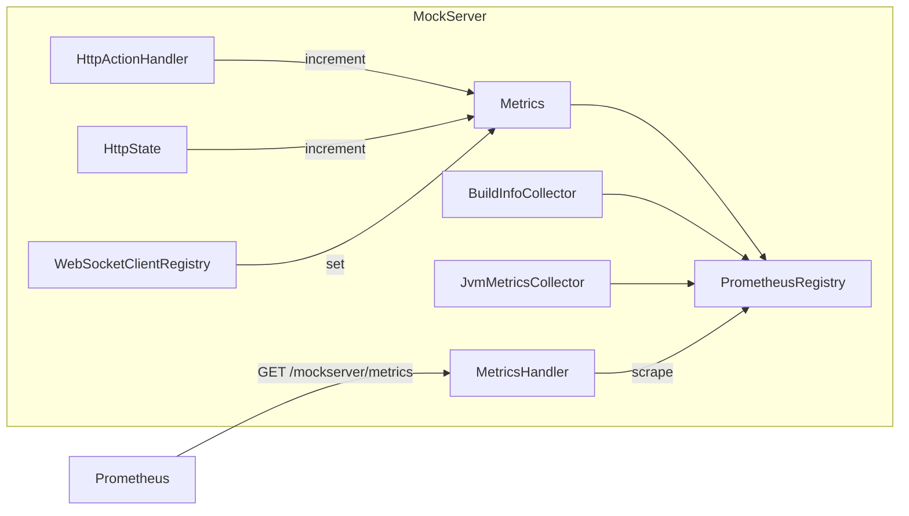

# Metrics & Monitoring

## Prometheus Metrics

MockServer exposes Prometheus-compatible metrics when the `metricsEnabled` configuration property is set to `true`. Metrics are served at the `/mockserver/metrics` endpoint in Prometheus text exposition format.

### Architecture



### Configuration

| Property | Default | Description |
|----------|---------|-------------|
| `metricsEnabled` | `false` | Enable Prometheus metrics collection and the `/mockserver/metrics` endpoint |

When metrics are disabled, the scrape endpoint returns a `404 Not Found` response.

### Metric Names

The `Metrics.Name` enum defines 24 request/action/websocket gauges (all Prometheus `Gauge` type); separate collectors add the build-info and JVM-runtime metrics described below:

#### Request & Expectation Matching

| Metric Name | Description |
|-------------|-------------|
| `requests_received_count` | Total requests received |
| `expectations_not_matched_count` | Requests that did not match any expectation |
| `response_expectations_matched_count` | Requests matched to a response expectation |
| `forward_expectations_matched_count` | Requests matched to a forward expectation |

#### Action Execution (one per action type)

| Metric Name | Description |
|-------------|-------------|
| `forward_actions_count` | Forward actions executed |
| `forward_template_actions_count` | Forward template actions executed |
| `forward_class_callback_actions_count` | Forward class callback actions executed |
| `forward_object_callback_actions_count` | Forward object callback actions executed |
| `forward_replace_actions_count` | Forward replace (override) actions executed |
| `response_actions_count` | Response actions executed |
| `response_template_actions_count` | Response template actions executed |
| `response_class_callback_actions_count` | Response class callback actions executed |
| `response_object_callback_actions_count` | Response object callback actions executed |
| `sse_response_actions_count` | SSE (server-sent events) response actions executed |
| `llm_response_actions_count` | LLM response actions executed |
| `llm_chaos_injected_count` | LLM chaos faults injected |
| `websocket_response_actions_count` | WebSocket response actions executed |
| `grpc_stream_response_actions_count` | gRPC stream response actions executed |
| `binary_response_actions_count` | Binary response actions executed |
| `dns_response_actions_count` | DNS response actions executed |
| `error_actions_count` | Error actions executed |

#### WebSocket Callbacks

| Metric Name | Description |
|-------------|-------------|
| `websocket_callback_clients_count` | Active WebSocket callback client connections |
| `websocket_callback_response_handlers_count` | Registered response callback handlers |
| `websocket_callback_forward_handlers_count` | Registered forward callback handlers |

### Build Info Metric

`BuildInfoCollector` registers a `mock_server_build_info` gauge with labels:

| Label | Description |
|-------|-------------|
| `version` | Full version (e.g. `7.0.0`) |
| `major_minor_version` | Major.minor version (e.g. `6.1`) |
| `group_id` | Maven group ID (`org.mock-server`) |
| `artifact_id` | Maven artifact ID (`mockserver-netty`) |
| `git_hash` | Abbreviated git commit hash the build was produced from, or `unknown` when no git metadata is available |

### JVM Runtime Metrics

`JvmMetricsCollector` registers JVM process-health gauges (read fresh from JDK `java.lang.management` MX beans on each scrape — no extra dependency). Registered once alongside `BuildInfoCollector` when `metricsEnabled`:

| Metric Name | Labels | Description |
|-------------|--------|-------------|
| `jvm_memory_used_bytes` | `area` = `heap` / `nonheap` | Memory currently used |
| `jvm_memory_committed_bytes` | `area` | Memory committed by the JVM |
| `jvm_memory_max_bytes` | `area` | Max memory (`-1` if undefined) |
| `jvm_threads_current` | — | Live thread count |
| `jvm_threads_daemon` | — | Daemon thread count |
| `jvm_gc_collection_count` | — | Total GC collections across all collectors |
| `jvm_gc_collection_seconds_sum` | — | Total GC time across all collectors (seconds) |

These let Grafana and the dashboard Metrics view chart heap/GC/thread behaviour alongside the request and action counters.

> **Perf-regression sampler dependency:** `perf-test-run.sh` (the performance regression pipeline's run step) scrapes `/mockserver/metrics` every 5 seconds during a growth run and reads exactly these three series by name: `jvm_memory_used_bytes{area="heap"}`, `jvm_gc_collection_seconds_sum`, and `jvm_threads_current`. If these metric names change, `perf-test-run.sh` must be updated in the same commit.

### Request Latency Histogram

`mock_server_request_duration_seconds` is a Prometheus classic histogram of request handling duration (receipt → response), with buckets from 0.5 ms to 10 s. It exposes the usual `_bucket{le="…"}`, `_sum`, and `_count` series, so Grafana/PromQL can derive latency percentiles, e.g.:

```promql
histogram_quantile(0.95, sum by (le) (rate(mock_server_request_duration_seconds_bucket[1m])))
```

It is registered (once) when `metricsEnabled`. Timing is captured per `NettyResponseWriter` (one is created per request, so there is no cross-request race) and **only when metrics are enabled** — `Metrics.observeRequestDurationSeconds(...)` is a no-op otherwise, so the request hot path pays nothing when metrics are off.

### HTTP Chaos Fault Counter

`mock_server_http_chaos_injected_total` is a Prometheus `Counter` with a `fault_type` label (values: `"drop"`, `"error"`, `"latency"`, `"truncate"`, `"malformed"`, `"slow"`, `"quota"`, `"graphql"`) that tracks every HTTP chaos fault injected by the chaos profile subsystem. It is registered once when `metricsEnabled` is `true`.

| Label Value | Incremented When |
|-------------|------------------|
| `drop` | A chaos profile drops the TCP connection without sending any response |
| `error` | A chaos profile injects an HTTP error status instead of the normal response |
| `latency` | A chaos profile injects artificial latency into a response |
| `truncate` | A chaos profile truncates the response body |
| `malformed` | A chaos profile emits a malformed/corrupted response |
| `slow` | A chaos profile drip-feeds the response slowly (chunk delay) |
| `quota` | A chaos profile returns a quota/rate-limit fault once the limit in a window is exceeded |
| `graphql` | A chaos profile injects a GraphQL-shaped error response |

`Metrics.incrementHttpChaosInjected(faultType)` is a static no-op when metrics are disabled (the counter is `null`). This counter is surfaced on the dashboard Metrics view as an "HTTP Chaos Faults" section (visible only when the metric is present and has non-zero data).

Example PromQL:

```promql
rate(mock_server_http_chaos_injected_total{fault_type="error"}[5m])
```

### Active Service-Scoped Chaos Gauge

`mock_server_active_service_chaos` is a Prometheus `GaugeWithCallback` with a `fault_type` label (values: `drop`, `error`, `latency`, `truncate`, `malformed`, `slow`, `quota`, `graphql`) reporting, per fault type, the number of currently-active service-scoped chaos profiles (`ServiceChaosRegistry`) configured with that fault. A profile carrying several faults counts under each, so the per-type series can be charted by type. (`slow` and `quota` require their companion fields — chunk-delay, and limit + window — to be counted, matching when they actually fire.) It is a *callback* gauge — the callback reads `Metrics.getActiveServiceChaosCountByFaultType()` → `ServiceChaosRegistry.getInstance().activeCountByFaultType()` at scrape time rather than tracking the value imperatively, so TTL auto-revert (which removes a profile without any `put`/`remove` call) is reflected without extra plumbing. Every fault type is always present (0 when none), giving a stable, complete set of series. It is registered once when `metricsEnabled` is `true`; the counts drop to 0 as profiles are cleared or their TTLs lapse, which makes `sum(mock_server_active_service_chaos) > 0` a natural "chaos still live" alert.

Both chaos metrics are also mirrored over OTLP by `OtelMetricsExporter` (`registerChaosCounter` / `registerActiveServiceChaosGauge`) so OTLP-only consumers can observe them without a Prometheus scrape.

### Async Message Counters

Two Prometheus `Counter`s track broker message flow for the optional `mockserver-async` (AsyncAPI broker-mocking) module, each labelled by `channel` (the broker topic/channel). Both are registered once when `metricsEnabled` is `true`.

| Metric Name | Incremented When |
|-------------|------------------|
| `mock_server_async_messages_published_total` | MockServer publishes an example message to a broker — one increment per message in `AsyncApiMockOrchestrator.publishAll()` (covers both publish-on-load and scheduled publishing) |
| `mock_server_async_messages_consumed_total` | MockServer records a message consumed from a broker subscription — one increment per message in the `KafkaMessageSubscriber` / `MqttMessageSubscriber` record path |

`mockserver-async` depends on `mockserver-core` (optional scope) and calls the static `Metrics.incrementAsyncMessagePublished(channel)` / `Metrics.incrementAsyncMessageConsumed(channel)` methods directly; both are null-safe no-ops when metrics are disabled, so the async hot paths pay nothing when metrics are off. These counters only move when a real broker is connected (`brokerConfig` with `kafkaBootstrapServers`/`mqttBrokerUrl`); a broker-less spec load leaves them at zero.

The dashboard **Metrics** view renders these on a dedicated **"Async message activity (cumulative)"** chart — kept separate from the HTTP **"HTTP request activity"** chart because broker message counts and HTTP request counts have different semantics. The two series (Published, Consumed) are summed across all channels client-side via `gaugeSeriesSum`; the panel is hidden until at least one async counter has data.

### How Metrics Are Incremented

- `HttpActionHandler` calls `metrics.increment(action.getType())` after dispatching each action, which maps the `Action.Type` enum to the corresponding `*_ACTIONS_COUNT` gauge
- `HttpState` increments `REQUESTS_RECEIVED_COUNT` on each request and `EXPECTATIONS_NOT_MATCHED_COUNT` when no expectation matches
- `WebSocketClientRegistry` calls `metrics.set()` to update WebSocket client and handler counts
- `Metrics.clear()` resets all gauges to zero (called during server reset)

### Scrape Endpoint

`MetricsHandler` serves the `/mockserver/metrics` endpoint. It uses `ExpositionFormats` to render all registered metrics from `PrometheusRegistry.defaultRegistry`, respecting the client's `Accept` header for content negotiation.

## Memory Monitoring

`MemoryMonitoring` provides CSV-based memory usage tracking, enabled via the `outputMemoryUsageCsv` configuration property.

### Configuration

| Property | Default | Description |
|----------|---------|-------------|
| `outputMemoryUsageCsv` | `false` | Enable memory usage CSV output |
| `memoryUsageCsvDirectory` | `.` | Directory for CSV output files |

### How It Works

`MemoryMonitoring` implements both `MockServerLogListener` and `MockServerMatcherListener`. It receives notifications when log entries are added or expectations change, and writes memory statistics to a CSV file (named `memoryUsage_YYYY-MM-DD.csv`) every 50 updates.

### CSV Columns

| Column | Description |
|--------|-------------|
| `mockServerPort` | Server port |
| `eventLogSize` | Current log entry count |
| `maxLogEntries` | Configured max log entries |
| `expectationsSize` | Current expectation count |
| `maxExpectations` | Configured max expectations |
| `heapInitialAllocation` | JVM heap initial allocation (bytes) |
| `heapUsed` | JVM heap used (bytes) |
| `heapCommitted` | JVM heap committed (bytes) |
| `heapMaxAllowed` | JVM heap max allowed (bytes) |
| `nonHeapInitialAllocation` | JVM non-heap initial allocation (bytes) |
| `nonHeapUsed` | JVM non-heap used (bytes) |
| `nonHeapCommitted` | JVM non-heap committed (bytes) |
| `nonHeapMaxAllowed` | JVM non-heap max allowed (bytes) |

## Key Classes

| Class | Module | Path |
|-------|--------|------|
| `Metrics` | mockserver-core | `org.mockserver.metrics.Metrics` |
| `Metrics.Name` | mockserver-core | `org.mockserver.metrics.Metrics.Name` (enum) |
| `MetricsHandler` | mockserver-core | `org.mockserver.metrics.MetricsHandler` |
| `BuildInfoCollector` | mockserver-core | `org.mockserver.metrics.BuildInfoCollector` |
| `JvmMetricsCollector` | mockserver-core | `org.mockserver.metrics.JvmMetricsCollector` |
| `MemoryMonitoring` | mockserver-core | `org.mockserver.memory.MemoryMonitoring` |
| `Summary` | mockserver-core | `org.mockserver.memory.Summary` |
| `Detail` | mockserver-core | `org.mockserver.memory.Detail` |

## Dependencies

| GroupId | ArtifactId | Version | Purpose |
|---------|-----------|---------|---------|
| `io.prometheus` | `prometheus-metrics-core` | 1.7.0 | Prometheus client library (Gauge, MultiCollector, PrometheusRegistry) |
| `io.prometheus` | `prometheus-metrics-exposition-formats` | 1.7.0 | Prometheus exposition format writers |
| `io.prometheus` | `prometheus-metrics-model` | 1.7.0 | Prometheus metric snapshots and labels |
