# Netty Pipeline & Protocol Handling

## Server Bootstrap

The server is started from `Main.java` (CLI) or `ClientAndServer` (embedded). Both create a `MockServer` instance which extends `LifeCycle`.

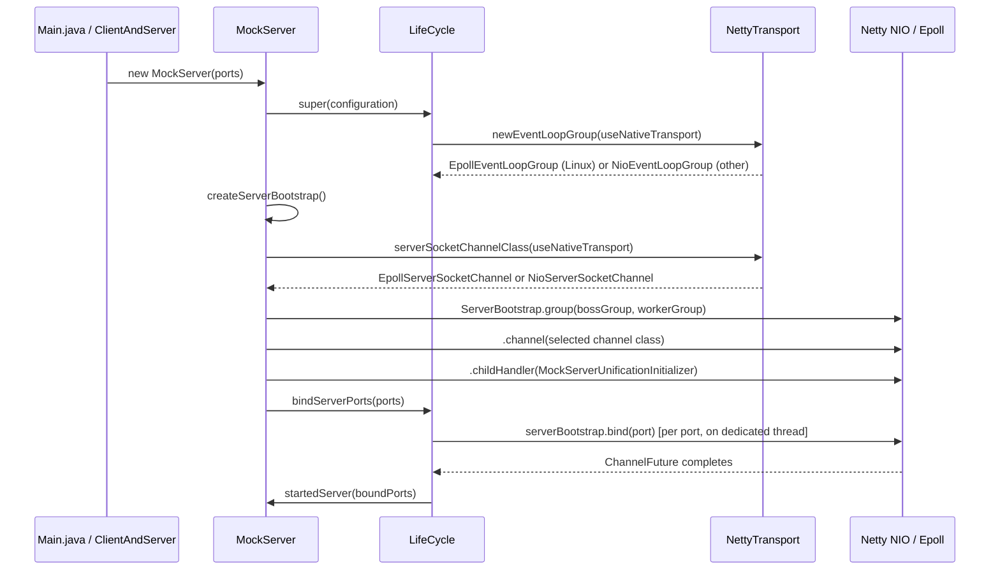

### Transport Selection

`NettyTransport` (`mockserver-core`, `org.mockserver.socket`) selects the highest-performance transport available at startup. On Linux with the native epoll library present and `useNativeTransport=true` (the default), it creates `EpollEventLoopGroup` and uses `EpollServerSocketChannel` / `EpollSocketChannel`. On all other platforms (macOS, Windows) or when the opt-out flag is set, it falls back to NIO transparently.

The transport selection is consistent across the entire data path: server bootstrap (boss + worker groups), outbound HTTP client (`NettyHttpClient`), and relay connect handler (`RelayConnectHandler`). This ensures the EventLoopGroup type always matches the channel type (epoll group with epoll channels, NIO group with NIO channels).

Epoll transport is required for transparent-proxy `SO_ORIGINAL_DST` resolution, which needs `EpollSocketChannel` children to extract the raw file descriptor.

**Intentionally left on NIO:** `Http3Server` (QUIC/datagram, separate experimental transport with its own `NioEventLoopGroup`), `McpToolRegistry`'s internal client, and `EchoServer` (test infrastructure).

| Property | Default | Env var | System property |
|----------|---------|---------|-----------------|
| `useNativeTransport` | `true` | `MOCKSERVER_USE_NATIVE_TRANSPORT` | `-Dmockserver.useNativeTransport` |

#### CI Test Coverage

On Linux CI the **full existing integration-test suite** exercises the epoll transport automatically because:

1. `useNativeTransport` defaults to `true`
2. The `netty-transport-native-epoll` JARs (linux-x86_64, linux-aarch_64) are declared as `runtime`-scoped dependencies in `mockserver-netty/pom.xml`, which Maven includes on the test classpath
3. On Linux the native `.so` loads successfully, so `Epoll.isAvailable()` returns `true`

To force NIO on Linux for comparison testing, set `useNativeTransport=false` via system property (`-Dmockserver.useNativeTransport=false`) or environment variable (`MOCKSERVER_USE_NATIVE_TRANSPORT=false`).

Dedicated activation tests in `EpollTransportIntegrationTest` (`mockserver-netty`) verify the channel and event-loop-group types at runtime. These tests are gated by `Assume.assumeTrue(Epoll.isAvailable())` and skip cleanly on macOS/Windows.

### Key Bootstrap Configuration

| Setting | Value | Purpose |
|---------|-------|---------|
| Boss group | `EpollEventLoopGroup(5)` or `NioEventLoopGroup(5)` | Accept connections |
| Worker group | `EpollEventLoopGroup(configurable)` or `NioEventLoopGroup(configurable)` | Handle I/O |
| Channel | `EpollServerSocketChannel` or `NioServerSocketChannel` | Server socket (transport-matched) |
| SO_BACKLOG | 1024 | Connection queue depth |
| AUTO_READ | true | Automatic read on new channels |
| ALLOCATOR | `PooledByteBufAllocator.DEFAULT` | Memory-efficient buffer allocation |
| WRITE_BUFFER_WATER_MARK | 8KB - 32KB | Backpressure control |

### Channel Attributes

| Attribute | Type | Purpose |
|-----------|------|---------|
| `REMOTE_SOCKET` | `InetSocketAddress` | Remote proxy target (port-forwarding mode) |
| `PROXYING` | `Boolean` | Whether channel is in proxy mode |
| `TLS_ENABLED_UPSTREAM` | `Boolean` | TLS active on client side |
| `TLS_ENABLED_DOWNSTREAM` | `Boolean` | TLS needed for upstream connections |
| `HTTP_ENABLED` | `Boolean` | HTTP pipeline configured |
| `HTTP2_ENABLED` | `Boolean` | HTTP/2 pipeline configured |
| `TRANSPARENT_ORIGINAL_DST_RESOLVED` | `Boolean` | Whether original-dst was resolved (conntrack/PROXY protocol) |
| `NETTY_SSL_CONTEXT_FACTORY` | `NettySslContextFactory` | SSL context for this channel |

## Channel Initializer

`MockServerUnificationInitializer` is a `@Sharable` `ChannelHandlerAdapter` that replaces itself with a `PortUnificationHandler` on `handlerAdded()`. This thin adapter ensures each new channel gets its own `PortUnificationHandler` instance (since the decoder maintains per-channel state).

When `transparentProxyEnabled` is true, the initializer adds two handlers before the port unification handler:

1. **`ProxyProtocolOriginalDestinationHandler`** (`"proxy-protocol"`) — inspects the first inbound bytes for a PROXY protocol header, dispatching on the first byte: `0x0D` → v2 (binary), `'P'` → v1 (text). If a recognised header is found, sets `REMOTE_SOCKET` + `PROXYING` + `TRANSPARENT_ORIGINAL_DST_RESOLVED` (v2: for the PROXY command on INET/INET6; LOCAL/UNIX defer to downstream resolution), consumes the header bytes, and removes itself. If not found, removes itself and passes bytes through unchanged.
2. **`TransparentProxyHandler`** (`"transparent-proxy"`) — fires at `channelActive` and runs the pluggable `CompositeOriginalDestinationResolver` chain (default: TPROXY → eBPF → SO_ORIGINAL_DST → conntrack → dns-intent). Skips resolution if `TRANSPARENT_ORIGINAL_DST_RESOLVED` is already set (e.g., by the PROXY protocol handler).

### Original Destination Resolver Chain

`CompositeOriginalDestinationResolver.defaultChain(Configuration)` tries strategies in order (first non-null wins):

| Order | Strategy | Class | Notes |
|-------|----------|-------|-------|
| 1 | TPROXY (IP_TRANSPARENT) | `TproxyOriginalDestinationResolver` | Returns `channel.localAddress()` when `transparentProxyTproxy=true`; null otherwise |
| 2 | eBPF socket metadata | `EbpfOriginalDestinationResolver` | O(1) BPF hash-map lookup; requires Linux + `CAP_BPF` + external cgroup BPF program; enabled via `transparentProxyEbpf=true` |
| 3 | SO_ORIGINAL_DST getsockopt | `SoOriginalDstResolver` | O(1) JNA `getsockopt`; requires Linux + Netty epoll transport |
| 4 | Linux conntrack table | `ConntrackOriginalDestinationResolver` | O(n) conntrack table scan; fallback when SO_ORIGINAL_DST is unavailable |
| 5 | DNS-intent (recover hostname MockServer's DNS answered) | `DnsIntentOriginalDestinationResolver` | Consults `DnsIntentRegistry`; last resort when all others return null |

The DNS-intent resolver consults `DnsIntentRegistry` (`mockserver-core`, `org.mockserver.mock.dns`), which records the `answeredIP → hostname` mappings MockServer's own DNS server hands out (A/AAAA answers). When a connection arrives at such an IP and all earlier strategies return null, the resolver returns an *unresolved* `InetSocketAddress` carrying the recovered hostname, so downstream forwarding/matching works by name (loop-prevention guards against a DNS-to-self loop). The registry is cleared by `HttpState.reset()`.

Note: PROXY protocol is handled separately in the pipeline (it reads bytes, not channel metadata).

## Port Unification Handler

`PortUnificationHandler` extends Netty's `ReplayingDecoder<Void>` and is **the heart of protocol detection**. It inspects the first bytes of every connection and routes to the appropriate protocol pipeline.

### Protocol Detection Order

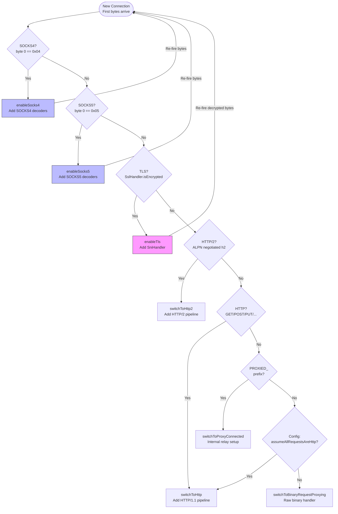

**Recursive detection**: When TLS or SOCKS is detected, the handler adds protocol-specific decoders, re-fires the bytes through the pipeline, and runs detection again on the decoded data. This enables arbitrary nesting (e.g., SOCKS5 → TLS → HTTP/2).

### Connection Delay

A configurable connection delay can be applied before protocol detection begins. When `connectionDelayMillis` is set to a non-zero value, `PortUnificationHandler.decode()` sleeps for the configured duration before inspecting the first bytes. This simulates slow connection establishment for testing timeout handling in clients.

Configuration: `ConfigurationProperties.connectionDelayMillis(long millis)`, system property `mockserver.connectionDelayMillis`, environment variable `MOCKSERVER_CONNECTION_DELAY_MILLIS`. Default: 0 (no delay).

**Warning:** The delay blocks the Netty I/O thread. For large delays or high connection rates, this may impact server throughput.

### TCP Chaos Handler

When TCP-layer chaos is active (at least one host registered in `TcpChaosRegistry`), a `TcpChaosHandler` is inserted at the front of the pipeline before HTTP codecs. This handler operates on raw `ByteBuf` data and can inject transport-layer faults that mirror Toxiproxy's named toxics:

| Fault Type | Field | Behaviour |
|-----------|-------|-----------|
| latency | `latencyMs` | Delays all inbound data by the configured milliseconds |
| down | `down` | Silently drops all inbound data (service appears down) |
| bandwidth | `bandwidthBytesPerSec` | Throttles inbound data to the configured bytes/sec |
| slow_close | `slowClose` | Delays the TCP FIN by 2 seconds on close |
| timeout | `timeout` | Never sends FIN; connection hangs on close |
| reset_peer | `resetPeer` | Sends TCP RST and closes immediately |
| slicer | `slicerChunkSize` | Fragments inbound data into chunks of the configured size |
| limit_data | `limitDataBytes` | Closes the connection after the configured bytes received |

The handler is **not sharable** (each channel gets its own instance) because it maintains per-connection state (`bytesConsumed` for `limitData`).

Profiles are managed via the REST API:

- `PUT /mockserver/tcpChaos` -- register, remove, or clear TCP chaos profiles
- `GET /mockserver/tcpChaos` -- list all active TCP chaos profiles
- `PATCH /mockserver/tcpChaos` -- merge-patch an existing profile

Profiles support optional TTL-based auto-expiry (dead-man's switch), identical to the `ServiceChaosRegistry` pattern.

### Protocol-Specific Pipelines

#### HTTP/1.1 Pipeline

```mermaid
graph LR
    TCH["TcpChaosHandler
(conditional)"] --> A[HttpServerCodec]
    A --> B[PreserveHeadersNettyRemoves]
    B --> C[HttpContentDecompressor]
    C --> D[HttpContentLengthRemover]
    D --> EMH[EarlyMatchingHandler]
    EMH --> E[HttpObjectAggregator]
    E --> F[CallbackWebSocketServerHandler]
    F --> G[DashboardWebSocketHandler]
    G --> MCP["McpStreamableHttpHandler
(conditional)"]
    MCP --> H[MockServerHttpServerCodec]
    H --> I[HttpRequestHandler]
```

| Handler | Class | Purpose |
|---------|-------|---------|
| TcpChaosHandler | `o.m.netty.unification` | (Conditional) Injects TCP-layer faults (latency, down, bandwidth, slicer, etc.) on raw bytes before HTTP decoding. Only added when `TcpChaosRegistry` has active entries |
| HttpServerCodec | Netty built-in | HTTP/1.1 request decoding / response encoding |
| PreserveHeadersNettyRemoves | `o.m.codec` | Preserves `Content-Encoding`/`Transfer-Encoding` headers that the downstream `HttpContentDecompressor`/`HttpObjectAggregator` strip (reset per request so they cannot leak across a pooled connection — issue #2322). Also captures the original (still compressed) request body bytes before decompression onto a channel attribute, so the decompressed body and the original on-the-wire bytes are both available (issue #2326) |
| HttpContentDecompressor | Netty built-in | Decompresses gzipped request bodies. The original compressed bytes are still preserved by `PreserveHeadersNettyRemoves` above and exposed via `HttpRequest#getBodyAsOriginalRawBytes()` |
| HttpContentLengthRemover | `o.m.netty.unification` | Strips empty Content-Length headers |
| EarlyMatchingHandler | `o.m.netty.unification` | On the first `HttpRequest` (headers only), checks for an expectation with `respondBeforeBody=true` whose matcher has no body component. If found, dispatches the response (and any close) and discards remaining `HttpContent`, so the response can be sent before the body is read. Reproduces scenarios like okhttp/okhttp#1001 (issue #1831). Skipped for `CONNECT` and HTTP/2 |
| HttpObjectAggregator | Netty built-in | Aggregates HTTP chunks into `FullHttpRequest` |
| CallbackWebSocketServerHandler | `o.m.netty.websocketregistry` | Intercepts `/_mockserver_callback_websocket` |
| DashboardWebSocketHandler | `o.m.dashboard` | Intercepts `/_mockserver_ui_websocket` |
| McpStreamableHttpHandler | `o.m.netty.mcp` | Intercepts `/mockserver/mcp` for MCP (Model Context Protocol) Streamable HTTP transport. Only added when `ConfigurationProperties.mcpEnabled()` is true. POST requests are offloaded to a dedicated executor (`McpSessionManager.getExecutor()`) to avoid blocking the Netty event loop during blocking tool calls (e.g., `Future.get()`) |
| MockServerHttpServerCodec | `o.m.codec` | Converts Netty HTTP ↔ MockServer model |
| HttpRequestHandler | `o.m.netty` | Main request processing |

#### HTTP/2 Pipeline

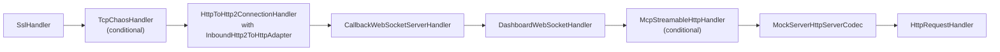

HTTP/2 frames are converted to HTTP/1.1 objects via `InboundHttp2ToHttpAdapter`, allowing the same `HttpRequestHandler` to process both protocols uniformly. When MCP is enabled (`ConfigurationProperties.mcpEnabled()`), the `McpStreamableHttpHandler` is also inserted in the HTTP/2 pipeline.

#### gRPC Pipeline (over HTTP/2)

When gRPC is enabled and the `GrpcProtoDescriptorStore` has loaded services, two additional handlers are inserted into both the h2c and TLS-negotiated HTTP/2 pipelines:

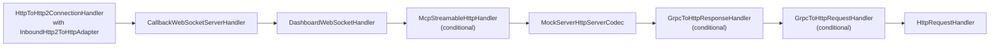

| Handler | Class | Purpose |
|---------|-------|---------|
| GrpcToHttpResponseHandler | `o.m.netty.grpc` | Outbound encoder — intercepts responses with `x-grpc-service` header, encodes JSON body back to gRPC-framed protobuf, appends `grpc-status` trailers; also converts gRPC-Web responses (trailers-in-body) when `x-grpc-web-content-type` header is present |
| GrpcToHttpRequestHandler | `o.m.netty.grpc` | Inbound handler — intercepts `application/grpc` requests, decodes protobuf body to JSON using descriptors, rewrites as `POST /<service>/<method>` with `x-grpc-*` headers; also translates `application/grpc-web*` requests to standard gRPC before processing |

The handlers are placed after `MockServerHttpServerCodec` so they operate on MockServer model objects (`HttpRequest`/`HttpResponse`), not raw Netty HTTP objects.

h2c (HTTP/2 cleartext) is detected by `isH2cPreface()` in `PortUnificationHandler`, which checks for the HTTP/2 connection preface (`PRI * HTTP/2.0\r\n\r\nSM\r\n\r\n`). Both `switchToH2c()` and `switchToHttp2()` conditionally wire gRPC handlers when descriptors are loaded. The `switchToHttp()` method also adds gRPC handlers to the HTTP/1.1 pipeline to support gRPC-Web over HTTP/1.1.

##### Multiplex Pipeline (default OFF)

When `grpcBidiStreamingEnabled` is `true` **and** gRPC descriptors are loaded, `switchToHttp2()` / `switchToH2c()` use an alternate HTTP/2 pipeline based on `Http2FrameCodec` + `Http2MultiplexHandler` instead of the connection-level `HttpToHttp2ConnectionHandler` + `InboundHttp2ToHttpAdapter`. Each HTTP/2 stream gets its own child channel initialized by `GrpcMultiplexChildInitializer`:

```mermaid
graph LR
    FC[Http2FrameCodec] --> MUX[Http2MultiplexHandler]
    MUX -->|per-stream child| SF["Http2StreamFrameToHttpObjectCodec\n(server=true)"]
    SF --> AGG[HttpObjectAggregator]
    AGG --> CB[CallbackWebSocketServerHandler]
    CB --> DASH[DashboardWebSocketHandler]
    DASH --> MCP["McpStreamableHttpHandler\n(conditional)"]
    MCP --> CODEC[MockServerHttpServerCodec]
    CODEC --> GRPC_RESP[GrpcToHttpResponseHandler]
    GRPC_RESP --> GRPC_REQ[GrpcToHttpRequestHandler]
    GRPC_REQ --> HANDLER[HttpRequestHandler]
```

`Http2StreamFrameToHttpObjectCodec` + `HttpObjectAggregator` re-aggregate inbound stream frames into `FullHttpRequest` objects, so the downstream handler chain sees the same objects as the connection-level adapter produces. This means inbound behaviour is byte-for-byte equivalent to the default pipeline for unary RPCs. The flag defaults to `false`; when off, the existing connection-level adapter path is used unchanged.

**Server-streaming:** `GrpcStreamResponseActionHandler` writes raw Netty HTTP objects (`DefaultHttpResponse`, per-message `DefaultHttpContent`, `DefaultLastHttpContent` with grpc-status/grpc-message trailers) directly to the `ChannelHandlerContext`. On the multiplex path, `Http2StreamFrameToHttpObjectCodec` is bidirectional and converts these outbound objects to HTTP/2 stream frames: initial HEADERS (with `Transfer-Encoding: chunked` automatically stripped by `HttpConversionUtil`), per-message DATA frames (byte-for-byte identical gRPC framing), and a trailing HEADERS frame with `grpc-status`/`grpc-message` and `endStream=true`. The `MockServerHttpServerCodec` encoder and `GrpcToHttpResponseHandler` do not intercept raw Netty objects (they only match `org.mockserver.model.HttpResponse`), so the objects pass through cleanly. No production code changes were needed -- the codec handles everything correctly.

| Property | Default | Env var | System property |
|----------|---------|---------|-----------------|
| `grpcBidiStreamingEnabled` | `false` | `MOCKSERVER_GRPC_BIDI_STREAMING_ENABLED` | `mockserver.grpcBidiStreamingEnabled` |

**Client-streaming (collect-then-respond):** For client-streaming RPCs, a client sends HEADERS followed by N DATA frames (each containing a gRPC length-prefixed message) then END_STREAM. On the multiplex path, `Http2StreamFrameToHttpObjectCodec` + `HttpObjectAggregator` re-aggregate all DATA frame bytes into a single `FullHttpRequest` body (byte-for-byte concatenation). `GrpcToHttpRequestHandler.convertGrpcRequest()` then decodes the concatenated body via `GrpcFrameCodec.decode()` into N messages, producing a JSON array body with the `x-grpc-client-streaming: true` header. This is identical to how the connection-level adapter handles client-streaming. Single-message requests (unary) decode as a single JSON object with no client-streaming header, preserving the distinction. No production code changes were needed -- the existing re-aggregation + decode pipeline handles this correctly.

Phase 3 will add true interleaved/reactive bidirectional streaming by removing the inbound re-aggregation and handling individual DATA frames with per-inbound-message reactive responses.

#### TLS Pipeline

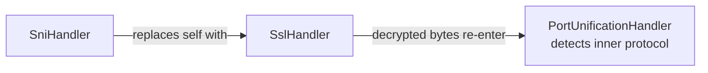

`SniHandler` (in `mockserver-core`) extends Netty's `AbstractSniHandler`. It extracts the hostname from the TLS ClientHello SNI extension, dynamically generates a certificate with that hostname as a Subject Alternative Name, and negotiates ALPN (HTTP/1.1 or HTTP/2).

#### SOCKS4 Pipeline

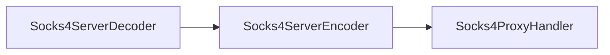

#### SOCKS5 Pipeline

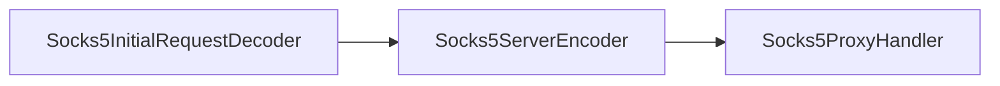

SOCKS5 is multi-phase: initial handshake → optional password auth → CONNECT command.

## Streaming Relay

When `streamingResponsesEnabled` is `true` (default), the `HttpObjectAggregator` in the **forward-path client pipeline** (inside `NettyHttpClient`) and in the relay pipelines inside `RelayConnectHandler` is replaced by `StreamingAwareHttpObjectAggregator`.

`StreamingAwareHttpObjectAggregator` is a subclass of `HttpObjectAggregator` (`mockserver-core` `org.mockserver.codec`). It inspects the first response head:

- **Non-streaming response** (does not have `Content-Type: text/event-stream`): delegates to `super` — behaviour is byte-for-byte identical to before. Ordinary chunked responses without SSE content type are always aggregated normally.
- **Streaming response**: removes itself from the pipeline and installs `StreamingResponseRelayHandler` in its place, positioned before `MockServerHttpClientCodec`. The relay handler then processes unaggregated `HttpObject` events.

### StreamingResponseRelayHandler

`StreamingResponseRelayHandler` (`mockserver-core` `org.mockserver.httpclient`) is a `ChannelInboundHandler` that consumes the raw `HttpObject` stream from the upstream server:

| Event | Action |
|-------|--------|
| `HttpResponse` (head) | Builds a head-only `org.mockserver.model.HttpResponse` with a `StreamingBody` sink. Completes `RESPONSE_FUTURE` immediately. |
| `HttpContent` | Forwards the chunk to the downstream (client) channel. Appends to `StreamingBody` capture buffer (bounded to `maxStreamingCaptureBytes`). |
| `LastHttpContent` | Closes the sink. Signals `HttpActionHandler` to write the `FORWARDED_REQUEST` log entry using the captured bytes. |
| `channelInactive` (mid-stream) | Calls `onError` on the sink. Emits a `FORWARDED_REQUEST` log entry flagged as truncated/aborted. |

An `IdleStateHandler(0, 0, streamIdleTimeoutSeconds)` is added to the streaming channel so stalled upstream connections are detected without the fixed global socket timeout cutting live streams.

### StreamingBody

`StreamingBody` (`mockserver-core` `org.mockserver.model`) is a chunk sink used to bridge the Netty handler with `HttpResponse`. It holds:

- A `subscribe(onChunk, onComplete, onError)` API consumed by the server-side `NettyResponseWriter` to write chunks to the downstream client.
- A bounded byte capture buffer (`capturedBytes()`) with a `truncated` flag.

The server-side `NettyResponseWriter` checks `response.getStreamingBody() != null` and, when true, writes a `DefaultHttpResponse` head followed by `DefaultHttpContent` frames per chunk and `LastHttpContent.EMPTY_LAST_CONTENT` at stream end — mirroring the existing `HttpSseResponseActionHandler` pattern.

## Relay Connect Pattern

When HTTP CONNECT or SOCKS tunneling is established, MockServer uses a **self-loopback relay** rather than connecting directly to the target:

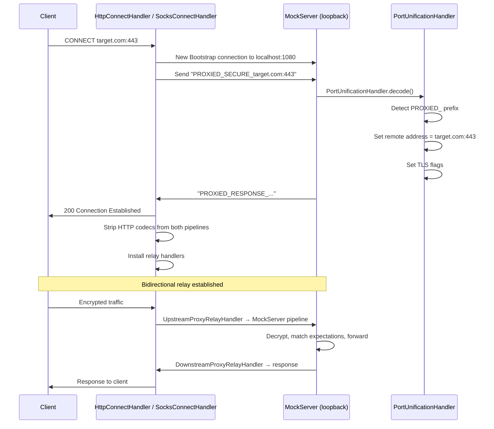

This pattern allows MockServer to:
- Intercept and log tunneled HTTPS traffic
- Match expectations against tunneled requests
- Generate dynamic TLS certificates for the target hostname

### IPv6 Support

The relay connect protocol and CONNECT handler support IPv6 addresses in bracket notation (e.g., `[::1]:443`, `[2001:db8::1]:8443`). Host:port parsing uses `HttpRequest.splitHostPort()` which correctly handles both IPv4 and IPv6 formats.

The local address detection (`calculateLocalAddresses()`) explicitly includes `127.0.0.1` and `localhost`, plus the bound interface address (via `InetAddress.getHostAddress()`), which may include IPv6 addresses depending on the network configuration. This ensures requests sent to MockServer's bound address are correctly identified as control-plane requests rather than proxy targets.

### Relay Handler Hierarchy

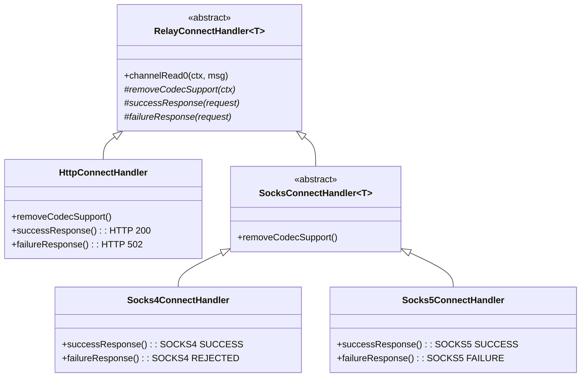

### Relay Data Flow

Once the relay is established, two handler pairs shuttle data:

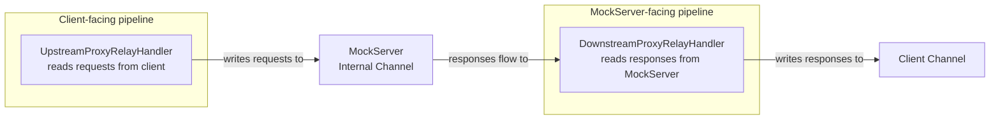

### Relay Protocol Selection (HTTP/1.1 vs HTTP/2)

`RelayConnectHandler.configurePipelines()` builds both relay pipelines to match the protocol
negotiated with the proxy client (`http2EnabledDownstream`, derived from the proxy-client TLS
ALPN result):

- the **client-facing** pipeline uses an `HttpToHttp2ConnectionHandler` when the client negotiated
  HTTP/2, otherwise an `HttpServerCodec`;
- the **internal loopback** pipeline mirrors that choice — a client-mode `HttpToHttp2ConnectionHandler`
  for HTTP/2, otherwise an `HttpClientCodec` — and its client TLS context advertises `h2` via ALPN
  only when the loopback codec is HTTP/2.

Keeping the loopback's TLS layer and codec in agreement makes the relay a transparent passthrough.
Before this was fixed, the loopback hard-wired an HTTP/1.1 codec while its TLS could negotiate
`h2`, so HTTP/2 requests through the CONNECT proxy were never decoded and hung (#2260).

When the `http2Enabled` configuration property is `false`, `NettySslContextFactory` never advertises
`h2` via ALPN and `PortUnificationHandler` ignores the h2c cleartext preface, so every connection —
direct or relayed — falls back to HTTP/1.1.

## DNS UDP Server

When `dnsEnabled=true`, `MockServer.bindDnsPort()` creates a separate Netty `Bootstrap` with `NioDatagramChannel` for UDP DNS:

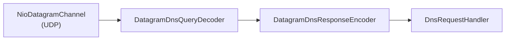

| Handler | Class | Purpose |
|---------|-------|---------|
| DatagramDnsQueryDecoder | Netty built-in (`netty-codec-dns`) | Decodes UDP datagrams into `DatagramDnsQuery` |
| DatagramDnsResponseEncoder | Netty built-in (`netty-codec-dns`) | Encodes `DatagramDnsResponse` to UDP datagrams |
| DnsRequestHandler | `o.m.netty.dns` | Matches DNS queries against expectations via `HttpState`, returns `DnsResponse` records |

The DNS channel uses the same `workerGroup` as the TCP server. It is managed separately from TCP `serverChannelFutures` — closed explicitly in `MockServer.stopAsync()`.

## Binary Protocol Handling

When no known protocol is detected, `BinaryRequestProxyingHandler` handles the raw bytes. The handler first checks for matching expectations via `HttpState.firstMatchingExpectation(BinaryRequestDefinition)`. If a match with a `BinaryResponse` action is found, the response bytes are written directly to the channel. Otherwise, in proxy mode (when a remote address is configured on the channel), raw bytes are forwarded via `NettyHttpClient.sendRequest(BinaryMessage, ...)`:

- **Waiting mode**: Blocks until upstream response arrives, writes it back
- **Non-waiting mode**: Fire-and-forget with optional `BinaryProxyListener` callback. `BinaryProxyListener` (`o.m.model.BinaryProxyListener`) is a functional interface with `onProxy(BinaryMessage binaryRequest, CompletableFuture<BinaryMessage> binaryResponse, SocketAddress serverAddress, SocketAddress clientAddress)` invoked when binary data is proxied

## SOCKS Protocol Detection

`SocksDetector` provides static detection methods:

**SOCKS4 detection** (`isSocks4`):
- Byte 0 = `0x04` (version)
- Byte 1 = valid command (CONNECT or BIND)
- Validates null-terminated username (max 256 chars)
- Optionally validates SOCKS4a hostname

**SOCKS5 detection** (`isSocks5`):
- Byte 0 = `0x05` (version)
- Byte 1 = auth method count
- Each auth method is NO_AUTH, PASSWORD, or GSSAPI

**SOCKS5 handshake lifecycle**:

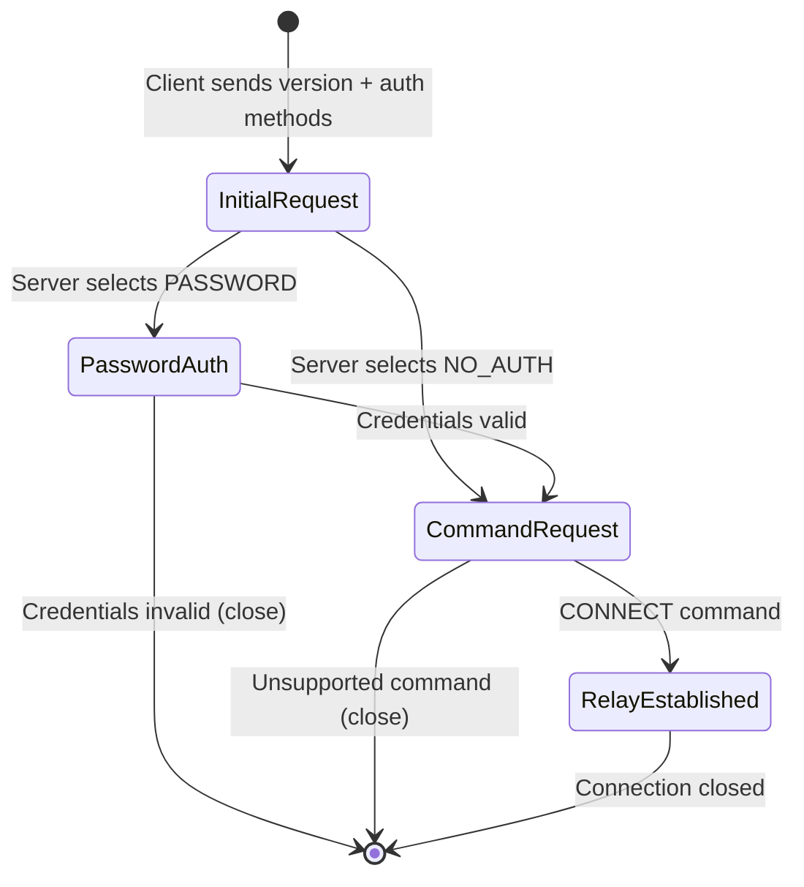

## Class Reference

| Class | File | Role |
|-------|------|------|
| `Main` | `mockserver-netty/.../cli/Main.java` | CLI entry point, argument parsing |
| `LifeCycle` | `mockserver-netty/.../lifecycle/LifeCycle.java` | Abstract server lifecycle (event loops, port binding, shutdown) |
| `MockServer` | `mockserver-netty/.../netty/MockServer.java` | Concrete server, configures `ServerBootstrap` |
| `MockServerUnificationInitializer` | `mockserver-netty/.../netty/MockServerUnificationInitializer.java` | Replaces self with `PortUnificationHandler` |
| `PortUnificationHandler` | `mockserver-netty/.../netty/unification/PortUnificationHandler.java` | Protocol detection and pipeline assembly |
| `HttpRequestHandler` | `mockserver-netty/.../netty/HttpRequestHandler.java` | Main request dispatcher |
| `NettyResponseWriter` | `mockserver-netty/.../netty/responsewriter/NettyResponseWriter.java` | Writes responses to Netty channels |
| `HttpConnectHandler` | `mockserver-netty/.../netty/proxy/connect/HttpConnectHandler.java` | HTTP CONNECT tunnel handler |
| `RelayConnectHandler` | `mockserver-netty/.../netty/proxy/relay/RelayConnectHandler.java` | Abstract relay establishment |
| `UpstreamProxyRelayHandler` | `mockserver-netty/.../netty/proxy/relay/UpstreamProxyRelayHandler.java` | Client → MockServer relay |
| `DownstreamProxyRelayHandler` | `mockserver-netty/.../netty/proxy/relay/DownstreamProxyRelayHandler.java` | MockServer → client relay |
| `BinaryRequestProxyingHandler` | `mockserver-netty/.../netty/proxy/BinaryRequestProxyingHandler.java` | Raw binary proxying |
| `SocksDetector` | `mockserver-netty/.../netty/proxy/socks/SocksDetector.java` | SOCKS4/5 protocol detection |
| `SocksProxyHandler` | `mockserver-netty/.../netty/proxy/socks/SocksProxyHandler.java` | Abstract SOCKS handler base |
| `Socks4ProxyHandler` | `mockserver-netty/.../netty/proxy/socks/Socks4ProxyHandler.java` | SOCKS4 CONNECT handling |
| `Socks5ProxyHandler` | `mockserver-netty/.../netty/proxy/socks/Socks5ProxyHandler.java` | SOCKS5 multi-phase handshake |
| `SocksConnectHandler` | `mockserver-netty/.../netty/proxy/socks/SocksConnectHandler.java` | Abstract SOCKS relay base |
| `SniHandler` | `mockserver-core/.../socket/tls/SniHandler.java` | TLS SNI extraction, dynamic cert generation |
| `HttpContentLengthRemover` | `mockserver-netty/.../netty/unification/HttpContentLengthRemover.java` | Strips empty Content-Length |
| `MockServerHttpServerCodec` | `mockserver-core/.../codec/MockServerHttpServerCodec.java` | Netty HTTP ↔ MockServer model codec |
| `GrpcToHttpRequestHandler` | `mockserver-netty/.../netty/grpc/GrpcToHttpRequestHandler.java` | gRPC request decode (protobuf→JSON); gRPC-Web translation |
| `GrpcToHttpResponseHandler` | `mockserver-netty/.../netty/grpc/GrpcToHttpResponseHandler.java` | gRPC response encode (JSON→protobuf); gRPC-Web re-framing |
| `GrpcWebTranslator` | `mockserver-core/.../grpc/GrpcWebTranslator.java` | gRPC-Web framing utilities (trailer frame, base64, content-type detection) |
| `DnsRequestHandler` | `mockserver-netty/.../netty/dns/DnsRequestHandler.java` | DNS query matching and response |
| `StreamingAwareHttpObjectAggregator` | `mockserver-core/.../codec/StreamingAwareHttpObjectAggregator.java` | Replaces `HttpObjectAggregator` in forward-path client pipelines; detects streaming responses and switches to `StreamingResponseRelayHandler` |
| `StreamingResponseRelayHandler` | `mockserver-core/.../httpclient/StreamingResponseRelayHandler.java` | Consumes unaggregated `HttpObject` events; relays chunks immediately; captures bounded body; signals `HttpActionHandler` on completion |
| `StreamingBody` | `mockserver-core/.../model/StreamingBody.java` | Chunk sink bridging relay handler to server-side response writer; holds bounded capture buffer |
| `AltSvcHeaderHandler` | `mockserver-netty/.../netty/unification/AltSvcHeaderHandler.java` | Outbound handler that adds `Alt-Svc` header to TCP responses when HTTP/3 is enabled; does not clobber user-set values |
