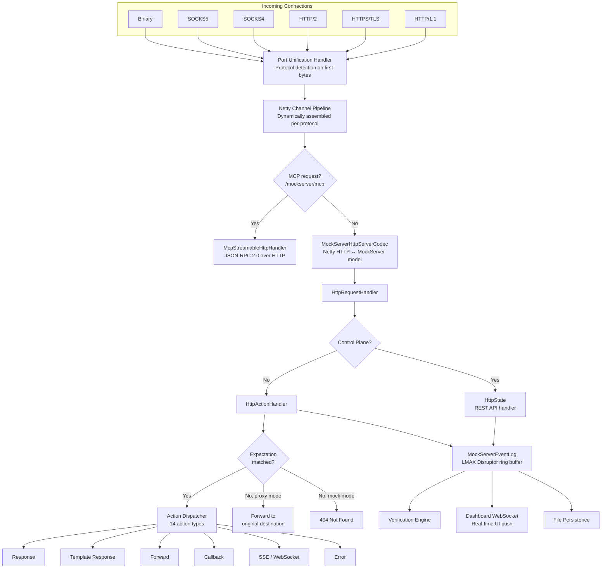
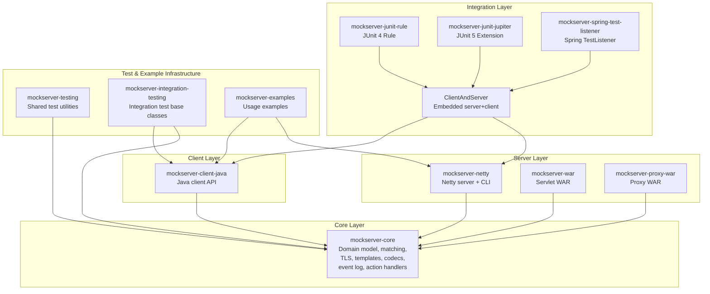

# Code Architecture Overview

## Monorepo Structure

MockServer is organized as a monorepo containing the Java server, client libraries, UI, plugins, and infrastructure.

```
mockserver-monorepo/
├── mockserver/                     # Java server (multi-module Maven project)
│   ├── mockserver-core/            # Core domain model, matching, serialisation (internal)
│   ├── mockserver-testing/         # Shared test utilities (internal, scope=test)
│   ├── mockserver-client-java/     # Java client library
│   ├── mockserver-client-java-no-dependencies/        # ↑ shaded, zero transitive deps
│   ├── mockserver-netty/           # Netty-based HTTP server (main artifact)
│   ├── mockserver-netty-no-dependencies/              # ↑ shaded, zero transitive deps
│   ├── mockserver-war/             # WAR-packaged mock server
│   ├── mockserver-proxy-war/       # WAR-packaged proxy
│   ├── mockserver-junit-rule/      # JUnit 4 integration
│   ├── mockserver-junit-rule-no-dependencies/         # ↑ shaded, zero transitive deps
│   ├── mockserver-junit-jupiter/   # JUnit 5 integration
│   ├── mockserver-junit-jupiter-no-dependencies/      # ↑ shaded, zero transitive deps
│   ├── mockserver-spring-test-listener/               # Spring test integration
│   ├── mockserver-spring-test-listener-no-dependencies/ # ↑ shaded, zero transitive deps
│   ├── mockserver-integration-testing/                # Integration-test helpers
│   ├── mockserver-integration-testing-no-dependencies/# ↑ shaded, zero transitive deps
│   └── mockserver-examples/        # Usage examples (not published for consumption)
├── mockserver-ui/                  # React dashboard UI (Vite + TypeScript)
├── mockserver-node/                # Node.js MockServer launcher (npm)
├── mockserver-client-node/         # Node.js/browser client library (npm)
├── mockserver-client-python/       # Python client library (PyPI)
├── mockserver-client-ruby/         # Ruby client library (RubyGems)
├── mockserver-performance-test/    # k6-based performance tests
├── container_integration_tests/    # Docker & Helm integration tests
├── jekyll-www.mock-server.com/     # Jekyll documentation website
├── helm/                           # Helm charts (mockserver + mockserver-config)
├── docker/                         # Production Docker images (5 variants)
├── docker_build/                   # CI build Docker images
├── terraform/                      # Terraform IaC (Buildkite agents + pipelines)
├── scripts/                        # Build, deploy, and utility scripts
└── docs/                           # Internal documentation
```

| Directory | Tech Stack | Build Tool |
|-----------|-----------|------------|
| `mockserver/` | Java 17+, Netty 4.1 | Maven (`./mvnw`) |
| `mockserver-ui/` | React, TypeScript | Vite (`npm`) |
| `mockserver-node/` | Node.js | Grunt (`npm`) |
| `mockserver-client-node/` | TypeScript | npm |
| `mockserver-client-python/` | Python 3.9+ | pip/pytest |
| `mockserver-client-ruby/` | Ruby 3.0+ | Bundler/RSpec |
| `mockserver/mockserver-maven-plugin/` | Java 17+ | Maven |
| `mockserver-performance-test/` | JavaScript (k6) | k6 |

The rest of this document focuses on the Java server architecture within `mockserver/`.

## Published Maven Artifacts

Everything published to Maven Central under `org.mock-server` is produced by a module under `mockserver/`, including the `mockserver-maven-plugin/` sibling. Each "shaded" module is a real sibling Maven module that depends on its source module and applies the maven-shade-plugin to produce a zero-transitive-deps jar.

| Source module | Published artifactId(s) | Notes |
|---------------|-------------------------|-------|
| `mockserver-core/` | `mockserver-core` | Transitive dependency of every other Java module; not consumed directly. |
| `mockserver-testing/` | `mockserver-testing` | Internal test scope; transitive only. |
| `mockserver-client-java/` | `mockserver-client-java` + `mockserver-client-java-no-dependencies` | Java client for the REST API. |
| `mockserver-netty/` | `mockserver-netty` + `mockserver-netty-no-dependencies` + `mockserver-netty:jar-with-dependencies` | Main HTTP server. The `jar-with-dependencies` classifier is the executable uber-jar (assembly plugin, not shade). |
| `mockserver-war/` | `mockserver-war` | Servlet WAR (mock mode). |
| `mockserver-proxy-war/` | `mockserver-proxy-war` | Servlet WAR (proxy mode). |
| `mockserver-junit-rule/` | `mockserver-junit-rule` + `mockserver-junit-rule-no-dependencies` | JUnit 4 `@Rule`. |
| `mockserver-junit-jupiter/` | `mockserver-junit-jupiter` + `mockserver-junit-jupiter-no-dependencies` | JUnit 5 extension. |
| `mockserver-spring-test-listener/` | `mockserver-spring-test-listener` + `mockserver-spring-test-listener-no-dependencies` | Spring `TestExecutionListener`. |
| `mockserver-integration-testing/` | `mockserver-integration-testing` + `mockserver-integration-testing-no-dependencies` | Integration-test helpers. |
| `mockserver-examples/` | `mockserver-examples` | Published, but documents usage rather than being a consumer dependency. |
| `mockserver/mockserver-maven-plugin/` | `mockserver-maven-plugin` | Maven plugin (`pre-integration-test` / `post-integration-test` hooks). Inherits its version from `mockserver/pom.xml` and uses `${project.version}` for internal mockserver-* dependency refs, but is NOT a child module of `mockserver/pom.xml` — built and deployed by the dedicated `:java: Maven Plugin` step in `.buildkite/release-pipeline.yml`, separately from the main reactor. |

The `*-no-dependencies` form is a real sibling module (e.g. `mockserver/mockserver-netty-no-dependencies/pom.xml`) — *not* a classifier on the source artifactId. Each sibling module is a thin pom that pulls in the source module as its single compile dependency, then runs `maven-shade-plugin` with `<shadedArtifactAttached>false</shadedArtifactAttached>` so the shaded jar IS the module's main artifact. This structure lets `central-publishing-maven-plugin` upload everything to Maven Central via the standard bundle flow under each artifact's natural coordinates. Before 6.0.0, the shaded jars were renamed at deploy time via `gpg:sign-and-deploy-file` and published under both `<classifier>shaded</classifier>` and the `-no-dependencies` artifactId; that dual-publish path was removed when the deploy mechanism switched to Sonatype Central Portal in 6.0.0.

## High-Level Architecture

MockServer is a multi-module Maven project providing an HTTP(S) mock server and proxy. Every incoming connection -- regardless of protocol -- enters through a single Netty port and is dynamically routed by a port unification handler.



## Module Dependency Hierarchy



## Java Compatibility

MockServer targets **Java 17** as the minimum supported version.

The Maven compiler source and target are set to `17` in the root `pom.xml`. The `javax`→`jakarta` namespace migration is a separate planned step — until it lands, dependencies still need to stay on the `javax` side of the namespace split:

| Constraint | Maximum Version | Reason |
|-----------|----------------|--------|
| Spring Framework | 5.x | Spring 6 uses the `jakarta` namespace |
| Spring Boot | 2.x | Spring Boot 3 requires Spring 6 |
| Tomcat Embed | 9.x | Tomcat 10+ uses `jakarta` namespace |
| Jetty | 9.x | Jetty 10+ uses `jakarta` namespace |
| Servlet API | `javax.servlet` | `jakarta.servlet` requires Jakarta EE 9+ |

When evaluating dependency upgrade PRs (Snyk, Dependabot, or community), reject any that migrate from `javax` to `jakarta` namespace until the broader migration is scheduled.

## Key Architectural Principles

### 1. Port Unification (Single-Port Multi-Protocol)

All protocols are served on a single port. The `PortUnificationHandler` inspects the first bytes of each connection and dynamically assembles the correct Netty pipeline. This is **recursive** -- when TLS is detected, decryption handlers are added and the detector runs again on the decrypted bytes, enabling nested protocols (e.g., SOCKS5 wrapping TLS wrapping HTTP/2).

See: [Netty Pipeline & Protocol Handling](netty-pipeline.md)

### 2. Self-Loopback Relay Pattern

For HTTPS CONNECT and SOCKS tunneling, MockServer does **not** connect directly to the target server. Instead, `RelayConnectHandler` opens a new connection back to MockServer itself, sending a `PROXIED_SECURE_host:port` message. This allows MockServer to intercept, log, and mock even tunneled traffic.

See: [Netty Pipeline & Protocol Handling](netty-pipeline.md#relay-connect-pattern)

### 3. LMAX Disruptor Single-Writer Event Log

All event logging (request received, expectation matched, forwarded, etc.) flows through an LMAX Disruptor ring buffer. A single consumer thread processes all writes and reads, eliminating the need for locks on the event log. Verification and UI retrieval are serialized through the same ring buffer as `RUNNABLE` entries.

See: [Event System, Logging & Verification](event-system.md)

### 4. Observer Pattern for Real-Time Updates

Both the dashboard UI and file persistence are driven by observer interfaces (`MockServerLogListener`, `MockServerMatcherListener`). When expectations or log entries change, listeners are notified and push updates to WebSocket clients or write to disk.

See: [Dashboard UI](dashboard-ui.md)

### 5. Action Dispatch Pattern

Matched expectations produce one of 14 action types across two categories (response vs forward), each with a dedicated handler class. This pattern cleanly separates matching from action execution.

See: [Request Processing, Mocking & Proxying](request-processing.md)

### 6. MCP Integration (Model Context Protocol)

MockServer exposes its control-plane capabilities via the Model Context Protocol, enabling AI agents and LLM-based tools to interact with MockServer programmatically. The MCP server uses Streamable HTTP transport on the `/mockserver/mcp` endpoint and provides tools (e.g., create expectations, verify requests) and resources (e.g., active expectations, recorded requests) that map to existing `HttpState` operations. MCP is enabled by default and can be disabled via `mcpEnabled=false`.

See: [Client & Integrations — MCP](client-and-integrations.md#mcp-model-context-protocol-integration)

## Package Map

| Package | Module | Purpose | Doc Reference |
|---------|--------|---------|---------------|
| `org.mockserver.cli` | netty | CLI entry point | [Netty Pipeline](netty-pipeline.md) |
| `org.mockserver.netty` | netty | Server bootstrap, request handler | [Netty Pipeline](netty-pipeline.md) |
| `org.mockserver.netty.unification` | netty | Port unification, protocol detection | [Netty Pipeline](netty-pipeline.md) |
| `org.mockserver.netty.proxy` | netty | CONNECT, SOCKS, binary proxying | [Netty Pipeline](netty-pipeline.md) |
| `org.mockserver.netty.responsewriter` | netty | Netty response writing | [Request Processing](request-processing.md) |
| `org.mockserver.lifecycle` | netty | Server lifecycle management | [Netty Pipeline](netty-pipeline.md) |
| `org.mockserver.dashboard` | netty | Dashboard UI handlers & serializers | [Dashboard UI](dashboard-ui.md) |
| `org.mockserver.netty.mcp` | netty | MCP (Model Context Protocol) server handler | [Client & Integrations](client-and-integrations.md) |
| `org.mockserver.integration` | netty | `ClientAndServer` combined class | [Client & Integrations](client-and-integrations.md) |
| `org.mockserver.mock` | core | Expectation management, HttpState | [Request Processing](request-processing.md) |
| `org.mockserver.mock.action.http` | core | Action handlers (14 types) | [Request Processing](request-processing.md) |
| `org.mockserver.matchers` | core | Request matching (15+ matcher types) | [Domain Model](domain-model.md) |
| `org.mockserver.model` | core | Domain objects (HttpRequest, etc.) | [Domain Model](domain-model.md) |
| `org.mockserver.serialization` | core | JSON/Java serialization | [Domain Model](domain-model.md) |
| `org.mockserver.codec` | core | Netty ↔ MockServer codecs | [Domain Model](domain-model.md) |
| `org.mockserver.socket.tls` | core | TLS certificate generation | [TLS & Security](tls-and-security.md) |
| `org.mockserver.templates` | core | Velocity/Mustache/JS templates | [Request Processing](request-processing.md) |
| `org.mockserver.log` | core | LMAX Disruptor event log | [Event System](event-system.md) |
| `org.mockserver.verify` | core | Verification engine | [Event System](event-system.md) |
| `org.mockserver.configuration` | core | Configuration properties | [Domain Model](domain-model.md) |
| `org.mockserver.openapi` | core | OpenAPI spec parsing | [Domain Model](domain-model.md) |
| `org.mockserver.closurecallback` | core | WebSocket callback system | [Client & Integrations](client-and-integrations.md) |
| `org.mockserver.persistence` | core | File persistence & watching | [Event System](event-system.md) |
| `org.mockserver.metrics` | core | Prometheus metrics collection | [Metrics & Monitoring](metrics.md) |
| `org.mockserver.memory` | core | Memory usage monitoring/CSV export | [Metrics & Monitoring](metrics.md) |
| `org.mockserver.grpc` | core | gRPC proto descriptor store, frame codec, JSON conversion | [AI & RPC Protocol Mocking](ai-protocol-mocking.md) |
| `org.mockserver.netty.grpc` | netty | gRPC↔HTTP pipeline handlers | [AI & RPC Protocol Mocking](ai-protocol-mocking.md) |
| `org.mockserver.client` | client-java | MockServerClient API | [Client & Integrations](client-and-integrations.md) |
| `org.mockserver.junit` | junit-rule | JUnit 4 Rule | [Client & Integrations](client-and-integrations.md) |
| `org.mockserver.junit.jupiter` | junit-jupiter | JUnit 5 Extension | [Client & Integrations](client-and-integrations.md) |
| `org.mockserver.springtest` | spring-test-listener | Spring integration | [Client & Integrations](client-and-integrations.md) |

## Code Documentation Index

| Level | Document | Scope |
|-------|----------|-------|
| **High** | [This document](overview.md) | System-wide architecture, module map, design principles |
| **High** | [Netty Pipeline & Protocol Handling](netty-pipeline.md) | Server bootstrap, port unification, all protocol pipelines, proxy relay |
| **Medium** | [Request Processing, Mocking & Proxying](request-processing.md) | HttpState, expectation matching, action dispatch, proxy forwarding |
| **Medium** | [Event System, Logging & Verification](event-system.md) | LMAX Disruptor, event log, verification, persistence |
| **Medium** | [Dashboard UI](dashboard-ui.md) | WebSocket handler, React SPA, real-time data push |
| **Low** | [Domain Model, Matchers & Serialization](domain-model.md) | Model classes, matcher hierarchy, codec layer, OpenAPI, configuration |
| **Low** | [TLS, Certificates & Security](tls-and-security.md) | BouncyCastle CA, SNI, mTLS, JWT, control plane auth |
| **Low** | [Client API & Test Integrations](client-and-integrations.md) | MockServerClient, JUnit 4/5, Spring, WebSocket callbacks |
| **Medium** | [AI & RPC Protocol Mocking](ai-protocol-mocking.md) | SSE streaming, JSON-RPC, MCP, A2A, gRPC mocking |
| **Medium** | [LLM Mocking](llm-mocking.md) | LLM response builder, provider codecs, conversation matchers, MCP tools, dashboard |
| **Low** | [Metrics & Monitoring](metrics.md) | Prometheus metrics, memory monitoring |
