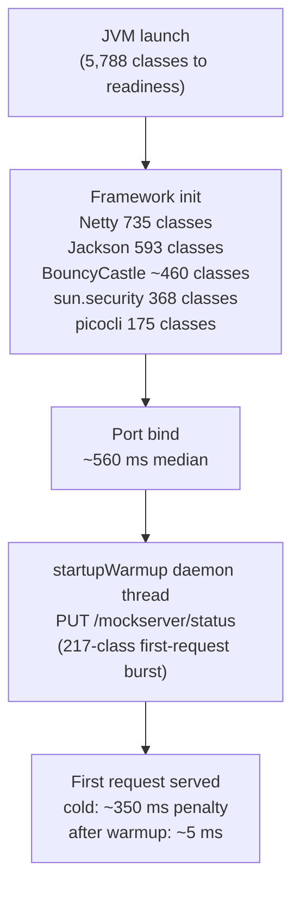

# Startup Performance

MockServer startup is **class-loading bound, not flag-tunable**. After measuring every lever, the fastest path is: (1) warm the first-request burst in the background after port bind (`startupWarmup`, default on), (2) defer eager subsystem initialization (BouncyCastle provider, forward client event-loop group), and (3) pre-load class metadata at image build time (AppCDS in the standard Docker image, Leyden AOT cache in the `-aot` variant). All of these are shipped.

**Headline numbers (arm64 Mac, 2026-07-02, median of 5 cold launches; two distinct metrics):**

| Metric | Before | After | Change |
|---|---|---|---|
| Standard Docker image, `docker run` → ready | 855 ms (7.4.0) | 566 ms (AppCDS) | −34% |
| Fat jar on host JDK 21, launch → ready (tight 2 ms poll) | 919 ms | 804 ms (lazy BC + lazy forward group) | −13% |
| First request arriving 600 ms after port-open | ~230 ms | 5–11 ms (`startupWarmup`) | −97% |
| `-aot` variant (JDK 25 Leyden), host launch → ready | — | ~580 ms | −37% vs standard jar |

(The ~230 ms "before" figure is the first request issued 600 ms after port-open; a request issued
*immediately* at port-open pays the full ~350 ms burst described below — the 600 ms of background
JIT/class-loading progress accounts for the difference.)

The launch→ready and first-request metrics are different things: a tight external poll races the
built-in warmup thread (so launch→ready barely moves), while any realistic poll interval — e.g. a
Testcontainers wait strategy — arrives after warmup finished and sees a near-instant first response.

Absolute numbers are machine-specific; only compare runs produced on the same machine and JDK build.

## Anatomy of Startup



### The first-request gap

Port binds at ~560 ms median, but a cold server takes ~350 ms longer before responding to the first request. That gap is exactly one request: request #1 takes 345–452 ms, request #2 takes ~5 ms, all subsequent requests take ~4 ms. A 217-class burst (Jackson serialization, Netty HTTP encoders, response writers) loads on the first real control-plane request. Every wait strategy — Testcontainers `WaitStrategy`, health checks, custom polling — pays this cost on a cold server.

The burst persists (~250 ms) even under the Leyden AOT cache because AOT pre-loads class metadata but not the linkage, initialization, and JIT compilation of that particular path.

### Class-loading breakdown (JFR + -verbose:class, 7.3.1-SNAPSHOT)

| Package group | Classes loaded to readiness |
|---|---|
| Netty | 735 |
| Jackson | 593 |
| BouncyCastle | ~460 |
| `sun.security` | 368 |
| picocli | 175 |
| **Total** | **5,788** |

### What was already lazy before this work

TLS key generation (RSA-2048, on first TLS connection; `proactivelyInitialiseTLS` defaults to `false`), Jackson ObjectMappers, template engines (Velocity, Mustache, GraalJS), metrics exporters, DNS/HTTP3/gRPC subsystems.

## Variant Matrix

All variants measured 2026-07-02, arm64 Mac, 7.3.1-SNAPSHOT fat jar, median of 5, time from `java -jar` to first `PUT /mockserver/status` → 200.

| Variant | Ready median | Port-bind median | vs baseline |
|---|---|---|---|
| JDK 21 baseline | 919 ms | 562 ms | — |
| JDK 17 baseline | 909 ms | 556 ms | ~0 |
| JDK 25 baseline | 941 ms | 566 ms | ~0 |
| `-Dmockserver.proxySetupLogging=false` | 911 ms | 562 ms | ~0 |
| stored (uncompressed) jar | 956 ms | 580 ms | ~0 |
| `-XX:+UseSerialGC` | 949 ms | 562 ms | ~0 |
| **exploded classpath** | **1,966 ms** | **1,351 ms** | **2x WORSE** |
| default JDK CDS only | ~906 ms | — | ~−13 ms |
| `-XX:TieredStopAtLevel=1` | ~875 ms | — | ~−44 ms (costs peak throughput) |
| **AppCDS (`-XX:SharedArchiveFile`, JDK 21)** | **671 ms** | **362 ms** | **−27%** |
| **AppCDS + `TieredStopAtLevel=1` + proxyoff** | **585 ms** | **324 ms** | **−36%** |
| **JDK 25 Leyden AOT cache** | **580 ms** | **315 ms** | **−37%** |
| **Leyden AOT + proxyoff** | **534 ms** | **286 ms** | **−42%** |

### Dead ends — do not re-litigate

These were measured and ruled out. The evidence is above.

| Approach | Result | Why rejected |
|---|---|---|
| Exploded classpath | 2x WORSE (1,966 ms) | Classpath scanning cost vastly exceeds any benefit on cold first-run |
| Stored/uncompressed jar | No effect (~956 ms) | JAR decompression is not on the critical path |
| SerialGC (`-XX:+UseSerialGC`) | No effect (~949 ms) | GC is not a bottleneck at startup on this heap size |
| Log level tuning | No effect | Log-level evaluation is not a bottleneck |
| `/dev/urandom` pinning | No effect on macOS; container baseline already fine | Not a bottleneck in the target environment |
| `proxySetupLogging=false` alone | No effect (~911 ms) | Post-bind, off the readiness critical path |
| Default JDK CDS | ~−13 ms | Too small to matter; it is always on anyway |
| C2 off (`TieredStopAtLevel=1`) | −44 ms but caps peak throughput | Wrong default for load-injection users; document as Testcontainers tip only |

## What Shipped

### U1 — `startupWarmup`: first-request warmup (shipped)

**Mechanism.** After port bind, `LifeCycle.startedServer()` starts a daemon thread (`MockServer-startup-warmup`) that issues one plain-HTTP `PUT /mockserver/status` to the first bound port via `java.net.HttpURLConnection`. This drives the full Netty decode → Jackson serialization → response write path, loading the 217-class first-request burst before any real caller arrives.

**Fail-soft.** The thread is a daemon (never blocks JVM exit), has 2-second connect and read timeouts, catches all `Throwable`, and logs only at TRACE on failure. A warm-up failure is invisible to callers.

**No event pollution.** `/mockserver/status` is a control-plane endpoint. It is not processed through the mock-matching or recorded-request path, so the warmup does not create `RECEIVED_REQUEST` log entries, does not affect expectation matching, and does not appear in `retrieve` output. This was verified in `StartupWarmupIntegrationTest`.

**Auth-exempt by design.** The warmup request goes through the same pre-auth `/status` branch that all health checks and readiness probes use, so `controlPlaneJWTAuthenticationRequired=true` deployments are not broken.

**Effect measured by `warmup_probe.py`.** At a 600 ms post-bind poll (the realistic interval for Testcontainers strategies), request #1 drops from ~350 ms to 5–11 ms.

**Configuration.** Property: `mockserver.startupWarmup` / env var: `MOCKSERVER_STARTUP_WARMUP`, boolean, default `true`. Set to `false` to disable (e.g. for benchmarking cold-start behaviour). Source: `ConfigurationProperties.java` (`MOCKSERVER_STARTUP_WARMUP`, default `"true"`), `Configuration.startupWarmup()`, `LifeCycle.startupWarmup(List<Integer>)`.

### U2 — AppCDS standard Docker image (shipped)

**Measured (arm64, launch of container → status 200, median of 5).** AppCDS image **566 ms** vs
published 7.4.0 standard image **855 ms** (−34%; −39% vs a same-jar no-AppCDS control at 933 ms).
Image size 411 MB vs 422 MB — the jlink-trimmed runtime offsets the ~33 MB archive. Archive use
confirmed via `-Xlog:cds=info` ("Opened archive /mockserver.jsa", mapped dynamic regions). Both
fallback cases proven: a missing archive and a corrupt archive each log a warning and start
normally.

> **Runtime bumped to JDK 25 (follow-up: re-measure).** The 566 ms / 411 MB figures above were
> measured on the JDK 17 runtime this image originally shipped. The standard/local images now bake a
> jlink-trimmed **Temurin 25** runtime (the library is still compiled to the Java 17 floor — a
> runtime-only change). The AppCDS archive re-trains and re-maps correctly on JDK 25 (verified
> locally via `-Xlog:cds`: both the `-Xshare:dump` base archive and the dynamic `/mockserver.jsa`
> open and map with no "cannot be mapped" warning; `java -version` reports `25.0.3`). A single local
> container launch→ready observation after the bump was ~563 ms — comparable, but a single sample,
> not a median-of-5 benchmark; re-run `scripts/perf/bench_startup.py` on JDK 25 for an authoritative
> figure.

**Mechanism.** The same train-at-build-time pattern as the `-aot` image, on a JDK 25 runtime with classic AppCDS rather than the Leyden AOT cache, in `docker/local/Dockerfile` (the release/snapshot artifact) and `docker/Dockerfile` (public download-mode reference, which also retains its netty-tcnative install). The runtime JVM is JDK 25; the library is still compiled to the Java 17 bytecode floor, so this is a runtime-only choice:

- Build stage: `eclipse-temurin:25-jdk-noble` with a jlink-trimmed runtime (same module set as the jlink binary bundle: `java.se,jdk.unsupported,jdk.crypto.ec,jdk.crypto.cryptoki,jdk.naming.dns,jdk.zipfs`, `--compress=zip-6` — the JDK-21+ form; the legacy numeric `--compress=2` was removed after JDK 17).
- `java -Xshare:dump` first creates the base CDS archive — a jlink image does not ship one, and the dynamic app archive layers on top of it.
- Training run: `java -XX:ArchiveClassesAtExit=/mockserver.jsa -jar ... -serverPort 1080`, polled via the bundled `org.mockserver.cli.HealthCheck`, then clean `SIGTERM`; the build fails if the archive was not produced.
- Runtime: distroless java-base-debian12 (digest-pinned by INDEX digest, same digest as `docker/aot`), trimmed JDK 25, jar, and archive. Entrypoint adds `-XX:SharedArchiveFile=/mockserver.jsa` with default `-Xshare:auto` semantics — if the archive is unusable (e.g. wrong JDK build) the JVM logs a warning and starts normally, making this safe for the default image.
- `TieredStopAtLevel=1` is intentionally NOT set — it would cap peak throughput for load-injection users. It remains a Testcontainers/ephemeral tip only.
- The release-script context contract (jar name, `DASHBOARD_ANALYTICS_*` build args, no network access in the `docker/local` build) is unchanged; no release wiring changes were needed.

**Archive coupling.** A CDS archive is tied to the exact JDK build that produced it. Updating the base image requires a new training run and a new archive — the same constraint as the Leyden AOT cache, and the same solution: bake the trained runtime into the image. This is why the archive must be produced inside the multi-stage Docker build rather than pre-built and committed.

### U3 — Lazy BouncyCastle provider registration (shipped)

**Mechanism.** `BCKeyAndCertificateFactory.ensureProviderRegistered()` uses a `volatile boolean providerRegistered` double-checked lock. The constructor sets only `configuration` and `mockServerLogger` fields — it does not call `ensureProviderRegistered`. Registration happens only on the first actual key/cert operation (`buildAndSaveCertificateAuthorityPrivateKeyAndX509Certificate`, `generateCertificate`, `certificateAuthorityX509Certificate`, etc.). On the first call, a `synchronized` block calls `Security.addProvider(new BouncyCastleProvider())` and sets `providerRegistered = true`. All subsequent calls take the fast volatile-read path.

A pure-mock server that never establishes a TLS connection pays zero BouncyCastle initialization cost (~460 classes). A server that handles TLS pays it on the first TLS operation, not at startup.

**Invariant.** `proactivelyInitialiseTLS=true` bypasses laziness by triggering TLS setup at startup — this is intentional: users who set that property want TLS ready immediately.

Source: `mockserver-core/.../socket/tls/bouncycastle/BCKeyAndCertificateFactory.java`.

### U4 — Lazy `forwardClientGroup` (shipped)

**Measured.** With U1+U3+U4 combined, the host fat-jar benchmark reached 804 ms ready / 489 ms
port-bind (from the 919 ms / 562 ms baseline); U4's individual share is ~30–40 ms of the bind-time
gain plus `clientNioEventLoopThreadCount` (default 5) fewer threads and their allocations on
mock-only servers. The thread/memory reduction, not wall-clock, is the primary benefit.

**Mechanism.** `LifeCycle.forwardClientGroup` is a `volatile EventLoopGroup` field initialized to `null`. The `LifeCycle` constructor does not create it. On the first forward/proxy request, `getForwardClientEventLoopGroup()` uses double-checked locking under `forwardClientGroupLock` to create a new `NettyTransport.newEventLoopGroup(clientNioEventLoopThreadCount, ...)`. A pure-mock server that never proxies never allocates the event loop group (saving `clientNioEventLoopThreadCount` selector threads and associated memory).

**Disjoint-group invariant preserved.** The forward group is always a new, distinct group — never the `workerGroup`. This disjointness prevents the self-deadlock that occurs when a pooled keep-alive channel reused inside a synchronous local object callback is pinned to the blocked server worker thread. See the field javadoc in `LifeCycle.java` for the full explanation.

**Stop safety.** `stopAsync()` reads `forwardClientGroup` under `forwardClientGroupLock` before tearing down event loops. If the group was never created, the shutdown path skips it. If a first-forward races a `stop()`, the accessor detects `stopping==true` and immediately shuts down the newly-created group so no un-terminated group is leaked.

Source: `mockserver-netty/.../lifecycle/LifeCycle.java` (`forwardClientGroup`, `getForwardClientEventLoopGroup()`, `stopAsync()`). Guard tests: `ForwardClientEventLoopIsolationTest`, `ForwardClientLazyCreationTest`, `ForwardClientEventLoopLifecycleTest`.

### `-aot` image — JDK 25 Leyden AOT cache (shipped, experimental)

The `-aot` Docker variant (`docker/aot/Dockerfile`) bakes a Leyden AOT cache (JEP 483/514/515) into the image at build time:

- **Build stage** (`eclipse-temurin:25-jdk-noble`): jlink produces a trimmed JDK 25 runtime with the same module set as the binary bundle.
- **Training run** (JEP 514 one-step): `java -XX:AOTCacheOutput=/mockserver.aot -jar /mockserver.jar -p 1080`, polled via `HealthCheck`, terminated with `SIGTERM`.
- **Runtime stage** (distroless java-base-debian12, digest-pinned): trimmed JDK 25, jar, and cache. Entrypoint: `-XX:AOTCache=/mockserver.aot`. If the cache is incompatible (wrong CPU arch or JDK build), the JVM logs a warning and continues — the same graceful fallback as `-Xshare:auto`.

The AOT cache is CPU-architecture and JDK-build specific; multi-arch builds produce independent caches. Netty-tcnative is omitted; TLS uses the JDK provider (functionally identical, slightly lower TLS handshake throughput).

Measured gain: −37% (−42% with `proxySetupLogging=false`) versus the standard baseline, on the fat-jar host benchmark. At release time the `-aot` container measured 0.35–0.37 s to ready vs 0.69–1.14 s for the then-untuned standard image; with AppCDS the standard image now reaches ~0.57 s (measured on the previous JDK 17 runtime; the image now runs a JDK 25 runtime and the figure should be re-measured — a single local container observation after the JDK 25 bump was comparable), narrowing the gap.

## GraalVM Native Image

### History: issue #2385 spike (2026-07)

The first native-image spike (tracked as issue #2385) produced a binary with ~72–73 ms ready time but was declined with evidence for three structural reasons:

1. `RESPONSE_CLASS_CALLBACK` / `FORWARD_CLASS_CALLBACK` / `initializationClass` rely on runtime class loading of user-supplied classes — incompatible with native-image's closed-world assumption, and impossible to fix with metadata.
2. Every feature not explicitly exercised during tracing-agent metadata generation failed at runtime — HTTPS failed until a classpath PEM resource was traced in, Velocity templates failed until traced.
3. Those failures were **silent**: unregistered reflection/resource access returned `null` or empty rather than throwing, so expectations silently did not match and the HTTP caller received no actionable error.

The conclusion was that GraalVM native-image is incompatible with the full MockServer feature set. This is documented in `docs/code/cli.md` ("Why jlink, not GraalVM native-image").

### 2026-07-02 exact-reachability-metadata re-spike: NO-GO verdict

`--exact-reachability-metadata` (GraalVM 23+, paired with `-XX:MissingRegistrationReportingMode=Exit`) was introduced specifically to convert silent reflection failures into loud errors. A second spike was run (GraalVM CE 25.0.2) to determine whether this addresses the #2385 objections.

**Spike results:** 178 MB binary, ~106 ms ready median, 149 MB RSS, 62–72 s build time. `--exact-reachability-metadata` reduces the silent-failure surface but does not eliminate it. Three failure modes remain:

1. **`UnsupportedFeatureError` bypasses `MissingRegistrationReportingMode`.** CLDR locale data access during HTTPS certificate generation threw `UnsupportedFeatureError` (a different GraalVM exception class) rather than `MissingRegistrationError`. This killed the LMAX Disruptor event-log consumer thread silently: the HTTP client saw a dropped connection and the server appeared to hang. This failure mode is not caught by `MissingRegistrationReportingMode=Exit`.

2. **Build-time-initialized state bakes build-machine facts.** Netty's `OpenSsl` availability probe ran at image-build time on the build machine (which could load the tcnative dylib), baking `available=true` into the binary; at runtime the JNI symbols were absent, producing `UnsatisfiedLinkError` on the TLS path with no registration error involved. Fourteen OpenSsl-family classes had to be forced to run-time initialization to fix it — and any similar build-time probe elsewhere would bake platform-specific wrong answers the same way.

3. **Loudness lives in the server log or process exit, not in the HTTP response.** Callers still see empty replies or dropped connections; the loud failure is only observable from the server side.

**CI fragility evidence.** The metadata suite required 6 build-run-trace-merge iterations to converge on 12 tested features; locale-coupled bundle metadata (`en_GB` entries, `-H:IncludeLocales`) was fragile across agent locales; 10 hand-merged metadata entries were silently dropped on agent regeneration; builder peak RSS was 5.7 GB, exceeding standard CI agent memory.

**Verdict: NO-GO.** Native reaches ~106 ms vs ~300 ms for a warmup-plus-AOT-tuned JVM image — a ~200 ms gain that does not justify the residual silent-failure modes and permanent metadata maintenance cost. Revisit only if GraalVM closes the `UnsupportedFeatureError`/build-time-init gaps.

The jlink binary bundle remains the correct JVM-less distribution mechanism. See `docs/code/cli.md` for the rationale and module set.

## Ecosystem Outlook (as of 2026-07)

| Technology | Status | MockServer relevance |
|---|---|---|
| Leyden JEP 483 | Shipped JDK 24 | Class loading/linking AOT cache — our `-aot` uses this |
| Leyden JEPs 514+515 | Shipped JDK 25 | One-step AOT training + AOT method profiling — the current `-aot` implementation |
| Leyden JEP 516 | Shipped JDK 26 (GA 2026-03-17) | AOT object cache, any GC — re-benchmark `-aot` on JDK 26 at next refresh |
| Leyden draft JEP 8335368 | AOT code compilation, no release target | Expected to improve warmup and time-to-peak, not ready-time; re-benchmark when it lands |
| CRaC (Checkpoint/Restore) | Azul Zulu/Liberica only — not mainline OpenJDK | ~54 ms restore times (PetClinic baseline), checkpoint-inside-image works without `docker checkpoint`. Blockers: non-mainline JDK, snapshot contains env vars/args plaintext and would freeze CA key material (must regenerate in `afterRestore`), no Testcontainers integration. Watch-only — warmup + AOT already reaches ~300 ms with zero ecosystem risk. |
| Lambda SnapStart | AWS Lambda, ZIP-only — no container image support | No applicable pattern |

**Quarkus/Spring comparison.** Quarkus measured −71–78% with JDK 25 Leyden caches. MockServer measured −37–42%. The smaller gain is expected: MockServer's baseline is already much leaner than Spring/Quarkus applications (5,788 classes vs tens of thousands), so there are fewer classes for the cache to skip.

## How to Re-Measure

The measurement harness lives in `scripts/perf/`. See `scripts/perf/README.md` for full usage.

| Script | Measures | Use when |
|---|---|---|
| `bench_startup.py` | Launch→port-bind and launch→ready medians across a variant matrix (JVM flags, jars, Docker images) | Comparing image/flag/JDK variants; validating a startup change |
| `gap_probe.py` | Port-bind to readiness split: times the first N sequential requests after TCP port opens | Diagnosing first-request latency vs bind cost |
| `warmup_probe.py` | First-request latency at 600 ms after port-open, `startupWarmup` on vs off | Validating the `startupWarmup` feature end-to-end |
| `startup-variants.json` | Variant definitions consumed by `bench_startup.py` | Edit to add new JVM flags, Docker images, or JDK versions |

```bash
# Variant matrix — fat jar:
python3 scripts/perf/bench_startup.py scripts/perf/startup-variants.json \
  --jar mockserver/mockserver-netty/target/mockserver-netty-<version>-jar-with-dependencies.jar \
  --port 22080 --runs 5

# First-request decomposition:
python3 scripts/perf/gap_probe.py <path-to-jar-with-dependencies>

# startupWarmup validation:
python3 scripts/perf/warmup_probe.py <path-to-jar-with-dependencies>
```

### Methodology caveats

- Startup is a single-shot wall-clock event. Use **medians of ≥5 fresh launches**, never a warmed JMH loop. JMH `SingleShotTime` in `mockserver-benchmark` measures individual subsystem inits, not whole-process startup.
- The ready poll in `bench_startup.py` runs every 2 ms, which races the built-in `startupWarmup` self-request. Tight-poll `ready` figures therefore **understate** the benefit warmup gives realistic pollers (Testcontainers strategies poll at hundreds-of-ms intervals). Use `warmup_probe.py` for a realistic comparison.
- Absolute numbers are machine-specific. Only compare runs from the same machine, same session, and same JDK build.
- Watch the max column for cold-cache outliers — the first run after building an artifact is often slow (OS page cache cold).
- Ports: the scripts default to the 22080+ range to avoid colliding with a running MockServer on 1080.
