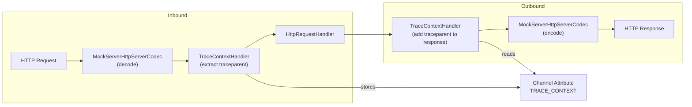

# Telemetry — OpenTelemetry Integration

## Overview

MockServer integrates with OpenTelemetry (OTEL) for both metrics export and trace context propagation. The telemetry subsystem lives in `mockserver-core/src/main/java/org/mockserver/telemetry/` and is designed to be fail-soft: telemetry failures never affect served responses.

## Components

### GenAI Span Export (`GenAiSpans`, `GenAiSpanExporter`)

Emits explicit OpenTelemetry GenAI semantic-convention spans for LLM completions MockServer serves. Each span carries provider (`gen_ai.system`), model, token usage, and finish reason. Controlled by `mockserver.otelTracesEnabled`.

- **`GenAiSpans`** — static emit point; no-op unless a tracer is installed by `GenAiSpanExporter`
- **`GenAiSpanExporter`** — configures the OTel trace SDK (OTLP HTTP/protobuf, JDK sender) and installs the tracer

### Metrics Export (`OtelMetricsExporter`)

Pushes MockServer's explicitly-defined metrics (request counts, expectation-match counts, action counts) to OTLP as observable gauges. Controlled by `mockserver.otelMetricsEnabled`.

Located in `mockserver-core/src/main/java/org/mockserver/metrics/OtelMetricsExporter.java`.

### OTLP Endpoint Resolution (`OtelEndpoints`)

Resolves per-signal OTLP HTTP endpoints (`/v1/metrics`, `/v1/traces`) from the single configured base URL (`mockserver.otelEndpoint`). Shared by both the metrics and trace exporters.

### W3C Trace Context Propagation (`W3CTraceContext`, `TraceContextHandler`)

Extracts W3C `traceparent` and `tracestate` headers from incoming HTTP requests and optionally propagates them to mock responses. This enables distributed tracing correlation when MockServer sits in a service mesh or test harness that uses W3C Trace Context.

#### `W3CTraceContext` (mockserver-core)

Value type that parses and validates W3C `traceparent` header values. Format: `{version}-{traceId}-{parentId}-{flags}`.

Validation rules:
- `traceId` must be 32 hex characters
- `parentId` must be 16 hex characters
- `version` and `flags` must be present

#### `TraceContextHandler` (mockserver-netty)

Netty `ChannelDuplexHandler` that sits in the pipeline between `MockServerHttpServerCodec` and `HttpRequestHandler`:

```
... -> MockServerHttpServerCodec -> TraceContextHandler -> HttpRequestHandler
```

**Inbound (channelRead):**
1. Extracts `traceparent` and `tracestate` headers from MockServer `HttpRequest`
2. Parses into `W3CTraceContext` and stores as a channel attribute
3. If `otelGenerateTraceId` is enabled and no traceparent header exists, generates a new random trace context

**Outbound (write):**
1. If `otelPropagateTraceContext` is enabled, copies the stored trace context headers to the MockServer `HttpResponse` before it reaches `MockServerHttpServerCodec` for encoding

The handler is `@Sharable` (no per-channel mutable state; state lives in the channel attribute `TRACE_CONTEXT`).

## Configuration Properties

| Property | Type | Default | Description |
|----------|------|---------|-------------|
| `mockserver.otelMetricsEnabled` | boolean | false | Export metrics via OTLP |
| `mockserver.otelTracesEnabled` | boolean | false | Export GenAI spans via OTLP |
| `mockserver.otelEndpoint` | string | (empty) | OTLP collector base URL |
| `mockserver.otelMetricsExportIntervalSeconds` | long | 60 | Metrics push interval |
| `mockserver.otelPropagateTraceContext` | boolean | false | Copy W3C trace headers to responses |
| `mockserver.otelGenerateTraceId` | boolean | false | Generate trace IDs for requests without `traceparent` |

All OTEL properties are opt-in (off by default) and available as both system properties (`-Dmockserver.*`) and environment variables (`MOCKSERVER_*`).

## Pipeline Integration

The `TraceContextHandler` is wired into all three HTTP pipeline setup methods in `PortUnificationHandler`:

- `switchToHttp` (HTTP/1.1)
- `switchToHttp2` (HTTP/2 via ALPN)
- `switchToH2c` (HTTP/2 cleartext)

It is always present in the pipeline but is effectively a no-op when both `otelPropagateTraceContext` and `otelGenerateTraceId` are disabled (their defaults). The handler reads the configuration at request time, so properties can be changed at runtime.

## Architecture Diagram



## Request-Level Spans (`RequestSpans`)

When `otelTracesEnabled` is set, MockServer emits a `SERVER`-kind OpenTelemetry span
for each served HTTP request/response (in addition to the GenAI spans produced by
`GenAiSpans`). The emitter is `org.mockserver.telemetry.RequestSpans`, which mirrors the
`GenAiSpans` pattern: a static `volatile Tracer` installed by `GenAiSpanExporter`, an
`isEnabled()` short-circuit, and a fully fail-soft `recordRequest(...)` (telemetry never
affects the served response).

Span attributes (OpenTelemetry semantic conventions where applicable):

| Attribute | Source |
|-----------|--------|
| `http.request.method` | request method |
| `http.route` | matched expectation path (else request path) |
| `http.response.status_code` | response status code |
| `mockserver.expectation_id` | matched expectation id (when an expectation matched) |
| `mockserver.response_time_ms` | forward path response time (omitted on mocked path) |

The span parent is taken from the inbound W3C trace context when present. The
`AttributeKey<W3CTraceContext>` is defined once in `org.mockserver.telemetry.TraceContextAttributes`
(in `mockserver-core`) so both the core `HttpActionHandler` (which reads the channel attribute
to find the parent context) and the netty `TraceContextHandler` (which sets it) share one key
without `mockserver-core` depending on `mockserver-netty`. Emission happens at the mocked-response
and forwarded-response write points in `HttpActionHandler`, each guarded by `RequestSpans.isEnabled()`.
