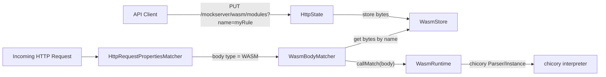

# WASM Custom Rule Engine

## Overview

MockServer supports WebAssembly (WASM) modules as custom body matchers. Users upload compiled WASM binaries via the control-plane REST API, then reference them by name in expectation body matchers. The WASM module receives the HTTP request body and returns a match/no-match decision.

This feature uses the **chicory** pure-Java WASM interpreter (no JNI or native code required), keeping MockServer's "runs anywhere Java runs" promise.

## Architecture



## Module ABI

WASM modules must export a function with the following signature:

```wat
(func $match (export "match") (param $ptr i32) (param $len i32) (result i32)
  ;; Read $len bytes from linear memory starting at $ptr
  ;; Return 1 for match, 0 for no match
)
```

The request body is written into the module's linear memory at offset 0 as UTF-8 bytes before calling `match`.

### Memory requirements

The module must declare at least one page of linear memory. The maximum memory is controlled by the `wasmMaxMemoryPages` configuration property (default: 256 pages = 16 MiB).

## Components

### WasmStore

`org.mockserver.wasm.WasmStore` -- thread-safe singleton backed by `ConcurrentHashMap<String, byte[]>`. Stores raw WASM module bytes keyed by user-chosen names. Reset on `/mockserver/reset`.

### WasmRuntime

`org.mockserver.wasm.WasmRuntime` -- parses the module with chicory's `Parser` and runs it via an `Instance`. Creates a fresh WASM instance per invocation for thread safety. Fails closed (returns `false`) on any error.

### WasmBody

`org.mockserver.model.WasmBody` -- domain model for a WASM body matcher. Extends `Body<String>` with type `Body.Type.WASM`. The value is the module name.

### WasmBodyMatcher

`org.mockserver.matchers.WasmBodyMatcher` -- extends `BodyMatcher<String>`. Looks up the module bytes from `WasmStore`, creates a `WasmRuntime`, and calls `callMatch()` with the request body string.

### WasmBodyDTO

`org.mockserver.serialization.model.WasmBodyDTO` -- Jackson-friendly DTO for JSON serialisation of `WasmBody`.

## REST API

| Method | Path | Description |
|--------|------|-------------|
| PUT | `/mockserver/wasm/modules?name={name}` | Upload a WASM module (raw bytes in body) |
| GET | `/mockserver/wasm/modules` | List loaded module names (JSON array) |
| DELETE | `/mockserver/wasm/modules?name={name}` | Remove a loaded module |

All endpoints require control-plane authentication when enabled.

## Configuration

| Property | Env var | Default | Description |
|----------|---------|---------|-------------|
| `mockserver.wasmEnabled` | `MOCKSERVER_WASM_ENABLED` | `false` | Enable WASM body matching (must opt in) |
| `mockserver.wasmMaxMemoryPages` | `MOCKSERVER_WASM_MAX_MEMORY_PAGES` | `256` | Maximum WASM linear memory pages (64 KiB each) |

## JSON expectation format

```json
{
  "httpRequest": {
    "body": {
      "type": "WASM",
      "moduleName": "myMatcher"
    }
  },
  "httpResponse": {
    "statusCode": 200
  }
}
```

## Security considerations

- WASM modules run inside the chicory interpreter sandbox -- they cannot access the host filesystem, network, or JVM internals
- Fail-closed design: any WASM error (parse failure, runtime trap, missing export) returns no-match
- The feature is disabled by default (`wasmEnabled = false`) -- users must explicitly opt in
- Memory is capped by `wasmMaxMemoryPages` to prevent resource exhaustion
