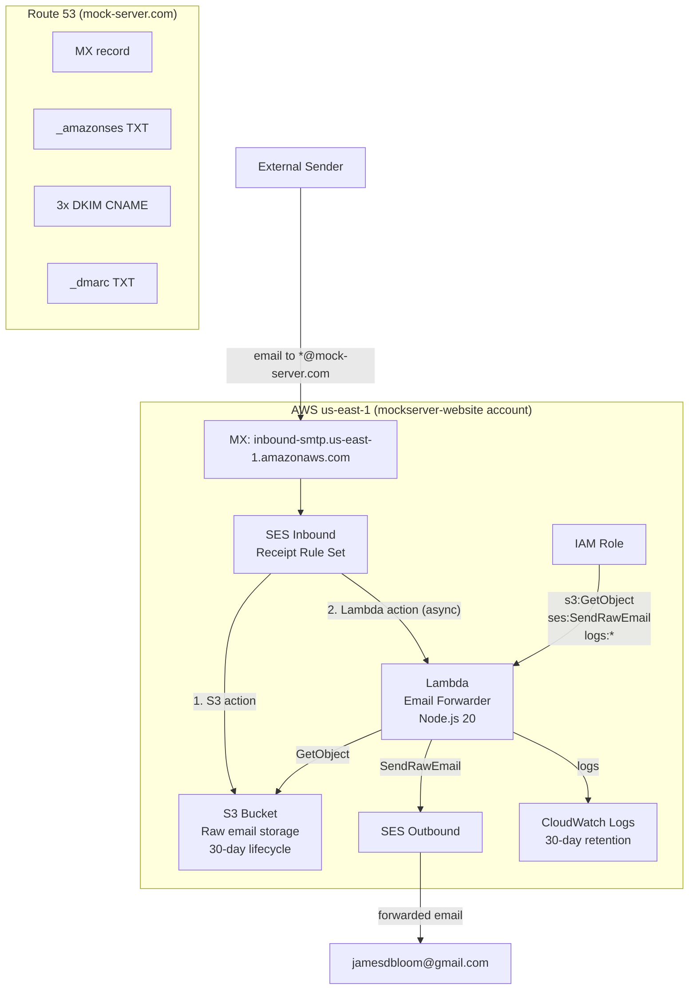
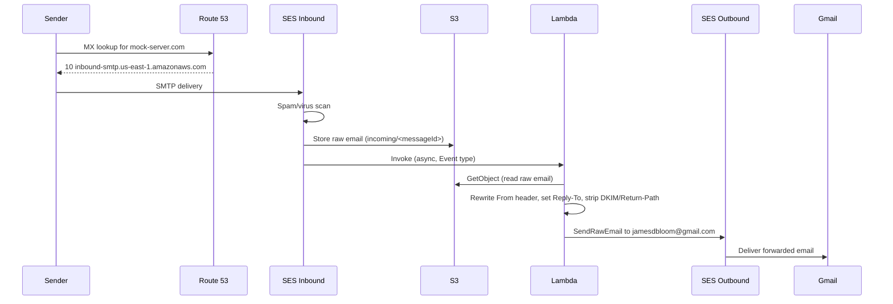

# AWS SES Email Forwarding

## Overview

All email to any address at `mock-server.com` is forwarded to `jamesdbloom@gmail.com` via AWS SES inbound email handling. This replaces the previous Google Workspace mailbox and provides a fully AWS-native, Terraform-managed catch-all forwarder.

The infrastructure runs in the `mockserver-website` AWS account (`us-east-1`), using the existing `mock-server.com` Route 53 hosted zone.

## Architecture



## Email Flow



## Resource Inventory

### SES

| Resource | Details |
|----------|---------|
| Domain identity | `mock-server.com` (verified via DNS TXT record) |
| DKIM | 3 CNAME records for DKIM signing |
| Email identity | `jamesdbloom@gmail.com` (verified via confirmation email -- required for SES sandbox) |
| Receipt rule set | `mock-server-com-inbound` (active) |
| Receipt rule | `mock-server-com-forward` -- catch-all for `mock-server.com`, spam scan enabled |

### S3

| Resource | Details |
|----------|---------|
| Bucket | `mock-server-com-mail-<account-id>` |
| Encryption | AES256 (SSE-S3) |
| Public access | All 4 blocks enabled |
| Lifecycle | Objects expire after 30 days |
| Bucket policy | `ses.amazonaws.com` can `PutObject` (scoped to this account) |

### Lambda

| Resource | Details |
|----------|---------|
| Function | `mock-server-com-email-forwarder` |
| Runtime | `nodejs20.x` |
| Memory | 256 MB |
| Timeout | 30 seconds |
| Handler | `index.handler` |
| Log group | `/aws/lambda/mock-server-com-email-forwarder` (30-day retention) |

### IAM

| Resource | Details |
|----------|---------|
| Role | `mock-server-com-email-forwarder` |
| Permissions | `s3:GetObject` (mail bucket), `ses:SendRawEmail`, CloudWatch Logs create/put |

### DNS Records

| Record | Type | Value | Purpose |
|--------|------|-------|---------|
| `mock-server.com` | MX | `10 inbound-smtp.us-east-1.amazonaws.com` | Route inbound email to SES |
| `_amazonses.mock-server.com` | TXT | SES verification token | Domain identity verification |
| `<token>._domainkey.mock-server.com` (x3) | CNAME | `<token>.dkim.amazonses.com` | DKIM signing |
| `_dmarc.mock-server.com` | TXT | `v=DMARC1; p=none;` | DMARC policy |

**Not managed by this stack:** The apex TXT record (contains `google-site-verification`) is not created or modified. SPF can be manually merged into the existing apex TXT record if desired.

## Terraform Stack

| Property | Value |
|----------|-------|
| Directory | `terraform/ses-email-forwarding/` |
| AWS account | `mockserver-website` |
| Region | `us-east-1` |
| State backend | S3 (`mockserver-terraform-state`, key `ses-email-forwarding/terraform.tfstate`) |
| AWS CLI profile | `mockserver-website` (operations), `mockserver-build` (state backend) |

### Variables

| Variable | Default | Description |
|----------|---------|-------------|
| `region` | `us-east-1` | AWS region |
| `domain` | `mock-server.com` | Domain for catch-all email |
| `forward_to` | `["jamesdbloom@gmail.com"]` | Destination addresses |
| `from_address` | `noreply@mock-server.com` | Rewritten From address |
| `email_retention_days` | `30` | S3 retention period |
| `alarm_email` | first `forward_to` address | Email for Lambda error alarm notifications |
| `enable_monitoring` | `true` | Create SNS topic, email subscription, and CloudWatch alarm (see below) |

## Configuration

### Changing or Adding Forwarding Addresses

1. Update `forward_to` in `terraform.tfvars`:
   ```hcl
   forward_to = ["jamesdbloom@gmail.com", "another@example.com"]
   ```
2. Run `./run.sh apply`
3. Click the SES verification link sent to any new address

### One-Time Manual Steps (After First Apply)

1. Click the SES email identity verification link sent to `jamesdbloom@gmail.com`
2. Confirm the SNS alarm subscription -- AWS sends a separate confirmation email to `alarm_email` (defaults to the first `forward_to` address). Click the "Confirm subscription" link in that email to start receiving alarm notifications.
3. Domain and DKIM verification happens automatically via DNS records
4. Send a test email to any `@mock-server.com` address to confirm forwarding works

## Failure Handling

- **Lambda error alarm**: A CloudWatch alarm monitors the forwarder Lambda `Errors` metric. When any error occurs (threshold >= 1 in a 5-minute period), an SNS notification is sent to the configured `alarm_email` address. This ensures failed forwards are noticed rather than silently lost.
- **Raw email retention**: The raw MIME email is stored in the S3 bucket by SES *before* the Lambda is invoked. Even if the Lambda fails, the email remains in S3 for `email_retention_days` (default 30 days) and can be manually reprocessed. Mail is not lost on a transient Lambda failure.
- **No DLQ needed**: A dead-letter queue is not used because the raw email is already durably retained in S3. The alarm + S3 retention together cover the failure recovery path.

## Disabling Monitoring (`enable_monitoring`)

The `enable_monitoring` variable (default: `true`) controls whether the SNS alarm topic, email subscription, and CloudWatch error alarm are created. These resources all depend on the SNS management API.

Set `enable_monitoring = false` when `terraform apply` is run from a network where the SNS management API is unreachable -- for example, behind a corporate TLS-inspection proxy that stalls SNS API calls. The remaining resources (SES, S3, Lambda, IAM, Route 53) will deploy normally.

Once the core stack is deployed, the monitoring can be applied later from a network where SNS is reachable (such as AWS CloudShell or a direct internet connection):

```bash
# From a network with SNS access:
terraform apply -var="enable_monitoring=true"
```

## Operational Notes

- **Active receipt rule set**: `aws_ses_active_receipt_rule_set` **activates this rule set and deactivates any other active receipt rule set** in the same AWS account and region. Only one receipt rule set can be active at a time. Verify that no prior active rule set exists before applying, or accept that the existing one will be deactivated.
- **Forwarded email preserves original `To:`**: The forwarded email keeps the original `To:` header intact, so for the catch-all you can see which `@mock-server.com` address received the email. This is intentional.
- **Removing a forwarding address**: Removing an address from `var.forward_to` destroys that address's `aws_ses_email_identity` on the next `terraform apply`. This is the intended behaviour and is safe.
- **Spam/virus scanning**: `scan_enabled = true` on the SES receipt rule means SES silently discards spam- and virus-flagged mail. No bounce is sent to the sender.

## Security

- **SES sandbox**: The account operates in SES sandbox mode. This is sufficient because the forwarder only sends to pre-verified destination addresses.
- **No public access**: The S3 bucket blocks all public access. Only SES (via bucket policy) and the Lambda function (via IAM) can access it.
- **Encryption**: All stored emails are encrypted at rest (AES256).
- **Spam scanning**: The SES receipt rule has `scan_enabled = true` -- SES scans inbound emails for spam and viruses before processing.
- **Retention**: Raw emails are automatically deleted after 30 days.
- **Least privilege IAM**: The Lambda role has only the minimum permissions needed (read from one bucket, send email, write logs).

## Cost

Estimated monthly cost for low-volume personal email (< 100 emails/month):

| Resource | Cost |
|----------|------|
| SES | Free (first 1,000 inbound + free tier outbound) |
| S3 | < $0.01 |
| Lambda | Free tier |
| Route 53 | $0 incremental (zone already exists) |
| CloudWatch | < $0.01 |
| **Total** | **< $0.10/month** |
