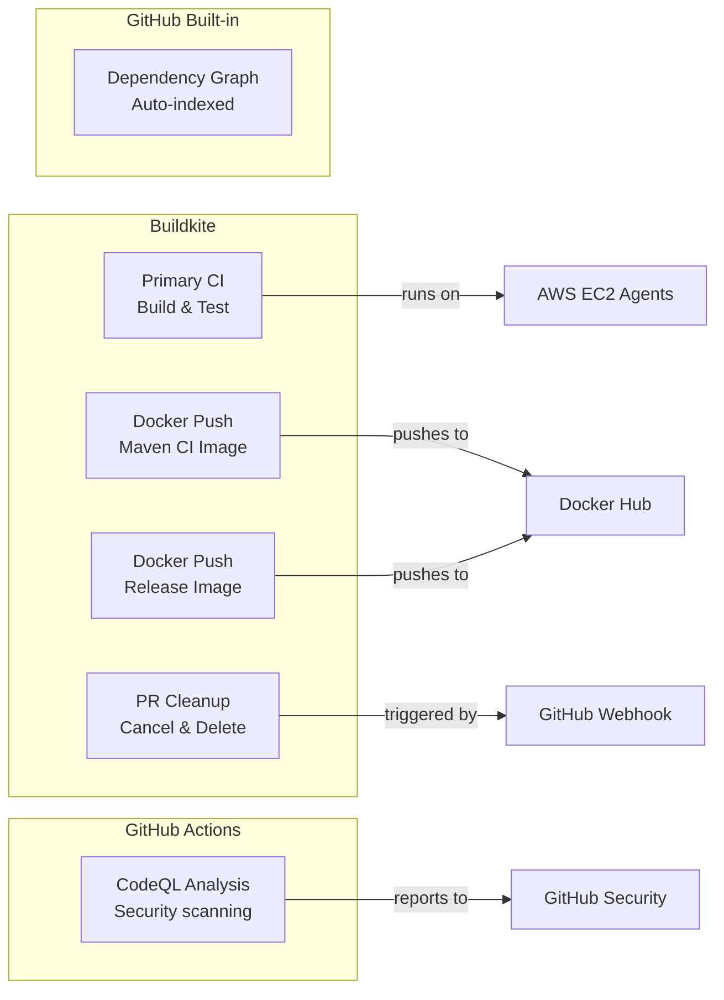
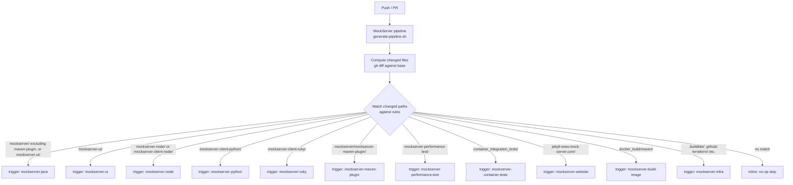
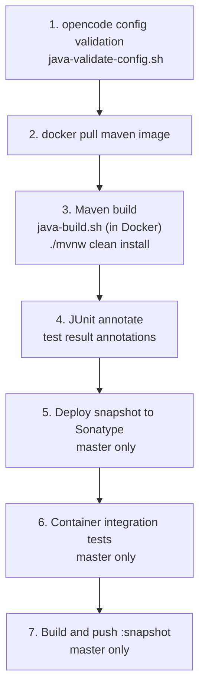
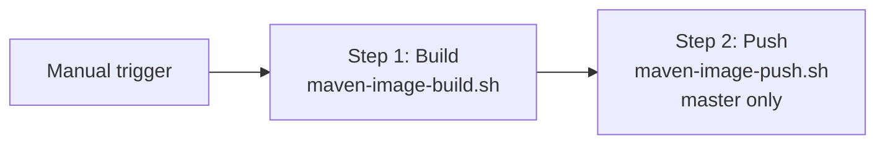
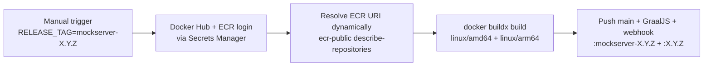
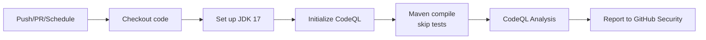
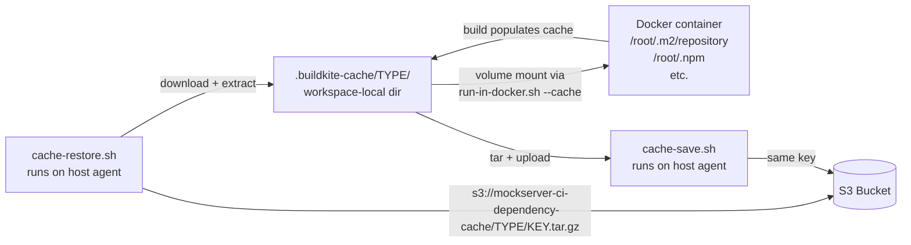

# CI/CD

## Overview

MockServer uses two CI/CD systems:



### CI Security Model

All custom CI pipelines run on Buildkite with self-managed EC2 agents. This keeps secrets (API tokens, Docker Hub credentials, AWS credentials) within the Buildkite/AWS boundary and avoids exposing them as GitHub Actions secrets.

**Principle:** Use Buildkite for any pipeline that needs secrets or performs actions. Use GitHub Actions only for read-only analysis that requires no secrets (e.g., CodeQL). Use Buildkite Pipeline Triggers to react to GitHub events without giving GitHub access to CI credentials.

| Concern | Approach |
|---|---|
| Build & test | Buildkite (EC2 agents, secrets in AWS Secrets Manager) |
| Docker push | Buildkite (Docker Hub credentials in AWS Secrets Manager) |
| GitHub event reactions | Buildkite Pipeline Triggers (GitHub webhook → Buildkite, no secrets in GitHub) |
| Security scanning | GitHub Actions CodeQL (read-only, no secrets needed) |
| Dependency graph | GitHub built-in (auto-indexed from manifests, no workflow needed) |

## Buildkite Pipelines

The monorepo uses a path-based pipeline orchestrator that dynamically triggers separate child pipelines based on changed files. Each child pipeline appears individually in the Buildkite dashboard, giving per-project visibility. Three agent queues are used:

| Queue | Instance Types | Purpose |
|-------|---------------|---------|
| `default` | `c5.2xlarge`, `c5a.2xlarge`, `m5.2xlarge` | Build and test workloads (Maven, Docker, k3d) |
| `trigger` | `t3.small`, `t3a.small`, `t3.micro` | Trigger polling jobs (`sleep` + `curl` loops) |
| `release` | Same as `default` | Release pipeline steps that access release secrets |
| `perf` | `c5.4xlarge` | Daily performance-regression benchmarks (k6 + JMH); scale-to-zero, max 1, 100% on-demand |

Trigger jobs (which poll child builds via the Buildkite API) run on cheap `trigger` queue instances to avoid starving build agents. See [Agent Starvation](#agent-starvation-from-script-based-triggers-resolved) for background.

### Pipeline Orchestrator

**File:** `.buildkite/scripts/generate-pipeline.sh`

The orchestrator runs as the first step of every build (via the main "MockServer" pipeline). It determines which files changed since the last successful build and emits command steps that call `trigger-pipeline.sh` to create child builds via the Buildkite API. For PRs, it diffs against the merge-base. For pushes to master, it queries the Buildkite API for the last successful build's commit SHA and diffs against it — this ensures that batch pushes with multiple commits correctly trigger all affected pipelines. If the base commit cannot be determined (API failure, first build, shallow clone), the orchestrator conservatively triggers all pipelines.



### Buildkite Pipelines

All pipelines are managed via Terraform in `terraform/buildkite-pipelines/pipelines.tf`. Only the main orchestrator pipeline triggers from GitHub webhooks; all child pipelines have `trigger_mode = "none"` and are triggered by the orchestrator.

| Pipeline (Buildkite slug) | Pipeline File | Trigger | What It Builds |
|---|---|---|---|
| `mockserver` | `pipeline.yml` | GitHub push/PR | Orchestrator — triggers child pipelines |
| `mockserver-java` | `pipeline-java.yml` | Orchestrator | Full Maven build and test |
| `mockserver-ui` | `pipeline-ui.yml` | Orchestrator | UI lint, typecheck, test, build |
| `mockserver-node` | `pipeline-node.yml` | Orchestrator | Node.js lint and typecheck |
| `mockserver-python` | `pipeline-python.yml` | Orchestrator | Python unit + integration tests (builds MockServer image from HEAD) |
| `mockserver-ruby` | `pipeline-ruby.yml` | Orchestrator | Ruby unit + integration tests (builds MockServer image from HEAD) |
| `mockserver-maven-plugin` | `pipeline-maven-plugin.yml` | Orchestrator | Maven plugin build and test |
| `mockserver-performance-test` | `pipeline-perf-test.yml` | Orchestrator | Perf test script validation |
| `mockserver-container-tests` | `pipeline-container-tests.yml` | Orchestrator | Shell script validation |
| `mockserver-website` | `pipeline-website.yml` | Orchestrator | Jekyll site build |
| `mockserver-infra` | `pipeline-infra.yml` | Orchestrator | Infrastructure validation |
| `mockserver-build-image` | `docker-push-maven.yml` | Orchestrator + Manual | Build/push maven CI image |
| `mockserver-release-image` | `docker-push-release.yml` | Manual | Build/push release image |
| `mockserver-release` | `release-pipeline.yml` | Manual | Automated release pipeline (TOTP, Maven Central, maven-plugin, Docker Hub + ECR Public, npm, Helm, Javadoc, SwaggerHub, website, JSON Schema, PyPI, RubyGems, GitHub Release, optional versioned site) |
| `mockserver-cleanup` | `pipeline-cleanup.yml` | GitHub webhook + scheduled | Clean up builds for closed PRs |
| `mockserver-perf-regression` | `pipeline-perf-test.yml` | Daily Buildkite schedule (04:00 UTC) | Daily performance-regression pipeline — guard + k6 run + JMH microbench + rolling-baseline compare |

A single commit can trigger multiple child pipelines if it changes files in multiple areas. For example, a commit touching both `mockserver/` and `mockserver-ui/` triggers both `mockserver-java` and `mockserver-ui` pipelines.

All pipelines have `cancel_intermediate_builds` and `skip_intermediate_builds` enabled. When a new build arrives for the same branch (e.g. Dependabot rebases a PR), Buildkite automatically cancels any running builds and skips queued builds for that branch. Native trigger steps automatically cancel child builds when the parent build is cancelled.

### Closed PR Build Cleanup

**File:** `.buildkite/pipeline-cleanup.yml`

When a PR is closed or merged, its Buildkite builds are no longer needed. The cleanup pipeline cancels any running builds and deletes all builds for the closed PR's branch across all child pipelines. This keeps the Buildkite dashboard clean — only builds for open PRs and master are visible.

The cleanup pipeline operates in two modes:

1. **Webhook-triggered (primary):** A Buildkite Pipeline Trigger receives GitHub `pull_request:closed` webhooks directly. The webhook payload is available to the build step via `buildkite-agent meta-data get buildkite:webhook`. This provides immediate cleanup when a PR is closed.
2. **Scheduled sweep (safety net):** A daily cron schedule sweeps all pipelines for builds on branches whose PRs are no longer open on GitHub. This catches anything missed by the webhook.

#### Why Buildkite Pipeline Triggers instead of GitHub Actions

Buildkite Pipeline Triggers can receive GitHub webhooks directly with HMAC-SHA256 signature verification. This avoids storing a Buildkite API token as a GitHub Actions secret, keeping all CI credentials within the Buildkite/AWS boundary:

| Approach | Secrets exposed to GitHub | Event-driven | Complexity |
|---|---|---|---|
| **Buildkite Pipeline Trigger** | None (webhook URL only) | Yes | Low |
| GitHub Actions workflow | Buildkite API token | Yes | Low |
| AWS Lambda webhook receiver | None | Yes | High |
| Buildkite scheduled sweep only | None | No (polling) | Low |

#### Setup

Steps 1 and 4 are managed by Terraform (`terraform/buildkite-pipelines/pipelines.tf`). Steps 2 and 3 require manual setup because Buildkite Pipeline Triggers don't have a Terraform resource yet (the feature is in public preview).

1. **Pipeline + schedule** (Terraform): Run `terraform apply` in `terraform/buildkite-pipelines/` to create the `mockserver-cleanup` pipeline and its daily schedule.
2. **Pipeline Trigger** (Buildkite UI): Go to the [cleanup pipeline settings](https://buildkite.com/mockserver/mockserver-cleanup/settings) → Triggers → New Trigger → GitHub:
   - Description: `GitHub PR closed/merged`
   - Branch: `master`, Commit: `HEAD`
   - Security: check "Validate webhook deliveries", enter a secret (`openssl rand -hex 32`)
   - Copy the trigger URL (`https://webhook.buildkite.com/deliver/bktr_...`)
3. **GitHub webhook** (GitHub UI): Go to [repo webhook settings](https://github.com/mock-server/mockserver-monorepo/settings/hooks) → Add webhook:
   - Payload URL: paste the Buildkite trigger URL from step 2
   - Content type: `application/json`
   - Secret: same as step 2
   - Events: select "Let me select individual events" → check only "Pull requests"
4. **Daily schedule** (Terraform): Created automatically by step 1 — runs at 06:00 UTC daily as a safety net.

### Performance Regression Pipeline

**File:** `.buildkite/pipeline-perf-test.yml`

**Trigger:** Daily Buildkite schedule at 04:00 UTC (`build.source == 'schedule'`), or via the Buildkite UI (`build.source == 'ui'`). Not triggered by the path-based orchestrator.

**Purpose:** Catch performance regressions automatically without requiring manual perf runs after every commit. The pipeline is notify-only — it never fails a build, only annotates.

#### Commit-guard dynamic-dispatch pattern

The pipeline's first step (`perf-test-guard.sh`, `trigger` queue) implements a "daily but only if there's something new" gate:

1. Calls `last_perf_run_commit` (in `lib/last-successful-commit.sh`) — resolves the commit the heavy regression run *last actually executed against*, by reading the most recent `perf_regression_ran_commit` Buildkite build meta-data (set by `perf-test-run.sh`) via the Buildkite API (token in AWS Secrets Manager `mockserver-build/buildkite-api-token`). This is deliberately distinct from the sibling `last_successful_commit` (last *passed build*, used by `generate-pipeline.sh`): the perf-test pipeline passes on its lint step on every push, so "last passed build" would almost always be `HEAD` and the guard would skip forever.
2. If `HEAD` equals the last run commit, annotates "skipped" and exits 0 — no compute is consumed.
3. Otherwise (new commit, or no prior run recorded) uses `buildkite-agent pipeline upload` to dynamically inject the run, microbench, and compare steps into the running build. These three steps target the `perf` agent queue (c5.4xlarge, on-demand).

This pattern avoids a fixed multi-step pipeline definition (which would always run all steps) while keeping the guard cheap on the `trigger` queue.

#### Steps

| Step script | Queue | What it does |
|---|---|---|
| `perf-test-guard.sh` | `trigger` | Commit guard + dynamic step upload |
| `perf-test-run.sh` | `perf` | k6 regression.js (HTTP + HTTPS/H2) + growth.js + background sampler; uploads `perf-result.json` |
| `perf-test-microbench.sh` | `perf` | JMH MatchingBenchmark with `-prof gc`; uploads `perf-microbench.json` |
| `perf-test-compare.sh` | `perf` | Merge artifacts + S3 persist + rolling median+MAD compare + Buildkite annotation |

See [Performance Tuning](../operations/performance-tuning.md#performance-regression-pipeline) for the full description of behaviours, thresholds, result schema, and how to re-baseline.

### CI Build Pipeline

**File:** `.buildkite/pipeline-java.yml`

Triggered by the orchestrator when files change in `mockserver/` or `mockserver-ui/`. The pipeline has multiple sequential phases separated by `- wait` directives:



#### Step 1: Validate Config

Runs `.buildkite/scripts/steps/java-validate-config.sh` to lint opencode configuration files.

#### Step 2: Update Docker Image

Pulls the latest `mockserver/mockserver:maven` build image to ensure the CI environment is current.

#### Step 3: Build

Runs `.buildkite/scripts/steps/java-build.sh`, which executes the full Maven build inside the `mockserver/mockserver:maven` Docker image via `run-in-docker.sh`:

- Volume-mounts the repository into the container
- Passes the `BUILDKITE_BRANCH` environment variable
- Executes `scripts/buildkite_quick_build.sh` which runs `./mvnw clean install`
- Memory limit: 7 GB
- Collects `.log` files, surefire/failsafe XML reports, and the shaded JAR as build artifacts

#### Step 4: JUnit Annotate

Uses the `junit-annotate` plugin to parse `**/target/*-reports/TEST-*.xml` and add test result annotations to the Buildkite build page. Runs with `continue_on_failure: true` so annotations appear even on test failures.

#### Steps 5–7: Master-Only Steps

On `master` only, three additional steps run sequentially:

- **Deploy snapshot:** `.buildkite/scripts/steps/java-deploy-snapshot.sh` — publishes SNAPSHOT artifacts to Sonatype
- **Container integration tests:** `.buildkite/scripts/steps/container-tests-run.sh` — runs Docker Compose and Helm integration tests
- **Build and push :snapshot:** `.buildkite/scripts/steps/java-docker-push-snapshot.sh` — builds and pushes the `:snapshot` and `:mockserver-snapshot` Docker images (`:latest` is only pushed during releases)

### Python and Ruby Client Integration Tests

**Files:** `.buildkite/scripts/steps/python-integration-test.sh`, `.buildkite/scripts/steps/ruby-integration-test.sh`

These pipelines run independently from the Java pipeline and do not have access to Java build artifacts. To test against the HEAD-built MockServer (not a stale `:snapshot` from Docker Hub), both scripts source a shared helper:

- **Helper:** `.buildkite/scripts/build-local-mockserver-image.sh` — builds the `mockserver-netty-no-dependencies` shaded JAR from the Maven reactor (skipped if the JAR already exists), copies it into `docker/local/`, and runs `docker build` to produce a local image tagged `mockserver-under-test:local` (configurable via `MOCKSERVER_IMAGE` env var).

The test fixtures (`conftest.py` for Python, `integration_spec.rb` for Ruby) also respect the `MOCKSERVER_IMAGE` env var when launching a container in standalone/local mode.

### Maven CI Image Push Pipeline

**File:** `.buildkite/docker-push-maven.yml`

**Trigger:** Manual (via Buildkite UI or API)

Builds and pushes `mockserver/mockserver:maven` — the Docker image used by the CI build pipeline. Run this when:
- `docker_build/maven/Dockerfile` or `docker_build/maven/settings.xml` change
- Monthly, to pick up base OS security updates
- After upgrading Maven or JDK versions



The pipeline has two steps separated by a `- wait` directive:

1. **Build:** `.buildkite/scripts/steps/maven-image-build.sh` builds the `mockserver/mockserver:maven` image
2. **Push** (master only): `.buildkite/scripts/steps/maven-image-push.sh` authenticates to Docker Hub via AWS Secrets Manager (`mockserver-build/dockerhub`) and pushes the image

### Release Image Push Pipeline

**File:** `.buildkite/docker-push-release.yml`

**Trigger:** Manual (during release process, step 7)

**Queue:** `release` — runs on the release agent queue so it has access to release secrets.

Builds and pushes the production MockServer Docker images as multi-arch images (`linux/amd64` + `linux/arm64` via QEMU). Three image variants are published: main, GraalJS, and webhook.

Set the `RELEASE_TAG` environment variable when triggering the build (e.g., `mockserver-7.0.0`). If triggered from a git tag, `BUILDKITE_TAG` is used as fallback.

Tags pushed per image:
- `mockserver/mockserver:mockserver-X.Y.Z` + `:X.Y.Z` (main + GraalJS variants)
- `mockserver/mockserver-webhook:mockserver-X.Y.Z` + `:X.Y.Z` (admission webhook)
- Same tags to ECR Public (URI resolved dynamically via `aws ecr-public describe-repositories`)



The ECR repository URI is resolved at runtime via `aws ecr-public describe-repositories` rather than hardcoded — the registry alias is AWS-assigned and must not be hardcoded (`.buildkite/scripts/steps/docker-push-release.sh`).

### Release Pipeline Security

#### File-based secrets (no `-e` in docker run)

All release scripts that run toolchains inside Docker containers (`scripts/release/components/maven-central.sh`, `maven-plugin.sh`, `helm.sh`, `docker.sh`) write secrets to `0600` files under `.tmp/` and read them from inside the container via mounted volume, rather than passing them as `docker run -e VAR=value`. Environment variables are readable from `/proc/1/environ` and via `docker inspect`; file-based secrets under `.tmp/` are not.

| Secret | File pattern | Removed from container via |
|--------|-------------|---------------------------|
| GPG key (base64) | `.tmp/gpg-key.$PID` | `trap` cleanup function on EXIT |
| GPG passphrase | `.tmp/gpg-passphrase.$PID` | same trap |
| Sonatype credentials | `.tmp/sonatype-creds.$PID` (username\npassword) | same trap |
| GHCR token | `.tmp/ghcr-creds.$PID` (username\ntoken) | `trap ... EXIT` in helm.sh |
| cosign key | `.tmp/cosign-key.$PID` | removed after signing |
| cosign password | `.tmp/cosign-pw.$PID` | removed after signing |
| Sonatype netrc | `.tmp/sonatype-netrc.$PID` | `trap ... EXIT` in polling loop |

Curl calls to the Sonatype Central Portal API use `--netrc-file` rather than `Authorization: Basic <base64>` in a shell variable, so credentials are not held in the shell environment across the 30-minute polling loop.

#### TOTP tolerance window (by design)

The TOTP verification step (`release-verify-totp.sh`) accepts ±5 minutes of clock skew (`TOTP_TOLERANCE_WINDOWS=10`). This is intentional — release-queue agents scale to zero, so the agent that runs the verifier cold-starts after the operator enters the code in the Buildkite block step. The Lambda autoscaler poll, EC2 spot acquisition, and agent bootstrap together take up to ~2.5 minutes. A standard ±1-window tolerance would produce false rejections on every cold-start without adding security, because the `allowed_teams: ["release-managers"]` gate on the block step is the primary access control.

To change this behaviour: either pre-warm the release queue or move TOTP validation into the block step itself (which runs in the Buildkite control plane, not on an agent).

#### Docker image cosign signing

After pushing release images to Docker Hub and ECR, the release pipeline cosign-signs each image digest using the same key infrastructure as Helm chart signing (`mockserver-release/cosign-key` in Secrets Manager). Signing is by digest so the signature binds to the exact manifest content, not a mutable tag.

Signing is strictly non-fatal: if the cosign key is absent or the binary is not installed, the images remain published and the release continues. The guard is:

```bash
if aws secretsmanager describe-secret --secret-id mockserver-release/cosign-key; then
  # sign
fi
```

See [Docker image verification](docker.md#verifying-image-signatures) for how to verify a signed image.

### Build Docker Image

The `mockserver/mockserver:maven` image is defined in `docker_build/maven/Dockerfile`:

- Base: Ubuntu 24.04 (Noble)
- JDK: OpenJDK 17
- Maven: 3.9.16 (manually installed from Apache)
- Dependencies: Pre-fetched by running a throwaway build during image creation
- Corporate CA: Optional certificate injection for TLS proxy environments (see [Docker](docker.md#maven-ci-image))

### Docker Registry Authentication

Docker push pipelines authenticate to two registries:

**Docker Hub** — credentials stored in AWS Secrets Manager (`mockserver-build/dockerhub`):

```json
{"username": "...", "token": "..."}
```

The shared script `.buildkite/scripts/docker-login.sh` fetches the secret and runs `docker login`.

**AWS ECR Public** — authenticated via IAM instance role (no stored credentials needed):

The shared script `.buildkite/scripts/ecr-login.sh` runs `aws ecr-public get-login-password --region us-east-1 | docker login --username AWS --password-stdin public.ecr.aws`.

Buildkite agent EC2 instances have IAM permissions for both Docker Hub secret access and ECR Public push (via `managed_policy_arns` in `terraform/buildkite-agents/main.tf`).

All Docker push scripts call both login scripts and push tags to both registries in a single `docker buildx build` command.

### Managing Buildkite Pipelines

Pipelines are managed via Terraform in `terraform/buildkite-pipelines/`. The Terraform stack includes all 15 pipelines (orchestrator, 11 child pipelines, 2 Docker image push pipelines, and 1 release pipeline), each pointing to `mock-server/mockserver-monorepo.git`. To add a new pipeline:

1. Create the pipeline YAML in `.buildkite/`
2. Add an entry to `local.pipelines` in `terraform/buildkite-pipelines/pipelines.tf`
3. Add a `trigger_if_changed` call in `.buildkite/scripts/generate-pipeline.sh`
4. Run `terraform apply` in `terraform/buildkite-pipelines/`

The Buildkite API token is stored in AWS Secrets Manager (`mockserver-build/buildkite-api-token`) and is used by the Terraform Buildkite provider for pipeline management.

## GitHub Actions

Two workflows run on GitHub Actions, both triggered automatically on push and pull requests.

### CodeQL Security Analysis

**File:** `.github/workflows/codeql-analysis.yml`

**Triggers:**
- Push to `master`
- Pull requests targeting `master`
- Weekly schedule: Tuesdays at 22:00 UTC

**Languages scanned:** Java, JavaScript, Python, Ruby

**Process:**



The workflow:
1. Checks out the repository
2. Sets up JDK 17 (Temurin distribution)
3. Initializes CodeQL for Java, JavaScript, Python, and Ruby
4. For Java: Runs `./mvnw clean compile -DskipTests -Dmaven.javadoc.skip=true` (CodeQL autobuild)
5. For JavaScript, Python, and Ruby: Analyzes source files directly (no build required)
6. Performs CodeQL static analysis to detect security vulnerabilities
7. Uploads results to GitHub Security tab

**Results:** Vulnerabilities appear in the repository's Security tab under "Code scanning alerts".

### Maven Dependency Submission

GitHub's built-in dependency graph automatically indexes all manifest files (`pom.xml`, `package.json`, `Gemfile`, `requirements.txt`) and their transitive dependencies. No custom workflow is needed.

**Powers:**
- Dependency insights in the repository (Insights → Dependency graph)
- Dependabot vulnerability alerts for transitive dependencies
- Dependency review in pull requests (shows dependency changes and known vulnerabilities)

**Note:** A custom `dependency-submission.yml` workflow was previously used but was removed because it never worked (the workflow failed on every run due to a GitHub-level configuration issue). The built-in dependency graph provides equivalent coverage.

## Build Agent Infrastructure

See [AWS Infrastructure](aws-infrastructure.md) for details on the Buildkite agent EC2 instances, AutoScaling Group, and Lambda-based autoscaler.

## Buildkite CLI Access

The Buildkite CLI (`bk`) provides authenticated access to builds, pipelines, and agents from the terminal. It uses browser-based OAuth login (similar to `aws sso login`) — no long-lived API tokens to manage.

### Install

```bash
brew tap buildkite/buildkite
brew install buildkite/buildkite/bk
```

Or download a binary from the [GitHub releases page](https://github.com/buildkite/cli/releases).

### Authenticate

```bash
bk auth login
```

This opens a browser window for OAuth login to Buildkite (similar to `aws sso login`). Once authenticated, the CLI stores credentials in the macOS keychain. No API token creation or manual secret management required.

After login, select the organization:

```bash
bk auth switch mockserver
```

### Verify

```bash
bk auth status
```

### Common Operations

The `bk` CLI uses `-p {pipeline}` for pipeline selection. The organization is set globally via `bk auth switch`.

```bash
# List recent builds
bk build list -p mockserver

# View a specific build
bk build view 3292 -p mockserver

# View a build as JSON
bk build view 3292 -p mockserver --json

# Cancel a build
bk build cancel 3292 -p mockserver -y

# Rebuild (retrigger) a build
bk build rebuild 3292 -p mockserver -y

# List agents (across all pipelines in the org)
bk agent list

# List agents as JSON
bk agent list --json
```

### REST API Token (via CLI)

The `bk` CLI can extract its OAuth token for use with the REST API:

```bash
TOKEN=$(bk auth token)
curl -sH "Authorization: Bearer $TOKEN" \
  "https://api.buildkite.com/v2/organizations/mockserver/pipelines/mockserver/builds/3292"
```

This avoids creating and managing separate API tokens. The token is the same OAuth token created by `bk auth login`.

### Opencode Integration

Once `bk` is installed and authenticated, opencode agents can use it directly for build operations (cancel, rebuild, inspect) without needing a separate API token. The `bk` CLI is the recommended approach.

**Note:** `bk auth login` requires an interactive TTY (browser OAuth flow), so it must be run by the user in a separate terminal before opencode can use `bk` commands. If the agent detects `bk` is not authenticated, it will prompt the user to run `bk auth login` manually.

## Agent Starvation from Script-Based Triggers (Resolved)

### Problem

The orchestrator emits `command` steps that run `trigger-pipeline.sh`, which creates a child build via the Buildkite API and then **polls until completion** (up to 2 hours). Each polling trigger job occupies an agent slot while doing essentially nothing — just `sleep 30` + `curl` in a loop.

When multiple commits land on `master` in quick succession (e.g. from concurrent opencode sessions), each parent build triggers ~6 child pipelines, and each trigger job holds an agent:

| Concurrent parent builds | Trigger jobs (agents blocked polling) | Agents remaining for actual work |
|---|---|---|
| 1 | ~6 | 4 of 10 |
| 2 | ~12 | 0 of 10 (starvation) |
| 3 | ~18 | 0 of 10 (starvation, queued jobs can't start) |

Cancel/skip intermediate builds is set to `!master` (disabled on master) because enabling it on master would cause legitimate builds to be dropped. Child pipelines (`mockserver-infra`, `mockserver-container-tests`) have empty filters (cancel/skip enabled on all branches), but the parent pipeline's trigger jobs still hold agents.

### Why Not Native Trigger Steps

Buildkite's native `trigger` step type would solve this — it doesn't consume an agent. However, native triggers cannot be used because PR build authorisation requires the script-based approach (the trigger script passes PR metadata and handles auth that native triggers don't support).

### Options Investigated

#### Option A: Separate Agent Pool for Triggers (Recommended)

Add a second, cheap agent stack on small instances (e.g. `t3.small` or `t3.micro`) dedicated to the `trigger` queue. Trigger jobs run on tiny instances while real work runs on the existing `default` queue.

| Property | `default` queue (current) | `trigger` queue (new) |
|---|---|---|
| Instance types | `c5.2xlarge`, `c5a.2xlarge`, `m5.2xlarge` | `t3.small`, `t3.micro` |
| Cost per instance (spot) | ~$0.06–0.12/hr | ~$0.004–0.008/hr |
| Max instances | 10 | 10–15 |
| Agents per instance | 1 | 3–5 (trigger jobs are idle polling) |
| Workload | Maven builds, Docker, k3d tests | `sleep` + `curl` polling loops |
| Memory needs | 7–16 GB | <256 MB |

**Pros:**
- Completely eliminates agent starvation — trigger jobs never compete with real work
- Very low cost (~$0.04/hr for 10 trigger agents vs ~$1/hr for 10 build agents)
- Simple Terraform change (add a third `module "buildkite_trigger_stack"` block)
- No pipeline YAML or script changes needed — only update `generate-pipeline.sh` to emit `agents: { queue: trigger }` for trigger steps

**Cons:**
- Adds a third ASG/Lambda scaler to manage
- Small increase in baseline infrastructure complexity

**Implementation:**

1. Add Terraform module in `terraform/buildkite-agents/main.tf`:
   ```hcl
   module "buildkite_trigger_stack" {
     source  = "buildkite/elastic-ci-stack-for-aws/buildkite"
     version = "~> 0.7.0"

     stack_name            = "buildkite-mockserver-trigger"
     buildkite_agent_token = var.buildkite_agent_token
     buildkite_queue       = "trigger"

      instance_types          = "t3.small,t3a.small,t3.micro"
      min_size                = 0
      max_size                = 4
      on_demand_percentage    = 0
      on_demand_base_capacity = 0

      agents_per_instance         = 4
      associate_public_ip_address = true
      managed_policy_arns         = [aws_iam_policy.read_buildkite_api_token.arn]
   }
   ```

2. Update `generate-pipeline.sh` to target the `trigger` queue:
   ```bash
   STEPS="${STEPS}  - label: \":pipeline: ${label}\"
       command: \".buildkite/scripts/trigger-pipeline.sh ${pipeline_slug} '${label}'\"
       timeout_in_minutes: 120
       agents:
         queue: trigger
   "
   ```

#### Option B: Concurrency Groups on Trigger Steps

Add `concurrency: 1` and `concurrency_group: "trigger/<pipeline-slug>"` to each trigger step. This ensures only one trigger job per child pipeline runs at a time — when build #4051 is already polling `mockserver-java`, build #4052's `mockserver-java` trigger queues instead of grabbing another agent.

**Pros:**
- No infrastructure changes — purely a pipeline YAML change
- Reduces worst-case agent consumption from N×6 to 6 (one per child pipeline)

**Cons:**
- Builds become serialised — build #4052 can't start `mockserver-java` until #4051 finishes
- Still wastes 6 expensive agents on polling (just caps it at 6 instead of unlimited)
- Increases total build wall-clock time for master

#### Option C: Increase Max Agents

Raise `max_size` from 10 to 20+ to accommodate concurrent builds.

**Pros:**
- Simple — change one number in `terraform.tfvars`
- No pipeline changes needed

**Cons:**
- Doubles cost during burst periods (~$1.20/hr → ~$2.40/hr with c5.2xlarge)
- Doesn't fix the root cause — trigger jobs still waste expensive instances
- Cost scales linearly with concurrency

#### Option D: Cancel Intermediate Builds on Master

Enable `cancel_running_branch_builds` for master (remove `!master` filter).

**Pros:**
- Frees agents immediately when a newer commit arrives
- No infrastructure cost increase

**Cons:**
- **Drops legitimate builds** — if commit A contains a real bug and commit B arrives, commit A's build is cancelled before it finishes, so the bug is never tested against commit A's code
- Current `trigger-pipeline.sh` has `cancel_child_build` trap logic that would also cancel child builds mid-run
- Not suitable for master where every commit should be validated

#### Option E: Hybrid — Cheap Trigger Pool + Concurrency Groups

Combine Options A and B: run triggers on cheap instances AND limit concurrency per child pipeline. This provides both cost efficiency and prevents runaway concurrent builds.

**Pros:**
- Best of both approaches
- Trigger agents are cheap, AND concurrency is bounded

**Cons:**
- Most complex to implement
- Serialisation delays from concurrency groups may not be worth it if the cheap pool has enough capacity

### Resolution

**Option A (Separate Agent Pool) has been implemented.** Trigger steps now target `queue: trigger` in `generate-pipeline.sh`, and a dedicated `buildkite-mockserver-trigger` stack runs on cheap `t3.small`/`t3a.small`/`t3.micro` instances with 4 agents per instance. This cleanly separates polling from building — trigger jobs never compete with real work for `default` queue agents.

**Terraform:** `terraform/buildkite-agents/main.tf` — `module "buildkite_trigger_stack"`
**Pipeline:** `.buildkite/scripts/generate-pipeline.sh` — `agents: { queue: trigger }`

If concurrent master builds remain a problem, Option E (adding concurrency groups) can be layered on top.

## Dependency Caching

Each pipeline caches its dependency manager's artifacts in S3, keyed on lockfile hashes, to avoid re-downloading dependencies on every ephemeral agent. The cache is fail-safe by design -- every failure mode (missing bucket, missing credentials, non-root agent, corrupt tarball, empty cache) results in a clean no-op (exit 0) and a cold build proceeds normally.

### Architecture



### How It Works

1. **Cache restore** (pipeline step, `soft_fail: true`): `cache-restore.sh <type>` computes a SHA-256 key from the relevant lockfiles, downloads `s3://mockserver-ci-dependency-cache/<type>/<key>.tar.gz`, and extracts it into `$BUILDKITE_BUILD_CHECKOUT_PATH/.buildkite-cache/<type>/`. If anything fails, it exits 0.

2. **Build** (existing step): `run-in-docker.sh --cache <type>` volume-mounts the workspace-local cache directory into the Docker container at the tool's default cache path (e.g., `/root/.m2/repository` for Maven, `/root/.npm` for npm). If the directory is empty (cache miss), the build starts with a cold cache -- no different from before caching was enabled.

3. **Cache save** (pipeline step, `soft_fail: true`): `cache-save.sh <type>` tars the populated cache directory and uploads it to S3 with the same key. If the key already exists in S3 (cache hit on a previous build), the upload is skipped.

### Cache Types and Keys

| Type | Lockfiles hashed | Container mount target |
|------|-----------------|----------------------|
| `maven` | All `pom.xml` files in `mockserver/` | `/root/.m2/repository` |
| `npm` | `package-lock.json` + `package.json` from `mockserver-ui/`, `mockserver-client-node/`, `mockserver-node/` | `/root/.npm` |
| `pip` | `pyproject.toml`, `setup.cfg`, `requirements.txt` from `mockserver-client-python/` | `/root/.cache/pip` |
| `bundler` | `Gemfile` + `Gemfile.lock` from `mockserver-client-ruby/`, `jekyll-www.mock-server.com/` | `/usr/local/bundle/cache` |

### Fail-Safe Design

The previous caching attempt (reverted) broke builds by writing to `/var/cache` (requires root) and bridging state across ephemeral agents via host volumes. This redesign avoids both problems:

- **No root-owned host paths**: caches live under the workspace checkout directory, which the `buildkite-agent` user always owns
- **No cross-agent state**: each job downloads its own cache from S3; no host-volume bridge between jobs
- **`set -uo pipefail` without `set -e`**: errors are handled inline, never propagated
- **`soft_fail: true`**: pipeline-level safety net -- even if the script somehow exits non-zero, the build continues
- **Credential check up-front**: `aws sts get-caller-identity` is tested before any S3 operation; if it fails, the script bails immediately with exit 0
- **Idempotent keys**: cache key is a pure function of lockfile content; same deps = same key = upload skipped

### Activation

The S3 bucket and IAM policy are defined in `terraform/buildkite-agents/dependency-cache.tf`. The IAM policy is currently **detached from all agent roles** — the runtime pipeline wiring (cache-restore/cache-save steps) was reverted. The bucket and policy remain in place so the infrastructure is ready to re-enable once cache-integrity verification (signed or content-addressed entries) is implemented.

To re-activate: attach `aws_iam_policy.dependency_cache` to the relevant queues in `main.tf` and re-add the cache restore/save steps to the affected pipelines.

Until the IAM policy is re-attached, the cache scripts will detect missing credentials and no-op gracefully. No pipeline will break.

## Local CI Simulation

To run the Buildkite build locally:

```bash
# Using the same Docker image as CI
scripts/local_buildkite_build.sh

# Or directly
docker run -v $(pwd):/build/mockserver \
  -w /build/mockserver \
  -a stdout -a stderr \
  mockserver/mockserver:maven \
  /build/mockserver/scripts/buildkite_quick_build.sh
```
