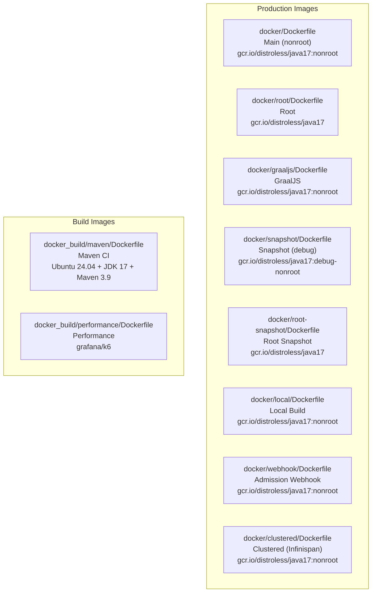
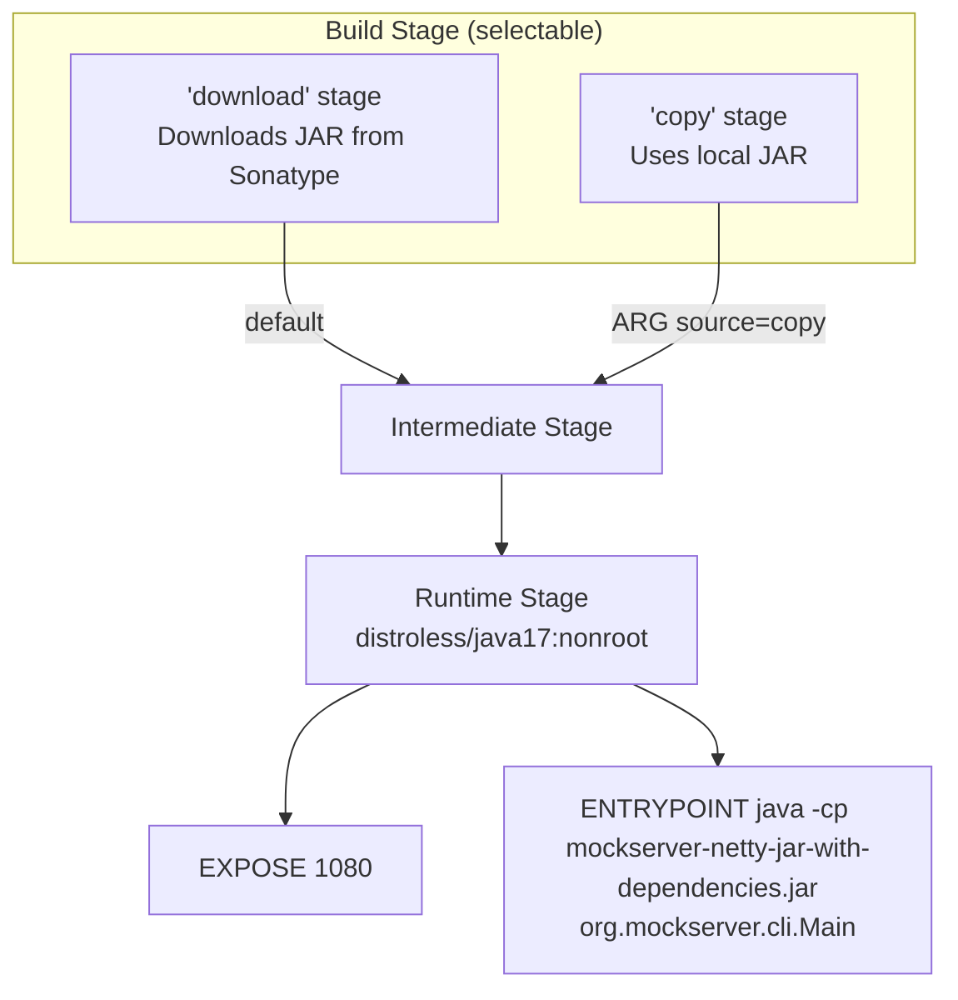

# Docker

## Image Variants

MockServer provides multiple Docker image variants for different use cases:



### Production Images

| Variant | Dockerfile | Base Image | User | Purpose |
|---------|-----------|------------|------|---------|
| Main | `docker/Dockerfile` | `gcr.io/distroless/java17:nonroot` | `nonroot` | Default production image |
| Root | `docker/root/Dockerfile` | `gcr.io/distroless/java17` | `root` | When root access is needed |
| GraalJS | `docker/graaljs/Dockerfile` | `gcr.io/distroless/java17:nonroot` | `nonroot` | Includes GraalJS for JS templating |
| Snapshot | `docker/snapshot/Dockerfile` | `gcr.io/distroless/java17:debug-nonroot` | `nonroot` | Testing pre-release builds |
| Root Snapshot | `docker/root-snapshot/Dockerfile` | `gcr.io/distroless/java17` | `root` | Testing pre-release (root) |
| Local | `docker/local/Dockerfile` | `gcr.io/distroless/java17:nonroot` | `nonroot` | Building from local JAR |
| Webhook | `docker/webhook/Dockerfile` | `gcr.io/distroless/java17:nonroot` | `nonroot` | Kubernetes admission webhook for sidecar injection |
| Clustered | `docker/clustered/Dockerfile` | `gcr.io/distroless/java17:nonroot` | `nonroot` | Infinispan state backend for multi-node clustering |

### Docker Registries

Images are published to two registries:

| Registry | Image | Notes |
|----------|-------|-------|
| Docker Hub | `mockserver/mockserver` | Primary registry (main MockServer image) |
| Docker Hub | `mockserver/mockserver-webhook` | Admission webhook image |
| AWS ECR Public | `public.ecr.aws/mockserver/mockserver` | Avoids Docker Hub rate limits for AWS-based CI/CD |
| AWS ECR Public | `public.ecr.aws/mockserver/mockserver-webhook` | Webhook image on ECR |

Both registries receive the same tags on every push. On each merge to `master`, the legacy Buildkite pipeline (`.buildkite/scripts/steps/java-docker-push-snapshot.sh`) pushes the `:snapshot`, `:mockserver-snapshot`, and `-graaljs` snapshot variants (plus `:snapshot` / `:mockserver-snapshot` for the webhook image). During releases, the release pipeline (`scripts/release/components/docker.sh`) pushes `:latest`, `:X.Y.Z`, `:mockserver-X.Y.Z`, `-graaljs`, `clustered-*`, and webhook release variants. The `:latest` tag is pushed only by the release pipeline, not by the legacy Buildkite docker-push-release step. The `:latest` tag always points to the most recent official release, not the development branch.

Release images are cosign-signed by digest after push (see below). Snapshot images are not signed.

The `-clustered` image variant (`clustered-X.Y.Z`, `clustered-mockserver-X.Y.Z`, `clustered-latest`) is published alongside the base and GraalJS images at release time. It bundles the `mockserver-state-infinispan` module and its transitive dependencies (Infinispan, JGroups, etc.) plus `netty-tcnative-boringssl-static` for native TLS. The build is error-isolated: a clustered image push failure does not abort the release since the main images have already been published.

### Verifying Image Signatures

Release images are cosign-signed by digest after push using the project's signing key (stored in AWS Secrets Manager `mockserver-release/cosign-key`). Signing uses the same key infrastructure as the Helm chart signing in `scripts/release/components/helm.sh`. The release Docker step runs on the **release** queue (the only queue granted `read_release_secrets`, which includes the cosign key) and auto-installs the pinned cosign binary into `.tmp/` if it is not already on the agent.

To verify a release image:

```bash
# Install cosign: https://docs.sigstore.dev/cosign/system_config/installation/

# Verify by digest (most reliable — binds to exact manifest content)
cosign verify \
  --key https://www.mock-server.com/mockserver-cosign.pub \
  mockserver/mockserver@sha256:<digest>

# Or verify the tag (resolves to digest internally)
cosign verify \
  --key https://www.mock-server.com/mockserver-cosign.pub \
  mockserver/mockserver:7.0.0
```

The public key corresponding to `mockserver-release/cosign-key` is **published at `https://www.mock-server.com/mockserver-cosign.pub`** (source: `jekyll-www.mock-server.com/mockserver-cosign.pub`; an identical copy is at `helm/mockserver/cosign.pub`). It can also be re-derived from the private key with `cosign public-key --key cosign.key`. The same key signs the Helm chart.

Signing is non-fatal in the release pipeline: if the key is absent (or the cosign binary cannot be downloaded), images are published unsigned and the release continues. The cosign binary itself is no longer a prerequisite — the release step downloads and checksum-verifies it on demand.

> **IAM note:** the signing step is gated by `aws secretsmanager describe-secret mockserver-release/cosign-key`, so the release-queue role needs **`secretsmanager:DescribeSecret`** on that secret in addition to `GetSecretValue` — otherwise the probe fails and signing is silently skipped (this caused the 7.0.0 chart/images to publish unsigned until the grant was added to `read_release_secrets`).

### Base Image CVE Baseline

Image scanners (Trivy, Grype, the ArtifactHub Helm security report) will always show a residual set of CVEs against the **distroless base image**, not against MockServer code or its Maven dependencies. This is expected and is not a release blocker.

**Why these appear:** every production image runs on `gcr.io/distroless/java17` (digest-pinned). That base ships the JRE plus the minimal set of Debian OS libraries the JRE links against — `libc6`, `libexpat1` (XML), `zlib1g`, `libuuid1`, `libpng16` / `liblcms2-2` (AWT imaging), `libbz2-1.0`. Scanners report any open Debian advisory against those packages. They are part of the base layer; MockServer neither installs nor controls them.

**Why a Java/JRE version bump does not clear them:** the CVEs are against the OS packages in the Debian layer, independent of the JRE major version. Changing the *build* toolchain JDK (e.g. building the release on JDK 17 rather than JDK 11) does not alter the runtime base image's OS package set at all.

**Why they often cannot be remediated at build time:** most carry `Fixed in: -` (`Fixable: 0`) in the report, meaning Debian has not yet published a patched package. When no upstream fix exists, there is nothing to pull in — re-pinning to the newest distroless digest removes nothing. Such advisories clear only once Debian ships patched packages **and** the distroless base is rebuilt **and** we adopt the new digest.

**How the digest stays current:** digest re-pinning is automated — Dependabot's `docker` ecosystem (see [`.github/dependabot.yml`](../../.github/dependabot.yml)) opens a bump PR whenever the upstream digest of a pinned base image moves. So when distroless rebuilds with fixed OS packages, the update arrives as a routine dependency PR; no manual re-pin or release-time step is required. Only the Dockerfile directories registered in `dependabot.yml` are auto-bumped — when adding a new Dockerfile directory, register it there too or its base image will not be tracked.

**What to check when triaging a base-image CVE report:**

1. Confirm the flagged package is an OS library from the distroless base (`libc6`, `libexpat1`, `zlib1g`, `libuuid1`, `libpng16`, `liblcms2-2`, `libbz2-1.0`, …) rather than a bundled Maven artifact — only the latter is actionable in our build.
2. Check the `Fixed in` column. `-` means no upstream fix exists yet → expected baseline, no action. A concrete version means distroless has likely already rebuilt → ensure the Dependabot digest-bump PR has merged (or merge it).
3. Assess reachability — these libraries are largely inert for MockServer's HTTP/proxy hot paths (e.g. no untrusted-XML-through-expat path), which is why an unpatched base CVE is rarely a practical risk.

### Docker HEALTHCHECK

All production MockServer **server** Dockerfiles include a built-in `HEALTHCHECK` instruction that runs a lightweight Java class (`org.mockserver.cli.HealthCheck`) to verify MockServer is serving requests. The health check calls `PUT /mockserver/status` internally — no shell, curl, or external tools required. The one exception is the admission-webhook image (`docker/webhook/Dockerfile`), which deliberately has no `HEALTHCHECK` — it is a short-lived Kubernetes sidecar-injection webhook rather than a long-running server, and its liveness/readiness is governed by Kubernetes probes against the webhook endpoint.

```dockerfile
HEALTHCHECK --interval=10s --timeout=5s --start-period=120s --retries=3 \
  CMD ["java", "-cp", "/mockserver-netty-jar-with-dependencies.jar", "org.mockserver.cli.HealthCheck"]
```

The health check reads `SERVER_PORT` / `MOCKSERVER_SERVER_PORT` to determine the correct port (defaults to 1080).

### Main Dockerfile Build Process



The main Dockerfile supports two source modes via the `source` build ARG:

- **`download`** (default): Downloads `mockserver-netty-jar-with-dependencies.jar` from Sonatype and `netty-tcnative-boringssl-static` from Maven Central
- **`copy`**: Copies a locally-built JAR from the Docker context; downloads `netty-tcnative-boringssl-static` from Maven Central

Both modes download `netty-tcnative-boringssl-static` from Maven Central (`repo1.maven.org`) for TLS performance.

**Exposed port:** 1080

> **MCP endpoint:** When `mcpEnabled=true` (via system property or `mockserver.properties`), the MCP (Model Context Protocol) endpoint is available at `/mockserver/mcp` on the same port. AI agents can connect using HTTP+SSE transport.

**Entry point:** `java -Dfile.encoding=UTF-8 -cp /mockserver-netty-jar-with-dependencies.jar:/libs/* -Dmockserver.propertyFile=/config/mockserver.properties org.mockserver.cli.Main`

### Build Images

| Image | Dockerfile | Base | Purpose |
|-------|-----------|------|---------|
| `mockserver/mockserver:maven` | `docker_build/maven/Dockerfile` | Ubuntu 24.04 | CI builds — JDK 17, Maven 3.9.16 |
| `mockserver/mockserver:performance` | `docker_build/performance/Dockerfile` | `grafana/k6` | Load testing with k6 |

## Docker Compose Examples

Three reference configurations demonstrate different MockServer setup approaches:

### By Volume Mount

```
docker/docker-compose/configure_by_volume_mount/
```

Mounts a `mockserver.properties` file and `initializerJson.json` into the container.

### By Command Arguments

```
docker/docker-compose/configure_by_command/
```

Passes configuration via command-line arguments to the MockServer CLI.

### By Environment Properties

```
docker/docker-compose/configure_by_environment_properties/
```

Uses environment variables (`MOCKSERVER_*`) for configuration.

## Multi-Architecture Build

Production images are built for both `linux/amd64` and `linux/arm64` using Buildkite with QEMU emulation on x86_64 agents:

```bash
# Triggered via Buildkite docker-push-release pipeline
# Set RELEASE_TAG=mockserver-X.Y.Z environment variable when triggering
```

See [CI/CD](ci-cd.md) for full pipeline details.

## Local Docker Operations

```bash
# Build from local JAR
docker/local/local_docker_build.sh

# Run locally built image
docker/local/local_docker_run.sh

# Run with cAdvisor monitoring
docker/local/local_docker_cadvisor_run.sh

# Launch interactive Maven container
scripts/local_docker_launch.sh
```

## Container Integration Tests

The `container_integration_tests/` directory contains 24 automated tests (16 Docker Compose + 8 Helm), plus non-blocking smoke tests for image variants:

```mermaid
graph TD
    TESTS[integration_tests.sh]

    subgraph "Docker Compose Tests (16)"
        DC1[Without server port]
        DC2[Default properties file]
        DC3[Custom properties file]
        DC4[Server port by command]
        DC5[Env var long name]
        DC6[Env var short name]
        DC7[Remote host/port]
        DC8[Persisted expectations]
        DC9[Expectation initialiser]
        DC10[Forward with override]
        DC11[mTLS]
        DC12[JVM options]
        DC13[Libs classpath]
        DC14[Graceful shutdown]
        DC15[Metrics]
        DC16[WAR Tomcat]
    end

    subgraph "Helm Tests (8)"
        H1[Default Helm values]
        H2[Helm with local Docker image]
        H3[Helm with custom port]
        H4[Helm with remote host/port]
        H5[Helm with inline config]
        H6[Helm ConfigMap injection]
        H7[Helm MockServer config chart]
        H8[Clustered state convergence]
    end

    TESTS --> DC1
    TESTS --> DC2
    TESTS --> DC3
    TESTS --> DC4
    TESTS --> DC5
    TESTS --> DC6
    TESTS --> DC7
    TESTS --> DC8
    TESTS --> DC9
    TESTS --> DC10
    TESTS --> DC11
    TESTS --> DC12
    TESTS --> DC13
    TESTS --> DC14
    TESTS --> DC15
    TESTS --> DC16
    TESTS --> H1
    TESTS --> H2
    TESTS --> H3
    TESTS --> H4
    TESTS --> H5
    TESTS --> H6
    TESTS --> H7
    TESTS --> H8
```



Each test:
1. Starts MockServer (via Docker Compose or Helm/k3d)
2. Creates expectations via the REST API
3. Validates responses using a curl-based client container
4. Tears down the environment

### Helper Scripts

| Script | Purpose |
|--------|---------|
| `integration_tests.sh` | Main orchestrator: builds images, runs all tests, prints summary |
| `docker-compose.sh` | Docker Compose helpers: `start-up`, `tear-down`, `docker-exec`, `container-logs` |
| `helm-deploy.sh` | k3d cluster lifecycle: `start-up-k8s`, `tear-down-k8s`, Helm install/uninstall |
| `logging.sh` | Coloured terminal output, `runCommand`, `retryCommand`, `logTestResult` |

### Environment Variable Controls

| Variable | Purpose |
|----------|---------|
| `SKIP_JAVA_BUILD` | Skip `mvnw package` step |
| `SKIP_DOCKER_BUILD_MOCKSERVER` | Skip building MockServer Docker image |
| `SKIP_DOCKER_REBUILD_CLIENT` | Skip rebuilding the curl client image |
| `SKIP_ALL_TESTS` | Skip all tests (build only) |
| `SKIP_DOCKER_TESTS` | Skip Docker Compose tests |
| `SKIP_HELM_TESTS` | Skip Helm/k3d tests |

See [Testing](../testing.md) for full details on running container integration tests.

## Maven CI Image

### Building Locally

The Maven CI image supports an optional corporate CA certificate for environments behind a TLS inspection proxy:

```bash
# Copy your corporate root CA certificate (optional, for TLS proxy environments)
cp /path/to/your/corporate-root-ca.pem docker_build/maven/corporate-root-ca.pem

# Build the image (native architecture)
docker build -t mockserver/mockserver:maven docker_build/maven/
```

Without a corporate CA cert, create an empty `corporate-root-ca.pem` file (or copy the `.pem.example` placeholder). The Dockerfile detects the empty file and skips certificate injection.

### Cross-Architecture Build (amd64 on Apple Silicon)

Buildkite agents run on amd64 EC2 instances. When building on Apple Silicon, cross-compile to amd64 before pushing:

```bash
docker buildx build \
    --builder desktop-linux \
    --platform linux/amd64 \
    --load \
    -t mockserver/mockserver:maven \
    docker_build/maven/
```

**Important:** Use the `desktop-linux` buildx builder, not `docker-container` builders (e.g. `multiplatform`). The `docker-container` driver runs in its own container and does not inherit the host's TLS certificate trust store, causing `x509: certificate signed by unknown authority` errors behind corporate TLS proxies.

Verify the architecture before pushing:

```bash
docker inspect mockserver/mockserver:maven --format '{{.Architecture}}'
# Should print: amd64
```

### Corporate CA Certificate

The Dockerfile supports injecting a corporate root CA certificate at build time:

- **Placeholder:** `docker_build/maven/corporate-root-ca.pem.example` (empty, committed to git)
- **Real cert:** `docker_build/maven/corporate-root-ca.pem` (gitignored, local only)
- If the cert file has content, it is added to the OS trust store (`update-ca-certificates`) and the Java truststore (`keytool`)
- In CI (Buildkite), the empty placeholder is used — no corporate CA is needed

### Automated Build

The Maven CI image is built and pushed to Docker Hub by the Buildkite pipeline `.buildkite/docker-push-maven.yml`:

- **Trigger:** Manual (via Buildkite UI or API)
- **Auth:** Docker Hub credentials from AWS Secrets Manager (`mockserver-build/dockerhub`)
- **Tag:** `mockserver/mockserver:maven`

See [CI/CD](ci-cd.md) for details.
