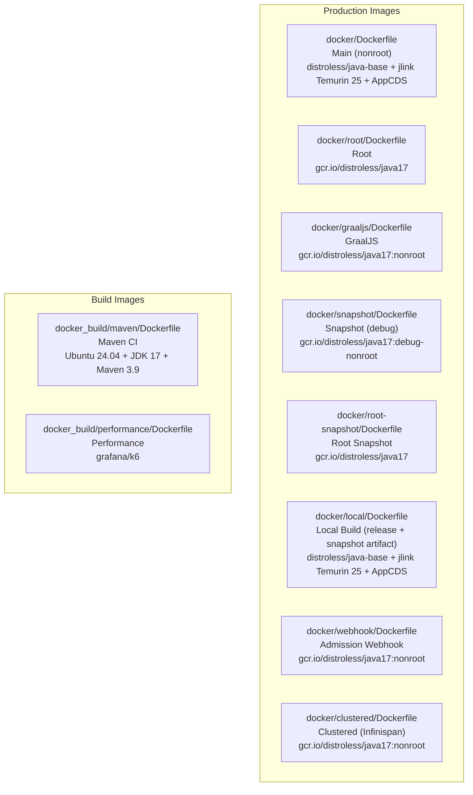
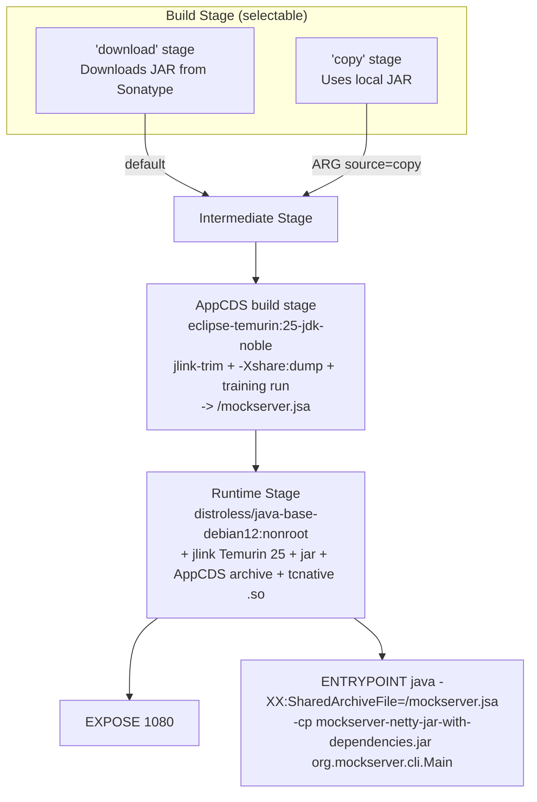

# Docker

## Image Variants

MockServer provides multiple Docker image variants for different use cases:


```mermaid
graph TB
    subgraph "Production Images"
        MAIN["docker/Dockerfile
Main (nonroot)
distroless/java-base + jlink Temurin 25 + AppCDS"]
        ROOT["docker/root/Dockerfile
Root
gcr.io/distroless/java17"]
        GRAAL["docker/graaljs/Dockerfile
GraalJS
gcr.io/distroless/java17:nonroot"]
        SNAP["docker/snapshot/Dockerfile
Snapshot (debug)
gcr.io/distroless/java17:debug-nonroot"]
        RSNAP["docker/root-snapshot/Dockerfile
Root Snapshot
gcr.io/distroless/java17"]
        LOCAL["docker/local/Dockerfile
Local Build (release + snapshot artifact)
distroless/java-base + jlink Temurin 25 + AppCDS"]
        WEBHOOK["docker/webhook/Dockerfile
Admission Webhook
gcr.io/distroless/java17:nonroot"]
        CLUSTERED["docker/clustered/Dockerfile
Clustered (Infinispan)
gcr.io/distroless/java17:nonroot"]
    end

    subgraph "Build Images"
        MVN["docker_build/maven/Dockerfile
Maven CI
Ubuntu 24.04 + JDK 17 + Maven 3.9"]
        PERF["docker_build/performance/Dockerfile
Performance
grafana/k6"]
    end
```

### Production Images

| Variant | Dockerfile | Base Image | User | Purpose |
|---------|-----------|------------|------|---------|
| Main | `docker/Dockerfile` | `gcr.io/distroless/java-base-debian12:nonroot` + jlink-trimmed Temurin 25 + AppCDS | `nonroot` | Default production **reference** image (download mode); ships netty-tcnative + a baked AppCDS archive (~⅓ faster time-to-ready). JVM is JDK 25; the library is still compiled to the Java 17 floor (runtime-only) |
| Root | `docker/root/Dockerfile` | `gcr.io/distroless/java17` | `root` | When root access is needed |
| GraalJS | `docker/graaljs/Dockerfile` | `gcr.io/distroless/java17:nonroot` | `nonroot` | Includes GraalJS for JS templating |
| Snapshot | `docker/snapshot/Dockerfile` | `gcr.io/distroless/java17:debug-nonroot` | `nonroot` | Testing pre-release builds |
| Root Snapshot | `docker/root-snapshot/Dockerfile` | `gcr.io/distroless/java17` | `root` | Testing pre-release (root) |
| Local | `docker/local/Dockerfile` | `gcr.io/distroless/java-base-debian12:nonroot` + jlink-trimmed Temurin 25 + AppCDS | `nonroot` | The image the release **and** snapshot pipelines actually build+push as `mockserver/mockserver:<ver>` / `:snapshot`; builds from a local JAR, bakes a baked AppCDS archive (~⅓ faster time-to-ready); no netty-tcnative (JDK TLS provider). JVM is JDK 25; the library is still compiled to the Java 17 floor (runtime-only) |
| Webhook | `docker/webhook/Dockerfile` | `gcr.io/distroless/java17:nonroot` | `nonroot` | Kubernetes admission webhook for sidecar injection |
| Clustered | `docker/clustered/Dockerfile` | `gcr.io/distroless/java17:nonroot` | `nonroot` | Infinispan state backend for multi-node clustering |
| AOT (experimental) | `docker/aot/Dockerfile` | `gcr.io/distroless/java-base-debian12:nonroot` + jlink-trimmed Temurin 25 | `nonroot` | EXPERIMENTAL, published as opt-in `X.Y.Z-aot` / `latest-aot` tags (Docker Hub + ECR Public) from the next release; bakes a JDK 25 AOT cache (JEP 483/514) at image-build time via a training run; ~2× faster time-to-ready; JDK TLS provider (no tcnative) |

### Docker Registries

Images are published to two registries:

| Registry | Image | Notes |
|----------|-------|-------|
| Docker Hub | `mockserver/mockserver` | Primary registry (main MockServer image) |
| Docker Hub | `mockserver/mockserver-webhook` | Admission webhook image |
| AWS ECR Public | `public.ecr.aws/mockserver/mockserver` | Avoids Docker Hub rate limits for AWS-based CI/CD |
| AWS ECR Public | `public.ecr.aws/mockserver/mockserver-webhook` | Webhook image on ECR |

Both registries receive the same tags on every push. On each merge to `master`, the legacy Buildkite pipeline (`.buildkite/scripts/steps/java-docker-push-snapshot.sh`) pushes the `:snapshot`, `:mockserver-snapshot`, and `-graaljs` snapshot variants (plus `:snapshot` / `:mockserver-snapshot` for the webhook image). During releases, the release pipeline (`scripts/release/components/docker.sh`) pushes `:latest`, `:X.Y.Z`, `:mockserver-X.Y.Z`, `-graaljs`, `clustered-*`, `-aot` (experimental, error-isolated), and webhook release variants. The `:latest` tag is pushed only by the release pipeline, not by the per-merge snapshot step. The `:latest` tag always points to the most recent official release, not the development branch.

Release images are cosign-signed by digest after push (see below). Snapshot images are not signed.

The `-clustered` image variant (`clustered-X.Y.Z`, `clustered-mockserver-X.Y.Z`, `clustered-latest`) is published alongside the base and GraalJS images at release time. It bundles the `mockserver-state-infinispan` module and its transitive dependencies (Infinispan, JGroups, etc.) plus `netty-tcnative-boringssl-static` for native TLS. The build is error-isolated: a clustered image push failure does not abort the release since the main images have already been published.

The **AOT experimental variant** (`docker/aot/Dockerfile`) is published as opt-in `X.Y.Z-aot`, `mockserver-X.Y.Z-aot`, and `latest-aot` tags (Docker Hub + ECR Public) from the next release, alongside the base and GraalJS images. Like the clustered image it is error-isolated in the release pipeline: an `-aot` build or push failure does not abort the release, since the main images have already been published by that point (the arm64 training run executes under QEMU emulation and is the most likely failure point). It copies a jlink-trimmed JDK 25 (Eclipse Temurin 25) runtime onto `gcr.io/distroless/java-base-debian12:nonroot`, runs a training start of MockServer during the image build to produce a JDK 25 AOT cache (JEP 483/514), and bakes that cache into the final image layer. At runtime the JVM loads the cache with `-XX:AOTCache=/mockserver.aot`, cutting time-to-ready by roughly half (~0.35 s vs ~0.7–0.8 s for the standard image). The AOT cache is CPU-architecture and JDK-build specific, so a separate cache is baked for each platform in a multi-arch build. When the soft-fail build succeeds, the published `-aot` tags are cosign-signed like every other release image (the signing step adds them only when the build actually pushed); it is not mirrored to GHCR. TLS uses the JDK provider rather than netty-tcnative; functional parity is complete (unlike GraalVM native-image). It can also be built from a repository checkout for local evaluation: `cd docker/aot && touch ca-bundle.pem && docker build .` (the `ca-bundle.pem` file must exist in the build context — it may be empty unless you are behind a corporate TLS-inspection proxy).

### Verifying Image Signatures

Release images are cosign-signed by digest after push using the project's signing key (stored in AWS Secrets Manager `mockserver-release/cosign-key`). Signing uses the same key infrastructure as the Helm chart signing in `scripts/release/components/helm.sh`. The release Docker step runs on the **release** queue (the only queue granted `read_release_secrets`, which includes the cosign key) and auto-installs the pinned cosign binary into `.tmp/` if it is not already on the agent.

To verify a release image:

```bash
# Install cosign: https://docs.sigstore.dev/cosign/system_config/installation/

# Verify by digest (most reliable — binds to exact manifest content)
cosign verify \
  --key https://www.mock-server.com/mockserver-cosign.pub \
  mockserver/mockserver@sha256:<digest>

# Or verify the tag (resolves to digest internally)
cosign verify \
  --key https://www.mock-server.com/mockserver-cosign.pub \
  mockserver/mockserver:7.4.0
```

The public key corresponding to `mockserver-release/cosign-key` is **published at `https://www.mock-server.com/mockserver-cosign.pub`** (source: `jekyll-www.mock-server.com/mockserver-cosign.pub`; an identical copy is at `helm/mockserver/cosign.pub`). It can also be re-derived from the private key with `cosign public-key --key cosign.key`. The same key signs the Helm chart.

Signing is non-fatal in the release pipeline: if the key is absent (or the cosign binary cannot be downloaded), images are published unsigned and the release continues. The cosign binary itself is no longer a prerequisite — the release step downloads and checksum-verifies it on demand.

> **IAM note:** the signing step is gated by `aws secretsmanager describe-secret mockserver-release/cosign-key`, so the release-queue role needs **`secretsmanager:DescribeSecret`** on that secret in addition to `GetSecretValue` — otherwise the probe fails and signing is silently skipped (this caused the 7.4.0 chart/images to publish unsigned until the grant was added to `read_release_secrets`).

### Base Image CVE Baseline

Image scanners (Trivy, Grype, the ArtifactHub Helm security report) will always show a residual set of CVEs against the **distroless base image**, not against MockServer code or its Maven dependencies. This is expected and is not a release blocker.

**Why these appear:** every production image runs on `gcr.io/distroless/java17` (digest-pinned). That base ships the JRE plus the minimal set of Debian OS libraries the JRE links against — `libc6`, `libexpat1` (XML), `zlib1g`, `libuuid1`, `libpng16` / `liblcms2-2` (AWT imaging), `libbz2-1.0`. Scanners report any open Debian advisory against those packages. They are part of the base layer; MockServer neither installs nor controls them.

**Why a Java/JRE version bump does not clear them:** the CVEs are against the OS packages in the Debian layer, independent of the JRE major version. Changing the *build* toolchain JDK (e.g. building the release on JDK 17 rather than JDK 11) does not alter the runtime base image's OS package set at all.

**Why they often cannot be remediated at build time:** most carry `Fixed in: -` (`Fixable: 0`) in the report, meaning Debian has not yet published a patched package. When no upstream fix exists, there is nothing to pull in — re-pinning to the newest distroless digest removes nothing. Such advisories clear only once Debian ships patched packages **and** the distroless base is rebuilt **and** we adopt the new digest.

**How the digest stays current:** digest re-pinning is automated — Dependabot's `docker` ecosystem (see [`.github/dependabot.yml`](../../.github/dependabot.yml)) opens a bump PR whenever the upstream digest of a pinned base image moves. So when distroless rebuilds with fixed OS packages, the update arrives as a routine dependency PR; no manual re-pin or release-time step is required. Only the Dockerfile directories registered in `dependabot.yml` are auto-bumped — when adding a new Dockerfile directory, register it there too or its base image will not be tracked.

**What to check when triaging a base-image CVE report:**

1. Confirm the flagged package is an OS library from the distroless base (`libc6`, `libexpat1`, `zlib1g`, `libuuid1`, `libpng16`, `liblcms2-2`, `libbz2-1.0`, …) rather than a bundled Maven artifact — only the latter is actionable in our build.
2. Check the `Fixed in` column. `-` means no upstream fix exists yet → expected baseline, no action. A concrete version means distroless has likely already rebuilt → ensure the Dependabot digest-bump PR has merged (or merge it).
3. Assess reachability — these libraries are largely inert for MockServer's HTTP/proxy hot paths (e.g. no untrusted-XML-through-expat path), which is why an unpatched base CVE is rarely a practical risk.

### Docker HEALTHCHECK

All production MockServer **server** Dockerfiles include a built-in `HEALTHCHECK` instruction that runs a lightweight Java class (`org.mockserver.cli.HealthCheck`) to verify MockServer is serving requests. The health check calls `PUT /mockserver/status` internally — no shell, curl, or external tools required. The one exception is the admission-webhook image (`docker/webhook/Dockerfile`), which deliberately has no `HEALTHCHECK` — it is a short-lived Kubernetes sidecar-injection webhook rather than a long-running server, and its liveness/readiness is governed by Kubernetes probes against the webhook endpoint.

```dockerfile
HEALTHCHECK --interval=10s --timeout=5s --start-period=120s --retries=3 \
  CMD ["java", "-cp", "/mockserver-netty-jar-with-dependencies.jar", "org.mockserver.cli.HealthCheck"]
```

The health check reads `SERVER_PORT` / `MOCKSERVER_SERVER_PORT` to determine the correct port (defaults to 1080).

### Main Dockerfile Build Process


```mermaid
flowchart TD
    subgraph "Build Stage (selectable)"
        DL["'download' stage
Downloads JAR from Sonatype"]
        CP["'copy' stage
Uses local JAR"]
    end

    DL -->|default| INT[Intermediate Stage]
    CP -->|ARG source=copy| INT

    INT --> AC["AppCDS build stage
eclipse-temurin:25-jdk-noble
jlink-trim + -Xshare:dump + training run
-> /mockserver.jsa"]
    AC --> RT["Runtime Stage
distroless/java-base-debian12:nonroot
+ jlink Temurin 25 + jar + AppCDS archive + tcnative .so"]

    RT --> EXPOSE["EXPOSE 1080"]
    RT --> ENTRY["ENTRYPOINT java -XX:SharedArchiveFile=/mockserver.jsa
-cp mockserver-netty-jar-with-dependencies.jar org.mockserver.cli.Main"]
```

The main Dockerfile supports two source modes via the `source` build ARG:

- **`download`** (default): Downloads `mockserver-netty-jar-with-dependencies.jar` from Sonatype and `netty-tcnative-boringssl-static` from Maven Central
- **`copy`**: Copies a locally-built JAR from the Docker context; downloads `netty-tcnative-boringssl-static` from Maven Central

Both modes download `netty-tcnative-boringssl-static` from Maven Central (`repo1.maven.org`) for TLS performance.

After the source stage the JAR flows through an **AppCDS build stage** (see [AppCDS Standard Image](#appcds-standard-image-fast-start) below) that jlink-trims a JDK 25 runtime and produces a baked AppCDS archive via a training run; the runtime stage copies that trimmed runtime, the archive, the JAR, and the tcnative `.so` onto `distroless/java-base-debian12`. The JVM in the runtime image is JDK 25; the MockServer library itself is still compiled to the Java 17 bytecode floor, so this is a runtime-only choice (the jar runs unmodified on the newer JVM).

**Exposed port:** 1080

> **MCP endpoint:** When `mcpEnabled=true` (via system property or `mockserver.properties`), the MCP (Model Context Protocol) endpoint is available at `/mockserver/mcp` on the same port. AI agents can connect using HTTP+SSE transport.

**Entry point:** `/usr/lib/jvm/temurin25-trimmed/bin/java -Dfile.encoding=UTF-8 -XX:MaxRAMPercentage=75.0 -XX:SharedArchiveFile=/mockserver.jsa -cp /mockserver-netty-jar-with-dependencies.jar:/libs/* -Dmockserver.propertyFile=/config/mockserver.properties org.mockserver.cli.Main`

**Heap cap:** `-XX:MaxRAMPercentage=75.0` limits the JVM heap to 75% of the container's memory limit so the in-memory request/expectation ring buffers size off a bounded heap rather than total node memory. The Helm chart delivers any `app.jvmOptions` value via the `JAVA_TOOL_OPTIONS` environment variable; the JVM **prepends** `JAVA_TOOL_OPTIONS` flags before the command-line args, so the `ENTRYPOINT`'s `-XX:MaxRAMPercentage=75.0` is evaluated **last** and wins over any competing `MaxRAMPercentage` in `jvmOptions`. An explicit `-Xmx` in `jvmOptions` (or `JAVA_TOOL_OPTIONS`) does disable `MaxRAMPercentage` — once `-Xmx` is present the flag is ignored. Both `docker/Dockerfile` and `docker/clustered/Dockerfile` include this flag.

### AppCDS Standard Image (fast start)

**Outcome:** the standard image (`docker/local/Dockerfile`, which the release **and** snapshot pipelines build+push, and its download-mode reference `docker/Dockerfile`) bakes an **Application Class Data Sharing (AppCDS)** archive over the MockServer + library classes at image-build time. This cuts container time-to-ready by roughly a third (measured ~855 ms → ~570 ms launch-to-ready on an arm64 host, median of 5; that figure was measured on the JDK 17 runtime and should be re-measured on JDK 25 — a single local container observation post-bump was comparable) while remaining the real HotSpot JVM with 100% feature parity. It uses the same train-at-build + jlink-runtime shape as the experimental `-aot` image, on a JDK 25 runtime with an AppCDS archive rather than the `-aot` variant's JDK 25 Leyden AOT cache. The MockServer library is still compiled to the Java 17 bytecode floor — the JDK 25 runtime is a runtime-only choice.

**Build shape (three stages):**

1. **Source stage** (`download` / `copy`, unchanged) produces `mockserver-netty-jar-with-dependencies.jar` (+ tcnative in `docker/Dockerfile`).
2. **AppCDS build stage** (`eclipse-temurin:25-jdk-noble`): `jlink` trims a JDK 25 runtime with the same module set as the binary bundle (`java.se,jdk.unsupported,jdk.crypto.ec,jdk.crypto.cryptoki,jdk.naming.dns,jdk.zipfs`, see `scripts/build-binary-bundle.sh`). A jlink image does **not** carry the JDK's default CDS base archive, so `java -Xshare:dump` regenerates it from the bundled `lib/classlist`. A **training run** then starts MockServer with `-XX:ArchiveClassesAtExit=/mockserver.jsa`, polls the bundled `org.mockserver.cli.HealthCheck` until the status endpoint answers (which also drives the post-bind warmup so the first-request class burst is archived), and stops cleanly so the JVM writes the dynamic archive at exit. An `ls -l /mockserver.jsa` fails the build if the archive was not produced.
3. **Runtime stage** (`gcr.io/distroless/java-base-debian12:nonroot`, digest-pinned — the **same base+digest as `docker/aot`**): copies the trimmed runtime to `/usr/lib/jvm/temurin25-trimmed`, plus the JAR, the `/mockserver.jsa` archive (and, in `docker/Dockerfile` only, the tcnative `.so`). The entrypoint adds `-XX:SharedArchiveFile=/mockserver.jsa`.

> **AppCDS vs Leyden AOT (both on JDK 25):** this image and `docker/aot/Dockerfile` both run a JDK 25 runtime and both use the `jlink --compress=zip-<level>` form (the legacy numeric `--compress=2` was removed after JDK 17). The difference is the baked artifact: this image bakes a classic **AppCDS** archive layered on a `-Xshare:dump` base CDS archive, whereas `-aot` bakes a **Leyden AOT cache** (which does not need the `-Xshare:dump` base layering). AppCDS keeps the standard image on the graceful `-Xshare:auto` fallback so it can never hard-fail on the archive at release time.

**Archive / JDK-build coupling:** a CDS archive is only usable by the exact JDK build it was trained with (same constraint as the AOT cache), so the trimmed JDK runtime is **baked into the image alongside the archive**, and each platform of a multi-arch build trains + bakes its own archive. When re-pinning the `java-base` digest or bumping the Temurin 25 build, the archive is rebuilt automatically by the next image build — no separate step.

**Graceful fallback (validated):** the runtime relies on the JVM default `-Xshare:auto`, so a **missing or corrupt** `/mockserver.jsa` (bind-mounted away, arch mismatch, truncated) logs a CDS warning (`Unable to map shared spaces` / `bad magic number`) and starts **normally** rather than failing. This is the guarantee the DEFAULT image depends on — unlike the `-aot` variant it cannot soft-fail at release time. Verified by running the image with the archive replaced by `/dev/null` and by random bytes: both reached `PUT /mockserver/status` → 200.

**Image size:** roughly break-even with the old `distroless/java17` image (the jlink-trimmed JDK 25 runtime offsets the ~33 MB archive; measured ~411 MB vs ~422 MB for `mockserver/mockserver:7.4.0` — re-measure on JDK 25 at the next size audit).

**QEMU note (release/CI):** the release pipeline builds multi-arch via `buildx` on amd64 agents, so the **arm64 training run executes under QEMU emulation** and is slower than a native run. This is the same cost the `-aot` image already pays. Unlike `-aot` (which is error-isolated / soft-fail), the standard image is the primary artifact, so a training-run failure under QEMU would fail the build — the training loop polls for up to 120 s and stops cleanly, which is ample on emulated arm64.

**Peak-throughput tip (not shipped):** adding `-XX:TieredStopAtLevel=1` shaves further startup but caps peak JIT throughput — wrong default for load-injection users, so it is **not** set in the shipped images. Testcontainers / ephemeral users who value fast start over sustained throughput can add it via `JAVA_TOOL_OPTIONS`.

### Building Behind a Corporate TLS-Inspecting Proxy

**Outcome:** to build the image variants locally behind a corporate TLS proxy, point `MOCKSERVER_LOCAL_CA_BUNDLE` at your corporate root CA before building — CI and published images are byte-identical because the mechanism is a no-op when the variable is unset.

```bash
export MOCKSERVER_LOCAL_CA_BUNDLE=/path/to/corporate-root-ca.pem
# then build any variant as usual, e.g.:
docker build docker/            # base image (downloads from Maven Central via the proxy)
```

**How it works:** each variant's alpine download stage (`docker/`, `docker/root/`, `docker/snapshot/`, `docker/root-snapshot/`, `docker/clustered/`, `docker/graaljs/`) `COPY`s a `ca-bundle.pem` from the build context. When that file is non-empty, the stage trusts it before `apk add` and before the `wget` jar downloads from `repo1.maven.org`, so TLS interception does not break the build. When it is empty (the CI/published-image case), an `[ -s ]` guard skips all trust changes, so the build is identical to a no-CA build.

The release/CI scripts and the container-integration-test harness stage this file automatically via the shared `docker/ensure-ca-bundle.sh` helper: it copies `MOCKSERVER_LOCAL_CA_BUNDLE` (or the `NODE_EXTRA_CA_CERTS` / `AWS_CA_BUNDLE` fallbacks) into the context when set, otherwise writes an empty placeholder. All `ca-bundle.pem` files are gitignored. `docker/local` and `docker/webhook` do **not** use this mechanism: `docker/webhook` is single-stage, and although `docker/local` is now multi-stage (its AppCDS build stage runs on `eclipse-temurin`), that stage performs **no network downloads** (it only copies the local JAR, jlink-trims, and runs a training start), so it needs no CA-bundle trust even behind a TLS-inspecting proxy.

The same download stages also harden Maven Central downloads against transient DNS/connection blips by appending GNU-wget retry directives (`tries`, `timeout`, `waitretry`, `retry_on_host_error`, `retry_connrefused`) to `/etc/wgetrc`. BusyBox wget ignores `/etc/wgetrc`, so this is a safe no-op on images that fall back to it.

### Build Images

| Image | Dockerfile | Base | Purpose |
|-------|-----------|------|---------|
| `mockserver/mockserver:maven` | `docker_build/maven/Dockerfile` | Ubuntu 24.04 | CI builds — JDK 17, Maven 3.9.16 |
| `mockserver/mockserver:performance` | `docker_build/performance/Dockerfile` | `grafana/k6` | Load testing with k6 |

## Docker Compose Examples

Three reference configurations demonstrate different MockServer setup approaches:

### By Volume Mount

```
docker/docker-compose/configure_by_volume_mount/
```

Mounts a `mockserver.properties` file and `initializerJson.json` into the container.

### By Command Arguments

```
docker/docker-compose/configure_by_command/
```

Passes configuration via command-line arguments to the MockServer CLI.

### By Environment Properties

```
docker/docker-compose/configure_by_environment_properties/
```

Uses environment variables (`MOCKSERVER_*`) for configuration.

## Multi-Architecture Build

Production images are built for both `linux/amd64` and `linux/arm64` using Buildkite with QEMU emulation on x86_64 agents:

```bash
# Built and pushed by the release pipeline's Docker step
# (scripts/release/components/docker.sh, via release-runner.sh docker)
```

See [CI/CD](ci-cd.md) for full pipeline details.

## Local Docker Operations

```bash
# Build from local JAR
docker/local/local_docker_build.sh

# Run locally built image
docker/local/local_docker_run.sh

# Run with cAdvisor monitoring
docker/local/local_docker_cadvisor_run.sh

# Launch interactive Maven container
scripts/local_docker_launch.sh
```

## Container Integration Tests

The `container_integration_tests/` directory contains 24 automated tests (16 Docker Compose + 8 Helm), plus non-blocking smoke tests for image variants:


```mermaid
graph TD
    TESTS[integration_tests.sh]

    subgraph "Docker Compose Tests (16)"
        DC1[Without server port]
        DC2[Default properties file]
        DC3[Custom properties file]
        DC4[Server port by command]
        DC5[Env var long name]
        DC6[Env var short name]
        DC7[Remote host/port]
        DC8[Persisted expectations]
        DC9[Expectation initialiser]
        DC10[Forward with override]
        DC11[mTLS]
        DC12[JVM options]
        DC13[Libs classpath]
        DC14[Graceful shutdown]
        DC15[Metrics]
        DC16[WAR Tomcat]
    end

    subgraph "Helm Tests (8)"
        H1[Default Helm values]
        H2[Helm with local Docker image]
        H3[Helm with custom port]
        H4[Helm with remote host/port]
        H5[Helm with inline config]
        H6[Helm ConfigMap injection]
        H7[Helm MockServer config chart]
        H8[Clustered state convergence]
    end

    TESTS --> DC1
    TESTS --> DC2
    TESTS --> DC3
    TESTS --> DC4
    TESTS --> DC5
    TESTS --> DC6
    TESTS --> DC7
    TESTS --> DC8
    TESTS --> DC9
    TESTS --> DC10
    TESTS --> DC11
    TESTS --> DC12
    TESTS --> DC13
    TESTS --> DC14
    TESTS --> DC15
    TESTS --> DC16
    TESTS --> H1
    TESTS --> H2
    TESTS --> H3
    TESTS --> H4
    TESTS --> H5
    TESTS --> H6
    TESTS --> H7
    TESTS --> H8
```

Each test:
1. Starts MockServer (via Docker Compose or Helm/k3d)
2. Creates expectations via the REST API
3. Validates responses using a curl-based client container
4. Tears down the environment

### Helper Scripts

| Script | Purpose |
|--------|---------|
| `integration_tests.sh` | Main orchestrator: builds images, runs all tests, prints summary |
| `docker-compose.sh` | Docker Compose helpers: `start-up`, `tear-down`, `docker-exec`, `container-logs` |
| `helm-deploy.sh` | k3d cluster lifecycle: `start-up-k8s`, `tear-down-k8s`, Helm install/uninstall |
| `logging.sh` | Coloured terminal output, `runCommand`, `retryCommand`, `logTestResult` |

### Environment Variable Controls

| Variable | Purpose |
|----------|---------|
| `SKIP_JAVA_BUILD` | Skip `mvnw package` step |
| `SKIP_DOCKER_BUILD_MOCKSERVER` | Skip building MockServer Docker image |
| `SKIP_DOCKER_REBUILD_CLIENT` | Skip rebuilding the curl client image |
| `SKIP_ALL_TESTS` | Skip all tests (build only) |
| `SKIP_DOCKER_TESTS` | Skip Docker Compose tests |
| `SKIP_HELM_TESTS` | Skip Helm/k3d tests |

See [Testing](../testing.md) for full details on running container integration tests.

## Maven CI Image

### Building Locally

The Maven CI image supports an optional corporate CA certificate for environments behind a TLS inspection proxy:

```bash
# Copy your corporate root CA certificate (optional, for TLS proxy environments)
cp /path/to/your/corporate-root-ca.pem docker_build/maven/corporate-root-ca.pem

# Build the image (native architecture)
docker build -t mockserver/mockserver:maven docker_build/maven/
```

Without a corporate CA cert, create an empty `corporate-root-ca.pem` file (or copy the `.pem.example` placeholder). The Dockerfile detects the empty file and skips certificate injection.

### Cross-Architecture Build (amd64 on Apple Silicon)

Buildkite agents run on amd64 EC2 instances. When building on Apple Silicon, cross-compile to amd64 before pushing:

```bash
docker buildx build \
    --builder desktop-linux \
    --platform linux/amd64 \
    --load \
    -t mockserver/mockserver:maven \
    docker_build/maven/
```

**Important:** Use the `desktop-linux` buildx builder, not `docker-container` builders (e.g. `multiplatform`). The `docker-container` driver runs in its own container and does not inherit the host's TLS certificate trust store, causing `x509: certificate signed by unknown authority` errors behind corporate TLS proxies.

Verify the architecture before pushing:

```bash
docker inspect mockserver/mockserver:maven --format '{{.Architecture}}'
# Should print: amd64
```

### Corporate CA Certificate

The Dockerfile supports injecting a corporate root CA certificate at build time:

- **Placeholder:** `docker_build/maven/corporate-root-ca.pem.example` (empty, committed to git)
- **Real cert:** `docker_build/maven/corporate-root-ca.pem` (gitignored, local only)
- If the cert file has content, it is added to the OS trust store (`update-ca-certificates`) and the Java truststore (`keytool`)
- In CI (Buildkite), the empty placeholder is used — no corporate CA is needed

### Automated Build

The Maven CI image is built and pushed to Docker Hub by the Buildkite pipeline `.buildkite/docker-push-maven.yml`:

- **Trigger:** Manual (via Buildkite UI or API)
- **Auth:** Docker Hub credentials from AWS Secrets Manager (`mockserver-build/dockerhub`)
- **Tag:** `mockserver/mockserver:maven`

See [CI/CD](ci-cd.md) for details.
