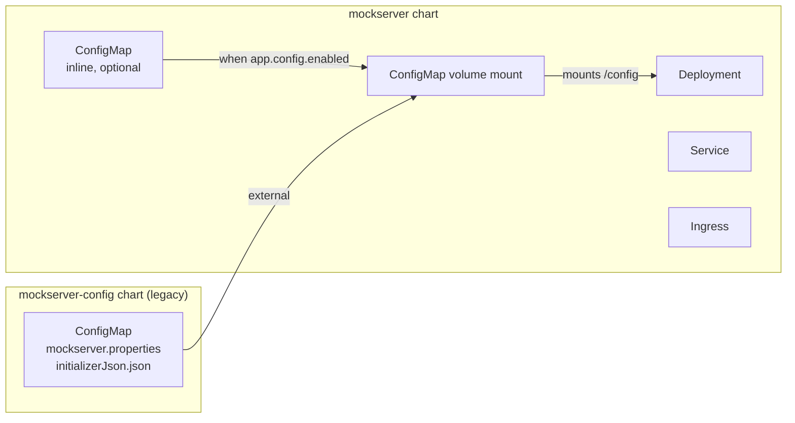
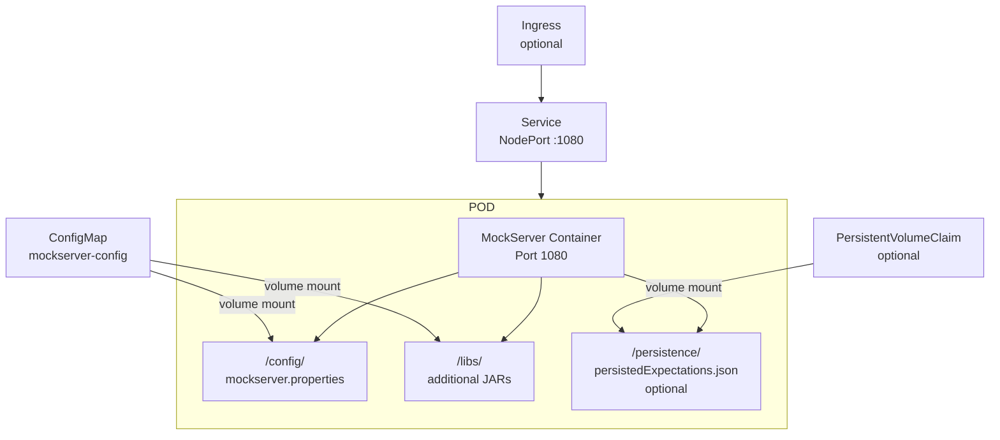
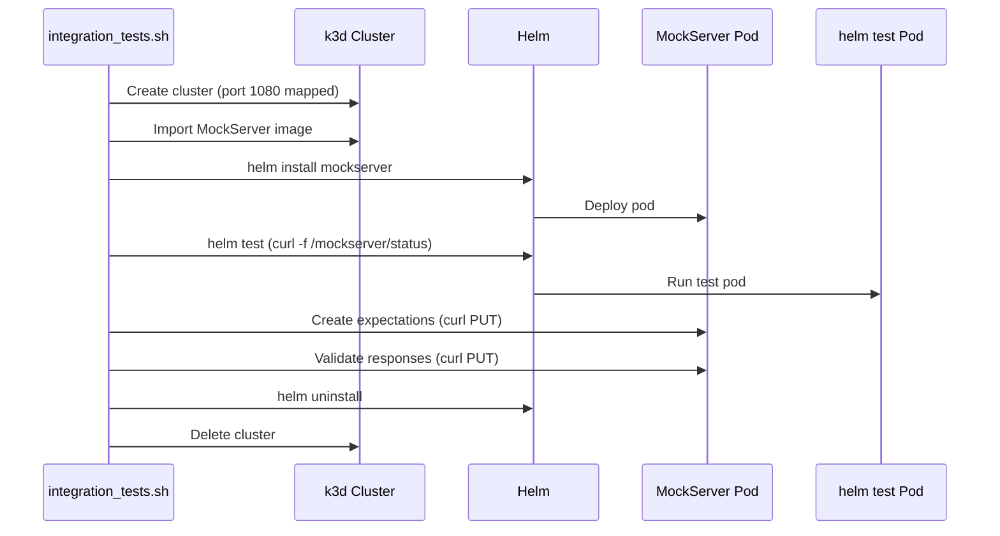

# Helm & Kubernetes

## Charts Overview

MockServer provides two Helm charts. The main `mockserver` chart can optionally create its own ConfigMap via inline configuration, or mount an externally-created ConfigMap:



| Chart | Path | Version | Purpose |
|-------|------|---------|---------|
| `mockserver` | `helm/mockserver/` | 6.1.0 | Main deployment chart (includes optional ConfigMap) |
| `mockserver-config` | `helm/mockserver-config/` | 6.1.0 | Example external ConfigMap chart (for reference) |

## mockserver Chart

### Templates

| Template | Purpose |
|----------|---------|
| `deployment.yaml` | Single-replica Deployment with ConfigMap volume mount |
| `service.yaml` | Service (NodePort/LoadBalancer/ClusterIP) |
| `ingress.yaml` | Optional Ingress resource |
| `configmap.yaml` | Optional ConfigMap for inline configuration (when `app.config.enabled`) |
| `pvc.yaml` | Optional PersistentVolumeClaim (when `app.persistence.enabled` and no `existingClaimName`) |
| `service-test.yaml` | Helm test pod (curl readiness check) |
| `_helpers.tpl` | Template helper functions |
| `NOTES.txt` | Post-install instructions |
| `headless-service.yaml` | Headless Service for JGroups DNS_PING pod discovery (when `clustering.enabled`) |
| `webhook-deployment.yaml` | Webhook Deployment (when `webhook.enabled`) |
| `webhook-service.yaml` | Webhook ClusterIP Service (when `webhook.enabled`) |
| `webhook-mutatingwebhookconfiguration.yaml` | MutatingWebhookConfiguration (when `webhook.enabled`) |
| `webhook-rbac.yaml` | ServiceAccount, ClusterRole, ClusterRoleBinding for webhook (when `webhook.enabled`) |
| `webhook-tls-selfsigned.yaml` | Self-signed TLS bootstrap — two Helm hook Jobs: a pre-install/pre-upgrade Job creates the TLS Secret, a post-install/post-upgrade Job patches the MWC caBundle. Split avoids `helm install --wait` deadlock. Only rendered when `webhook.enabled` and `webhook.certManager.enabled=false` |
| `webhook-tls-certmanager.yaml` | cert-manager Issuer + Certificate (when `webhook.enabled` and `webhook.certManager.enabled=true`) |

### Default Values

```yaml
replicaCount: 1
app:
  logLevel: "INFO"
  serverPort: "1080"
  mountedConfigMapName: "mockserver-config"
  mountedLibsConfigMapName: "mockserver-config"
  propertiesFileName: "mockserver.properties"
  readOnlyRootFilesystem: false
  serviceAccountName: default
  runAsUser: 65534
  config:
    enabled: false
    properties: ""
    initializerJson: ""
    extraFiles: {}
  persistence:
    enabled: false
    existingClaimName: ""
    storageClass: ""
    accessModes:
      - ReadWriteOnce
    size: 256Mi
    mountPath: /persistence
    annotations: {}
podSecurityContext: {}   # pod-level securityContext, e.g. {fsGroup: 2000}
image:
  repository: mockserver
  snapshot: false
  pullPolicy: IfNotPresent
service:
  type: NodePort
  port: 1080
  annotations: {}
  clusterIP: ""
  externalIPs: []
  loadBalancerIP: ""
  loadBalancerSourceRanges: []
  nodePort: ""
  test:
    image: radial/busyboxplus:curl
ingress:
  enabled: false
  className: ""
  annotations: {}
  hosts:
    - host: mockserver.local
      paths:
        - path: /
          pathType: ImplementationSpecific
  tls: []
podAnnotations: {}
podLabels: {}
resources: {}
nodeSelector: {}
tolerations: []
affinity: {}
clustering:
  enabled: false
  clusterName: "mockserver-cluster"
  transportConfig: "jgroups-kubernetes.xml"
  jgroupsPort: 7800
imagePullSecrets: []
releasenameOverride: ""
```

### Clustering

When `clustering.enabled=true`, the chart:

1. Creates a **headless Service** (`<release>-headless`) for JGroups `DNS_PING` pod discovery
2. Sets `MOCKSERVER_STATE_BACKEND=infinispan`, `MOCKSERVER_CLUSTER_ENABLED=true`, `MOCKSERVER_CLUSTER_NAME`, `MOCKSERVER_CLUSTER_TRANSPORT_CONFIG`, and `JGROUPS_DNS_QUERY` environment variables
3. Exposes the JGroups TCP port (default 7800) as a container port
4. Disables the `/libs` ConfigMap volume mount (the `-clustered` image ships its own `/libs`)

**Requires the `-clustered` image variant** (`mockserver/mockserver:clustered-<version>`) which bundles the Infinispan/JGroups libraries. The default image does not include these — enabling clustering with the default image fails at startup.

| Value | Type | Default | Description |
|-------|------|---------|-------------|
| `clustering.enabled` | bool | `false` | Enable clustered state backend |
| `clustering.clusterName` | string | `mockserver-cluster` | JGroups cluster name; all pods sharing state must use the same value |
| `clustering.transportConfig` | string | `jgroups-kubernetes.xml` | JGroups transport config file; built-in default uses TCP + DNS_PING |
| `clustering.jgroupsPort` | int | `7800` | JGroups inter-pod TCP port |

See the [Centralized Deployment](https://www.mock-server.com/mock_server/centralized_deployment.html) consumer docs for deployment examples.

### Deployment Architecture



### Persistence

When `app.persistence.enabled=true`, the chart:

1. Creates a PersistentVolumeClaim (unless `app.persistence.existingClaimName` references an existing one)
2. Mounts the PVC at `app.persistence.mountPath` (default `/persistence`)
3. Injects environment variables to enable MockServer's file-based persistence:
   - `MOCKSERVER_PERSIST_EXPECTATIONS=true`
   - `MOCKSERVER_PERSISTED_EXPECTATIONS_PATH=/persistence/persistedExpectations.json`
   - `MOCKSERVER_INITIALIZATION_JSON_PATH=/persistence/persistedExpectations.json`

**Property precedence:** These environment variables are safe defaults. MockServer's property resolution order is: system property > property file > environment variable > hardcoded default. So any matching property in the user's `mockserver.properties` file overrides the chart-injected env vars.

| Value | Type | Default | Description |
|-------|------|---------|-------------|
| `app.persistence.enabled` | bool | `false` | Enable persistent storage |
| `app.persistence.existingClaimName` | string | `""` | Use existing PVC (skip PVC creation) |
| `app.persistence.storageClass` | string | `""` | StorageClass (empty = cluster default) |
| `app.persistence.accessModes` | list | `[ReadWriteOnce]` | PVC access modes |
| `app.persistence.size` | string | `256Mi` | PVC size |
| `app.persistence.mountPath` | string | `/persistence` | Container mount path |
| `app.persistence.annotations` | map | `{}` | PVC annotations |
| `podSecurityContext` | map | `{}` | Pod-level securityContext, rendered verbatim into `spec.template.spec.securityContext`. Accepts any pod-level field (`fsGroup`, `fsGroupChangePolicy`, `runAsGroup`, `seccompProfile`, …). Empty ⇒ nothing emitted. |

**Backward compatibility:** Disabled by default. When disabled, no PVC, volumes, volumeMounts, or env vars are added — the chart behaves identically to before this feature was added. `podSecurityContext` likewise defaults to `{}`, so no pod-level `securityContext` is emitted unless set.

**Pod securityContext / PVC permissions:** on clusters with restrictive defaults the pod may be unable to write to the mounted volume, so persistence silently fails. Set a pod-level `fsGroup` so the volume is group-owned and writable, e.g. `--set podSecurityContext.fsGroup=2000`. `podSecurityContext` is the general-purpose hook for any pod-level securityContext field (the container-level `securityContext` continues to carry `runAsUser` / `readOnlyRootFilesystem` / `allowPrivilegeEscalation`).

**PVC retention:** Chart-managed PVCs are NOT deleted by `helm uninstall`. Delete the PVC manually if you want to remove persisted data: `kubectl delete pvc <release-name> -n <namespace>`.

### Admission Webhook (Automatic Sidecar Injection)

When `webhook.enabled=true`, the chart deploys a MutatingAdmissionWebhook that automatically injects the MockServer transparent-proxy sidecar and iptables init container into pods that opt in. This automates the manual sidecar pattern documented in [Transparent Proxy / Sidecar Mode](https://www.mock-server.com/mock_server/service_mesh.html).

**How it works:**

1. The webhook watches for Pod CREATE events in namespaces labelled `mockserver.org/sidecar-injection: enabled`
2. Pods with the annotation `mockserver.org/inject: "true"` receive:
   - An iptables init container (with UID-exclusion loop avoidance)
   - A MockServer sidecar container (with `MOCKSERVER_TRANSPARENT_PROXY_ENABLED=true`)
   - An idempotency marker annotation (`mockserver.org/injected: "true"`)
3. Pods without the annotation, or already injected, are allowed through unchanged

**TLS bootstrap:** Two options:
- **Self-signed (default):** two Helm hook Jobs work together to avoid a deadlock under `helm install --wait` and GitOps tools (ArgoCD, Flux):
  1. A **pre-install/pre-upgrade** Job (hook-weight -5) generates a self-signed CA + server certificate and creates the TLS Secret. This runs before Helm applies non-hook resources, so the Deployment can mount the Secret and become Ready immediately.
  2. A **post-install/post-upgrade** Job (hook-weight 0) reads `ca.crt` from the Secret and patches the MutatingWebhookConfiguration's `caBundle`. This runs after non-hook resources exist, so the MWC is available to patch.
  No external dependencies. Compatible with both `helm install` and `helm install --wait`.
- **cert-manager:** set `webhook.certManager.enabled=true`. The chart creates an Issuer + Certificate and annotates the MutatingWebhookConfiguration with `cert-manager.io/inject-ca-from`.

**Webhook server:** The `mockserver-k8s-webhook` module includes a runnable HTTPS server (`WebhookServer`) that handles AdmissionReview requests on `POST /inject` and serves a health check on `GET /healthz`. The server is packaged as a fat jar (`mockserver-k8s-webhook-<version>-jar-with-dependencies.jar`) and published as the `mockserver/mockserver-webhook` Docker image. Configuration (TLS cert/key paths, sidecar injection settings) is read from environment variables matching the Helm `webhook-deployment.yaml` template.

**Webhook Docker image:** The `mockserver/mockserver-webhook` image is published to Docker Hub and ECR Public by the release pipeline alongside the main MockServer image. The Helm chart defaults to `mockserver/mockserver-webhook:<appVersion>`, so `helm install --set webhook.enabled=true` works out of the box once a release ships.

**Building locally (optional, for development):**

```bash
# Build the fat jar
cd mockserver && ./mvnw package -pl mockserver-k8s-webhook -DskipTests && cd ..

# Copy the jar into the Docker build context
cp mockserver/mockserver-k8s-webhook/target/mockserver-k8s-webhook-*-jar-with-dependencies.jar \
  docker/webhook/mockserver-webhook.jar

# Build the Docker image
docker build -t mockserver/mockserver-webhook:6.1.1-SNAPSHOT docker/webhook
```

| Value | Type | Default | Description |
|-------|------|---------|-------------|
| `webhook.enabled` | bool | `false` | Enable the admission webhook |
| `webhook.failurePolicy` | string | `Ignore` | `Ignore` = pods created even if webhook is down |
| `webhook.timeoutSeconds` | int | `10` | Webhook call timeout |
| `webhook.namespaceSelector` | map | `{}` | Override the default namespace selector (default: `mockserver.org/sidecar-injection: enabled`) |
| `webhook.objectSelector` | map | `{}` | Additional pod-level selector |
| `webhook.sidecar.serverPort` | int | `1080` | MockServer port in the injected sidecar |
| `webhook.sidecar.redirectPorts` | string | `"80,443"` | Ports redirected by iptables |
| `webhook.sidecar.runAsUser` | int | `65534` | UID for the sidecar (must match iptables exclusion) |
| `webhook.certManager.enabled` | bool | `false` | Use cert-manager for TLS instead of self-signed |
| `webhook.tls.certValidityDays` | int | `3650` | Self-signed cert validity (days) |

**Backward compatibility:** Disabled by default. When disabled, no webhook-related resources are rendered.

### Health Checks

- **Readiness probe:** TCP socket check on port 1080
- **Liveness probe:** TCP socket check on port 1080

### Installation

```bash
# --- Option A: OCI (recommended, Helm 3.8+) ------------------------------
helm install mockserver oci://ghcr.io/mock-server/charts/mockserver

# Pin a version
helm install mockserver oci://ghcr.io/mock-server/charts/mockserver --version 6.1.0

# --- Option B: Legacy HTTP repo ------------------------------------------
helm repo add mockserver https://www.mock-server.com
helm repo update

# Install with defaults (no configuration)
helm install mockserver mockserver/mockserver

# Install with custom values
helm install mockserver mockserver/mockserver \
  --set app.serverPort=1080 \
  --set service.type=ClusterIP

# Install with inline configuration (single chart — recommended)
# Use --set-string for JSON values — escape commas as \, since --set treats commas as separators
helm install mockserver mockserver/mockserver \
  --set app.config.enabled=true \
  --set app.config.properties="mockserver.initializationJsonPath=/config/initializerJson.json" \
  --set-string 'app.config.initializerJson=[{"httpRequest":{"path":"/example"}\,"httpResponse":{"body":"response"}}]'

# Or using a values.yaml file for complex config
helm install mockserver mockserver/mockserver -f my-values.yaml

# Legacy: external config chart + main chart. The mockserver-config chart is
# NOT published in the Helm repo (see "mockserver-config Chart" section
# below) — to use it, clone the source repo and install from the local path.
git clone https://github.com/mock-server/mockserver-monorepo
helm install mockserver-config ./mockserver-monorepo/helm/mockserver-config
helm install mockserver mockserver/mockserver
```

## mockserver-config Chart (Legacy / Example)

The separate `mockserver-config` chart is retained as a **reference example only**. It is not published to the Helm repository at `https://www.mock-server.com/index.yaml` — consumers wanting to use it must copy the chart from `helm/mockserver-config/` in the source repo. For new deployments, use the inline `app.config` values in the main chart instead (see above).

Its `Chart.yaml` is bumped automatically by the release scripts (`finalize.sh`'s find-and-replace pass) to keep it in lock-step with the main `mockserver` chart, but only the `mockserver` chart is packaged and pushed to S3 by `helm.sh`.

This chart provides a ConfigMap containing:

- `mockserver.properties` — server configuration
- `initializerJson.json` — pre-loaded expectations

### Template

The ConfigMap template loads default files from `static/`:

```yaml
apiVersion: v1
kind: ConfigMap
metadata:
  name: {{ .Chart.Name }}
data:
  mockserver.properties: |-
    {{ printf "%s" (.Files.Get "static/mockserver.properties") | indent 4 }}
  initializerJson.json: |-
    {{ printf "%s" (.Files.Get "static/initializerJson.json") | indent 4 }}
```

Static defaults are in `helm/mockserver-config/static/`:
- `mockserver.properties` — default MockServer properties
- `initializerJson.json` — default expectation initialiser (empty array)

## Versioning Policy

All MockServer components — Java modules, client libraries, Docker images, and Helm charts — share a single version number. This keeps things simple and transparent for users.

The Helm chart `version` and `appVersion` in `Chart.yaml` **MUST always match the MockServer application version**. Both charts (`mockserver` and `mockserver-config`) follow this rule, but the enforcement path differs:

- **`mockserver` (published)**: `scripts/release/components/helm.sh` sets both fields to `$RELEASE_VERSION` via an explicit `sed` pass before packaging, then publishes the `.tgz` to S3.
- **`mockserver-config` (reference-only, NOT published)**: bumped passively by `finalize.sh`'s general find-and-replace across `*.yaml` files. Not packaged or pushed anywhere.

Rules:

- **NEVER** bump the chart version independently of the MockServer version
- **NEVER** change `version` without also changing `appVersion` to the same value
- Both charts must be kept at the same version (the release scripts handle this automatically)

Helm chart changes made between releases are published as part of the next MockServer release, not independently.

## Chart Distribution

The chart is published to two locations on every release. Both are kept in lock-step by `scripts/release/components/helm.sh`.

| Channel | URL | Underlying storage | Why both |
|---------|-----|-------------------|----------|
| **OCI (recommended)** | `oci://ghcr.io/mock-server/charts/mockserver` | GitHub Container Registry, public | Native format for modern toolchains (Argo CD, Flux, Renovate); immutable digests; cosign-signable; same auth path consumers already use for `ghcr.io` container images |
| **Legacy HTTP** | `https://www.mock-server.com` (index.yaml) | S3 bucket fronting the website | Back-compat for `helm repo add` users and direct `.tgz` downloads — kept indefinitely |

### OCI registry (GHCR)

- **Registry:** `ghcr.io`
- **Namespace:** `mock-server/charts`
- **Package:** `mockserver` (chart name from `Chart.yaml`)
- **Pull URL:** `oci://ghcr.io/mock-server/charts/mockserver`
- **Visibility:** public (no auth required for `helm pull` / `helm install`)
- **Push auth:** Fine-scoped GitHub PAT with `write:packages` scope, stored in AWS Secrets Manager as `mockserver-release/ghcr-token` (`{username, token}`)

### Legacy HTTP repo

- **Bucket:** Main website S3 bucket (see `~/mockserver-aws-ids.md`)
- **Index:** `helm/charts/index.yaml`
- **Charts:** `helm/charts/mockserver-*.tgz` (every released version)

### Artifact Hub

[Artifact Hub](https://artifacthub.io) is the de-facto discovery site for Helm charts. Publishing
the OCI chart there makes it findable without users knowing the `oci://` path in advance. The
listing reads `Chart.yaml` natively (`name`, `description`, `keywords`, `home`, `sources`,
`maintainers`, `icon`) plus the `annotations` block (`artifacthub.io/license`, `artifacthub.io/links`).

Repository metadata lives in [`helm/artifacthub-repo.yml`](../../helm/artifacthub-repo.yml). One-time
bootstrap (manual — needs an Artifact Hub account):

1. Artifact Hub → Control Panel → Repositories → Add → kind **Helm charts**, OCI based, URL
   `oci://ghcr.io/mock-server/charts`.
2. Copy the generated **Repository ID** into `repositoryID` in `helm/artifacthub-repo.yml`.
3. Publish the metadata file to the registry root so Artifact Hub can verify ownership:
   ```bash
   oras push ghcr.io/mock-server/charts:artifacthub.io \
     helm/artifacthub-repo.yml:application/vnd.cncf.artifacthub.repository-metadata.layer.v1.yaml
   ```

After that, Artifact Hub auto-indexes each new chart version pushed to GHCR by the release pipeline —
no per-release step. (Optional follow-up: add the `oras push` of the metadata file to
`scripts/release/components/helm.sh` once `oras` is available on the `release` agents.)

### Signing the chart (Artifact Hub "Signed" badge)

Artifact Hub shows a **Signed** badge when the OCI chart carries a [cosign](https://docs.sigstore.dev/)
signature (it detects them automatically for OCI repositories — no annotation needed). The release
pipeline has a **guarded, opt-in** signing step in `scripts/release/components/helm.sh`: it is a
**no-op until a signing key exists**, so it never affects unsigned releases.

To enable signing:

1. **Generate a cosign key pair** (once): `cosign generate-key-pair` → `cosign.key` (encrypted with a
   password) + `cosign.pub`. Publish `cosign.pub` somewhere users can verify against (e.g. the repo
   or the website).
2. **Store it** in the build account's Secrets Manager as `mockserver-release/cosign-key`, a JSON
   secret with keys `key` (the PEM contents of `cosign.key`) and `password` (the key password).
3. **Validate with the test harness** — run `scripts/release/test-cosign-signing.sh`. It sources the
   release library and calls the same `load_secret` + `in_docker` helpers, downloading a pinned cosign
   binary into the `alpine/helm` image, `cosign login ghcr.io` with the existing GHCR token, and
   `cosign sign --key <key> ghcr.io/mock-server/charts/mockserver:<version>` — the identical code path
   to the release step. Default run is a non-mutating preflight (loads the secret, proves the
   key+password decrypt, logs in to GHCR); `--sign` then signs the real published tags and verifies
   them. A `--dry-run` *release* does **not** test this — the release skips signing in dry-run — so use
   the harness. Signing is non-fatal regardless, so a real release won't break if it fails (it just
   publishes unsigned).

Once a signed version is on GHCR, Artifact Hub shows the Signed badge on its next scan. The public
key is published in the repo at `helm/mockserver/cosign.pub`, so users can verify a chart with:

```bash
cosign verify \
  --key https://raw.githubusercontent.com/mock-server/mockserver-monorepo/master/helm/mockserver/cosign.pub \
  ghcr.io/mock-server/charts/mockserver:<version>
```

(The private half lives only in the `mockserver-release/cosign-key` Secrets Manager secret.)

> Hardening notes: the step fetches a SHA256-pinned cosign binary (v2.4.3) at release time and the
> private key is mounted as a `0600` file rather than passed via the container's environment, so it
> never appears in the host process table. Keyless (OIDC) signing is a further alternative if
> Buildkite OIDC is set up, avoiding a stored key altogether.

### Requesting "Official" status (Artifact Hub)

The Artifact Hub **Official** badge marks a package as published by the project that owns the
software. It is a curated status granted by the Artifact Hub maintainers (not a file you add), and
requires the repository to already be a **Verified Publisher** (it is). Request it by opening an
issue on [`github.com/artifacthub/hub`](https://github.com/artifacthub/hub/issues) using the
*"Request official status"* template, e.g.:

> **Title:** Request official status for the MockServer Helm chart
>
> **Repository:** `mockserver` (kind: Helm) — `oci://ghcr.io/mock-server/charts/mockserver`
> **Artifact Hub URL:** _<the chart's artifacthub.io URL>_
>
> MockServer is an open-source HTTP(S) mock server & proxy (https://www.mock-server.com, source at
> https://github.com/mock-server/mockserver-monorepo). This repository is the official publisher of
> MockServer — the chart is built and released from the same monorepo. It is already a Verified
> Publisher (repository ID `a6ca1874-16c1-43c8-9924-9bf9c3a5a9ea`). Please grant Official status.

Once granted, the Official badge appears alongside Verified Publisher.

### Release pipeline (automated)

`scripts/release/components/helm.sh` runs on the `release` agent queue and:

1. Bumps `Chart.yaml` `version` + `appVersion` to `$RELEASE_VERSION`
2. `helm lint` + `helm package`
3. `helm registry login ghcr.io` + `helm push <tgz> oci://ghcr.io/mock-server/charts`
4. Sync historical `.tgz` + `index.yaml` from S3, regenerate index, upload back
5. Commit + push `Chart.yaml`, the new `.tgz`, and the rebuilt `index.yaml`

GHCR is pushed first so a registry outage aborts the step before any S3 mutation. Re-running the step after a mid-publish failure is safe — `helm push` overwrites the existing OCI tag with identical bytes, and the S3 sync rebuilds the index from scratch. **Caveat:** this assumes the GHCR package is *not* configured with immutable tags. If you ever turn on immutability in the GHCR package settings, re-publishing the same version will fail with `403`; either bump the version or temporarily disable immutability before retry.

### Backfilling the OCI registry

To populate GHCR with historical chart versions (one-time, after first turning the OCI publishing flow on):

```bash
# Authenticate to AWS to load the PAT from Secrets Manager
aws sso login --profile mockserver-build

# Dry-run to see which versions will push
AWS_PROFILE=mockserver-build scripts/release/backfill-helm-oci.sh --dry-run

# Push every .tgz under helm/charts/ to ghcr.io/mock-server/charts
AWS_PROFILE=mockserver-build scripts/release/backfill-helm-oci.sh --execute
```

The script enumerates `helm/charts/mockserver-*.tgz` in version order and pushes each one. Safe to re-run — `helm push` against an existing OCI tag overwrites it with the same bytes.

### Publishing a chart manually (rare)

Almost never needed — the release pipeline does this. Useful for emergency republishes:

```bash
# Package
cd helm && helm package ./mockserver/ --destination charts/ && cd ..

# OCI (GHCR) — printf avoids the trailing newline that echo would append
printf "%s" "$GHCR_TOKEN" | helm registry login ghcr.io --username "$GHCR_USERNAME" --password-stdin
helm push helm/charts/mockserver-X.Y.Z.tgz oci://ghcr.io/mock-server/charts

# Legacy HTTP (S3)
aws s3 sync s3://<website-bucket>/ helm/charts/ --exclude '*' --include 'mockserver-*.tgz' --include 'index.yaml'
helm repo index helm/charts/ --url https://www.mock-server.com
aws s3 cp helm/charts/mockserver-X.Y.Z.tgz s3://<website-bucket>/
aws s3 cp helm/charts/index.yaml s3://<website-bucket>/
```

## Testing

### Static Validation (CI)

The infra pipeline runs `helm lint` and `helm template` against both charts on every change to `helm/`. This catches syntax errors, rendering issues, and invalid template logic without needing a Kubernetes cluster.

- **Pipeline step:** `.buildkite/scripts/steps/helm-validate.sh`
- **Validates:** default values, inline config enabled, ingress enabled, persistence enabled (chart-managed and existing PVC)

### k3d-Based Integration Testing

The container integration tests use k3d (k3s in Docker) for Helm testing. k3d was chosen over Kind for faster cluster startup (~10-15s vs ~30-40s) and simpler port mapping.



**k3d config** (`container_integration_tests/k3d-config.yaml`):

```yaml
apiVersion: k3d.io/v1alpha5
kind: Simple
metadata:
  name: mockserver
servers: 1
ports:
  - port: 1080:1080
    nodeFilters:
      - loadbalancer
```

### Test Cases

| Test | What It Tests |
|------|--------------|
| `helm_default_config` | Default chart deployment (no overrides) |
| `helm_local_docker_container` | Custom local Docker image |
| `helm_custom_server_port` | Custom server port (`app.serverPort=1081`) |
| `helm_remote_host_and_port` | Proxy remote host/port (two MockServer instances) |
| `helm_inline_config` | Inline ConfigMap with pre-loaded expectations (`app.config.enabled=true`) |

Each test also invokes `helm test` to verify the service-test pod can reach MockServer's `/status` endpoint.

### Running Locally

```bash
# Prerequisites: docker, k3d, helm, kubectl
# Build the test image first
SKIP_HELM_TESTS=true container_integration_tests/integration_tests.sh

# Run helm tests only
SKIP_JAVA_BUILD=true SKIP_DOCKER_TESTS=true container_integration_tests/integration_tests.sh

# Clean up cluster afterward
DELETE_CLUSTER=true SKIP_JAVA_BUILD=true SKIP_DOCKER_TESTS=true container_integration_tests/integration_tests.sh
```
