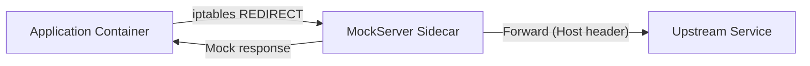

# Transparent Proxy / Sidecar Mode

MockServer can run as a Kubernetes sidecar proxy with transparent HTTP interception. This enables service mesh integration patterns where MockServer intercepts traffic destined for external services.

## Architecture



## Transparent Proxy Mode

When `transparentProxyEnabled=true`, MockServer treats all incoming HTTP connections as proxy requests. Instead of requiring clients to send explicit HTTP CONNECT requests, it uses the `Host` header to determine the forwarding target.

This works with Linux iptables REDIRECT rules that redirect outbound traffic to MockServer's port, making the interception transparent to the application.

### How it works

1. iptables redirects outbound traffic from the application container to MockServer's port
2. MockServer resolves the original destination:
   - **On Linux**: reads the original destination from the kernel conntrack table (`/proc/net/nf_conntrack`) which records the pre-REDIRECT destination. This is the most accurate method and works even when the Host header is missing, wrong, or the request is non-HTTP (binary).
   - **Fallback**: if conntrack is unavailable (non-Linux OS, `nf_conntrack` module not loaded, or the entry has been flushed), MockServer falls back to the `Host` header from the incoming request.
3. If an expectation matches, MockServer returns the mock response
4. Otherwise, MockServer forwards the request to the original target

### Configuration

| Property | Default | Description |
|----------|---------|-------------|
| `transparentProxyEnabled` | `false` | Enable transparent proxy mode |

Environment variable: `MOCKSERVER_TRANSPARENT_PROXY_ENABLED`

### iptables example (init container)

The UID-based RETURN rule **must come before** any REDIRECT rules to prevent an infinite redirect loop: when MockServer forwards a request upstream, its own outgoing packet would otherwise match the REDIRECT and loop back to itself.

```yaml
initContainers:
  - name: iptables-init
    image: alpine:3.19
    securityContext:
      capabilities:
        add: ["NET_ADMIN"]
    command:
      - sh
      - -c
      - |
        # RETURN first — exclude MockServer's own egress (UID 65534) to prevent redirect loop
        iptables -t nat -I OUTPUT -m owner --uid-owner 65534 -j RETURN
        iptables -t nat -A OUTPUT -p tcp --dport 80 -j REDIRECT --to-port 1080
        iptables -t nat -A OUTPUT -p tcp --dport 443 -j REDIRECT --to-port 1080
```

The `excludeUid` must match `app.runAsUser` (default 65534). The Helm chart configures this via `sidecar.iptables.excludeUid`.

## Helm Chart

The Helm chart includes sidecar configuration under the `sidecar` key:

```yaml
sidecar:
  enabled: false
  transparentProxy: false
  iptables:
    enabled: false
    excludeUid: 65534   # must match app.runAsUser to prevent redirect loop
```

When `sidecar.transparentProxy` is true, the `MOCKSERVER_TRANSPARENT_PROXY_ENABLED` environment variable is set in the deployment.

### Automatic Sidecar Injection (Admission Webhook)

When `webhook.enabled=true`, the chart deploys a MutatingAdmissionWebhook that automatically injects the MockServer sidecar and iptables init container into pods. This removes the need to manually edit every Deployment. See [helm.md](helm.md) for full details.

The webhook Docker image (`mockserver/mockserver-webhook`) is published to Docker Hub and ECR Public by the release pipeline alongside the main MockServer image. Install with the webhook enabled:

```bash
helm install mockserver mockserver/mockserver \
  --set webhook.enabled=true
kubectl label namespace my-namespace mockserver.org/sidecar-injection=enabled
# Annotate pods: mockserver.org/inject: "true"
```

**Building locally (optional, for development):**

```bash
# Build the fat jar and Docker image
cd mockserver && ./mvnw package -pl mockserver-k8s-webhook -DskipTests && cd ..
cp mockserver/mockserver-k8s-webhook/target/mockserver-k8s-webhook-*-jar-with-dependencies.jar \
  docker/webhook/mockserver-webhook.jar
docker build -t mockserver/mockserver-webhook:6.1.1-SNAPSHOT docker/webhook
```

## Implementation

| Component | Location |
|-----------|----------|
| Configuration properties | `Configuration.java`, `ConfigurationProperties.java` |
| Transparent proxy logic | `mockserver-netty/src/main/java/org/mockserver/netty/proxy/TransparentProxyInitializer.java` |
| Composite resolver chain | `mockserver-netty/src/main/java/org/mockserver/netty/proxy/CompositeOriginalDestinationResolver.java` |
| TPROXY resolver (local address) | `mockserver-netty/src/main/java/org/mockserver/netty/proxy/TproxyOriginalDestinationResolver.java` |
| eBPF resolver | `mockserver-netty/src/main/java/org/mockserver/netty/proxy/EbpfOriginalDestinationResolver.java` |
| SO_ORIGINAL_DST resolver (JNA) | `mockserver-netty/src/main/java/org/mockserver/netty/proxy/SoOriginalDstResolver.java` |
| Conntrack resolver (fallback) | `mockserver-netty/src/main/java/org/mockserver/netty/proxy/ConntrackOriginalDestinationResolver.java` |
| Conntrack table helper | `mockserver-netty/src/main/java/org/mockserver/netty/proxy/SoOriginalDstHelper.java` |
| DNS intent resolver | `mockserver-netty/src/main/java/org/mockserver/netty/proxy/DnsIntentOriginalDestinationResolver.java` |
| Pipeline handler (sets REMOTE_SOCKET) | `mockserver-netty/src/main/java/org/mockserver/netty/proxy/TransparentProxyHandler.java` |
| Webhook HTTPS server | `mockserver-k8s-webhook/.../webhook/WebhookServer.java` |
| Admission webhook handler | `mockserver-k8s-webhook/.../webhook/AdmissionReviewHandler.java` |
| JSONPatch builder | `mockserver-k8s-webhook/.../webhook/SidecarPatchBuilder.java` |
| Injection config | `mockserver-k8s-webhook/.../webhook/SidecarInjectionConfig.java` |
| Webhook Dockerfile | `docker/webhook/Dockerfile` |
| Helm values | `helm/mockserver/values.yaml` |
| Helm deployment | `helm/mockserver/templates/deployment.yaml` |
| Helm webhook templates | `helm/mockserver/templates/webhook-*.yaml` |

## Original-Destination Resolution

MockServer resolves the original destination of intercepted connections through a composite chain (`CompositeOriginalDestinationResolver`). Each resolver is tried in order; the first non-null result wins.

### Resolver Chain

| Priority | Resolver | Strategy | Requirements |
|----------|----------|----------|--------------|
| 1 | `TproxyOriginalDestinationResolver` | Reads `channel.localAddress()` — with TPROXY iptables rules, this IS the original destination | `transparentProxyTproxy=true`, `CAP_NET_ADMIN`, Netty epoll |
| 2 | `EbpfOriginalDestinationResolver` | eBPF map lookup | `transparentProxyEbpf=true` |
| 3 | `SoOriginalDstResolver` | O(1) `getsockopt(SO_ORIGINAL_DST)` via JNA (no JNI) | Linux, Netty epoll (`EpollSocketChannel`), JNA native loadable |
| 4 | `ConntrackOriginalDestinationResolver` | O(n) parse of `/proc/net/nf_conntrack` | Linux, `nf_conntrack` module loaded, file readable |
| 5 | `DnsIntentOriginalDestinationResolver` | Infers destination from DNS query history | Fallback when all above return null |

The default chain for REDIRECT-based transparent proxy is: **SO_ORIGINAL_DST → conntrack → dns-intent**. When `transparentProxyTproxy=true`, TPROXY is prepended as the first resolver.

### SO_ORIGINAL_DST (Primary Path)

`SoOriginalDstResolver` calls `getsockopt(fd, SOL_IP, SO_ORIGINAL_DST, ...)` via JNA — not JNI. JNA loads the C library dynamically at runtime, so no compile-time native code is needed. The resolver is an O(1) socket-option read and returns null (never throws) on unsupported platforms (non-Linux, NIO transport, JNA unavailable), allowing the chain to fall through.

Requirements:
- Linux OS
- Netty epoll transport (`EpollSocketChannel`) — the NIO transport does not expose a raw file descriptor
- JNA loadable at runtime (`com.sun.jna.Native`)

### Conntrack (Fallback)

`ConntrackOriginalDestinationResolver` parses `/proc/net/nf_conntrack` to find the pre-`iptables -j REDIRECT` destination. This is O(n) per connection (n = tracked connections), capped at 200,000 lines to bound CPU cost. If the table exceeds the cap or `nf_conntrack` is unavailable, the resolver returns null and the chain continues to dns-intent.

### TPROXY Mode

With `transparentProxyTproxy=true`, iptables uses `-j TPROXY` instead of `-j REDIRECT`. The kernel preserves the original destination as the socket's local address, so resolution is trivial (`channel.localAddress()` returns it directly). No conntrack lookup or `getsockopt` is needed.

### Testing

- Unit tests for all resolvers run cross-platform (macOS/Linux/Windows)
- `SoOriginalDstResolverTest` verifies sockaddr decoding and platform-support gating
- `TproxyOriginalDestinationResolverTest` verifies TPROXY mode flag and local-address extraction
- `CompositeOriginalDestinationResolverTest` verifies chain ordering and null fall-through
- `SoOriginalDstEndToEndIT` and `TproxyEndToEndIT` require Linux with `NET_ADMIN` (Docker-gated)
- The `TransparentProxyHandler` is tested with an `EmbeddedChannel` to verify `REMOTE_SOCKET` attribute setting and graceful fallback

## Limitations

- **SO_ORIGINAL_DST requires Linux + epoll**: On macOS or Windows, or with NIO transport, the resolver returns null and conntrack (also Linux-only) is tried next. Both fall through to dns-intent on non-Linux hosts.
- **Conntrack lookup is O(n) with a cap**: The `/proc/net/nf_conntrack` scan is capped at 200,000 lines. If the table exceeds this, MockServer falls back to Host-header resolution via dns-intent.
- **iptables required without the webhook**: Without the admission webhook, an init container or external mechanism must configure traffic redirection. With the webhook enabled, iptables rules are injected automatically into opted-in pods.
