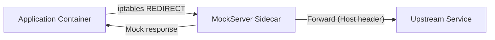

# Service Mesh / Sidecar Mode

MockServer can run as a Kubernetes sidecar proxy with transparent HTTP interception and a simplified xDS route discovery endpoint. This enables service mesh integration patterns where MockServer intercepts traffic destined for external services.

## Architecture



## Transparent Proxy Mode

When `transparentProxyEnabled=true`, MockServer treats all incoming HTTP connections as proxy requests. Instead of requiring clients to send explicit HTTP CONNECT requests, it uses the `Host` header to determine the forwarding target.

This works with Linux iptables REDIRECT rules that redirect outbound traffic to MockServer's port, making the interception transparent to the application.

### How it works

1. iptables redirects outbound traffic from the application container to MockServer's port
2. MockServer reads the `Host` header from the incoming request
3. If an expectation matches, MockServer returns the mock response
4. Otherwise, MockServer forwards the request to the original target (resolved from the Host header)

### Configuration

| Property | Default | Description |
|----------|---------|-------------|
| `transparentProxyEnabled` | `false` | Enable transparent proxy mode |

Environment variable: `MOCKSERVER_TRANSPARENT_PROXY_ENABLED`

### iptables example (init container)

```yaml
initContainers:
  - name: iptables-init
    image: alpine:3.19
    securityContext:
      capabilities:
        add: ["NET_ADMIN"]
    command:
      - sh
      - -c
      - |
        iptables -t nat -A OUTPUT -p tcp --dport 80 -j REDIRECT --to-port 1080
        iptables -t nat -A OUTPUT -p tcp --dport 443 -j REDIRECT --to-port 1080
        # Exclude MockServer's own traffic to avoid loops
        iptables -t nat -I OUTPUT -m owner --uid-owner 65534 -j RETURN
```

## xDS Route Discovery Endpoint

When `xdsEnabled=true`, MockServer exposes a REST endpoint that returns active expectations as a simplified xDS RouteConfiguration JSON structure.

### Endpoint

`GET /mockserver/xds/routes`

### Response format

```json
{
  "name": "mockserver_routes",
  "virtual_hosts": [
    {
      "name": "mockserver",
      "domains": ["*"],
      "routes": [
        {
          "match": {
            "path": "/api/users",
            "method": "GET"
          },
          "expectationId": "abc-123"
        }
      ]
    }
  ]
}
```

This is a simplified approximation of Envoy's xDS RouteConfiguration format. It does not implement the full xDS gRPC streaming protocol (LDS/RDS/CDS/EDS). It provides a JSON snapshot of the current route table that can be consumed by custom tooling or extended in future for full xDS compatibility.

### Configuration

| Property | Default | Description |
|----------|---------|-------------|
| `xdsEnabled` | `false` | Enable xDS route discovery endpoint |
| `xdsPort` | `18000` | Port for xDS endpoint (reserved for future gRPC use) |

Environment variables: `MOCKSERVER_XDS_ENABLED`, `MOCKSERVER_XDS_PORT`

## Helm Chart

The Helm chart includes sidecar configuration under the `sidecar` key:

```yaml
sidecar:
  enabled: false
  transparentProxy: false
  xdsEnabled: false
  xdsPort: 18000
```

When `sidecar.transparentProxy` is true, the `MOCKSERVER_TRANSPARENT_PROXY_ENABLED` environment variable is set in the deployment.

When `sidecar.xdsEnabled` is true, both `MOCKSERVER_XDS_ENABLED` and `MOCKSERVER_XDS_PORT` are set.

## Implementation

| Component | Location |
|-----------|----------|
| Configuration properties | `Configuration.java`, `ConfigurationProperties.java` |
| Transparent proxy logic | `mockserver-netty/.../proxy/TransparentProxyInitializer.java` |
| xDS route builder | `mockserver-core/.../xds/XdsRouteBuilder.java` |
| REST endpoint | `HttpState.java` (GET /mockserver/xds/routes) |
| Helm values | `helm/mockserver/values.yaml` |
| Helm deployment | `helm/mockserver/templates/deployment.yaml` |

## Limitations

- **No full xDS gRPC streaming**: The current implementation provides a REST JSON endpoint, not the full xDS gRPC streaming protocol (Envoy's ADS/SotW/Delta). This is sufficient for simple tooling and can be extended later.
- **No SO_ORIGINAL_DST**: The transparent proxy uses the Host header for target resolution, not Linux's `SO_ORIGINAL_DST` socket option. This works for HTTP traffic but requires the Host header to be set correctly.
- **iptables required for interception**: The transparent proxy itself does not set up iptables rules. An init container or external mechanism must configure traffic redirection.
