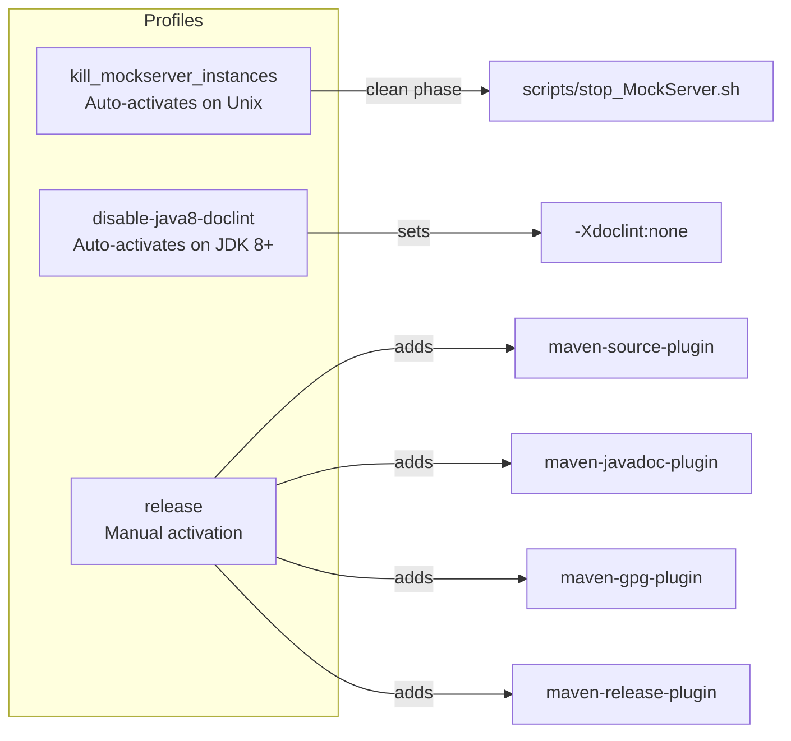
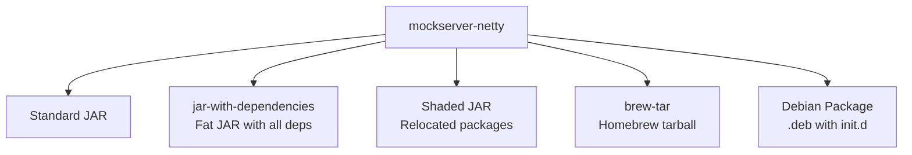

# Build System

## Monorepo Build Landscape

The monorepo contains multiple projects with different build tools:

| Directory | Build Tool | Build Command (from repo root) |
|-----------|-----------|-------------------------------|
| `mockserver/` | Maven (`./mvnw`) | `cd mockserver && ./mvnw clean install` |
| `mockserver-ui/` | Vite + npm | `cd mockserver-ui && npm ci && npm run build` |
| `mockserver-node/` | Grunt + npm | `cd mockserver-node && npm ci && npx grunt` |
| `mockserver-client-node/` | npm + TypeScript | `cd mockserver-client-node && npm ci && npm test` |
| `mockserver-client-python/` | pip + pytest | `cd mockserver-client-python && pip install -e '.[dev]' && pytest` |
| `mockserver-client-ruby/` | Bundler + RSpec | `cd mockserver-client-ruby && bundle install && bundle exec rspec` |
| `mockserver/mockserver-maven-plugin/` | Maven | `cd mockserver && ./mvnw clean install -DskipTests && ./mvnw -f mockserver-maven-plugin/pom.xml clean verify` |
| `mockserver-performance-test/` | k6 (JavaScript) | `cd mockserver-performance-test && for f in k6/*.js; do k6 inspect "$f"; done` |

> **Running the regression and growth scripts locally:** see [Performance regression pipeline — local runs](#performance-regression-pipeline-local-runs) below.

CI builds are orchestrated by `.buildkite/scripts/generate-pipeline.sh` which selects pipelines based on changed files. See [CI/CD](../infrastructure/ci-cd.md) for details.

## Java Server Build (mockserver/)

### Maven Configuration

MockServer uses Maven 3.9.16 via the Maven Wrapper (`mvnw`). The project targets Java 17 source/target compatibility — produced bytecode runs on Java 17+, and building from source requires JDK 17+.

`mockserver/.mvn/maven.config` sets `-T 1C` so the reactor builds with the parallel (one-thread-per-core) `MultiThreadedBuilder` by default, matching CI (`./mvnw -T 1C clean install`). This is a free speed-up on the multi-module compile/package phases and composes with the within-module parallel unit tests (see [performance-tuning.md](performance-tuning.md)). Pass `-T 1` on the command line to force a single-threaded build when debugging reactor ordering or interleaved log output.

### Modules

The project comprises 25 Maven modules:

| Module | Packaging | Purpose |
|--------|-----------|---------|
| `mockserver-bom` | pom (flattened) | Bill of Materials — import to pin every MockServer module and third-party transitive to one converged version |
| `mockserver-testing` | jar | Shared test utilities |
| `mockserver-client-java` | jar | Java client API (`MockServerClient`) |
| `mockserver-client-java-no-dependencies` | jar (shaded) | Client with all dependencies shaded |
| `mockserver-core` | jar | Domain model, matching, TLS, templates, codecs, event log, action handlers |
| `mockserver-integration-testing` | jar | Integration test base classes |
| `mockserver-integration-testing-no-dependencies` | jar (shaded) | Integration test base classes, shaded |
| `mockserver-war` | war | Servlet WAR deployment |
| `mockserver-proxy-war` | war | Proxy-only WAR deployment |
| `mockserver-netty` | jar (+fat, shaded) | Netty server, CLI, dashboard, proxy relay |
| `mockserver-netty-no-dependencies` | jar (shaded) | Netty server with all dependencies shaded |
| `mockserver-junit-rule` | jar | JUnit 4 `@Rule` integration |
| `mockserver-junit-rule-no-dependencies` | jar (shaded) | JUnit 4 rule, shaded |
| `mockserver-junit-jupiter` | jar | JUnit 5 `@ExtendWith` integration |
| `mockserver-junit-jupiter-no-dependencies` | jar (shaded) | JUnit 5 extension, shaded |
| `mockserver-spring-test-listener` | jar | Spring Test integration |
| `mockserver-spring-test-listener-no-dependencies` | jar (shaded) | Spring Test integration, shaded |
| `mockserver-examples` (at `../examples/java`) | jar | Usage examples |
| `mockserver-async` | jar | AsyncAPI broker mocking |
| `mockserver-testcontainers` | jar | Testcontainers integration module |
| `mockserver-state-infinispan` | jar | Infinispan-backed clustered state backend |
| `mockserver-blob-s3` | jar | S3 blob storage backend |
| `mockserver-blob-gcs` | jar | GCS blob storage backend |
| `mockserver-blob-azure` | jar | Azure blob storage backend |
| `mockserver-k8s-webhook` | jar (+fat) | Kubernetes admission webhook for sidecar injection |

### Dependency management and the BOM

MockServer pins all of its third-party transitive versions in the **parent POM's `<dependencyManagement>`**, and the reactor's own Enforcer `dependencyConvergence` rule guards that everything resolves to a single version. That management is, by design, **not inherited by downstream consumers** — so a consumer running the same Enforcer rule would see MockServer's transitive versions diverge.

`mockserver-bom` closes that gap. It extends the parent POM (inheriting every third-party pin) and adds `dependencyManagement` entries for the published MockServer modules, then uses the `flatten-maven-plugin` (`flattenMode=bom`, `dependencyManagement=expand`) to publish a **self-contained** POM with all pins inlined and no parent reference. Consumers import it to get a converged tree:

```xml
<dependencyManagement>
  <dependencies>
    <dependency>
      <groupId>org.mock-server</groupId>
      <artifactId>mockserver-bom</artifactId>
      <version>${mockserver.version}</version>
      <type>pom</type>
      <scope>import</scope>
    </dependency>
  </dependencies>
</dependencyManagement>
```

Two related choices reduce convergence pressure even without the BOM: `mockserver-client-java` **excludes the server-only engines** from its `mockserver-core` dependency (a client never executes templates/scripts/WASM/gRPC), and `mockserver-core` **prunes the stale `velocity-engine-core 2.3`** that `velocity-tools-generic` drags in alongside the `2.4.1` the build already uses. The parent's `flatten-maven-plugin` execution is declared `<inherited>false</inherited>`, so it applies only to the root POM; `mockserver-bom` carries its own copy.

### Quick Reference

All Maven commands run from within the `mockserver/` directory:

```bash
cd mockserver

# Full build (clean + compile + test + package)
./mvnw clean install

# Build without tests
./mvnw clean install -DskipTests

# Build a single module
./mvnw clean install -pl mockserver-core

# Run unit tests only
./mvnw test -pl mockserver-netty

# Run integration tests
./mvnw verify -pl mockserver-netty
```

### Build Scripts

| Script | Purpose |
|--------|---------|
| `scripts/buildkite_quick_build.sh` | CI build — `mvnw clean install` with 8GB heap |
| `scripts/buildkite_deploy_snapshot.sh` | CI deploy — `mvnw clean deploy` to Sonatype snapshots |
| `scripts/local_quick_build.sh` | Local build — Java 17, 3 threads, includes integration tests |
| `scripts/local_online_build.sh` | Local build — Java 17, includes integration tests |
| `scripts/local_buildkite_build.sh` | Run Buildkite build locally inside Docker |
| `scripts/local_build_module_by_module.sh` | Build each module sequentially |
| `scripts/local_release.sh` | Maven release (prepare + perform) to Sonatype staging |
| `scripts/local_deploy_snapshot.sh` | Deploy SNAPSHOT via Docker container |
| `scripts/local_single_test.sh` | Run a single integration test |
| `scripts/local_single_module.sh` | Build a single module |
| `scripts/stop_MockServer.sh` | Kill running MockServer processes |
| `scripts/bash_functions.sh` | Shared shell functions library |
| `scripts/download_maven_jars.sh` | Download Maven JARs from repositories |
| `scripts/install_ca_certificate.sh` | Install CA certificates into trust stores |
| `scripts/jekyll_server.sh` | Start Jekyll development server |
| `scripts/local_docker_launch.sh` | Launch interactive Docker Maven container |
| `scripts/local_docker_push_tag.sh` | Push Docker image with tag |
| `scripts/local_generate_web_site.sh` | Generate Jekyll documentation website |
| `scripts/local_javadoc_build_all_versions.sh` | Build Javadoc for all versions |
| `scripts/local_list_versions.sh` | List project versions |
| `scripts/log_event_size_test_*.sh` | Log event size test variants (4 scripts) |

## Maven Profiles



| Profile | Activation | Purpose |
|---------|-----------|---------|
| `kill_mockserver_instances` | Auto on Unix (`/usr/bin/env` exists) | Kills existing MockServer processes during `clean` phase |
| `disable-java8-doclint` | Auto on JDK 8+ | Disables strict Javadoc linting |
| `release` | Manual (`-P release`) | Adds source JARs, Javadoc JARs, GPG signing, Maven release plugin |

## Build Plugins

| Plugin | Version | Phase | Purpose |
|--------|---------|-------|---------|
| `maven-compiler-plugin` | 3.15.0 | compile | Java 17 compilation with `-Xlint:all` |
| `git-commit-id-maven-plugin` | 9.0.1 | initialize | Resolves the abbreviated git commit hash into `${git.commit.id.abbrev}` for the version class (mockserver-core only); degrades to an empty hash when no git metadata is present |
| `templating-maven-plugin` | 3.1.0 | generate-sources | Generates version class from templates (version, group/artifact id, git hash) |
| `maven-jar-plugin` | 3.5.0 | package | JAR packaging with MANIFEST.MF metadata |
| `maven-clean-plugin` | 3.5.0 | clean | Removes `.log`, keystore, and temp files |
| `maven-surefire-plugin` | 3.5.6 | test | Unit tests (`*Test.java`, excludes `*IntegrationTest.java`) |
| `maven-failsafe-plugin` | 3.5.6 | integration-test | Integration tests (`*IntegrationTest.java`) |
| `maven-checkstyle-plugin` | 3.6.0 | validate | Code style enforcement via `checkstyle.xml` |
| `maven-enforcer-plugin` | 3.6.3 | validate | Dependency convergence checks |
| `exec-maven-plugin` | 3.6.3 | clean | Runs `stop_MockServer.sh` (Unix profile) |

## Test Configuration

- **Unit tests:** `*Test.java` — run during `test` phase via Surefire
- **Integration tests:** `*IntegrationTest.java` — run during `integration-test`/`verify` phases via Failsafe
- **Parallel unit tests (`mockserver-core`):** Surefire runs in two phases — a parallel phase (`parallel=classes`, `threadCount=4`) for the bulk of the suite, and a `sequential-tests` execution (`parallel=none`) for the classes that mutate JVM-global state (`ConfigurationProperties` system properties, the static Prometheus `Metrics` registry, the controllable clock, or globally-fixed time). `ParallelStaticStateGuardTest` fails the build if the parallel-excluded and sequential-included class lists drift apart. See [performance-tuning.md](performance-tuning.md) for the rationale.
- **Log level:** `mockserver.logLevel=ERROR` during tests
- **Locale:** Forced to `en-GB` (`-Duser.language=en -Duser.country=GB`)
- **Test listener:** `org.mockserver.test.PrintOutCurrentTestRunListener` for progress output

## Packaging Outputs

The `mockserver-netty` module produces multiple artifacts:



| Artifact | Classifier | Description |
|----------|-----------|-------------|
| Standard JAR | (none) | Module classes only |
| Fat JAR | `jar-with-dependencies` | All dependencies bundled (used by Docker) |
| Shaded JAR | `shaded` | Dependencies relocated to avoid conflicts |
| Homebrew tarball | `brew-tar` | Tarball for Homebrew formula |
| Debian package | (none) | `.deb` with SysV init.d and Upstart configs |

## Distribution

Artifacts are published to:

- **Central Portal** (snapshots): `https://central.sonatype.com/repository/maven-snapshots/`
- **Maven Central** (releases): via Central Portal at `https://central.sonatype.com/repository/maven-releases/`

GPG signing is required for releases (configured in the `release` profile).

## Performance regression pipeline — local runs

`mockserver-performance-test/k6/regression.js` and `growth.js` can be run locally against the compose stack in `mockserver-performance-test/stack/`. The `forward` behaviour requires a dedicated upstream MockServer because it proxies to a separate instance (not itself). Use `K6_FORWARD_SELF=true` to skip the upstream requirement on a single-container local smoke run.

```bash
# Start the compose stack (includes mockserver + mockserver-upstream)
cd mockserver-performance-test/stack
docker compose up -d

# Run regression over HTTP (default)
k6 run \
  -e BASE_URL=http://localhost:1080 \
  -e K6_RESULT_PATH=/tmp/perf-result.json \
  mockserver-performance-test/k6/regression.js

# Run regression over HTTPS + HTTP/2
k6 run \
  -e BASE_URL=https://localhost:1080 \
  -e PROTO=https_h2 \
  -e K6_RESULT_PATH=/tmp/perf-result-h2.json \
  mockserver-performance-test/k6/regression.js

# Run growth (fills maxLogEntries, measures latency slope)
k6 run \
  -e BASE_URL=http://localhost:1080 \
  mockserver-performance-test/k6/growth.js

# Single-container smoke (no upstream needed)
k6 run \
  -e K6_FORWARD_SELF=true \
  -e BASE_URL=http://localhost:1080 \
  mockserver-performance-test/k6/regression.js
```

The upstream container is named `mockserver-upstream` and listens on port 1080 inside the stack network (`FORWARD_UPSTREAM_HOST` defaults to `mockserver-upstream:1080`). For local runs where k6 is on the host, set `FORWARD_UPSTREAM_HOST=localhost:<exposed-port>` or use `K6_FORWARD_SELF=true`.

### Result JSON schema

The pipeline compare step (`perf-test-compare.sh`) merges two artifacts and persists the result to S3. The schemas are:

**`perf-result.json`**
```json
{
  "metadata": { "sha": "...", "branch": "...", "timestamp": "..." },
  "behaviours": {
    "<op>_<proto>": { "p50_ms": 0, "p95_ms": 0, "p99_ms": 0, "throughput_rps": 0, "error_rate": 0 }
  },
  "growth": {
    "cpu_peak": 0, "heap_start": 0, "heap_end": 0, "heap_peak": 0, "heap_ratio": 0,
    "gc_seconds_delta": 0, "threads_peak": 0, "p95_start": 0, "p95_end": 0, "p95_ratio": 0
  }
}
```

**`perf-microbench.json`**
```json
{
  "microbench": {
    "<matcherType>_<count>": { "time_per_op": 0, "time_unit": "ns/op", "alloc_bytes_per_op": 0 }
  }
}
```

`<op>_<proto>` keys are `match_http`, `forward_http`, `template_http`, `large_http`, and their `_https_h2` counterparts. The merged run is stored at `s3://mockserver-ci-perf-results/runs/<branch>/<iso>__<sha>.json`.
