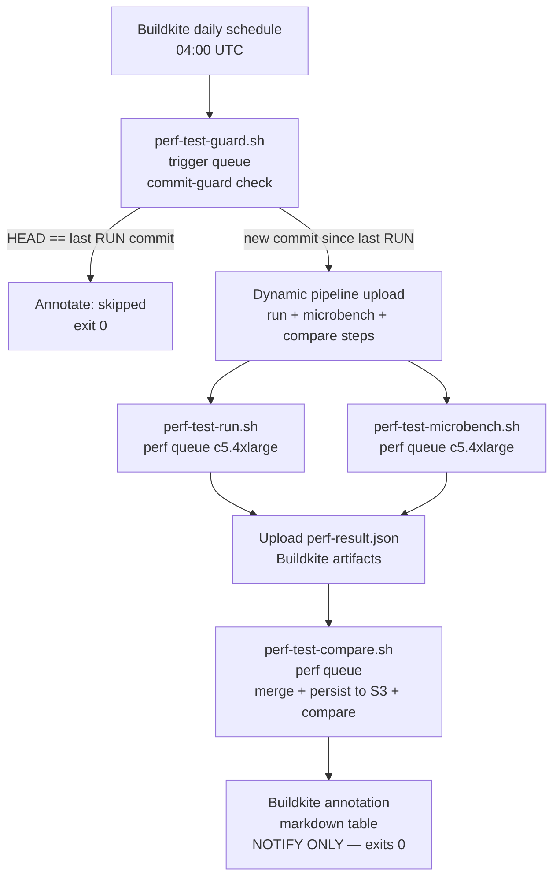

# Performance Tuning

Internal companion to the user-facing [Performance page](https://www.mock-server.com/mock_server/performance.html) and [Performance Configuration include](https://www.mock-server.com/mock_server/configuration_properties.html#performance). Where the website tells users *what knobs exist*, this doc explains *why each knob behaves the way it does*, points at the implementation, and captures the rules-of-thumb that aren't worth publishing externally.

## Where the budget actually goes

Three pools account for almost all of MockServer's CPU and memory under load:

| Pool | Sized by | What it bounds |
|------|----------|----------------|
| Netty event loops (server + outbound client) | `nioEventLoopThreadCount`, `clientNioEventLoopThreadCount` | Concurrent socket I/O — incoming connections, proxied outbound, SSE/WebSocket fan-out |
| Action-handler executor | `actionHandlerThreadCount` | Synchronous response/forward/callback dispatch off the event loop |
| LMAX Disruptor ring buffer + log retention | `maxLogEntries` (auto-derived from heap), `maxExpectations` | Recorded requests, verification log, persistent event store |

Read [docs/code/memory-management.md](../code/memory-management.md) before touching `maxLogEntries` / `maxExpectations` — those defaults are derived from heap size at first read, so changing heap without setting the limits explicitly can quietly shift them by an order of magnitude.

For the request-processing flow itself, [docs/code/request-processing.md](../code/request-processing.md) and [docs/code/netty-pipeline.md](../code/netty-pipeline.md) describe where each handler runs and how requests cross the event-loop / executor boundary.

## Rules of thumb

These are the heuristics maintainers reach for when tuning real workloads. They are not contractual — measure before you change.

- **CPU-bound matching → grow `nioEventLoopThreadCount`** to `2 × cores` and leave `actionHandlerThreadCount` alone. Useful when most requests resolve from matchers without action dispatch (read-heavy verification workloads).
- **Action-heavy → grow `actionHandlerThreadCount`** to `4 × cores` and keep event loops at default. Useful when actions block on outbound IO (forwards, callbacks, JavaScript template evaluation).
- **Recording-heavy → raise heap before raising `maxLogEntries`.** The default is derived from heap; doubling `maxLogEntries` without giving the JVM more memory just shifts the eviction pressure into GC overhead.
- **Streaming heavy (SSE / WebSocket fan-out) → check the outbound event-loop count first** (`clientNioEventLoopThreadCount` and `webSocketClientEventLoopThreadCount`); the inbound side rarely saturates first.
- **mTLS or per-cert renegotiation in the hot path → enable `proactivelyInitialiseTLS=true`.** Defers nothing to first-connect; turn-on cost is one slow startup, ongoing cost is zero per-connection.

## JVM flags

The maven CI build agent invokes the JVM with `-Xms2048m -Xmx6144m` (see `scripts/buildkite_quick_build.sh`). For production-like load testing, set both `-Xms` and `-Xmx` to the same value to avoid heap-resize stalls during the run. The shipped Dockerfiles do not set heap defaults — `JAVA_OPTS` from the container environment wins.

A heap dump on OOM is *not* enabled by default; for triage runs add `-XX:+HeapDumpOnOutOfMemoryError -XX:HeapDumpPath=/var/log/mockserver/` via `JAVA_OPTS`.

### GC selection

Java 17 ships production-ready ZGC. For latency-sensitive deployments — particularly those running with large `maxLogEntries` (deep event ring buffers) — `-XX:+UseZGC` typically holds stop-the-world pauses in the single-digit millisecond range (1–5 ms) regardless of heap size, where G1 (the Java 17 server-class default) commonly sits in the 50–200 ms range during mixed cycles under sustained allocation. (Sub-millisecond pauses are an attribute of Generational ZGC in JDK 21+, not the non-generational ZGC shipped in Java 17.)

These numbers are based on typical GC behaviour, not MockServer-specific benchmarks. Use the `mockserver-performance-test/` k6 harness with `mockserver.outputMemoryUsageCsv=true` to confirm your workload before switching.

Rules of thumb:
- **Heap < 2 GB:** stay on the default (G1). ZGC's fixed overhead isn't worth it.
- **Heap 2–4 GB:** G1 (the default) is fine for almost everything. Switch to ZGC only if you've measured GC pauses showing up on the matcher path.
- **Heap ≥ 4 GB and p99 latency matters:** add `-XX:+UseZGC` via `JAVA_OPTS`. Set `-Xms` and `-Xmx` to the same value (e.g. `-Xms4g -Xmx4g`) so the heap is pre-committed.

In containerised deployments, size the container memory limit at least ~1.5× the `-Xmx` value when using ZGC. The kernel OOM-killer reacts to physical memory (RSS), not virtual address space — what eats RSS beyond `-Xmx` is the JVM's own overhead (code cache, metaspace, JIT, thread stacks) plus Netty's direct buffer pool. ZGC adds a further wrinkle on some cgroup setups: it multi-maps the same physical pages for its coloured-pointer scheme, and under certain RSS-accounting modes those pages are counted multiple times against the cgroup limit, so the kernel can OOM-kill the process even though the actual physical footprint fits. Example: `-Xmx4g` → `--memory=6g`.

ZGC is not the default because (a) MockServer's typical deployment is a small fixture in a test pipeline where G1 is fine, and (b) ZGC adds a fixed memory overhead that hurts small-heap scenarios.

Shenandoah is deliberately omitted: it has been production-ready since OpenJDK 15 (JEP 379) and is therefore available in OpenJDK 17, but it is absent from Oracle JDK 17 and not universally available across all JDK distributions. ZGC is the simpler recommendation because it ships in every JDK 17 distribution MockServer supports.

## Measuring

Two enable-it-once-then-leave-it knobs:

- `mockserver.metricsEnabled=true` exposes Prometheus metrics at `GET /mockserver/metrics`. The exposed metrics are listed in [docs/code/metrics.md](../code/metrics.md). Always enable this for any non-trivial perf investigation — Buildkite agents have it off by default to avoid skew.
- `mockserver.outputMemoryUsageCsv=true` writes per-second JVM memory snapshots to `memoryUsage_<yyyy-MM-dd>.csv` in the working directory (or `memoryUsageCsvDirectory` if set). Useful when reproducing a leak: grep for the heap line, plot it, and you get the same data the dashboard summary shows.

The repo has a k6 harness in `mockserver-performance-test/` (`k6/load.js` with thresholds as gates). Use it as a starting point for your own scenarios — don't read the numbers as canonical (they're agent-class-dependent).

## What's deliberately not tuned

These look like knobs but are not — changing them rarely helps and often hurts:

- **Ring buffer size** — directly tied to `maxLogEntries` via `nextPowerOfTwo`; do not try to size them independently. The Disruptor needs the power-of-two for its index masking.
- **`mockserver-core` Surefire two-phase parallel execution** — do not collapse it back to a single phase. The bulk of the suite runs with `parallel=classes` (`threadCount=4`); a small `sequential-tests` execution (`parallel=none`) runs the classes that mutate JVM-global state which cannot be thread-isolated (`ConfigurationProperties` system-property config, the static Prometheus `Metrics` registry, and globally-fixed time for assertions on event-log disruptor-thread timestamps). An earlier single-phase `parallel=classes` attempt deadlocked on a `ConfigurationProperties` ↔ `MockServerLogger` `<clinit>` cycle; that cycle is now fixed (`ClassInitializationDeadlockTest`) and the `UUIDService` / `EpochService` / `TimeService` test-mode switches are thread-scoped, so the parallel phase is stable. `ParallelStaticStateGuardTest` enforces that the parallel-excluded and sequential-included class lists stay in sync.
- **`mockserver-netty` integration tests are NOT fork-parallelised** — and this was tried and deliberately reverted (2026-06-01), so do not re-attempt it without first hardening the tests. Failsafe runs them serially (~328s on a 14-core dev box). Forking the suite (`forkCount=4`, both `reuseForks=true` and `=false` tried, with the 6 `PortFactory`-preallocated-port classes split into a `forkCount=1` sequential bucket) cut wall time to ~180s **but was intermittently flaky** — 4 of 5 validation runs failed. The suite is studded with wall-clock timing assertions in the shared `mockserver-integration-testing` base classes (e.g. `shouldReturnResponseForExpectationWithDelay` bounds a 2s server-side delay at ≤4s; the various `*WithDelay` forward/callback tests are similar) that do not survive the CPU/scheduler contention and per-class JVM churn of parallel forks: observed blow-outs ranged from 8.6s to >1000s, plus TLS-forward timing failures. State isolation is *not* the blocker (port 0 binding, unique temp files, and per-fork `ConfigurationProperties` all hold up) — the timing assertions are. Re-enabling fork parallelism here requires first making those assertions robust (relative/tolerant bounds, or isolating the Scheduler from contention), which is a larger change to shared test infrastructure. Netty *unit* tests are also left single-phase: one timing-bound class (`DashboardWebSocketHandlerTest`, ~30s) dominates and fixed compile overhead swamps any parallel gain.
- **`matchersFailFast`** — defaults to `true` (early-exit on first non-matching field) and that is almost always right. Disable only when you specifically need every field's match status in the failure log.
- **`regexMatchingTimeoutMillis`** — defaults to 5000 ms (5 seconds), which hands every regex evaluation off to a thread pool with a `future.get(timeout)` to guard against catastrophic-backtracking (ReDoS). The thread-pool hand-off itself costs a context switch per regex evaluation per matcher per request. If you control all expectations and are confident no regex can back-track catastrophically, set `regexMatchingTimeoutMillis=0` to run the regex inline on the event-loop thread and skip the hand-off entirely. **Do not set this to 0 when expectations come from untrusted sources** — `MatchingTimeoutExecutor` is the ReDoS guard.

## Performance regression pipeline

A daily, notify-only pipeline catches performance regressions automatically by comparing each run against a rolling stored-history baseline. It runs independently of the opt-in `k6 load test` step that already exists in the regular build pipeline (that step stays unchanged).

### What it runs



**Commit guard:** `perf-test-guard.sh` resolves the commit the heavy regression run *last actually executed against* (`last_perf_run_commit` in `lib/last-successful-commit.sh`) and dispatches only when `HEAD` differs. Crucially this keys off **real runs, not lint passes**: the perf-test pipeline passes on its lint step on every push, so "last successful build" would almost always be `HEAD` and the guard would skip forever. Instead, `perf-test-run.sh` records `perf_regression_ran_commit` in the build's Buildkite meta-data when it runs, and the guard reads the most recent such value via the Buildkite API. If `HEAD` equals it, the pipeline annotates "skipped" and exits; otherwise it dynamically uploads the run/microbench/compare steps. (The sibling `last_successful_commit` helper — last *passed build* — remains used by `generate-pipeline.sh` for path-based change detection.)

**Run step (`perf-test-run.sh`, `perf` queue):** Starts a dedicated upstream MockServer (needed for the `forward` behaviour) and the server under test with metrics enabled and default `maxLogEntries`. On hosts with 16+ vCPU it core-pins the server, upstream, and k6 to disjoint cpusets for reproducibility; on smaller hosts it skips pinning with a warning. Runs `regression.js` twice — once over plain HTTP, once over HTTPS (ALPN auto-negotiates HTTP/2), then runs `growth.js` with a background sampler collecting CPU (`docker stats`), heap (`jvm_memory_used_bytes{area="heap"}`), GC (`jvm_gc_collection_seconds_sum`), and threads (`jvm_threads_current`) from `/mockserver/metrics` every 5 seconds. Assembles and uploads `perf-result.json`.

**Microbench step (`perf-test-microbench.sh`, `perf` queue):** Builds `mockserver-core` inside `mockserver/mockserver:maven`, runs the JMH `MatchingBenchmark` (`mockserver/mockserver-benchmark`) with `-prof gc` over focused params. Reshapes JMH output into `perf-microbench.json`.

**Compare step (`perf-test-compare.sh`, `perf` queue):** Merges the two artifacts; persists the run to `s3://mockserver-ci-perf-results/runs/<branch>/<iso>__<sha>.json`; fetches the last N=10 prior runs. If fewer than MIN_BASELINE=5 runs exist it annotates "baseline warming up" and stops. Otherwise it computes a regression threshold per metric using a rolling **median + MAD** baseline and flags regressions.

### Triggering a run

The heavy run is gated so it does not fire on ordinary commits. There are three ways to start one:

- **Daily schedule (automatic).** A Buildkite schedule (`perf_regression_daily`, `0 4 * * *` UTC, defined in `terraform/buildkite-pipelines/pipelines.tf`) creates a `build.source == 'schedule'` build. The commit guard dispatches the heavy steps only if `master` has moved since the last *actual* run (see the meta-data mechanism above).
- **Manual UI build.** Clicking **New Build** on the `mockserver-performance-test` pipeline creates a `build.source == 'ui'` build. This **force-dispatches** the run regardless of the new-commit check, so you can re-measure the same commit on demand.
- **`[perf-run]` build message (API / CLI).** Any build whose message contains `[perf-run]` force-dispatches the run — the programmatic equivalent of the UI button. The daily schedule and the orchestrator's path-based triggers never carry this marker, so it cannot fire the heavy run by accident. Example:
  ```bash
  curl -H "Authorization: Bearer $BK_TOKEN" \
    -X POST "https://api.buildkite.com/v2/organizations/mockserver/pipelines/mockserver-performance-test/builds" \
    -d '{"commit":"<sha>","branch":"master","message":"[perf-run] manual run"}'
  ```

`ui` and `[perf-run]` set `FORCE_RUN=true` in `perf-test-guard.sh`, bypassing the "new commit since last run" check; a `schedule` build respects it. The guard runs on the cheap `trigger` queue; only the dispatched run/microbench/compare steps consume the `perf` queue (a c5.4xlarge that scales from zero, so allow a few minutes for the agent to launch).

### Behaviours measured

Four behaviours run in `regression.js`, each as a `constant-arrival-rate` k6 scenario tagged `op:<name>`:

| Tag | What it measures |
|-----|-----------------|
| `match` | Static mock match and response |
| `forward` | Forward action to a dedicated upstream MockServer |
| `template` | Velocity response template rendering |
| `large` | ~4 KB JSON response body |

A warmup scenario (`op:warmup`) always runs first so JIT compilation and GC reach steady state before measurements begin.

Each behaviour is measured twice: `<op>_http` over plain HTTP and `<op>_https_h2` over HTTPS with HTTP/2 (ALPN). Result keys are `<op>_<proto>` (`match_http`, `match_https_h2`, etc.).

`growth.js` covers the separate "resource grows over time" class of regression (validated against [issue #2329](https://github.com/mock-server/mockserver/issues/2329): O(n) request-log eviction once the 100k `maxLogEntries` ring fills causes CPU/latency to climb). It runs a sustained `load` scenario on the match path at a rate high enough to fill `maxLogEntries` early, with low-rate latency probes at the start (`window:first`) and end (`window:last`) of the run. It emits first/last-window p95 and their ratio.

### Result JSON schema

Two artifacts are produced per run and merged by the compare step before persisting to S3:

- `perf-result.json` — `{metadata, behaviours: {<op>_<proto>: {p50_ms, p95_ms, p99_ms, throughput_rps, error_rate}}, growth: {cpu_peak, heap_start, heap_end, heap_peak, heap_ratio, gc_seconds_delta, threads_peak, p95_start, p95_end, p95_ratio}}`
- `perf-microbench.json` — `{microbench: {<matcherType>_<count>: {time_per_op, time_unit, alloc_bytes_per_op}}}`

### Regression thresholds

The compare step applies a **rolling median + MAD** baseline over the last N=10 prior runs. A metric is flagged when the head value crosses `max(median + 3 × 1.4826 × MAD, percent-floor)`:

| Metric class | Direction | Min pct floor |
|---|---|---|
| Latency (p50/p95/p99) | Higher is worse | 10% |
| CPU, heap, alloc | Higher is worse | 10% |
| Throughput | Lower is worse | 10% |
| Microbench time/alloc | Higher is worse | 5% |
| Growth slope (CPU ratio, heap ratio) | Higher is worse; absolute floor 1.30 (constant-load CPU/heap should hold ≈ 1.0) so steady-state badness is not normalised away | 10% |
| Growth slope (p95 latency ratio) | Higher is worse; absolute floor 2.0 (latency is noisier; a #2329-class signal is ~hundreds×) — rolling median+MAD stays the sensitive gate | 10% |
| Error rate | Higher is worse; absolute floor 0.005 | — |

The pipeline is **notify-only**: the compare step always exits 0 (`soft_fail: true` as belt-and-braces). It never fails the build. A flagged regression appears as a Buildkite annotation table on the run. An optional webhook notification fires when `PERF_NOTIFY_WEBHOOK` is set.

### Reading the annotation table

The annotation shows one row per flagged metric with columns: metric key, baseline (median), head value, change %, and threshold. A metric not listed passed. The "baseline warming up" annotation appears when fewer than 5 prior runs exist on the branch — this is expected when the pipeline is first deployed or after the S3 history is pruned.

### Re-baselining

The rolling baseline is self-healing: as runs accumulate, old outlier runs age out of the N=10 window. To force a clean baseline (e.g. after a deliberate performance improvement), delete the S3 objects under `s3://mockserver-ci-perf-results/runs/master/` for the range you want to drop. The pipeline will annotate "baseline warming up" until 5 new runs accumulate.

### Key files

| File | Purpose |
|------|---------|
| `.buildkite/pipeline-perf-test.yml` | Pipeline definition — guard step gated on `build.source == 'schedule'`/`'ui'` or a `[perf-run]` build message |
| `.buildkite/scripts/lib/last-successful-commit.sh` | Shared helper: `last_successful_commit` (last passed build) for `generate-pipeline.sh` + `last_perf_run_commit` (last actual run, via `perf_regression_ran_commit` meta-data) for the guard |
| `.buildkite/scripts/steps/perf-test-guard.sh` | Commit-guard + dynamic pipeline upload (`trigger` queue) |
| `.buildkite/scripts/steps/perf-test-run.sh` | k6 run + background sampler + result assembly (`perf` queue) |
| `.buildkite/scripts/steps/perf-test-microbench.sh` | JMH microbench + JSON reshape (`perf` queue) |
| `.buildkite/scripts/steps/perf-test-compare.sh` | S3 persistence + median+MAD compare + annotation (`perf` queue) |
| `mockserver-performance-test/k6/regression.js` | k6 regression scenarios (4 behaviours × HTTP+HTTPS/H2, warmup) |
| `mockserver-performance-test/k6/growth.js` | k6 growth/slope scenarios (sustained fill + window probes) |
| `s3://mockserver-ci-perf-results/` | Historical run storage (see [AWS Infrastructure](../infrastructure/aws-infrastructure.md)) |

## When perf regresses unexpectedly

1. Check if `metricsEnabled` is on in the affected environment. If not, turn it on and re-run.
2. Look at `mockserver_action_count_total` by action type — a regression in one action category usually points at the responsible code path.
3. Compare ring-buffer drop counters (`mockserver_log_entries_dropped_total`) to baseline. Any non-zero value means log retention is the bottleneck, not the request path.
4. If event loops are pegged, take a thread dump (`jcmd <pid> Thread.print > dump.txt`) and look for stack traces parked on outbound IO — usually a slow downstream, not a MockServer bug.
5. Pull a JFR recording (`-XX:StartFlightRecording=filename=mockserver.jfr,duration=2m`) if you need allocation-level detail. Open in Mission Control or the IntelliJ profiler.
