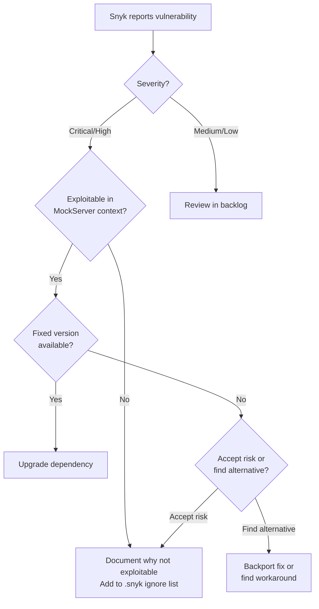

# Snyk Security Scanning

## Overview

MockServer uses [Snyk](https://snyk.io) for continuous security vulnerability scanning of Maven dependencies. Snyk automatically scans pull requests and reports vulnerabilities before they are merged.

## Namespace Migration Status

The `javax`→`jakarta` namespace migration is **complete**. MockServer now targets Jakarta EE 10, Spring Framework 7.0.7, Tomcat 11, and Jetty 12. The `.snyk` policy file no longer carries ignore rules blocked solely by the old `javax` constraint.

For full details see [docs/operations/security.md](security.md).

## Integration Points

### PR Status Checks

Snyk runs automatically on all pull requests via two integrations:

1. **`security/snyk (mockserver)`** - Scans against the `mockserver` organization
2. **`security/snyk (jamesdbloom)`** - Scans against the personal organization

Both checks must pass for a PR to be merged. Results are visible in the PR status checks with links to detailed reports on app.snyk.io.

### Web Dashboard

**URL:** https://app.snyk.io/org/mockserver/projects

The Snyk dashboard provides:
- Real-time vulnerability monitoring across all Maven modules
- Severity ratings (Critical, High, Medium, Low)
- Remediation guidance
- License compliance information

## Snyk CLI

### Installation

The Snyk CLI is already installed via Homebrew:

```bash
snyk --version
```

### Authentication

Snyk CLI uses OAuth for authentication:

```bash
snyk auth
```

This opens a browser window for authentication. The CLI stores credentials securely in the system keychain.

### Running Scans Locally

#### Scan all Maven modules

```bash
snyk test --maven-aggregate-project
```

#### Scan main project only

```bash
snyk test --file=pom.xml --package-manager=maven
```

#### Generate JSON output for analysis

```bash
snyk test --maven-aggregate-project --json > snyk-report.json
```

#### Monitor project (upload to Snyk dashboard)

```bash
snyk monitor --maven-aggregate-project
```

### Common Commands

| Command | Description |
|---------|-------------|
| `snyk test` | Test for vulnerabilities |
| `snyk monitor` | Upload snapshot to Snyk for continuous monitoring |
| `snyk test --severity-threshold=high` | Only fail on high/critical severity |
| `snyk test -d` | Debug mode (verbose output) |
| `snyk ignore --id=SNYK-JAVA-...` | Ignore a specific vulnerability |

## Vulnerability Triage

### Compatibility Constraints

The `javax`→`jakarta` namespace migration is complete (Spring 7.0.7, Jakarta EE 10, Jetty 12, Tomcat 11). Previously blocked upgrades are now unblocked. See [docs/operations/security.md](security.md) for the current dependency policy and any remaining constraints.

### Vulnerability Categories

Snyk reports vulnerabilities in several categories. Prioritize based on:

1. **Severity** (Critical > High > Medium > Low)
2. **Exploitability** (Is the vulnerable code path actually used in MockServer?)
3. **Remediation path** (Is a fixed version available and compatible?)

### Decision Tree



### Current Status (as of June 2026)

**All modules:** ✅ No known vulnerabilities blocked by namespace constraints. The `javax`→`jakarta` migration is complete; Spring 7.0.7, Jetty 12, and Tomcat 11 are now in use.

For any outstanding vulnerabilities, consult the Snyk dashboard at https://app.snyk.io/org/mockserver/projects.

## Snyk Policy File

**File:** `.snyk`

MockServer uses a Snyk policy file to document vulnerabilities that are ignored with documented reasons (e.g., not exploitable in MockServer's context, or mitigated by isolation to test-only modules).

### Policy Structure

The `.snyk` file contains:
- **Ignore rules** for vulnerabilities that cannot be fixed or are not exploitable
- **Expiration dates** to trigger periodic review
- **Documented reasons** explaining each ignore decision

### Adding New Ignores

To ignore a new vulnerability:

```bash
# Interactive - prompts for reason and expiration
snyk ignore --id=SNYK-JAVA-ORGSPRINGFRAMEWORK-12008931

# Command line - specify all parameters
snyk ignore --id=SNYK-JAVA-ORGSPRINGFRAMEWORK-12008931 \
  --reason="Not exploitable in MockServer context: only used in test-only examples module." \
  --expires="2026-08-11"
```

Or manually edit the `.snyk` file following the existing format.

### Testing with Policy

```bash
# Test with policy file (default location: .snyk)
snyk test --maven-aggregate-project

# Specify custom policy location
snyk test --policy-path=.snyk
```

### Policy Review Process

The expiration dates in the policy file trigger automatic Snyk notifications when they approach. This ensures:
- Regular review of ignored vulnerabilities
- Updates when backports or fixed versions become available

## Integration with Dependabot

Snyk and Dependabot work together:

1. **Dependabot** proposes dependency upgrades (automated PRs)
2. **Snyk** scans the PRs for new/resolved vulnerabilities
3. Both checks must pass before merge

## GitHub Actions Integration

Snyk checks run automatically via GitHub's built-in Snyk integration. No custom workflow is required. The integration is configured at the organization/repository level in GitHub settings.

## Next Steps

1. **Regular monitoring:** Review Snyk dashboard monthly for new vulnerabilities
2. **Backport evaluation:** For critical vulnerabilities, evaluate if backports or fixed upstream versions are available

## References

- Snyk CLI documentation: https://docs.snyk.io/snyk-cli
- Snyk Maven documentation: https://docs.snyk.io/scan-using-snyk/supported-languages-and-frameworks/java-and-kotlin
- MockServer Java compatibility policy: `AGENTS.md`
