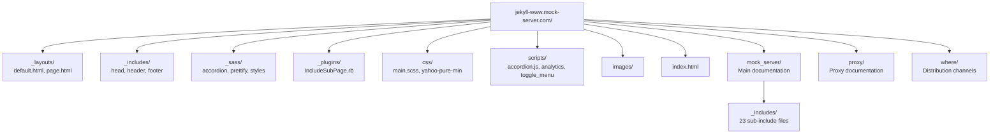

# Website

## Overview

The MockServer documentation website at `https://www.mock-server.com` is a Jekyll static site hosted on AWS S3 with CloudFront CDN.

**Source:** `jekyll-www.mock-server.com/`

> **Missing pages return HTTP 404.** CloudFront maps the private bucket's 403 (missing object) to a real 404 serving `error403.html` (which still `meta refresh`es humans to the homepage). This keeps deleted URLs out of search-engine indexes — see the CloudFront notes in [docs/infrastructure/aws-infrastructure.md](../infrastructure/aws-infrastructure.md#cloudfront-distributions). The status code is set in `terraform/website/sites.tf` (`custom_error_response.response_code`). After `terraform apply`, cached error responses keep serving the old status for up to `error_caching_min_ttl` (300s), so run a CloudFront `/*` invalidation to take effect immediately. Roll back by setting `response_code = 200` and re-applying.

## Site Configuration

**File:** `jekyll-www.mock-server.com/_config.yml`

| Setting | Value |
|---------|-------|
| URL | `https://www.mock-server.com` |
| Markdown engine | kramdown |
| Sass output | `:compressed` |
| `mockserver_version` | `7.0.0` |
| `mockserver_api_version` | `7.0.x` |
| `mockserver_snapshot_version` | `6.1.1-SNAPSHOT` |
| Google Analytics | GA4 measurement ID `G-20BB7EJG4E` (in `_config.yml` as `ga4_measurement_id`) |
| Custom plugin | `jekyll-code-example-tag` |

## Site Structure



## Content Sections

### Mock Server (`mock_server/`)

| Page | Content |
|------|---------|
| `getting_started.html` | Quick start guide |
| `creating_expectations.html` | Expectation creation (request matchers + actions) |
| `running_mock_server.html` | Running MockServer (all deployment options) |
| `mockserver_clients.html` | Client libraries (Java, JavaScript, Ruby) |
| `verification.html` | Request verification |
| `configuration_properties.html` | Full configuration reference |
| `HTTPS_TLS.html` | TLS/SSL configuration and mTLS |
| `using_openapi.html` | OpenAPI specification support |
| `response_templates.html` | Velocity/Mustache/JS response templates |
| `debugging_issues.html` | Troubleshooting guide |
| `clearing_and_resetting.html` | State management |
| `initializing_expectations.html` | Expectation initialisation on startup |
| `persisting_expectations.html` | Persistent expectations across restarts |
| `running_tests_in_parallel.html` | Parallel test execution patterns |
| `isolating_single_service.html` | Single-service isolation testing |
| `control_plane_authorisation.html` | Control plane auth (JWT, mTLS) |
| `CORS_support.html` | CORS configuration |
| `performance.html` | Performance tuning |
| `mockserver_ui.html` | Dashboard UI |

### Sub-includes (`mock_server/_includes/`)

23 reusable content fragments for code examples and configuration blocks:

| Include | Content |
|---------|---------|
| `request_matcher_code_examples.html` | Request matching examples |
| `response_action_code_examples.html` | Response action examples |
| `forward_action_code_examples.html` | Forward action examples |
| `error_action_code_examples.html` | Error action examples |
| `openapi_request_matcher_code_examples.html` | OpenAPI matcher examples |
| `running_docker_container.html` | Docker usage instructions |
| `running_mock_server_detail.html` | Detailed server startup options |
| `running_mock_server_summary.html` | Server startup summary |
| `running_npm_module.html` | npm module usage |
| `helm_chart.html` | Helm chart usage |
| `tls_configuration.html` | TLS config reference |
| `logging_configuration.html` | Logging config reference |
| `performance_configuration.html` | Performance config reference |
| `cors_configuration.html` | CORS config reference |
| `clustering.html` | Clustering documentation |
| `control_plane_authentication_configuration.html` | Auth config |
| `control_plane_authentication_jwt_configuration.html` | JWT auth config |
| `control_plane_authentication_mtls_configuration.html` | mTLS auth config |
| `initializer_persistence_configuration.html` | Init/persistence config |
| `template_restriction_configuration.html` | Template security config |
| `creating_expectations.html` | Expectation creation details |
| `retrieve_code_example.html` | Retrieve API examples |
| `verification_summary.html` | Verification summary |

### Proxy (`proxy/`)

| Page | Content |
|------|---------|
| `getting_started.html` | Proxy quick start |
| `verification.html` | Proxy request verification |
| `record_and_replay.html` | Record & replay functionality |
| `configuring_sut.html` | Configuring system-under-test |

### Where (`where/`)

Distribution channel pages: `docker.html`, `downloads.html`, `github.html`, `kubernetes.html`, `maven_central.html`, `npm.html`, `slack.html`, `trello.html` (auto-redirects to GitHub Projects after 3 seconds)

## Layouts

### `default.html`

Base HTML5 template:
- `` — meta tags, SEO (Open Graph, Schema.org), Google Fonts, CSS
- `` — navigation sidebar with section links
- `{{ content }}` — page content
- `` — copyright, JavaScript (toggle menu, prettify, accordion)

### `page.html`

Extends `default` — wraps content in a `<div class="post">` with `<h1>` title.

## Custom Plugins

### `IncludeSubPage.rb`

Provides two Liquid tags:

- `` — includes a file relative to the current page
- `` — includes a file from the site root

Both tags strip YAML front matter before rendering.

## Branding & Fonts

- **Title font:** page titles (`.page_header h1`) and the site/brand header (`.header h1`) use the
  Google web font **Permanent Marker**, loaded via `_includes/head.html` alongside
  `Averia Sans Libre`. Section headings (`h2`) intentionally stay on `Averia Sans Libre` for
  readability. Rules live in `_sass/_styles.scss`. (Apple's *Marker Felt* is **not** usable here —
  it is a proprietary system font with no web-font licence, so it only renders on Apple devices;
  Permanent Marker is the cross-platform equivalent.)
- **Brand "M" icon / favicons:** the marker-style "M" is shared across the site and the dashboard:
  - Website: `favicon.svg` (adaptive `prefers-color-scheme` fill), `favicon.ico`
    (native 16/32/48/64/128/256 frames), `apple-touch-icon.png` (180×180),
    `images/mockserver-icon.png` (195×195). Wired up in `_includes/head.html` (SVG first, `.ico`
    fallback).
  - Dashboard: `favicon.svg`, `favicon.ico` and `apple-touch-icon.png` in `mockserver-ui/public/`
    (no `mockserver-icon.png` — that one is website-only), referenced from `mockserver-ui/index.html`
    under the `/mockserver/dashboard/` base path.
- **How the icons/logo are generated:** the "M" and the "MockServer" wordmark are outlined from the
  *Permanent Marker* font with `fonttools` (text → vector paths, so there is no font dependency),
  filled `#333333`, with path coordinates rounded to 2 dp. The same source produces the CNCF
  Landscape wordmark — see [../distribution/cncf-landscape-entry.md](../distribution/cncf-landscape-entry.md).

## Building the Website

```bash
# Local development server
cd jekyll-www.mock-server.com
bundle install
bundle exec jekyll serve

# Or use the script
scripts/jekyll_server.sh

# Production build
cd jekyll-www.mock-server.com
bundle exec jekyll build
# Output in _site/
```

## Deployment

> **Resolve the live target dynamically — do not trust hard-coded bucket/distribution
> names.** The `versioned-site` release step (`scripts/release/components/versioned-site.sh`)
> repoints the `mock-server.com` + `www.mock-server.com` CNAME aliases at the **newest
> _versioned_ bucket and distribution** on every release. So "the current site" moves
> with each release: as of 7.0.0 it is bucket `aws-website-mockserver-7-0` /
> distribution `ED1HOMPC7011S`, and the previous current site (`nb9hq` /
> `E3R1W2C7JJIMNR`) is now frozen as the `5-15.mock-server.com` **archive** — uploading
> to it corrupts that archive. Older docs and `~/mockserver-aws-ids.md` may name the
> wrong "current" bucket; always re-resolve before deploying:
>
> ```bash
> # Live bucket + distribution serving www.mock-server.com:
> aws cloudfront list-distributions --profile mockserver-website \
>   --query "DistributionList.Items[?contains(Aliases.Items,'www.mock-server.com')].{Id:Id,Origin:Origins.Items[0].DomainName}" \
>   --output table
> ```

1. Build: `bundle exec jekyll build`
2. Resolve the live bucket + distribution with the command above.
3. Upload `_site/` to that bucket (`aws s3 cp` for a targeted page deploy, or
   `aws s3 sync --delete` for a full publish).
4. Invalidate that distribution — `/*` for a full publish, or the specific changed
   paths for a targeted deploy (CloudFront ignores query strings, so a `?cb=`
   cache-buster does **not** flush the edge; you must invalidate).

The `mockserver-website` profile authenticates directly into the website account
(`014848309742`) as admin, so manual deploys do **not** need the cross-account
`assume_website_role` that CI (`scripts/release/`) uses.

See [AWS Infrastructure](../infrastructure/aws-infrastructure.md) and [Release Process](release-process.md) for details.

## Website Infrastructure Security

The following controls are applied to the CloudFront distributions and DNS for `mock-server.com`. These are managed by Terraform in `terraform/website/`.

### CloudFront Response Security Headers

A shared `aws_cloudfront_response_headers_policy` (`mockserver-security-headers`) is attached to the default cache behaviour of all distributions:

| Header | Value |
|--------|-------|
| `Strict-Transport-Security` | `max-age=31536000; includeSubDomains` |
| `X-Content-Type-Options` | `nosniff` |
| `X-Frame-Options` | `SAMEORIGIN` |
| `Referrer-Policy` | `strict-origin-when-cross-origin` |
| `Content-Security-Policy` | Conservative allow-list (self + Google Analytics) — may need tuning for third-party widgets |

All headers have `override = true` so they cannot be suppressed by S3 object metadata.

### CAA DNS Records

Route 53 CAA records on `mock-server.com` restrict TLS certificate issuance to Amazon CA:

```
0 issue    "amazon.com"
0 issuewild "amazon.com"
```

This prevents a compromised or rogue CA from issuing a certificate for the domain. Managed by `aws_route53_record.caa` in `terraform/website/sites.tf`.

### S3 Static Website Hosting

S3 static-website hosting (`aws_s3_bucket_website_configuration`) is **not** configured. CloudFront uses the private OAC REST S3 origin with `default_root_object = "index.html"`, which avoids exposing the S3 website endpoint publicly.

### Cross-Account Role ExternalId

The `mockserver-release-website` IAM role in the website account enforces `sts:ExternalId` on the trust policy. The ExternalId is **active** -- callers must supply the correct value or the assume-role call will be denied.

- **Secret location:** the `external_id` key in the `mockserver-release/website-role` secret (build account, eu-west-2). The same secret also holds the `role_arn` key.
- **CI path (`scripts/release/`):** `assume_website_role()` in `_lib.sh` loads the `external_id` from the secret and passes `--external-id` to `aws sts assume-role`. `versioned-site.sh` loads it and passes `TF_VAR_role_external_id` into the dockerized terraform so CI applies keep the trust-policy condition in sync.
- **Manual apply:** set `TF_VAR_role_external_id=<value>` when running `terraform apply` in `terraform/website/`. The value is in the secret above (never committed to the repo).
- **Terraform plumbing:** `cross-account-role.tf` conditionally adds the `sts:ExternalId` Condition when `var.role_external_id != ""`. The `main.tf` providers pass `external_id` in their `assume_role` blocks (also conditional).

**OAC-only origin access:** All distributions authenticate to S3 through a single Origin Access Control (OAC), signing origin requests with SigV4. The legacy Origin Access Identity resources and the `AllowLegacyOAIRead` bucket-policy grant were removed (2026-06-05) after confirming all 9 distributions reference only `origin_access_control_id` in their origin config, so the OAI grants were dead code.

## SEO & Metadata Files

| File | Purpose |
|------|---------|
| `sitemap.xml` | XML sitemap for search engines |
| `sitemap.html` | HTML sitemap for users |
| `robots.txt` | Search engine crawl directives |
| `feed.xml` | Atom/RSS feed |

## Proxy Sub-includes

`proxy/_includes/` contains reusable fragments for proxy documentation:

| Include | Content |
|---------|---------|
| `analysing_behaviour.html` | Proxy behaviour analysis examples |

## External References

The website navigation includes links to:

- **SwaggerHub API Reference:** https://app.swaggerhub.com/apis/jamesdbloom/mock-server-openapi
- **GitHub Examples:** https://github.com/mock-server/mockserver-monorepo/tree/master/examples
