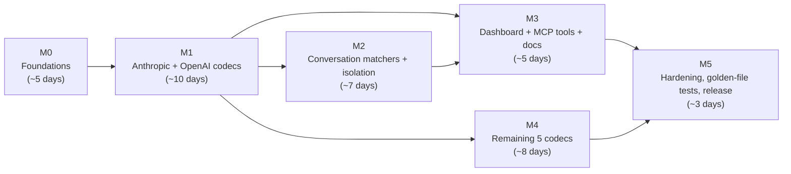
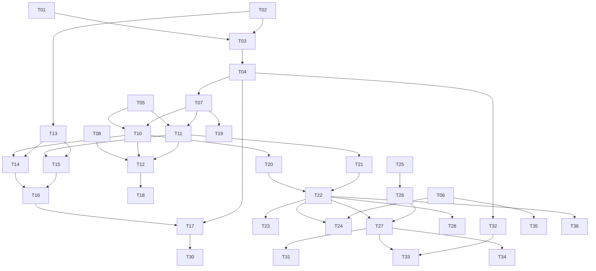

# Implementation Plan — LLM & Agent Mocking (RFC-1 + RFC-2 Layer B)

**Status:** Draft (2026-05-26)
**Companion to:** [mockserver-llm-mocking.md](mockserver-llm-mocking.md)
**Scope:** End-to-end execution plan for RFC-1 (LLM Response Builder) and RFC-2 Layer B (LLM-conversation matchers on the existing scenario state machine). Tier 1 items #3–#4 and all Tier 2/3 items are explicitly out of scope and handled by follow-up plans.

This document is a roadmap. The authoritative design lives in the RFC; this plan converts that design into sized, sequenced, testable work items with explicit dependencies.

---

## 1. Goals & non-goals

**Goals**
- Ship `httpLlmResponse` as a first-class action type with provider-correct encoding for all 7 providers (Anthropic, OpenAI Chat Completions, OpenAI Responses, Gemini, Bedrock, Azure OpenAI, Ollama).
- Ship conversation-aware matchers (`whenTurnIndex`, `whenLatestMessageContains`, `whenLatestMessageRole`, `whenContainsToolResultFor`) built on the existing `ScenarioManager` with per-session isolation via `isolateBy(...)`.
- Maintain Java 11 compatibility (no Spring 6, no `jakarta`, no Java 17+ APIs).
- Match the existing `httpSseResponse` rigor for dashboard rendering, JSON schema, serialisation, and event logging.

**Non-goals (out of scope, deferred)**
- Tier 1 #3 `verify_tool_call` and #4 `explain_agent_run` (follow-up plan, depend on this work).
- Tier 2/3 features (cost analytics, chaos profiles, VCR/strict mode, drift detection, bisection).
- Multi-modal content in `Completion` (images, audio).
- Real tokenizer for `usage` estimation.
- Convergence of the TypeScript `llmTraffic.ts` parser with the new Java codec (tracked separately in §7.10 of the RFC).
- Non-Java client library updates (Python, Ruby, TypeScript) — REST is sufficient at launch; native helpers ship in a phase-2 plan.

---

## 2. Milestones at a glance

**Critical path:** M0 → M1 → M2 → M3 → M5. M4 (additional codecs) runs in parallel with M2/M3 once M1 is done.

Total budgeted effort: ~38 engineer-days for one engineer, ~22 calendar days with 2 engineers running M2 and M4 in parallel.

---

## 3. Work items

Each item lists: ID, title, size (S ≤ 1d, M ≤ 3d, L ≤ 5d), depends-on, deliverables, definition of done.

### M0 — Foundations

| ID | Title | Size | Depends on | Deliverables | Done when |
|---|---|---|---|---|---|
| **T01** | Add `LLM_RESPONSE` to `Action.Type` enum | S | – | `Action.java` modification | Enum value added; no other code references it yet |
| **T02** | Introduce `Completion`, `ToolUse`, `EmbeddingResponse`, `StreamingPhysics` model classes | M | T01 | 4 new files under `org.mockserver.model` | Classes compile, have equals/hashCode, no serializer wiring yet |
| **T03** | Introduce `HttpLlmResponse` action class | S | T02 | `HttpLlmResponse.java` | Fluent setters, extends `Action`, returns `LLM_RESPONSE` type |
| **T04** | Wire `httpLlmResponse` field into `Expectation` and `ExpectationDTO` | M | T03 | Modifications to two files | `equals`/`hashCode` include the new field; deserialisation of a JSON expectation with `httpLlmResponse` round-trips |
| **T05** | Add `ProviderCodec` interface, `ProviderCodecRegistry`, `ParsedConversation` skeleton, `Provider` enum | M | T02 | 4 new files under `org.mockserver.llm` | Registry returns "unsupported" error for every provider; unit test for registry contract |
| **T06** | Add `mockserver.maxLlmConversationBodySize` config property (bytes, default `1048576`) | S | – | `ConfigurationProperties.java`, `Configuration.java` | Property read as `int` bytes; clamp `[16384, 67108864]` enforced at startup; env var `MOCKSERVER_MAX_LLM_CONVERSATION_BODY_SIZE` works; consumer docs in `configuration_properties.html` and `running_docker_container.html` updated |
| **T07** | JSON schema + Jackson serializer/deserializer for `httpLlmResponse` | M | T04 | New serializer + deserializer + schema file | An `httpLlmResponse` round-trips through `ExpectationSerializer` |
| **T08** | `HttpLlmResponseActionHandler` skeleton that returns 501 for any provider | S | T03 | New handler class wired into action dispatch | A registered LLM expectation receives a request → 501 |

**M0 exit criteria:** an LLM expectation can be registered via REST, persisted, round-tripped, listed in `/mockserver/expectation`, and matches inbound requests — it just doesn't yet return useful content.

### M1 — Anthropic + OpenAI codecs

| ID | Title | Size | Depends on | Deliverables | Done when |
|---|---|---|---|---|---|
| **T10** | `AnthropicCodec.encode()` — non-streaming Messages API | M | T05, T07 | `AnthropicCodec.java` (encode only) | Golden-file test for `text`, `tool_use`, `usage` round-trips a real Anthropic response |
| **T11** | `OpenAiChatCompletionsCodec.encode()` — non-streaming | M | T05, T07 | `OpenAiChatCompletionsCodec.java` (encode only) | Golden-file test for `text`, tool call, `usage` |
| **T12** | Wire codec dispatch into `HttpLlmResponseActionHandler` (non-streaming path) | S | T10, T11, T08 | Handler modification | Anthropic + OpenAI non-streaming expectations return correct JSON |
| **T13** | Streaming physics → `SseEvent` list expansion (§2.3.2 of RFC) | M | T02 | `StreamingPhysicsExpander` utility in `org.mockserver.llm` | Unit test verifies delays match formula; jitter is uniform; seed reproducibility |
| **T14** | `AnthropicCodec.encode()` — streaming (SSE event sequence) | M | T10, T13 | Anthropic streaming path | Golden-file test for full `message_start` → `message_stop` sequence with tool calls |
| **T15** | `OpenAiChatCompletionsCodec.encode()` — streaming | M | T11, T13 | OpenAI streaming path | Golden-file test for `chat.completion.chunk` sequence with `finish_reason` |
| **T16** | `HttpLlmResponseActionHandler` delegates streaming to `HttpSseResponseActionHandler` | S | T14, T15 | Handler modification | Streaming LLM expectations flow through existing SSE handler |
| **T17** | `LlmMockBuilder` + non-streaming + streaming builder API (Java client) | M | T04, T16 | `LlmMockBuilder.java`, `LlmConversationBuilder.java` (stub for now) | Sample app builds and uses both providers via the fluent API |
| **T18** | Embeddings codec path (`deterministicFromInput()` algorithm) | M | T02, T12 | OpenAI embeddings encoder; deterministic vector generator | Unit test asserts same input + dims + seed → identical L2-normalised vector across JVMs |
| **T19** | Failure-mode wiring (§2.7): unsupported provider, bad args, invalid usage, out-of-range `tokensPerSecond`/`jitter` | S | T07, T12 | Validation in DTO + handler | 400 with field path for each documented failure |

**M1 exit criteria:** an engineer can write `llmMock("/v1/messages").withProvider(ANTHROPIC).respondingWith(completion()…).applyTo(client)` and have a real Anthropic-targeting agent (e.g., the Anthropic SDK pointed at MockServer) successfully receive a correct streaming or non-streaming response. Same for OpenAI Chat Completions.

### M2 — Conversation matchers + isolation

| ID | Title | Size | Depends on | Deliverables | Done when |
|---|---|---|---|---|---|
| **T20** | `AnthropicCodec.decode()` — produce `ParsedConversation` from request body | M | T05, T10 | Decode path | Round-trip test (encode a known Completion, decode an Anthropic request body, match expected `ParsedMessage` list) |
| **T21** | `OpenAiChatCompletionsCodec.decode()` | M | T05, T11 | Decode path | Round-trip test |
| **T22** | `LlmConversationMatcher` — `whenTurnIndex`, `whenLatestMessageContains`, `whenLatestMessageRole`, `whenContainsToolResultFor` | L | T20, T21 | Matcher class + unit tests per predicate | Each predicate works against parsed conversations from both providers; AND composition verified |
| **T23** | Parse-failure semantics: fail-closed, DEBUG log, no throw | S | T22 | Matcher behaviour | Malformed JSON → no match; oversize body → no match; wrong-provider body → no match |
| **T24** | Body-size cap honoured (`maxLlmConversationBodySize`) | S | T22, T06 | Matcher behaviour | Bodies > cap skip parsing |
| **T25** | `ScenarioManager` composite-key support `(scenarioName, isolationValue)` | M | – | Backward-compatible modification | Null isolation behaves identically to today; non-null isolates state per value; per-key `compute()`-style atomic transition preserved; `reset()` clears all composite state; `clear(scenarioName)` clears every isolation variant of that name; concurrent stress test passes |
| **T26** | `isolateBy(header(...) | queryParameter(...) | cookie(...))` fluent API | S | T25 | Builder extension | Each source extracts correctly; missing attribute falls back to shared key |
| **T27** | Auto-generated scenario names + `newScenarioState` advancement per `turn()` block | M | T22, T26 | `LlmConversationBuilder` complete impl | A 3-turn conversation script with tool calls works end-to-end |
| **T28** | Matcher wired into `HttpRequestPropertiesMatcher` evaluation order | S | T22 | Wiring change | LLM matcher only invoked when expectation has LLM predicates declared |

**M2 exit criteria:** a 2-turn agent loop (turn 1: `tool_use` for `search`; turn 2 after `tool_result`: final answer) works against a real Anthropic or OpenAI SDK. Two concurrent agents with different `x-session-id` headers do not interfere.

### M3 — Dashboard, MCP tools, consumer docs

| ID | Title | Size | Depends on | Deliverables | Done when |
|---|---|---|---|---|---|
| **T30** | Register `mock_llm_completion` MCP tool | S | T17 | `McpToolRegistry.java` addition | Tool count 22 → 23; MCP integration test passes |
| **T31** | Register `create_llm_conversation` MCP tool | M | T27 | `McpToolRegistry.java` addition | Tool count 23 → 24; agent can build a multi-turn conversation via NL → tool call |
| **T32** | Dashboard expectation row renders "LLM Response" badge with provider + model + text preview | M | T04 | `mockserver-ui` component changes | Visual check + snapshot test; respects existing column layout |
| **T33** | Dashboard Conversation view extended to show scripted turns alongside captured traffic | M | T27, T32 | UI extension | Side-by-side script vs actual traffic; manual QA |
| **T34** | Update `jekyll-www.mock-server.com/mock_server/_includes/creating_expectations.html` (LLM section + isolation example) | M | T27 | Consumer doc update | Renders cleanly; examples copy-pasteable |
| **T35** | Update `configuration_properties.html` for `maxLlmConversationBodySize` | S | T06 | Consumer doc update | Property documented with default and clamp |
| **T36** | Update internal docs: `docs/code/request-processing.md`, `domain-model.md`, `event-system.md`, `docs/README.md` | M | T04, T22 | Internal doc updates | Architecture diagrams in Mermaid; cross-links to RFC |

**M3 exit criteria:** a user reading `creating_expectations.html` can build an LLM mock without seeing the RFC; the dashboard shows LLM expectations as first-class items; an MCP agent can set up an LLM scenario from natural language.

### M4 — Remaining 5 codecs (parallel with M2/M3)

| ID | Title | Size | Depends on | Deliverables | Done when |
|---|---|---|---|---|---|
| **T40** | `OpenAiResponsesCodec` — encode + decode (separate `Completion` variant for `output`/`reasoning` blocks) | L | T11, T21 | New codec | Golden-file test for `output` + `reasoning` shape; conversation matchers work |
| **T41** | `GeminiCodec` — encode + decode | L | T05 | New codec | Golden-file test; matchers work |
| **T42** | `BedrockCodec` — encode + decode (Claude-on-Bedrock variant of Anthropic codec) | M | T10, T20 | New codec | Golden-file test |
| **T43** | `AzureOpenAiCodec` — delegates most logic to `OpenAiChatCompletionsCodec` | S | T11, T21 | New codec | Golden-file test for Azure-specific headers/path |
| **T44** | `OllamaCodec` — encode + decode | M | T05 | New codec | Golden-file test |

**M4 exit criteria:** all 7 providers in the `Provider` enum are implemented; `ProviderCodecRegistry` returns a real codec for each.

### M5 — Hardening & release

| ID | Title | Size | Depends on | Deliverables | Done when |
|---|---|---|---|---|---|
| **T50** | End-to-end test suite: full agent loop per provider | M | All M1+M2+M4 | Test module | One e2e test per provider exercising tool call → tool result → final answer |
| **T51** | Concurrency stress test: 100 concurrent isolated conversations | S | T25, T27 | Stress test | No state leakage; throughput within 10% of equivalent non-LLM expectation throughput |
| **T52** | Golden-file refresh: capture real provider responses, diff against codec output | M | All M1+M4 | Captured fixtures + diff script | Each provider's golden file matches a recent real response within tolerated drift |
| **T53** | CodeQL + Snyk sweep over new code | S | All | Security report | Zero new high/critical findings; LOW/MEDIUM acknowledged |
| **T54** | Release-notes entry, changelog update, migration guide (none needed — additive only) | S | All | `changelog.md` entry | Reviewers approve wording |

**M5 exit criteria:** the feature ships in the next MockServer release. Backport not required.

---

## 4. Dependency graph (work-item level)

---

## 5. Test strategy

| Layer | Approach |
|---|---|
| Codec unit tests | Per-provider, golden-file tests using **real captured responses** from each provider. Stored under `mockserver-core/src/test/resources/llm/fixtures/<provider>/`. Files are committed; they are not regenerated automatically (drift detection is a Tier 3 feature). |
| Matcher unit tests | Per-predicate; AND composition; parse-failure fail-closed; body-size cap; isolation source matrix (header/cookie/queryParam present/absent). |
| Scenario state machine | Concurrent test with 100 isolated keys; backward compatibility with existing scenario tests (zero regressions in `ScenarioManagerTest`). |
| Integration | Real provider SDKs (Anthropic Java SDK if available, OpenAI Java SDK) pointed at MockServer — verifies wire compatibility end-to-end. |
| Streaming physics | Deterministic verification with seed + jitter = 0; statistical verification (mean within 5% of expected) with jitter > 0. |
| Dashboard | Snapshot test for new badge; manual QA for Conversation view. |
| Performance | Stress test: 100 concurrent conversations; throughput regression budget = 10% vs `httpSseResponse` baseline. |

---

## 6. Risks & mitigations

| Risk | Likelihood | Impact | Mitigation |
|---|---|---|---|
| Provider format drift breaks golden-file tests | High over 6 months | Test breakage, not user breakage | Tier 3 drift-detection job + clearly-marked update procedure in `docs/code/`. Accept occasional fixture refreshes. |
| `OpenAiResponsesCodec` requires a second `Completion` variant | Certain | Adds ~3 days of codec work | Already factored into M4 sizing. Use a `CompletionShape` tag in `Completion` to discriminate. |
| `ScenarioManager` composite-key change introduces subtle regression | Medium | High — breaks existing scenarios | Backward-compat path is the default; new code path only used when `isolateBy` declared. Full `ScenarioManagerTest` re-run before merge. |
| TS-vs-Java parser divergence causes Conversation-view confusion | Medium | Medium — user-visible inconsistency | Document the duplication; track convergence in §7.10. Accept for launch. |
| Jitter / timing tests are flaky in CI | Medium | Medium — wasted CI runs | Default seed in tests; jitter > 0 tests use statistical assertions, not exact-value. |
| LOC blowup makes the change hard to review | High | Medium — review delay | Break work into 1 PR per work item or per cluster of small items. ~40 PRs total expected. |

---

## 7. Decision log

| Decision | Made when | Rationale |
|---|---|---|
| First-class `httpLlmResponse` action type (not sugar) | 2026-05-26, in spec review | Persisted form preserves intent; enables verify_tool_call (#3) and explain_agent_run (#4) without re-parsing SSE; dashboard renders LLM intent |
| All 7 providers at launch | 2026-05-26 | User-specified scope. Phased within M1+M4 to keep M1 deliverable shippable in isolation if M4 slips |
| Provider inherited from `withProvider(...)` (no body sniffing) | 2026-05-26 | Zero ambiguity; fail-closed semantics; matches existing builder pattern |
| Per-session isolation via `isolateBy(...)` | 2026-05-26 | Real isolation without breaking existing scenarios; configurable source (header/cookie/query) |
| TS parser duplication accepted at launch | 2026-05-26 | Time-limited; convergence tracked in RFC §7.10 |
| Body-size cap defaults to 1 MiB | 2026-05-26 | DoS protection without affecting realistic conversation history (rough estimate: 1 MiB ≈ 250 turns of typical agent dialogue) |
| Embedding seed default = 0 | 2026-05-26 | Reproducible by default; users can override |

---

## 8. Follow-ups not in this plan

These items depend on this work but are scoped to separate plans:

1. **Tier 1 #3 — `verify_tool_call`** — verification assertions over captured tool calls, leveraging the `ParsedConversation` produced by codec decoders.
2. **Tier 1 #4 — `explain_agent_run`** — diagnostic analysis of recorded agent sessions; ranks issues like duplicate tool calls, loops, token hotspots.
3. **Non-Java client native helpers** — Python, Ruby, TypeScript `llmMock` wrappers around the REST contract.
4. **Tier 2 #5 — Token/cost analytics + budget assertions.**
5. **Tier 2 #6 — LLM fault/chaos profiles.**
6. **Tier 2 #7 — VCR mode + strict mode + body redaction + field normalisation.**
7. **TS↔Java parser convergence (RFC §7.10).**
