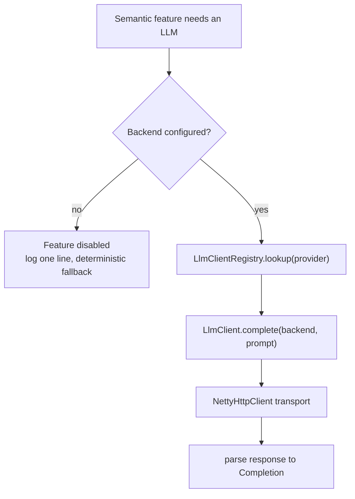

# LLM & Agent Mocking — Roadmap

**Last updated:** 2026-05-29
**Purpose:** Track remaining work for first-class LLM/agent mocking. Designs that shipped are documented in the codebase (`docs/code/`, consumer docs, source) — this file only lists what is still open.

The original RFC (RFC-1 LLM Response Builder + RFC-2 Stateful Scripted Conversations) and its execution plan have been retired now that both shipped. Historical context lives in the git log around commits `fa2a5bb05` → `9e3efe0e2` (M0–M5 + post-M5 hardening) and `3f03bce33` → `adaed5a72` (dashboard UX U1–U4).

---

## Priority list status

### Tier 1 — foundational

| # | Item | Status |
|---|---|---|
| 1 | LLM response builder (`llmMock`) — RFC-1 | ✅ Shipped (M0–M5) |
| 2 | Stateful scripted conversations — RFC-2 Layer B | ✅ Shipped (M2) |
| 3 | Tool-call assertions (`verify_tool_call`) | ❌ Not started |
| 4 | Agent-run / LLM-session analysis (`explain_agent_run`) | ❌ Not started |

### Tier 2 — high value

| # | Item | Status |
|---|---|---|
| 5 | Token/cost analytics + budget assertions | ✅ Shipped (U3 — token/cost rollup tile + session inspector) |
| 6 | LLM fault/chaos profiles (429/529 + Retry-After, mid-stream truncation, malformed SSE, probabilistic error rates) | ❌ Not started (was U6, ~8–12 days) |
| 7 | VCR mode + strict mode + body redaction + field normalisation | 🟡 Partial — cassette manager shipped in U4; strict-mode, body redaction, and field normalisation still open |

### Tier 3 — valuable / specialised

| # | Item | Status |
|---|---|---|
| 8 | MCP/A2A conformance contract testing (`run_mcp_contract_test`) | ❌ Not started — see Item assessments below |
| 9a | Normalised prompt matching (deterministic) | ❌ Not started — recommended next |
| 9b | Semantic prompt matching (runtime LLM / embeddings) | ❌ Not started — opt-in only, not for assertions |
| 10 | OTel GenAI / OpenInference span export | ❌ Not started |
| 11 | Correlated agent-run session / call-graph view | ❌ Not started |
| 12 | Prompt-injection / adversarial-response harness | ❌ Not started |
| 13 | Drift detection (fixtures vs real API in CI) | ❌ Not started (was U5, ~5–8 days) |
| 14 | Run bisection / diff | 🟡 Partial — structural trajectory diff shipped in U4; full bisection workflow open (low priority) |

---

## Design principle — determinism vs runtime LLM

MockServer's core value is **deterministic, fast, offline test doubles.** A runtime LLM call injects non-determinism, latency, token cost, network dependency, and an API key into the test path. That trade-off is acceptable for *generation* (`llmMock` already does it — a fuzzy generated response is fine) but **harmful for matching and assertions**, where a test must pass or fail reproducibly. A matcher that sometimes matches is worse than no matcher.

Apply this lens when scoping the items below:
- Most of the open work (drift detection, bisection/diff, MCP conformance) is **deterministic** — it does not need an LLM at all; its question is value-vs-scope, not feasibility.
- Only **semantic matching (#9b)** genuinely wants runtime-LLM semantics, and that is precisely where determinism makes it least appropriate. Keep it opt-in, off by default, and never on the assertion path.

---

## Enabling runtime LLM access

Any runtime-LLM feature (starting with #9b) needs MockServer to act as a *client* against a real LLM the user already has. The challenge — "we don't know which LLM a user has" — is solved by reusing the existing provider abstraction and letting the user declare a backend.

### Mirror the existing codec pattern

The codebase already proves the per-provider knowledge exists:
- `org.mockserver.model.Provider` enum — `ANTHROPIC`, `OPENAI`, `OPENAI_RESPONSES`, `GEMINI`, `BEDROCK`, `AZURE_OPENAI`, `OLLAMA`
- `org.mockserver.llm.ProviderCodec` + `org.mockserver.llm.ProviderCodecRegistry` (static-block registry keyed by `Provider`; codec implementations live in `org.mockserver.llm.codec`)
- The UI's `PROVIDERS` list (`mockserver-ui/src/lib/expectationFromCapture.ts`) maps the enum 1:1

The existing codecs are MockServer→client: `decode()` parses an inbound *request*; `encode()` builds an outbound mock *response*. Calling a real LLM is the opposite direction (build an outbound *request*, parse the inbound *response* into a `Completion`), so the codecs don't serve it directly — but the **registry-keyed-by-`Provider` pattern is the shape to copy.**

Introduce a sibling SPI:

```java
public interface LlmClient {
    Provider provider();
    CompletableFuture<Completion> complete(LlmBackend backend, ParsedConversation prompt);
}
```

Register `OpenAiLlmClient`, `AnthropicLlmClient`, … in an `LlmClientRegistry` — a singleton populated in a static initializer block, keyed by `Provider`, structurally identical to `ProviderCodecRegistry`. Each client reuses the existing `org.mockserver.httpclient.NettyHttpClient` for transport and owns only the provider-specific quirks (URL path, auth header shape, request-body JSON, response parsing → `Completion`). Adding a provider = implement `LlmClient` + register; nothing else changes.

Auth/endpoint quirks the per-provider clients encapsulate:

| Provider | Auth | Default base URL |
|----------|------|------------------|
| OpenAI | `Authorization: Bearer` | `api.openai.com` |
| Azure OpenAI | `api-key` header | `{resource}.openai.azure.com` |
| Anthropic | `x-api-key` + `anthropic-version` | `api.anthropic.com` |
| Gemini | `?key=` query param | `generativelanguage.googleapis.com` |
| Ollama | none | `localhost:11434` |
| Bedrock | SigV4 signing | regional endpoint |

### One config object: `LlmBackend`

```java
record LlmBackend(
    String   name,               // optional — required only for Layer 3 named backends
    Provider provider,           // the "type" — reuses the existing enum
    String   baseUrl,            // optional — defaults per provider (table above)
    String   apiKey,
    String   model,              // optional — provider default
    Map<String,String> headers,  // escape hatch for odd setups
    Long     timeoutMillis
) {}
```

Defaulting `baseUrl` per provider means enabling a backend is usually just a *type + a key* (Ollama needs neither).

Implementation notes for when this is built:
- The `headers` map must be defensively copied to an unmodifiable map in the compact constructor (the record is meant to be immutable; Guava's `ImmutableMap` is already on the classpath).
- `apiKey` is a secret — it MUST be redacted (`***`) in any configuration-dump log output, following the existing secret-property handling in `ConfigurationProperties`.

### Three config layers — simplest first

1. **Honor the providers' own env conventions (zero MockServer config).** If `OPENAI_API_KEY` / `ANTHROPIC_API_KEY` / `GEMINI_API_KEY` / `OLLAMA_HOST` are already set (the same vars each provider's SDK reads), auto-detect an available backend.
2. **MockServer properties for a single default backend** (standard `ConfigurationProperties` env-var + system-property pattern, like `maxLlmConversationBodySize`): `mockserver.llmProvider`, `mockserver.llmApiKey`, `mockserver.llmModel`, `mockserver.llmBaseUrl`.
3. **Named backends via JSON** (`mockserver.llmBackendsConfig=llm-backends.json`) for multiple/advanced setups; each entry is an `LlmBackend`, selectable by name.

### Resolution and safety



- **Off unless configured.** No resolved backend → semantic features are unavailable; MockServer logs one line and falls back to deterministic matching. Runtime-LLM is opt-in by construction.
- **Fail closed on error/timeout.** If a backend is configured but `LlmClient.complete()` times out (per `LlmBackend.timeoutMillis`, with a conservative default) or throws, the semantic match returns no-match — the same outcome as unconfigured — and logs one warning line. A flaky network must never flip an assertion.
- **Pin for reproducibility.** Default `temperature=0`, pass a `seed` where supported, cache responses keyed by prompt so a given input is stable within a run. Never on the assertion path.

### Why this stays simple / extensible / clean

- **Simple:** one record + one interface + one registry; transport (`NettyHttpClient`) already exists.
- **Extensible:** new provider = implement `LlmClient` + register — the same one-line story as codecs.
- **Clean:** the `Provider` enum remains the single source of truth shared by codecs, the UI `PROVIDERS` list, and now the clients — no parallel taxonomy.

### Proving the path — start with Ollama

The natural first slice is the SPI + registry + a single provider, and **Ollama is the ideal one to build and test against first**: it needs no auth, runs locally, and is free, so it avoids cloud keys, token cost, and network flakiness while exercising the full end-to-end path (`LlmClient` → `NettyHttpClient` → real completion → `Completion`). Once the path is proven with Ollama, the remaining providers are just per-provider request-build, response-parse, and auth quirks layered onto the same SPI.

---

## Known limitations on shipped work

Tracked separately in `docs/code/llm-security-audit.md`:
- Ollama codec emits SSE-shaped events instead of native NDJSON
- Bedrock codec emits plain Anthropic SSE rather than the `aws-chunked` binary envelope
- `whenContainsToolResultFor` E2E false-negative for Gemini/Ollama (unit tests pass; pipeline-level interaction issue)

---

## Item assessments (value vs complexity)

Ranked by value-to-complexity for the contested Tier 3 items:

| Item | Runtime LLM? | Assessment |
|------|--------------|------------|
| **9a — Normalised prompt matching** | No | **Do it.** Strip whitespace, sort JSON keys, drop volatile fields (timestamps, request IDs), lowercase. Agent prompts are dynamically assembled, so exact-byte matching is brittle. Deterministic, low complexity, just extends the existing matcher framework. Clear yes. |
| **13 — Drift detection** | No (structural) | **Worthwhile, opt-in.** Replay recorded requests against the real provider and diff response *shape* (new/renamed fields, changed SSE framing) — drift is structural, not semantic. Reuses the U4 structural diff and closes the loop on the U4 cassette manager (stale cassettes are the #1 VCR complaint). Complexity is operational: needs real API keys + tokens in CI and is inherently flaky, so it belongs in a scheduled/opt-in lane, never the per-commit build. |
| **14 — Run bisection** | No | **Defer.** The valuable 80% (structural trajectory diff) already shipped in U4. Remaining git-bisect-style narrowing only pays off for long, complex runs; "here's the diff, look at it" covers most debugging. Diminishing returns until a user has runs long enough that manual diff-reading hurts. |
| **9b — Semantic prompt matching** | Yes | **Opt-in only, never for assertions.** Embeddings need threshold tuning and pin a model version; an LLM judge is non-deterministic. Ship it (if at all) as an explicitly fuzzy/exploratory matcher, off by default. |
| **8 — MCP/A2A conformance testing** | No | **Likely scope creep.** Genuinely valuable to the ecosystem and fully deterministic (protocol conformance, not semantics), but it is a different product category — a *validator/test suite* rather than a *mock/proxy* — and carries a heavy ongoing burden of tracking a fast-moving spec. If pursued, consider a companion project rather than core MockServer. |

## Suggested next steps

When picking the next milestone:
1. **#9a Normalised prompt matching** — cheap, deterministic, high value; fixes the brittleness of exact-byte matching against dynamically assembled agent prompts.
2. **#13 Drift detection (U5)** — closes the "cassettes go stale" maintenance gap. Pairs naturally with the cassette manager that already shipped in U4. Opt-in CI lane only.
3. **#6 Chaos profiles (U6)** — declarative resilience testing. Larger backend feature.
4. **#3/#4 Tool-call assertions / agent-run analysis** — leverages the `ParsedConversation` produced by the existing codecs; no new transport work.

Lower priority / reconsider scope: **#9b semantic matching** (opt-in, non-assertion only), **#14 full bisection** (diff already shipped), **#8 MCP conformance** (likely a separate tool).
