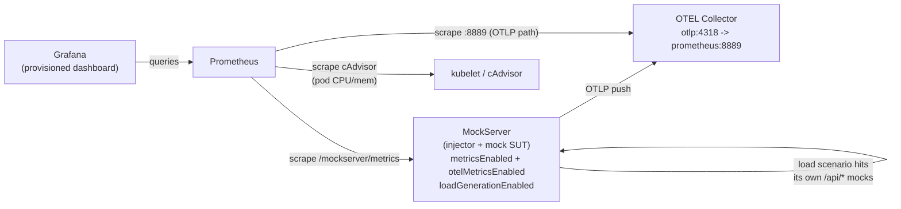

# Load Injection Observability on Kubernetes (k3s / k3d)

Visualise **MockServer's load-injection metrics in Grafana**, in parallel with the
system under test — the single biggest reason to drive load from MockServer. One
`./run.sh` stands up a local [k3s](https://k3s.io) cluster (via [k3d](https://k3d.io))
running MockServer, Prometheus, an OpenTelemetry Collector and Grafana, preloads a
load scenario, triggers it, and opens a provisioned dashboard that renders VUs,
throughput, latency percentiles, failures, status codes, data transfer, JVM
heap/GC/threads, and real pod CPU & memory.

## What it demonstrates

- **MockServer exposes metrics over both channels at once** — a **Prometheus**
  scrape endpoint (`GET /mockserver/metrics`) *and* an **OpenTelemetry (OTLP)**
  push to a collector. Prometheus scrapes both paths so you can see the identical
  series arrive each way (`up{job="mockserver"}` and `up{job="mockserver-otlp"}`).
- **A rich Grafana dashboard for a load run** — active VUs, request rate,
  error rate, p50/p90/p95/p99 latency, iterations, errors by kind, throttling,
  status-class breakdown, throughput by route, and request/response bytes — all
  from the `mock_server_load_*` family.
- **Injector health alongside the load** — JVM heap, GC time, thread count, and
  genuine **pod CPU & memory** (from the kubelet's cAdvisor), so you can tell a
  latency rise in your SUT from one in the injector itself.



> **Self-contained by design:** here MockServer load-tests its *own* mocked
> `/api/*` endpoints, so the example needs no external service. In a real test you
> would point the load-scenario steps (`config/load-scenario.json`) at your actual
> service under test and add its metrics as another Grafana row — the MockServer
> panels stay exactly the same.

## Prerequisites

- [Docker](https://docs.docker.com/get-docker/) (running)
- [k3d](https://k3d.io) ≥ 5.x — creates a k3s cluster inside Docker
- `kubectl`
- A MockServer image with **Load Scenarios** support (`mockserver/mockserver:latest`).
  All other images (Prometheus, Grafana, OpenTelemetry Collector) are public.

## Run

```bash
./run.sh
```

It creates the cluster, applies the manifests, preloads and **triggers** the
`storefront-load` scenario, and opens port-forwards. Then open Grafana and watch
the dashboard fill in. Stop the port-forwards with `Ctrl-C` (the cluster keeps
running); delete everything with `./teardown.sh`.

| Service | URL | Notes |
|---------|-----|-------|
| Grafana | http://localhost:3000 | Dashboard *“MockServer — Load Injection & Observability”*. Anonymous admin — no login needed. |
| Prometheus | http://localhost:9090 | Try `sum(mock_server_load_active_vus)` or check **Status → Targets**. |
| MockServer | http://localhost:1080 | Metrics at `/mockserver/metrics`; control plane at `/mockserver/loadScenario`. |

Re-trigger or stop the run at any time:

```bash
curl -X PUT http://localhost:1080/mockserver/loadScenario/start -d '{"names":["storefront-load"]}'
curl -X PUT http://localhost:1080/mockserver/loadScenario/stop  -d '{"all":true}'
```

Confirm the **OpenTelemetry** path independently of Prometheus:

```bash
kubectl logs deploy/otel-collector -n mockserver-demo --tail=20   # MockServer metrics arriving over OTLP
```

## Expected output

Within ~30–60s of the run starting, the Grafana dashboard shows:

- **Active VUs** ramping up and then holding around 25, with **In-flight requests** tracking it.
- **Request rate** in the single-digit-to-low-tens of req/s (contention-bound) and a fully-populated **latency** panel (p50/p90/p95/p99).
- **Status codes** dominated by `2xx` with a thin band of `5xx` (the deliberately-failing
  `/api/inventory` step), and a matching non-zero **Errors by kind** (`http_5xx`).
- **JVM** heap/GC/threads and **pod CPU & memory** panels populated from the injector.

> **Note on absolute numbers:** because this self-contained demo runs the load *injector* and the mock
> *target* inside one MockServer instance, throughput and latency are contention-bound and modest (and the
> p95 stat may show red) — that's expected. Pointed at a real, separate service under test, these panels
> reflect that service instead. The dashboard reads a single metrics source (the `Metrics source` dropdown,
> default `mockserver`); switch it to `mockserver-otlp` to confirm the OpenTelemetry path carries the same series.

`./run.sh` prints a `scenario RUNNING` line on success. In Prometheus,
`up{job="mockserver"}`, `up{job="mockserver-otlp"}` and the `kubernetes-cadvisor`
targets should all be **UP**.

## Files

| Path | Purpose |
|------|---------|
| `config/expectations.json` | The mock SUT — `/api/orders/*` (200), `/api/checkout` (201), `/api/inventory` (503). |
| `config/load-scenario.json` | The `storefront-load` scenario (RATE ramp → VU hold, weighted steps). |
| `manifests/10-mockserver.yaml` | MockServer with metrics + OTLP + load generation enabled. |
| `manifests/20-otel-collector.yaml` | OTLP receiver → Prometheus exporter (+ debug log). |
| `manifests/30-prometheus.yaml` | Scrapes MockServer, the OTLP path, and cAdvisor (with RBAC). |
| `manifests/40-grafana.yaml` | Grafana with provisioned datasource + dashboard provider. |
| `grafana/dashboards/mockserver-load-injection.json` | The dashboard (edit and re-run to iterate). |
| `run.sh` / `teardown.sh` | Bring up (+ trigger) / delete the cluster. |

## Troubleshooting

- **Pods stuck in `ContainerCreating` with `x509: certificate signed by unknown authority`** — you are behind a
  TLS-inspecting proxy and the cluster's containerd does not trust your corporate root CA, so it cannot pull images.
  Recreate the cluster with your CA wired into containerd, e.g.:
  ```bash
  cat > registries.yaml <<'EOF'
  configs:
    "docker.io":            { tls: { ca_file: /etc/ssl/certs/corp-ca.pem } }
    "registry-1.docker.io": { tls: { ca_file: /etc/ssl/certs/corp-ca.pem } }
  EOF
  k3d cluster create mockserver-obs --agents 1 --wait \
    --registry-config registries.yaml \
    --volume /path/to/your/corp-ca-bundle.pem:/etc/ssl/certs/corp-ca.pem@all
  ```
  then re-run the `kubectl apply` / configmap / trigger steps from `run.sh`.
- **`start` returns `403 Forbidden`** — load generation is disabled; the MockServer Deployment sets
  `MOCKSERVER_LOAD_GENERATION_ENABLED=true`, so this only happens if you changed it.
- **Dashboard panels empty** — give it ~30–60s after triggering, and confirm Prometheus targets are UP
  (Prometheus → Status → Targets). The `env`/`region` custom labels only appear on Prometheus series because they
  are allow-listed via `MOCKSERVER_LOAD_GENERATION_METRIC_LABELS`.

## See also

- [Load Injection](https://www.mock-server.com/mock_server/load_injection.html) — the load-scenario model and the full `mock_server_load_*` metric catalogue.
- [Metrics & Monitoring](https://www.mock-server.com/mock_server/observability.html) — Prometheus and OpenTelemetry configuration reference.
