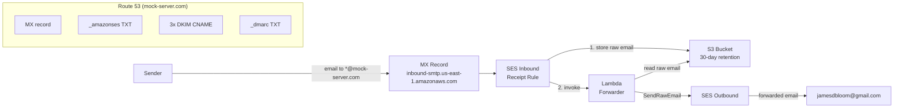

# SES Email Forwarding

Terraform configuration for catch-all email forwarding on `mock-server.com`. All email sent to any address at the domain is forwarded to a configurable list of destination addresses (default: `jamesdbloom@gmail.com`).

## Architecture



## How It Works

1. **MX record** routes all email for `mock-server.com` to the SES inbound endpoint in `us-east-1`.
2. **SES receipt rule** (catch-all for the domain) stores the raw MIME email in S3, then invokes a Lambda function asynchronously.
3. **Lambda forwarder** reads the email from S3, rewrites the `From` header to a verified `@mock-server.com` address (preserving the original sender in `Reply-To` and the display name), removes stale DKIM/Return-Path/Sender headers, and re-sends via SES `SendRawEmail`.
4. **SES outbound** delivers the rewritten email to the configured destination addresses.

## Failure Handling

- **Lambda error alarm**: A CloudWatch alarm monitors the forwarder Lambda `Errors` metric. When any error occurs (threshold >= 1 in a 5-minute period), an SNS notification is sent to the configured `alarm_email` address. Failed forwards are noticed rather than silently lost.
- **Raw email retention**: The raw MIME email is stored in S3 by SES *before* the Lambda is invoked. Even if the Lambda fails, the email remains in S3 for `email_retention_days` (default 30 days) and can be manually reprocessed -- mail is not lost on a transient Lambda failure.

## Disabling Monitoring (`enable_monitoring`)

The `enable_monitoring` variable (default: `true`) controls whether the SNS alarm topic, email subscription, and CloudWatch error alarm are created. These resources all depend on the SNS management API.

Set `enable_monitoring = false` when `terraform apply` is run from a network where the SNS management API is unreachable -- for example, behind a corporate TLS-inspection proxy that stalls SNS API calls. The remaining resources (SES, S3, Lambda, IAM, Route 53) will deploy normally.

Once the core stack is deployed, the monitoring can be applied later from a network where SNS is reachable (such as AWS CloudShell or a direct internet connection):

```bash
# From a network with SNS access:
terraform apply -var="enable_monitoring=true"
```

## Operational Notes

- **Active receipt rule set**: `aws_ses_active_receipt_rule_set` **activates this rule set and deactivates any other active receipt rule set** in the same AWS account and region. Only one receipt rule set can be active at a time. Verify that no prior active rule set exists before applying, or accept that the existing one will be deactivated.
- **Forwarded email preserves original `To:`**: The forwarded email keeps the original `To:` header, so for the catch-all you can see which `@mock-server.com` address received the email. This is intentional.
- **Removing a forwarding address**: Removing an address from `var.forward_to` destroys that address's `aws_ses_email_identity` on the next `terraform apply`. This is intended and safe.
- **Spam/virus scanning**: `scan_enabled = true` on the receipt rule means SES silently discards spam/virus-flagged mail (no bounce to the sender).

## Directory Structure

```
ses-email-forwarding/
├── main.tf                  # Provider + data sources
├── backend.tf               # S3 remote state configuration
├── versions.tf              # Terraform + provider versions
├── variables.tf             # Input variables
├── ses.tf                   # SES domain identity, DKIM, receipt rules, DNS records
├── s3.tf                    # Inbound mail S3 bucket
├── lambda.tf                # Forwarder Lambda function + IAM
├── monitoring.tf            # SNS alarm topic + CloudWatch error alarm
├── outputs.tf               # Outputs
├── lambda/                  # Lambda source
│   └── index.js             # Email forwarder (Node.js 20, AWS SDK v3)
├── terraform.tfvars.example # Example variable values
├── run.sh                   # Wrapper script (auth + plan/apply)
└── README.md                # This file
```

## Prerequisites

1. **Terraform** >= 1.15 -- `brew install terraform`
2. **AWS CLI** -- `brew install awscli`
3. **AWS SSO profile** `mockserver-website` configured:
   ```bash
   aws configure sso --profile mockserver-website
   # SSO region: eu-west-2
   # Default region: us-east-1
   ```
4. The `mock-server.com` Route 53 hosted zone must already exist in the `mockserver-website` account.

## Getting Started

### 1. Authenticate

```bash
aws sso login --profile mockserver-website
```

### 2. Configure Variables (optional)

The defaults work out of the box for `mock-server.com` forwarding to `jamesdbloom@gmail.com`. If you need to change anything:

```bash
cp terraform.tfvars.example terraform.tfvars
# Edit terraform.tfvars
```

> **terraform.tfvars is gitignored** -- it must never be committed.

### 3. Preview Changes

```bash
./run.sh plan
```

### 4. Apply

```bash
./run.sh apply
```

### 5. One-Time Manual Steps

After applying:

1. **Confirm destination email**: AWS sends a verification email to each address in `forward_to` (the `aws_ses_email_identity` resource). Click the verification link in the email sent to `jamesdbloom@gmail.com`.
2. **Confirm alarm subscription**: AWS sends a separate SNS subscription confirmation email to `alarm_email` (defaults to the first `forward_to` address). Click the "Confirm subscription" link to start receiving Lambda error alarm notifications.
3. **Domain verification**: The `_amazonses` TXT record and DKIM CNAMEs are created automatically by Terraform in Route 53. SES verifies the domain identity automatically via DNS -- no manual action needed.
4. **Test**: Send an email to any address at `mock-server.com` (e.g. `test@mock-server.com`). It should arrive in the forwarding destination inbox within a few seconds.

## run.sh Reference

The `run.sh` wrapper handles AWS SSO authentication, environment workarounds (corporate TLS proxy, macOS pyexpat), and runs Terraform commands.

```
Usage: run.sh [command]

Commands:
  plan       Run terraform plan (default)
  apply      Run terraform apply
  destroy    Run terraform destroy
  init       Run terraform init
```

## Variables

| Variable | Type | Default | Description |
|----------|------|---------|-------------|
| `region` | `string` | `us-east-1` | AWS region (must support SES inbound) |
| `domain` | `string` | `mock-server.com` | Domain to receive email for (catch-all) |
| `forward_to` | `list(string)` | `["jamesdbloom@gmail.com"]` | Destination email addresses |
| `from_address` | `string` | `noreply@mock-server.com` | Verified sender for the rewritten From header |
| `email_retention_days` | `number` | `30` | Days to retain raw emails in S3 |
| `alarm_email` | `string` | first `forward_to` address | Email for Lambda error alarm notifications |
| `enable_monitoring` | `bool` | `true` | Create SNS topic, email subscription, and CloudWatch alarm (see below) |

## Outputs

| Output | Description |
|--------|-------------|
| `ses_domain_identity_arn` | ARN of the SES domain identity |
| `ses_verification_token` | SES domain verification token |
| `ses_dkim_tokens` | DKIM tokens for DNS verification |
| `mx_value` | MX record value for inbound email |
| `mail_bucket_name` | S3 bucket storing raw inbound emails |
| `lambda_function_name` | Name of the forwarder Lambda function |
| `alarm_sns_topic_arn` | ARN of the SNS topic for forwarder error alarms |
| `alarm_name` | Name of the CloudWatch alarm for forwarder Lambda errors |
| `dns_records_created` | Summary of all DNS records managed by this stack |

## Changing or Adding Forwarding Addresses

1. Edit `forward_to` in `terraform.tfvars` (or pass via `-var`):
   ```hcl
   forward_to = ["jamesdbloom@gmail.com", "another@example.com"]
   ```
2. Run `./run.sh apply` -- this creates a new `aws_ses_email_identity` for the new address and updates the Lambda environment variable.
3. Click the SES verification link that AWS sends to the new address.

## DNS Records

This stack creates the following DNS records in the `mock-server.com` hosted zone:

| Record | Type | Purpose |
|--------|------|---------|
| `mock-server.com` | MX | Routes inbound email to SES |
| `_amazonses.mock-server.com` | TXT | SES domain verification |
| `<token>._domainkey.mock-server.com` (x3) | CNAME | DKIM signing verification |
| `_dmarc.mock-server.com` | TXT | DMARC policy (`p=none`) |

**Note:** An apex SPF TXT record is deliberately **not** created. The apex TXT already holds a `google-site-verification` value that this stack must not take ownership of. Email deliverability is covered by SES DKIM signing. An SPF record can be merged into the existing apex TXT manually later if desired.

## Cost

Estimated monthly cost (low-volume personal email):

| Resource | Cost |
|----------|------|
| SES inbound | Free (first 1,000 emails/month) |
| SES outbound | $0.10 per 1,000 emails |
| S3 | < $0.01 (tiny objects, 30-day retention) |
| Lambda | Free tier (first 1M requests/month) |
| Route 53 | $0 incremental (zone already exists) |
| CloudWatch Logs | < $0.01 |
| **Total** | **< $0.10/month** |
