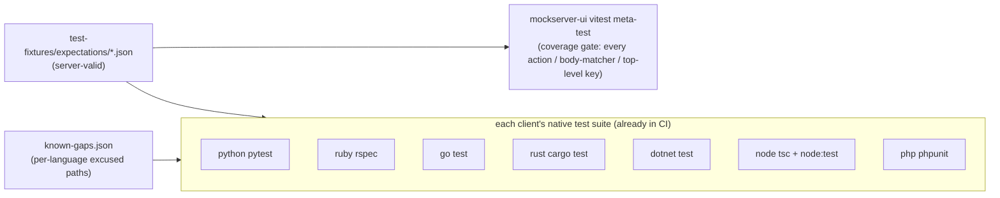

# Cross-language client round-trip fidelity fixtures

**Outcome:** one canonical, server-validated set of kitchen-sink Expectation JSON fixtures that every
MockServer client library (Python, Ruby, Go, Rust, C#/.NET, Node, PHP) deserializes with its native model
and re-serializes, asserting semantic equality with the input. This proves the generated/hand-written client
code carries every server feature — and, where a model currently drops a field, pins that drop as an explicit,
machine-readable known gap so a regression cannot hide and a later fix auto-arms the assertion.

## Why this exists

The dashboard's per-language code tabs embed faithful `buildExpectationJson` JSON and hydrate it through each
client's deserializer. Fidelity is therefore gated by each client MODEL's completeness, and any missing field
is dropped **silently**. This harness turns every such silent drop into a visible, tracked ledger entry.

```
test-fixtures/expectations/
  *.json               44 single-Expectation fixtures, each validated 2xx by PUT /mockserver/expectation
  known-gaps.json      language -> [dropped/mutated JSON paths] ledger (the model-completion backlog)
```

## Layout / flow



Each client test: parse fixture → client-deserialize → client-serialize → compare (null==absent normalized;
headers/query/trailers/cookies canonicalized across both valid encodings) → assert every diff path is listed in
`known-gaps.json` for that language. A **ratchet** also fails the test if a listed gap no longer matches any
diff (i.e. the model was fixed) — forcing the stale entry to be removed.

## Fixture inventory (44)

- Body matchers: STRING(+subString), JSON(+matchType STRICT), JSON_SCHEMA, JSON_PATH, XML, XML_SCHEMA, XPATH,
  REGEX(+not/optional), PARAMETERS, BINARY, GRAPHQL, WASM, ALL_OF; plus JWT request matcher and pathParameters.
- Actions: static response (delay+connectionOptions+cookies+trailers+reasonPhrase), forward, override, forward
  with fallback, forward validate, forward template, forward class/object callback, response template
  (JS/MUSTACHE), response class/object callback, error, websocket, sse, binary, dns, grpc stream, grpc bidi, llm
  (completion+conversationPredicates+normalization+streamingPhysics; embedding+rerank+moderation+contentFilter+chaos).
- Response sequences: httpResponses with responseMode SEQUENTIAL / WEIGHTED(+responseWeights) / SWITCH(+switchAfter) / RANDOM.
- Top-level: chaos, rateLimit, percentage, beforeActions, afterActions, capture, namespace, steps, scenario
  bindings + crossProtocolScenarios, explicit priority / times / timeToLive.

Every fixture is a single Expectation object and is validated against a live MockServer (201 on PUT). Adding a
new server feature should add a fixture; the meta-test fails CI until every action type, body-matcher type and
top-level Expectation key is exercised.
